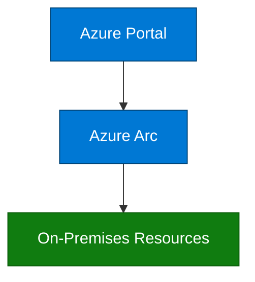

# GitHub Copilot Instructions

## Project Overview

This is the **Microsoft Sovereign Cloud Brain Trek** — a Jekyll-based technical documentation and training platform for architects and solutions professionals. The repository provides structured learning content covering Microsoft Sovereign Cloud technologies including Azure Local, Azure Arc, and Edge RAG (Retrieval-Augmented Generation).

### Target Audience

| Track | Roles | Focus |
|-------|-------|-------|
| **Sales & Pre-Sales** | Account Executives, Solution Specialists, Pre-Sales Consultants | Business value, opportunity qualification, deal structuring (L50-L100) |
| **Technical** | Cloud Architects, Field Engineers, AI Developers, Solution Engineers | Architecture design, deployment, implementation, troubleshooting (L50-L300) |

### Core Technologies

- **Digital Sovereignty** — Data residency, operational sovereignty, regulatory compliance
- **Azure Local** — Hyperconverged infrastructure (connected & disconnected modes)
- **Azure Arc** — Hybrid management for servers, Kubernetes, and data services
- **Edge RAG** — On-premises AI with retrieval-augmented generation
- **Zero Trust Security** — Multi-pillar security architecture
- **Compliance Frameworks** — GDPR, FedRAMP, HIPAA, ITAR, PCI DSS

---

## Content Structure

### Level-Based Hierarchy

Content is organized by proficiency level:

```text
docs/
├── level-50/    # Prerequisites (1-2 weeks, 2-4 hours)
├── level-100/   # Foundational (2-4 weeks, 4-12 hours)
├── level-200/   # Intermediate (4-6 weeks, 16-36 hours)
├── level-300/   # Advanced (8-12 weeks, 48-120 hours)
└── resources/   # External links & reference materials
```

### Module Structure Pattern

Each module follows this standard structure:

1. **Main Module Page** (`module-0N-topic-name.md`) — Overview, learning objectives, key concepts
2. **Topic Sub-pages** (2-4 files) — Detailed content deep-dives
3. **Knowledge Check** (`topic-knowledge-check.md`) — 10-15 assessment questions
4. **Hands-on Lab** (Level 200+) (`lab-0N-lab-name.md`) — Step-by-step exercises

---

## File Naming Conventions

### Markdown Files

- Use **lowercase with hyphens**: `topic-name.md`
- Be descriptive and content-focused

| Type | Pattern | Example |
|------|---------|---------|
| Module overview | `module-0N-topic.md` | `module-01-digital-sovereignty.md` |
| Topic page | `topic-name.md` | `azure-arc-kubernetes.md` |
| Knowledge check | `topic-knowledge-check.md` | `azure-arc-knowledge-check.md` |
| Lab exercise | `lab-0N-name.md` | `lab-01-azure-local-deployment.md` |
| Specifications | `VISUAL_SPECIFICATIONS.md` | Internal design reference |
| Level overview | `README.md` | Level index and navigation |

### Folders

- All lowercase with hyphens
- Level-based: `level-50/`, `level-100/`, `level-200/`, `level-300/`
- Supporting: `resources/`, `assets/images/`

---

## YAML Front Matter

All content pages must include YAML front matter:

```yaml
---
layout: default
title: Page Title
nav_order: 1
parent: Parent Section Name    # For child pages
has_children: true             # For parent pages with sub-pages
description: "Brief description for SEO and navigation"
nav_exclude: true              # For internal/specification files
---
```

### Layout Values

- `default` — Standard documentation page
- `page` — Standalone page
- `post` — Blog post format

---

## Markdown Formatting Standards

### Page Structure Template

```markdown
# Page Title
{: .no_toc }

Brief introduction paragraph explaining the topic.

## Table of Contents
{: .no_toc .text-delta }

1. TOC
{:toc}

---

## Overview

Module overview content here.

## Learning Objectives

After completing this module, you will be able to:

- ✅ Objective 1
- ✅ Objective 2
- ✅ Objective 3

## Prerequisites

- [ ] Prerequisite 1
- [ ] Prerequisite 2

## Key Concepts

### Concept Heading

Content here...

## Next Steps

- **[Proceed to Next Module →](next-module.md)**
```

### Heading Hierarchy

- `#` (H1) — Page title only (one per page), followed by `{: .no_toc }`
- `##` (H2) — Major sections
- `###` (H3) — Subsections
- `####` (H4) — Detailed breakdowns (use sparingly)

**Never skip heading levels** (e.g., don't go from H2 to H4).

### Callouts and Notices

```markdown
{: .warning }
> **⚠️ Warning Title**
> Warning content describing a potential issue.

{: .note }
> **💡 Note:** Additional helpful information.

{: .important }
> **Important:** Critical information the reader must know.
```

### Expandable Content (Details/Summary)

```markdown
<details>
<summary>Click to expand</summary>

Hidden content here...

</details>
```

### Code Blocks

Always specify the language:

````markdown
```powershell
Get-AzResourceGroup -Name "sovereign-rg"
```

```yaml
apiVersion: v1
kind: ConfigMap
```

```bash
az login --use-device-code
```
````

### Links

- **Internal links**: Use relative paths — `[Link Text](../level-100/topic.md)`
- **External links**: Use full URLs — `[Microsoft Learn](https://learn.microsoft.com/)`
- **Section anchors**: `[Section](#section-heading-lowercase-with-hyphens)`

---

## Knowledge Check Format

Use this standard format for assessment questions:

```markdown
### Question N: Topic Name

Question text here?

A) Option A  
B) Option B  
C) Option C  
D) Option D

<details>
<summary>Click to reveal answer</summary>

**Correct Answer: B**

**Explanation:**
Detailed explanation of why this answer is correct and why other options are incorrect.

**Reference:** [Topic Documentation](relative-link-to-content.md)
</details>
```

Guidelines:

- Include 10-15 questions per knowledge check
- Cover key concepts from the module
- Balance difficulty across the question set
- Always provide explanations and references

---

## Visual Assets

### Placeholder Format

When visual assets are pending design, use this placeholder:

```markdown
> **📊 Visual Asset Placeholder**
> *Asset Name: [Asset N: Asset Title]*
> Description of what the diagram will show...
> **Source:** Adapted from Microsoft Learn documentation
```

### Delivered Assets

When SVG/PNG assets are available:

```markdown

*Figure N: Caption describing the visual*
```

### Mermaid Diagrams

Use Mermaid.js for inline diagrams with Azure color palette:

````markdown

````

**Azure Color Palette:**

- Azure Blue: `#0078D4` (primary)
- Azure Dark Blue: `#004578` (borders/strokes)
- Azure Green: `#107C10` (success/on-premises)
- Azure Orange: `#FF8C00` (warnings)
- Azure Red: `#D13438` (errors/critical)

For detailed visual specifications, refer to `VISUAL_SPECIFICATIONS.md` files in each level folder.

---

## Writing Guidelines

### Terminology Consistency

Use these standard terms throughout:

| Correct Term | Avoid |
|--------------|-------|
| Azure Local | Azure Stack HCI (legacy) |
| Sovereign Landing Zone (SLZ) | sovereign landing zone |
| Edge RAG | edge-rag, EdgeRAG |
| Microsoft Entra ID | Azure Active Directory (legacy) |
| Customer Lockbox | customer lockbox |
| Air-gapped | air gapped, airgapped |

### Voice and Tone

- Use **active voice** where possible
- Be **clear and concise** — avoid jargon without explanation
- **Technical accuracy** is paramount — verify against Microsoft Learn
- **Accessible language** — define acronyms on first use

### Role-Specific Content

When content differs by audience:

```markdown
{: .note }
> **For Sales Professionals:** Focus on business value and ROI metrics.
> **For Technical Professionals:** See the [architecture deep-dive](link.md) for implementation details.
```

---

## Accessibility Requirements

- **Alt text**: All images must have descriptive alt text
- **Heading levels**: Never skip levels (H1 → H2 → H3)
- **Link text**: Use descriptive text (not "click here")
- **Color contrast**: WCAG AA compliance (4.5:1 ratio)
- **Tables**: Include header rows with proper markup

---

## Microsoft Learn References

When referencing official documentation:

```markdown
**Reference:** [Article Title](https://learn.microsoft.com/path) — Microsoft Learn
```

Key documentation sources:

- [Microsoft Sovereign Cloud](https://learn.microsoft.com/en-us/industry/sovereign-cloud/)
- [Azure Local](https://learn.microsoft.com/en-us/azure/azure-local/)
- [Azure Arc](https://learn.microsoft.com/en-us/azure/azure-arc/)
- [Edge RAG](https://learn.microsoft.com/en-us/azure/azure-arc/edge-rag/)
- [Zero Trust](https://learn.microsoft.com/en-us/security/zero-trust/)

---

## Jekyll Configuration

This site uses:

- **Theme**: Minima with Just the Docs influences
- **Jekyll version**: 4.2.0
- **Plugins**: `jekyll-feed`, `jekyll-seo-tag`, `jekyll-sitemap`

Navigation is defined in `_data/navigation.yml` and controlled via `nav_order` in front matter.

---

## Quick Reference Checklist

When creating or editing content:

- [ ] YAML front matter includes `layout`, `title`, `nav_order`, `description`
- [ ] Page title uses `# Title` with `{: .no_toc }`
- [ ] Table of contents included for pages with multiple sections
- [ ] Learning objectives use ✅ checkmarks
- [ ] Heading hierarchy is sequential (no skipped levels)
- [ ] Internal links use relative paths
- [ ] Code blocks specify language
- [ ] Images have descriptive alt text
- [ ] Knowledge check questions use expandable answer format
- [ ] Microsoft Learn references include full URLs
- [ ] File name follows `lowercase-with-hyphens.md` convention
