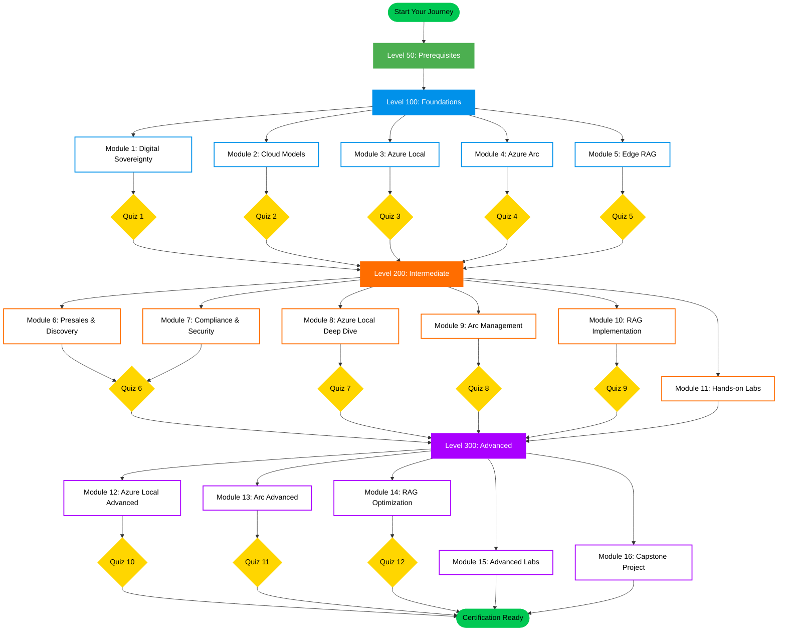

# Microsoft Sovereign Cloud Brain Trek

Master Sovereign Cloud, Azure Local, and Edge AI Technologies

A comprehensive learning journey for architects and solutions professionals

> **📢 Public Preview Notice**
> This content is currently in **public preview**. All learning modules and assessments are complete and ready for use.
> **Hands-on labs** are currently in development and will be released in Q1 2026.

[](https://opensource.org/licenses/MIT)
[](https://azure.microsoft.com/)
[](https://learn.microsoft.com/)
[](https://github.com/features/copilot)

[](https://azure.microsoft.com/en-us/products/azure-arc/)
[](https://learn.microsoft.com/en-us/azure/azure-local/)
[](https://kubernetes.io/)
[](https://www.anthropic.com/claude)
[](CONTRIBUTING.md)
[](docs/README.md)

## Overview

Welcome to the **Microsoft Sovereign Cloud Brain Trek** – your comprehensive skilling platform for mastering sovereign cloud technologies, hybrid infrastructure, and edge AI. This repository contains structured learning modules for sales and technical professionals to develop deep expertise in:

- **Microsoft Sovereign Cloud** (Sovereign Public, Private, and National Partner Clouds)
- **Azure Local** (Connected and Disconnected Operations)
- **Azure Arc** (Hybrid and Multi-Cloud Management)
- **Retrieval-Augmented Generation (RAG)** on Azure Arc for Edge

## Target Audience

- **Sales & Pre-Sales:** Account Executives, Solution Specialists, and Technical Sales Professionals - (L100 knowledge path)
- **Technical Professionals:** Cloud Architects, Field Engineers, and AI Developers - (up to L300)

## Learning Path Structure

The skilling plan is organized into four progressive levels:

| Level | Objective | Duration |
|-------|-----------|----------|
| **50** | **Prerequisites:** Cloud computing, security & Azure fundamentals | 1-2 weeks |
| **100** | **Foundational:** Understand the "what" and "why" | 2-4 weeks |
| **200** | **Intermediate:** Design solutions and handle objections | 4-6 weeks |
| **300** | **Advanced:** Lead deployments and provide expert guidance | 8-12 weeks |

### Learning Journey Map



**Legend:**

- 🟢 **Level 50 (Green)**: Prerequisites - foundational cloud & security knowledge
- 🔵 **Level 100 (Blue)**: Foundational concepts - white boxes with blue borders
- 🟠 **Level 200 (Orange)**: Intermediate skills - white boxes with orange borders
- 🟣 **Level 300 (Purple)**: Advanced expertise - white boxes with purple borders
- 🟡 **Quizzes (Yellow)**: Knowledge validation checkpoints - bright yellow diamonds
- 🟢 **Start/End (Green)**: Journey milestones - bright green rounded boxes

## Documentation Structure

```text
docs/
├── index.md                    # Home page
├── introduction.md             # Project introduction
├── level-50/                   # Prerequisites
├── level-100/                  # Foundational concepts
├── level-200/                  # Intermediate skills
├── level-300/                  # Advanced expertise
├── resources/                  # Additional resources
└── assets/                     # Images and diagrams
```

## Getting Started

### For Learners

1. **Start with Level 50** in [`/docs/level-50/`](docs/level-50/README.md) — Cloud, security & Azure fundamentals
2. **Continue to Level 100** in [`/docs/level-100/`](docs/level-100/README.md) — Foundational sovereign cloud concepts
3. **Progress to Level 200** in [`/docs/level-200/`](docs/level-200/README.md) — Solution design & deployment planning
4. **Complete Level 300** in [`/docs/level-300/`](docs/level-300/README.md) — Advanced expertise & customer leadership

### For Content Contributors

1. **Review** [CONTRIBUTING.md](CONTRIBUTING.md) for contribution guidelines
2. **Check** [.github/PROJECT_FILES.md](.github/PROJECT_FILES.md) for current project status
3. **Reference** [docs/README.md](docs/README.md) for content structure

### For Deploying the Site

1. **See** [docs/README.md](docs/README.md) for content organization
2. **Review** Jekyll configuration (coming soon)
3. **Test locally** before GitHub Pages deployment

## Key Technologies Covered

- Microsoft Sovereign Cloud
- Azure Local (formerly Azure Stack HCI)
- Azure Arc
- Azure Kubernetes Service (AKS)
- Edge RAG (Retrieval-Augmented Generation)
- Sovereign Landing Zones (SLZ)
- Zero Trust Security

## Contributing

We welcome contributions! Please see [CONTRIBUTING.md](CONTRIBUTING.md) for detailed guidelines.

### Content Contributions

New content should follow:

1. Level/module structure in `docs/level-XXX/`
2. YAML frontmatter template (see existing files)
3. Markdown formatting standards
4. Visual asset placeholder format (see examples in existing files)

### Jekyll Deployment

Site deployment preparation is underway for late November 2025. See [deployment status](#deployment-status) below.

## Resources

- [Microsoft Sovereign Cloud Documentation](https://learn.microsoft.com/en-us/industry/sovereign-cloud/)
- [Azure Local Documentation](https://learn.microsoft.com/en-us/azure/azure-local/)
- [Azure Arc Documentation](https://learn.microsoft.com/en-us/azure/azure-arc/overview)
- [Microsoft Learn Training](https://learn.microsoft.com/en-us/training/)

## License

This project is licensed under the MIT License - see the [LICENSE](LICENSE) file for details.

## Acknowledgments

This skilling plan is based on Microsoft's official documentation and best practices for Sovereign Cloud, Azure Local, and Edge AI solutions.

---

**Status:** ✅ Content Complete | Site Live on GitHub Pages
**Last Updated:** November 27, 2025
**Repository:** [sov-cloud-brain-trek](https://github.com/jonathan-vella/sov-cloud-brain-trek)
