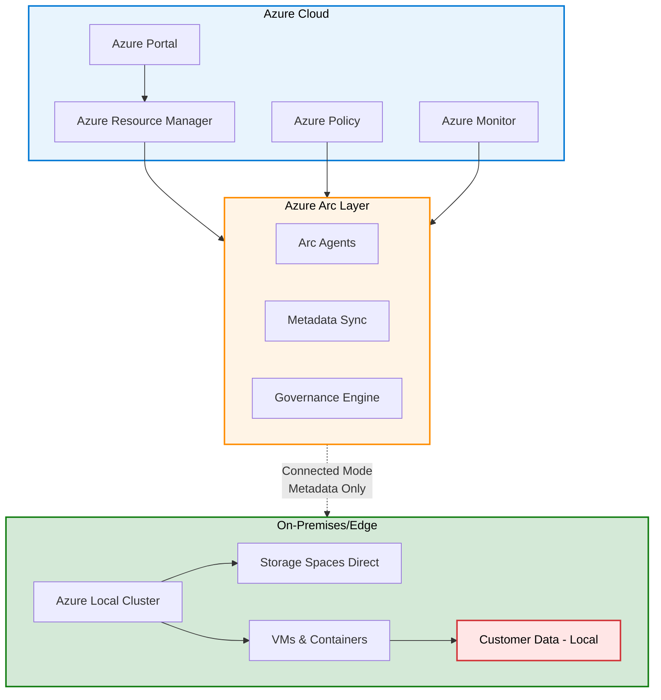

# Azure Arc Introduction

{: .no_toc }

## Table of Contents

{: .no_toc .text-delta }

1. TOC
{:toc}

---

## Overview

**Azure Arc** is Microsoft's hybrid and multi-cloud management platform that extends Azure management and services to any infrastructure - on-premises, multiple clouds, and the edge. Arc enables organizations to manage diverse environments with a consistent set of tools, governance policies, and security controls.

### What is Azure Arc?

Azure Arc provides:

**Unified Management:**

- Single control plane for hybrid and multi-cloud resources
- Consistent management across Windows, Linux, SQL Server, Kubernetes
- Azure portal as central management interface

**Cloud-Native Services Anywhere:**

- Deploy Azure services on any infrastructure
- Run Azure data services on-premises
- Consistent application deployment patterns

**Centralized Governance:**

- Apply Azure Policy to any resource, anywhere
- Enforce security and compliance at scale
- Audit and report across entire estate

**Flexible Deployment:**

- Support for any infrastructure (physical, virtual, cloud)
- Works with existing tools and processes
- No vendor lock-in

---

## Why Arc Matters for Sovereign Cloud Strategies

Azure Arc plays a critical role in sovereignty by enabling organizations to:

**Maintain Data Residency:**

- Keep data and processing on-premises
- Apply Azure governance without moving data
- Meet strict data localization requirements

**Ensure Operational Sovereignty:**

- Control where workloads run
- Manage resources locally when needed
- Maintain operational independence

**Apply Consistent Governance:**

- Enforce policies across all environments
- Centralized security posture management
- Unified compliance reporting

**Enable Hybrid Innovation:**

- Modern cloud services on existing infrastructure
- Gradual cloud adoption at your pace
- Preserve investments while modernizing

**Connection to Sovereignty Concepts:**

- [Review Digital Sovereignty →](digital-sovereignty)
- [Review Operational Sovereignty →](operational-sovereignty)
- [Review Azure Local (Sovereign Private Cloud) →](azure-local-overview)

---

## Arc as the Bridge Between On-Premises and Azure

Azure Arc creates a hybrid bridge that connects:

**On-Premises Infrastructure:**

- Physical servers and virtual machines
- Kubernetes clusters (any CNCF-certified distribution)
- SQL Server and PostgreSQL databases
- VMware vSphere and Azure Local environments

**→ Azure Management Plane:**

- Azure portal and ARM (Azure Resource Manager)
- Azure Policy and RBAC
- Azure Monitor and Log Analytics
- Azure Security Center
- Azure Update Management

**Benefits of the Bridge:**

- **Unified visibility:** See all resources in one place
- **Consistent tooling:** Same tools for cloud and on-premises
- **Centralized governance:** Policies apply everywhere
- **Simplified operations:** Reduce tool sprawl
- **Hybrid workflows:** Seamless integration across environments

---

## Multi-Cloud Governance Capabilities

Azure Arc isn't limited to Microsoft environments - it supports multi-cloud scenarios:

**Supported Environments:**

- **On-Premises:** Physical servers, VMware, Hyper-V, Azure Local
- **Microsoft Azure:** Native Azure resources
- **AWS:** EC2 instances, EKS clusters
- **Google Cloud:** GCE instances, GKE clusters
- **Other Clouds:** Any cloud provider supporting agents

**Multi-Cloud Benefits:**

- **Unified governance:** Same policies across all clouds
- **Simplified management:** Single pane of glass
- **Cost optimization:** Better visibility into multi-cloud spend
- **Security posture:** Consistent security controls
- **Avoid lock-in:** Maintain flexibility

**Use Cases:**

- Acquired company using different cloud
- Best-of-breed services from multiple clouds
- Geographic requirements (specific clouds in certain regions)
- Hedge against single-provider risk

---

## Relationship to Azure Local and Digital Sovereignty

Azure Arc and Azure Local work together to provide comprehensive sovereignty:

**Azure Local (Physical Infrastructure):**

- Provides the hardware and local compute
- Runs VMs, containers, storage locally
- Operates Connected or Disconnected

**Azure Arc (Management Layer):**

- Provides unified management (in Connected Mode)
- Enables Azure services on Azure Local
- Applies governance and policies
- Delivers observability and monitoring

**Together They Provide:**

**Sovereignty Advantages:**

- Data remains on-premises (Azure Local)
- Centralized management from Azure (Arc)
- Consistent governance across locations
- Operational flexibility (Connected/Disconnected)

---

## Common Misconceptions About Arc

### Misconception 1: "Arc Moves Data to Azure"

**Reality:** Arc synchronizes metadata and telemetry, not workload data. Your application data, databases, and files stay on-premises. Only configuration, logs, and metrics are sent to Azure for management purposes.

### Misconception 2: "Arc Requires Continuous Internet Connectivity"

**Reality:** While Arc works best with regular connectivity, it's resilient to temporary outages. Resources continue operating locally. Some features (like policy enforcement) work intermittently.

### Misconception 3: "Arc Only Works with Microsoft Products"

**Reality:** Arc supports many non-Microsoft technologies: Linux servers, any CNCF-certified Kubernetes, PostgreSQL, and more. It's designed for heterogeneous environments.

### Misconception 4: "Arc Is Just Another Management Tool"

**Reality:** Arc is a management plane (layer), not a tool. It brings Azure Resource Manager capabilities to any infrastructure, enabling consistent tooling, governance, and services.

### Misconception 5: "Arc Replaces My Existing Tools"

**Reality:** Arc complements existing tools. You can continue using VMware vCenter, Kubernetes tooling, etc. Arc provides an additional layer for Azure-based governance and services.

---

---

## Three Pillars of Azure Arc

```mermaid
graph TB
    Arc[Azure Arc Platform]

    Arc --> Servers[Arc-Enabled Servers]
    Arc --> K8s[Arc-Enabled Kubernetes]
    Arc --> Data[Arc-Enabled Data Services]

    Servers --> S1[Windows & Linux Servers]
    Servers --> S2[Policy & Governance]
    Servers --> S3[Azure Monitor]
    Servers --> S4[Update Management]

    K8s --> K1[Any CNCF K8s Cluster]
    K8s --> K2[GitOps Configuration]
    K8s --> K3[Multi-Cluster Management]
    K8s --> K4[Azure Services on K8s]

    Data --> D1[SQL Managed Instance]
    Data --> D2[PostgreSQL Hyperscale]
    Data --> D3[Managed DB Experience]
    Data --> D4[Cloud Billing Model]

    style Arc fill:#0078D4,stroke:#004578,stroke-width:3px,color:#fff
    style Servers fill:#E8F4FD,stroke:#0078D4,stroke-width:2px,color:#000
    style K8s fill:#E8F4FD,stroke:#0078D4,stroke-width:2px,color:#000
    style Data fill:#E8F4FD,stroke:#0078D4,stroke-width:2px,color:#000
```

### Arc-Enabled Resources Comparison

---

### Multi-Site Deployment Topology

---

## Core Arc Services

Azure Arc consists of three main service categories:

### 1. Azure Arc-Enabled Servers

**Purpose:** Extend Azure management to Windows and Linux servers anywhere.

**Key Capabilities:**

- Inventory and organize servers
- Apply Azure Policy for compliance
- Monitor with Azure Monitor
- Update management at scale
- Microsoft Defender for Cloud integration
- Run automation runbooks

**Supported Platforms:**

- Windows Server 2012 R2 and newer
- Various Linux distributions (Ubuntu, RHEL, SUSE, etc.)
- Physical or virtual machines
- Any cloud provider

**Benefits:**

- Unified server management
- Consistent security posture
- Centralized compliance reporting
- Reduced operational complexity

**[Learn More →](azure-arc-servers)**

---

### 2. Azure Arc-Enabled Kubernetes

**Purpose:** Bring Kubernetes clusters under Azure management.

**Key Capabilities:**

- Manage any CNCF-certified Kubernetes cluster
- GitOps-based configuration management
- Deploy Azure services to clusters
- Apply Azure Policy for Kubernetes
- Monitor clusters with Azure Monitor
- Integrate with Azure security services

**Supported Platforms:**

- AKS (Azure Kubernetes Service) on Azure Local
- Amazon EKS
- Google GKE
- Red Hat OpenShift
- Rancher, VMware Tanzu
- Upstream Kubernetes

**Benefits:**

- Consistent application deployment
- Multi-cluster management
- Cloud-native GitOps workflows
- Unified security and compliance

**[Learn More →](azure-arc-kubernetes)**

---

### 3. Azure Arc-Enabled Data Services

**Purpose:** Deploy Azure data services on any infrastructure.

**Key Capabilities:**

- SQL Managed Instance on-premises
- PostgreSQL Hyperscale on-premises
- Managed database experience anywhere
- Elastic scale and high availability
- Cloud-billing model for on-premises
- Azure-consistent management

**Supported Services:**

- **Azure SQL Managed Instance:** Full SQL Server compatibility
- **PostgreSQL Hyperscale:** Scalable PostgreSQL with Citus extension

**Benefits:**

- Evergreen database platform
- Pay-as-you-go pricing for on-premises
- Reduced database administration overhead
- Data stays on-premises (sovereignty)

**[Learn More →](azure-arc-data-services)**

---

## Comparison Table: Three Arc Services

| Feature | Arc Servers | Arc Kubernetes | Arc Data Services |
|---------|-------------|----------------|-------------------|
| **Target** | Windows/Linux servers | Kubernetes clusters | SQL/PostgreSQL databases |
| **Primary Use** | Server management | Container orchestration | Managed databases |
| **Onboarding** | Install agent | Connect cluster | Deploy data controller |
| **Management** | Azure portal, CLI | Azure portal, GitOps | Azure Data Studio |
| **Governance** | Azure Policy | Azure Policy for K8s | Azure RBAC |
| **Monitoring** | Azure Monitor | Container Insights | Azure Monitor |
| **Licensing** | Included with server OS | Included | Pay-as-you-go |
| **Data Location** | Local (no data sync) | Local | Local |
| **Best For** | Traditional VMs/servers | Modern cloud-native apps | Database workloads |

---

## Core Benefits

### 1. Consistent Governance Across Hybrid Environments

**Challenge:** Different environments have different management tools, leading to inconsistent policies and security gaps.

**Arc Solution:**

- Apply Azure Policy to any resource, anywhere
- Centralized policy assignment and compliance reporting
- Drift detection and remediation
- Audit trail for all changes

**Example:** Apply a policy requiring disk encryption across all servers - Azure VMs, on-premises servers, and AWS EC2 instances - all managed the same way.

### 2. Unified Security and Compliance Management

**Challenge:** Fragmented security tools create blind spots and increase management overhead.

**Arc Solution:**

- Microsoft Defender for Cloud across all environments
- Unified security posture assessment
- Threat detection and response
- Compliance dashboards (PCI-DSS, HIPAA, etc.)

**Example:** Security team can see the security posture of all servers (regardless of location) in a single dashboard, with consistent recommendations.

### 3. Support for Sovereignty and Data Residency

**Challenge:** Meet data residency requirements while still leveraging cloud management.

**Arc Solution:**

- Workloads and data stay on-premises
- Only metadata synchronized to Azure
- Local data processing
- Compliance with data localization laws

**Example:** EU-based company keeps all customer data on-premises (GDPR compliance) while using Azure Arc for centralized governance.

### 4. No Vendor Lock-In to Specific Infrastructure

**Challenge:** Avoid being locked into a single cloud provider or infrastructure platform.

**Arc Solution:**

- Works with any infrastructure
- Supports multi-cloud scenarios
- Preserves existing investments
- Freedom to choose best platform per workload

**Example:** Company uses AWS for web apps, Azure for analytics, and on-premises for databases - all managed through Azure Arc.

### 5. Cost Efficiency Through Better Resource Utilization

**Challenge:** Overprovisioning in cloud or underutilization on-premises leads to waste.

**Arc Solution:**

- Visibility into resource usage across all environments
- Right-size workloads based on actual usage
- Optimize placement (cloud vs. on-premises)
- Reduce tool sprawl (fewer management products to license)

**Example:** Identify underutilized servers across multiple locations and consolidate workloads, reducing hardware footprint by 30%.

### 6. Simplified Operational Management

**Challenge:** Managing multiple toolsets is complex, error-prone, and requires diverse skillsets.

**Arc Solution:**

- Single toolset for all environments
- Consistent automation and scripting
- Unified monitoring and alerting
- Reduced training requirements

**Example:** Operations team learns Azure tools once, applies them everywhere - reducing time to train new staff by 50%.

---

## Arc and Sovereignty

### How Arc Helps Achieve Data Sovereignty

**Data Residency:**

- Workloads run on-premises or in specified regions
- Data never leaves designated boundaries
- Local processing for sensitive information
- Compliance with GDPR, HIPAA, etc.

**Metadata vs. Data:**

- **Data** (stays local): Application data, databases, files, customer information
- **Metadata** (sent to Azure): Resource configuration, metrics, logs, inventory

**Sovereignty Benefits:**

- Meet regulatory requirements for data location
- Maintain control over sensitive data
- Enable modern cloud management without cloud data storage
- Audit and prove compliance

### Compliance Capabilities

**Azure Policy Initiatives:**

- PCI-DSS compliance bundle
- HIPAA/HITRUST compliance
- ISO 27001 controls
- NIST SP 800-53
- Custom policies for organization-specific requirements

**Continuous Compliance Monitoring:**

- Real-time compliance state
- Drift detection
- Remediation recommendations
- Automated remediation (optional)

**Audit and Governance:**

- All configuration changes logged
- Who made what change, when
- Compliance reports for auditors
- Integration with Azure Sentinel for SIEM

### Audit and Governance for Regulated Industries

**Healthcare (HIPAA):**

- Enforce encryption at rest
- Audit access to patient data systems
- Ensure only approved software runs
- Track all administrative changes

**Finance (PCI-DSS, SOX):**

- Enforce network segmentation
- Audit privileged access
- Ensure update compliance
- Tamper-proof audit logs

**Government (FedRAMP, ITAR):**

- Enforce security baselines (STIG, CIS)
- Control data export
- Audit all access
- Ensure only approved personnel can access

### Connection to Operational Sovereignty Concepts

**Operational Control:**

- Resources run locally (not dependent on cloud)
- Local admin access remains
- Failover doesn't depend on Azure connectivity
- Operations continue during internet outages

**Balanced Approach:**

- Operational control on-premises
- Strategic governance from Azure
- Best of both worlds

**[Review Operational Sovereignty Concepts →](operational-sovereignty)**

---

## Customer Scenarios

### Scenario 1: Manufacturing Multi-Site Network (Arc Servers)

**Industry:** Manufacturing  
**Company:** Global automotive parts manufacturer  
**Locations:** 25 factories worldwide

**Challenge:**

- Inconsistent server management across facilities
- Different tools and processes per region
- Difficult to enforce security policies
- No centralized visibility
- Compliance audits are time-consuming

**Solution: Azure Arc-Enabled Servers**

**Implementation:**

- Install Azure Arc agents on 2,500+ servers across all factories
- Apply Azure Policy for security baseline
- Use Azure Monitor for centralized observability
- Deploy Microsoft Defender for Cloud
- Implement Azure Update Management

**Technical Details:**

- Mix of Windows Server and Linux (Ubuntu, RHEL)
- On-premises Active Directory integration
- Hybrid connectivity via ExpressRoute
- Automated agent deployment via Group Policy
- Monthly compliance reporting

**Results:**

- ✅ 100% visibility across all factories
- ✅ Consistent security policies applied globally
- ✅ 60% reduction in time to apply patches
- ✅ Passed all compliance audits
- ✅ Detected and remediated 15 security misconfigurations
- ✅ $500K annual savings from reduced tool licenses

**Discovery Questions for Similar Scenarios:**

- How many locations do you manage?
- What's your current server management approach?
- How do you ensure consistent security?
- What compliance frameworks apply?
- How long does a typical audit take?

---

### Scenario 2: Hybrid Kubernetes Deployment (Arc Kubernetes)

**Industry:** Retail  
**Company:** E-commerce platform  
**Scale:** 200+ microservices

**Challenge:**

- Applications running on Azure AKS and on-premises Kubernetes
- Need consistent deployment process
- Want GitOps workflow
- Different tools for Azure vs. on-premises
- Difficulty maintaining policy consistency

**Solution: Azure Arc-Enabled Kubernetes**

**Implementation:**

- Connect on-premises Kubernetes clusters (3 clusters, 100+ nodes) to Azure Arc
- Implement GitOps with Flux v2
- Deploy applications using Azure Arc-enabled App Services
- Apply Azure Policy for Kubernetes
- Centralized monitoring with Container Insights

**Technical Details:**

- On-premises: Rancher-managed Kubernetes clusters
- Azure: AKS clusters in 2 regions
- GitOps repository: Azure Repos
- Continuous deployment using Flux
- Policy enforcement for pod security

**Results:**

- ✅ Unified deployment process across all clusters
- ✅ Consistent application configuration
- ✅ 80% faster deployments with GitOps
- ✅ Real-time visibility into all workloads
- ✅ Automated policy enforcement
- ✅ Reduced deployment errors by 70%

**Discovery Questions for Similar Scenarios:**

- Are you running Kubernetes on-premises?
- What Kubernetes distribution do you use?
- How do you manage multi-cluster deployments today?
- Do you use GitOps?
- What compliance requirements apply to your containers?

---

### Scenario 3: Database Migration with Sovereignty (Arc Data Services)

**Industry:** Financial Services  
**Company:** Regional bank  
**Database Count:** 150+ SQL Server databases

**Challenge:**

- SQL Server 2012/2014 reaching end of support
- Data must remain on-premises (regulatory requirement)
- Want managed database experience
- Need high availability without complexity
- Want modern backup and DR

**Solution: Azure Arc-Enabled SQL Managed Instance**

**Implementation:**

- Deploy Azure Arc data controller on-premises
- Migrate databases to Arc-enabled SQL Managed Instance
- Configure high availability (3-replica AG)
- Set up Azure Backup integration
- Apply Azure RBAC for access control

**Technical Details:**

- Deployed on Azure Local cluster (8 nodes)
- SQL MI instances with 3-replica HA
- Automatic backups to Azure storage
- Point-in-time restore capability
- Pay-as-you-go licensing model

**Results:**

- ✅ Data stays on-premises (meets regulations)
- ✅ Managed database experience (reduced admin overhead by 50%)
- ✅ 99.95% availability with built-in HA
- ✅ Modern backup/restore capabilities
- ✅ Reduced licensing costs with pay-as-you-go
- ✅ Evergreen SQL (always up to date)

**Discovery Questions for Similar Scenarios:**

- What database versions are you running?
- Do you have data residency requirements?
- How much database administration effort do you spend?
- What's your HA/DR strategy today?
- Are you interested in modern licensing models?

---

### Scenario 4: Financial Institution Multi-Cloud Governance (Arc Servers + Policies)

**Industry:** Financial Services  
**Company:** International investment bank  
**Environment:** Azure, AWS, on-premises

**Challenge:**

- Acquired companies using different cloud providers
- Inconsistent security controls
- Difficult to audit compliance
- SOX and PCI-DSS requirements
- Need unified governance

**Solution: Azure Arc for Multi-Cloud Governance**

**Implementation:**

- Onboard 1,000+ servers (Azure, AWS, on-premises) to Azure Arc
- Apply Azure Policy initiatives (PCI-DSS, SOX controls)
- Deploy Microsoft Defender for Cloud
- Implement centralized logging with Log Analytics
- Set up automated compliance reporting

**Technical Details:**

- Azure: 300 VMs
- AWS: 400 EC2 instances (via Arc agent)
- On-premises: 300 physical/virtual servers
- Policies: 150+ rules applied consistently
- Monthly compliance reports for auditors

**Results:**

- ✅ Unified view of 1,000+ servers across 3 environments
- ✅ Consistent security policies everywhere
- ✅ 95% compliance score (up from 60%)
- ✅ Automated compliance reporting
- ✅ Passed SOX and PCI-DSS audits with no findings
- ✅ $800K annual savings (reduced compliance overhead)

**Discovery Questions for Similar Scenarios:**

- Do you use multiple cloud providers?
- How do you govern multi-cloud today?
- What compliance frameworks apply?
- How long do your audits take?
- What's your security management overhead?

---

## Sales Talking Points

### Universal Talking Points

**1. Extend Azure Benefits Beyond Azure Cloud**

- Don't choose between cloud and on-premises
- Get Azure management for any infrastructure
- Preserve existing investments while modernizing
- No need to migrate everything to public cloud

**2. Single Pane of Glass for All Infrastructure**

- See all resources in Azure portal
- Unified management across clouds and on-premises
- Consistent tooling and automation
- Reduce tool sprawl and complexity

**3. Sovereignty-Compliant Hybrid Management**

- Keep data on-premises for compliance
- Apply cloud-based governance
- Meet GDPR, HIPAA, FedRAMP requirements
- Audit trail for all changes

**4. No Need to Choose Between Cloud and On-Premises**

- Hybrid-first approach
- Right workload, right place
- Flexibility to move workloads as needs change
- Avoid vendor lock-in

**5. Reduce Operational Complexity**

- One toolset for all environments
- Consistent automation and scripting
- Simplified training (learn Azure tools once)
- Reduced licensing costs (fewer tools)

**6. Apply Azure Governance Rules Everywhere**

- Same policies for Azure, AWS, on-premises
- Centralized compliance reporting
- Drift detection and remediation
- Automated policy enforcement

**7. Future-Proof Your Infrastructure**

- No lock-in to specific cloud or platform
- Support for emerging technologies
- Investment in Arc pays off long-term
- Microsoft's commitment to hybrid

### Competitive Differentiation

**vs. AWS Outposts / AWS Systems Manager:**

- Arc supports AWS resources (and others)
- No requirement to use AWS services
- More flexible licensing
- Better multi-cloud story

**vs. Google Anthos:**

- Arc supports more than just Kubernetes
- Includes servers and data services
- Broader ecosystem of ISV integrations
- More mature governance (Azure Policy)

**vs. VMware vRealize / vCenter:**

- Arc complements (doesn't replace) VMware tools
- Adds cloud-based governance layer
- Extends beyond VMware to other platforms
- Future-ready for cloud-native

**vs. DIY Management:**

- Consistent tooling reduces complexity
- Microsoft-supported solution
- Regular updates and new capabilities
- Lower TCO than building custom tools

---

## Discovery Questions for Customers

### Infrastructure and Workloads

**1. Where do your workloads currently run?**

- Understanding current footprint
- Identifies Arc opportunities

**2. Do you have on-premises infrastructure you want to keep?**

- Preserves investments
- Arc enables hybrid scenarios

**3. Are you using multiple cloud providers?**

- Multi-cloud governance opportunity
- Unified management value prop

**4. What's your cloud migration strategy?**

- Identify hybrid period duration
- Arc as bridge during migration

### Governance and Compliance

**5. What governance challenges are you facing?**

- Uncover pain points
- Arc solves governance at scale

**6. What compliance frameworks apply to your organization?**

- GDPR, HIPAA, PCI-DSS, etc.
- Arc built-in compliance support

**7. How do you enforce policies across environments today?**

- Identify tool sprawl
- Show unified policy value

**8. How long do compliance audits typically take?**

- Quantify compliance overhead
- Arc reduces audit time

### Operations and Management

**9. How many environments do you currently manage?**

- Scale of management challenge
- Arc value increases with scale

**10. What tools do you use for server/Kubernetes management?**
    - Understand tool landscape
    - Show Arc integration value

**11. What's your path to cloud?**
    - Understand adoption journey
    - Position Arc as enabler

**12. Do you use Kubernetes? If so, which distribution?**
    - Kubernetes opportunity
    - Arc K8s compatibility

---

## Decision Framework

### When Arc is the Right Choice

**✅ Strong Yes Indicators:**

- Managing resources across multiple locations/clouds
- Need for consistent governance and policies
- Compliance requirements (GDPR, HIPAA, etc.)
- Want to modernize without full cloud migration
- Multi-cloud or hybrid cloud strategy
- Regulatory data residency requirements
- Existing on-premises investments to preserve

**⚠️ Consider Carefully:**

- Organization readiness for Azure tooling
- Network connectivity to Azure (for management)
- Licensing costs vs. benefits
- Integration with existing tools and processes

**❌ Not the Best Fit:**

- All workloads already in single cloud
- No governance or compliance requirements
- Very small scale (< 10 servers)
- No need for centralized management
- Organizations without Azure expertise

### Arc vs. Standalone On-Premises Management

| Criteria | Azure Arc | Standalone Tools |
|----------|-----------|------------------|
| **Unified Management** | ✅ Yes | ❌ No |
| **Multi-Cloud Support** | ✅ Yes | ⚠️ Limited |
| **Compliance Reporting** | ✅ Automated | 🟡 Manual |
| **Learning Curve** | 🟡 Medium (Azure skills) | 🟢 Low (existing tools) |
| **Cost** | 🟡 Azure services fees | 🟢 Lower |
| **Future-Ready** | ✅ Yes | ⚠️ Varies |
| **Vendor Lock-In** | 🟢 Low | 🟡 Varies |

### Arc as Complement to Azure Local

**Perfect Together:**

- Azure Local provides infrastructure
- Arc provides management and governance
- Enhanced capabilities when combined:
  - Unified visibility
  - Consistent policies
  - Modern services (Data Services, App Services)
  - Simplified operations

**When to Use Both:**

- Sovereignty requirements + desire for Azure management
- Multiple Azure Local clusters
- Hybrid scenarios (Azure + Azure Local)
- Want modern database services on-premises

---

## Next Steps

Ready to explore Azure Arc in depth? Continue with these topics:

### [Arc-Enabled Servers Deep Dive →](azure-arc-servers)

Learn how to manage Windows and Linux servers with Azure Arc, including onboarding, policy application, and monitoring.

**Duration:** 20-25 minutes

---

### [Arc-Enabled Kubernetes Deep Dive →](azure-arc-kubernetes)

Explore how to connect Kubernetes clusters to Azure Arc and implement GitOps-based application deployment.

**Duration:** 20-25 minutes

---

### [Arc Data Services Overview →](azure-arc-data-services)

Understand how to deploy Azure SQL Managed Instance and PostgreSQL on any infrastructure with Arc Data Services.

**Duration:** 20-25 minutes

---

### [Azure Arc Knowledge Check Quiz →](azure-arc-quiz)

Test your understanding with 12 questions covering all aspects of Azure Arc.

**Duration:** 15-20 minutes

---

## Additional Resources

### Microsoft Learn

- **[Introduction to Azure Arc](https://learn.microsoft.com/en-us/training/modules/intro-to-azure-arc/)**
  - 30-minute module
  - Covers Arc fundamentals
  - Hands-on exercises

- **[Manage hybrid infrastructure with Azure Arc](https://learn.microsoft.com/en-us/training/paths/manage-hybrid-infrastructure-with-azure-arc/)**
  - 4-hour learning path
  - Comprehensive Arc coverage
  - Practical scenarios

### Documentation

- **[Azure Arc Overview](https://learn.microsoft.com/en-us/azure/azure-arc/overview)**
  - Official product documentation
  - Architecture details
  - Getting started guides

- **[Azure Arc Jumpstart](https://azurearcjumpstart.io/)**
  - Hands-on scenarios
  - Automation scripts
  - Real-world examples

### Community

- **[Azure Arc Tech Community](https://techcommunity.microsoft.com/t5/azure-arc-blog/bg-p/AzureArcBlog)**
  - Product announcements
  - Best practices
  - Customer stories

- **[Azure Arc YouTube](https://www.youtube.com/results?search_query=azure+arc)**
  - Product demos
  - Technical deep dives
  - Customer testimonials

---

**Last Updated:** October 2025
