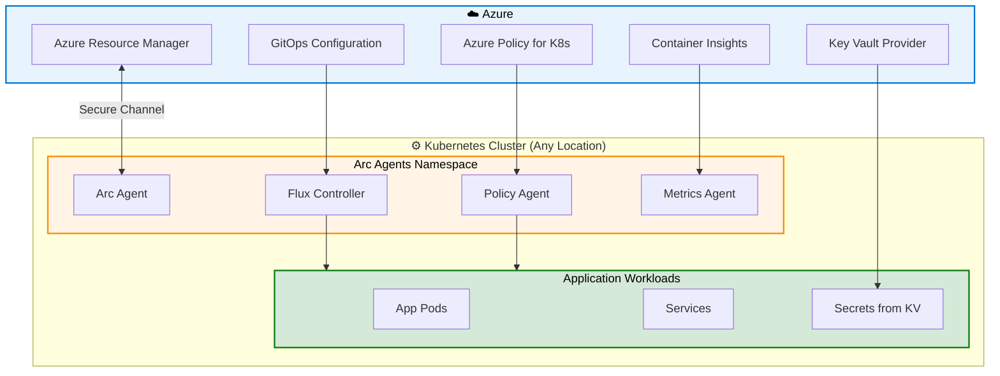
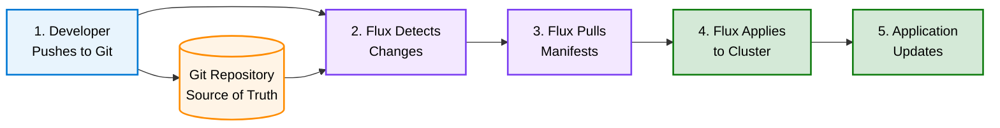

# Azure Arc-Enabled Kubernetes

{: .no_toc }

## Table of Contents

{: .no_toc .text-delta }

1. TOC
{:toc}

---

## What is Arc-Enabled Kubernetes?

<details class="diagram-container" open>
<summary>View Diagram: Arc-Enabled Kubernetes Architecture</summary>
<div class="diagram-content" markdown="1">



_Figure 1: Arc-enabled Kubernetes connects any CNCF cluster to Azure management_

</div>
</details>

Azure Arc-enabled Kubernetes allows you to attach and configure Kubernetes clusters running anywhere - on-premises, in other clouds, or at the edge. Arc brings Azure services and management to any CNCF-certified Kubernetes cluster.

**Key Capabilities:**

- Connect any CNCF-certified Kubernetes cluster to Azure
- Deploy applications using GitOps (Flux)
- Apply Azure Policy for Kubernetes
- Monitor with Azure Monitor Container Insights
- Deploy Azure services to clusters (App Services, Event Grid, etc.)
- Implement security best practices at scale

**[← Back to Azure Arc Introduction](azure-arc-intro)**

---

## Supported Kubernetes Distributions

**Microsoft:**

- AKS (Azure Kubernetes Service) on Azure Local
- AKS Edge Essentials

**Major Distributions:**

- Amazon EKS (Elastic Kubernetes Service)
- Google GKE (Google Kubernetes Engine)
- Red Hat OpenShift (OCP)
- Rancher (RKE, K3s)
- VMware Tanzu Kubernetes Grid
- SUSE Rancher
- Canonical Kubernetes

**Requirements:**

- CNCF-certified Kubernetes 1.19 or newer
- Outbound internet connectivity
- kubectl access to cluster
- ClusterAdmin permissions

---

## Deployment and Cluster Onboarding

### Prerequisites

**Azure Side:**

- Azure subscription
- Resource group
- Registered resource providers
- Service principal (for automation)

**Cluster Side:**

- Running Kubernetes cluster
- kubectl configured
- Outbound HTTPS connectivity
- Sufficient cluster resources (2 vCPU, 4 GB RAM minimum)

### Onboarding Steps

**1. Install Azure CLI Extensions:**

```bash
az extension add --name connectedk8s
az extension add --name k8s-configuration
az extension add --name k8s-extension
```

**2. Connect Cluster:**

```bash
az connectedk8s connect   --name myCluster   --resource-group myResourceGroup   --location eastus
```

**3. Verify Connection:**

```bash
az connectedk8s list --resource-group myResourceGroup
kubectl get deployments,pods -n azure-arc
```

**What Gets Installed:**

- Azure Arc agents (azure-arc namespace)
- Cluster Connect feature
- Config management (GitOps) controllers
- Azure Policy extension (optional)

---

## GitOps-Based Configuration Management

### What is GitOps?

GitOps uses Git repositories as the source of truth for cluster configuration. Changes to the Git repo automatically sync to clusters.

**Benefits:**

- Declarative configuration
- Version control for all changes
- Audit trail (Git history)
- Easy rollback (Git revert)
- Consistent across multiple clusters

### Flux v2 Integration

Azure Arc uses Flux v2 for GitOps:

**Create GitOps Configuration:**

```bash
az k8s-configuration flux create   --name my-app-config   --cluster-name myCluster   --resource-group myResourceGroup   --namespace my-app   --scope cluster   --url https://github.com/my-org/my-app   --branch main   --kustomization name=my-app path=./deploy
```

**Flux Components:**

- **Source Controller:** Monitors Git repos
- **Kustomize Controller:** Applies Kustomize overlays
- **Helm Controller:** Manages Helm releases
- **Notification Controller:** Sends alerts

### Application Deployment Workflow



---

## Policy Enforcement on Kubernetes

### Azure Policy for Kubernetes

**Policy Categories:**

- **Security:** Pod security standards, image restrictions
- **Resource Management:** CPU/memory limits, resource quotas
- **Networking:** Ingress restrictions, network policies
- **Compliance:** Labeling requirements, allowed registries

**Built-in Policies:**

- Enforce HTTPS ingress only
- Require CPU and memory limits
- Block privileged containers
- Enforce read-only root filesystems
- Restrict hostPath volumes

### Policy Implementation

**1. Install Azure Policy Extension:**

```bash
az k8s-extension create   --cluster-name myCluster   --resource-group myResourceGroup   --cluster-type connectedClusters   --extension-type Microsoft.PolicyInsights   --name azure-policy
```

**2. Assign Policies:**

```bash
az policy assignment create   --name 'enforce-https-ingress'   --policy <policy-id>   --scope /subscriptions/<sub-id>/resourceGroups/myResourceGroup
```

**3. View Compliance:**

- Azure portal → Policy → Compliance
- Filter by Kubernetes clusters
- Drill into non-compliant resources
- View remediation recommendations

### Pod Security Standards

**Baseline:** Minimize privilege escalation  
**Restricted:** Hardened security (production workloads)  
**Privileged:** Unrestricted (dev/test only)

---

## Multi-Cluster Orchestration

### Managing Multiple Clusters

**Benefits:**

- Consistent configuration across clusters
- Central visibility and control
- Unified security posture
- Simplified operations

**Approaches:**

**1. GitOps at Scale:**

- Single Git repo for all clusters
- Cluster-specific overlays (Kustomize)
- Environment-based branching

**2. Policy Inheritance:**

- Policies at subscription or management group level
- Apply to all clusters automatically
- Override at cluster level if needed

**3. Centralized Monitoring:**

- Azure Monitor for all clusters
- Unified dashboards
- Cross-cluster queries
- Correlated alerts

### Example: 3-Tier Application Across Clusters

**Development Cluster:**

- Git branch: dev
- Namespace: my-app-dev
- Replica count: 1

**Staging Cluster:**

- Git branch: staging
- Namespace: my-app-staging
- Replica count: 2

**Production Cluster:**

- Git branch: main
- Namespace: my-app-prod
- Replica count: 5

All clusters auto-sync from Git, ensuring consistent deployment patterns.

---

## Cost Considerations

**Azure Arc-enabled Kubernetes:**

- **Free** to connect clusters
- **Free** GitOps configuration (up to 10 configurations per cluster)

**Additional Costs:**

- **Azure Policy:** First 6 vCPUs free, then ~$6/vCPU/month
- **Azure Monitor:** ~$2.30/GB logs + $0.50/GB for Prometheus metrics
- **Azure services deployed:** Varies by service

**Cost Optimization:**

- Use built-in monitoring before Azure Monitor (if cost-sensitive)
- Limit number of policies to essential
- Right-size log retention
- Use free tier where available

---

## Use Case Scenarios

### Scenario 1: Retail Multi-Cloud Kubernetes

**Challenge:** Microservices running on Azure AKS and on-premises Rancher.

**Solution:**

- Connect all clusters to Azure Arc
- Unified GitOps deployment
- Consistent policies across clusters
- Centralized monitoring

**Results:**

- 50% faster deployments
- Zero configuration drift
- Unified security compliance
- Simplified operations

### Scenario 2: Manufacturing Edge Deployment

**Challenge:** Deploy AI models to 20 edge locations with local K3s clusters.

**Solution:**

- Arc-enable all edge clusters
- GitOps for model deployment
- Azure Policy for security baseline
- Azure Monitor for edge observability

**Results:**

- Consistent model deployment
- Real-time monitoring from central location
- Automated rollback on failures
- 90% reduction in deployment errors

### Scenario 3: Financial Services Compliance

**Challenge:** Enforce security standards on 15 Kubernetes clusters (on-prem + cloud).

**Solution:**

- Arc-enable all clusters
- Apply Azure Policy for pod security
- Implement admission controller policies
- Centralized audit logs

**Results:**

- 100% policy compliance
- Passed regulatory audit
- Blocked 50+ policy violations
- Automated compliance reporting

---

## Best Practices

**1. Start with GitOps:**

- Store all configs in Git from day 1
- Use branching strategy (dev/staging/prod)
- Implement code review for config changes

**2. Implement Policy Early:**

- Start with restrictive policies
- Gradually relax as needed
- Test policies in dev first

**3. Monitor from the Start:**

- Enable Container Insights
- Set up essential alerts
- Create custom dashboards

**4. Use Namespaces:**

- Isolate workloads by namespace
- Apply policies per namespace
- Use RBAC for namespace access

**5. Plan for Scale:**

- Design for multiple clusters from start
- Use cluster selectors for targeting
- Automate onboarding process

---

## Troubleshooting

**Cluster Won't Connect:**

- Verify internet connectivity to Azure endpoints
- Check kubectl access
- Validate ClusterAdmin permissions
- Review cluster logs

**GitOps Not Syncing:**

- Verify Git repo access
- Check Flux controller logs
- Validate manifest syntax
- Confirm branch/path configuration

**Policy Not Enforced:**

- Wait for policy sync (15-20 minutes)
- Check policy extension status
- Verify policy scope
- Review pod admission logs

---

## Next Steps

- [Arc Data Services →](azure-arc-data-services)
- [Arc Servers →](azure-arc-servers)
- [Azure Arc Quiz →](azure-arc-quiz)
- [Back to Arc Overview →](azure-arc-intro)

**External Resources:**

- [Azure Arc-enabled Kubernetes docs](https://learn.microsoft.com/en-us/azure/azure-arc/kubernetes/)
- [GitOps with Flux documentation](https://fluxcd.io/docs/)
- [Azure Arc Jumpstart - Kubernetes scenarios](https://azurearcjumpstart.io/azure_arc_jumpstart/azure_arc_k8s/)

---

**Last Updated:** October 2025
