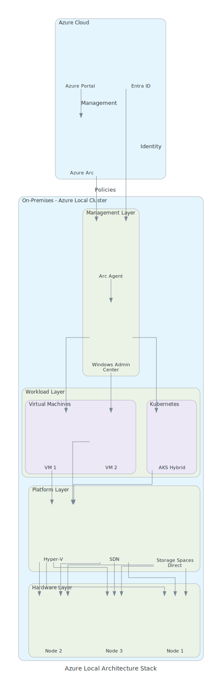
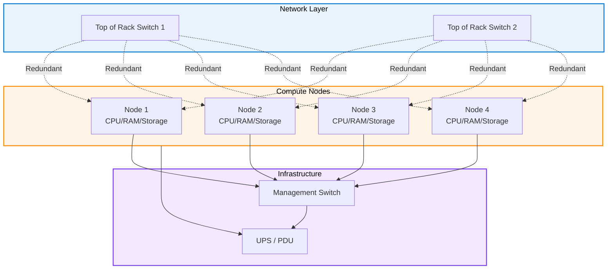

# Azure Local Architecture Deep Dive

{: .no_toc }

## Table of Contents

{: .no_toc .text-delta }

1. TOC
{:toc}

---

## Overview

Azure Local architecture combines physical infrastructure with software-defined technologies to create a hyper-converged platform. Understanding the architecture is essential for planning deployments, sizing infrastructure, and troubleshooting issues.

View Diagram: Azure Local Architecture Stack

_Figure 1: Complete Azure Local architecture with all layers from hardware to Azure cloud integration_

This page provides an in-depth look at:

- Physical infrastructure requirements and topology
- Logical components and their interactions
- Networking architecture and design patterns
- Security layers and encryption mechanisms
- Integration with Azure cloud services

**[← Back to Azure Local Overview](azure-local-overview)**

---

## Physical Infrastructure Requirements

### Node Configuration

An Azure Local cluster consists of 1-16 physical servers (nodes), with most production deployments using 2-4 nodes for high availability.

**Single-Node Clusters:**

- Suitable for branch offices or edge locations
- No cluster-level redundancy
- Lower cost entry point
- Limited high availability

**Multi-Node Clusters (Recommended):**

- 2-4 nodes: Most common configuration
- 5-8 nodes: Large deployments with high capacity needs
- 9-16 nodes: Hyper-scale scenarios

### Server Hardware Specifications

**Minimum Requirements (per node):**

**CPU:**

- 64-bit x86 processor with:
  - Intel VT-x or AMD-V virtualization extensions
  - Second Level Address Translation (SLAT)
  - 8+ cores recommended (16+ for production)
- Examples: Intel Xeon Scalable, AMD EPYC

**Memory:**

- Minimum: 128 GB DDR4
- Recommended: 384 GB - 1 TB
- Production: 512 GB - 6 TB per node
- ECC (Error-Correcting Code) required

**Storage:**

- **OS drives**: 2x 240 GB+ SATA SSD (mirrored)
- **Cache tier**: 2-8x NVMe SSD (800 GB - 3.2 TB each)
- **Capacity tier**: 4-16x SSD or HDD (1-16 TB each)
- Minimum total: 4 drives per node
- Maximum: 400+ drives per cluster

**Network Adapters:**

- Minimum: 2x 10 GbE adapters
- Recommended: 2x 25 GbE or higher
- RDMA-capable adapters preferred (iWARP, RoCE, or InfiniBand)
- Examples: Mellanox/NVIDIA, Intel, Broadcom

**Other Requirements:**

- UEFI 2.3.1c or newer firmware
- TPM 2.0 for security features
- Redundant power supplies
- BMC/iDRAC for remote management

### Validated Hardware Partners

Microsoft maintains a catalog of validated Azure Local solutions from partners:

**Tier 1 OEM Partners:**

- Dell EMC (PowerEdge servers)
- HPE (ProLiant servers)
- Lenovo (ThinkSystem servers)
- Fujitsu (PRIMERGY servers)

**Tier 2 System Builders:**

- Supermicro
- DataON
- QCT (Quanta)
- Wortmann AG

**Benefits of Validated Hardware:**

- ✅ Pre-tested configurations
- ✅ Guaranteed compatibility
- ✅ Simplified support
- ✅ Firmware and driver validation
- ✅ Performance optimization

**Reference:** [Azure Local Catalog](https://azurestackhcisolutions.azure.microsoft.com/)

---

## Hardware Topology and Placement

### Physical Rack Layout

**Typical 4-Node Cluster Layout:**

**Key Design Principles:**

- Dual top-of-rack (ToR) switches for redundancy
- Each node connected to both ToR switches
- Separate management network
- Redundant power distribution
- Cable management for airflow

### Data Center Requirements

**Physical Space:**

- Standard 42U rack sufficient for most clusters
- 1-2U per node (typical)
- Additional space for networking gear
- Consider growth (future node additions)

**Power:**

- Per-node: 300-800 watts typical, 1200+ watts max
- 4-node cluster: ~5-10 kW total
- UPS recommended for graceful shutdown
- PDU with monitoring capability

**Cooling:**

- Maintain ambient temperature: 10-35°C (50-95°F)
- Hot aisle/cold aisle configuration recommended
- Monitor temperature and humidity
- Adequate airflow (front-to-back or back-to-front)

**Connectivity:**

- Access to corporate network
- Internet access (for Connected Mode)
- Out-of-band management network
- Consider future WAN upgrades

---

## Networking Architecture

Azure Local networking is the most critical aspect of the architecture. Poor network design leads to performance issues and reduced reliability.

### Network Traffic Types

Azure Local has four primary network traffic types:

**1. Management Traffic**

- Cluster management and monitoring
- Azure Arc communication (Connected Mode)
- Remote administration (RDP, PowerShell)
- **Bandwidth**: Low (< 100 Mbps typical)
- **Latency**: Not critical (< 100ms acceptable)
- **Recommendation**: 1 GbE sufficient

**2. Storage Traffic (SMB)**

- Storage Spaces Direct (S2D) communication
- Volume replication between nodes
- Highest bandwidth requirement
- **Bandwidth**: 10-100+ Gbps
- **Latency**: Critical (< 1ms required, < 0.5ms optimal)
- **Recommendation**: 25 GbE minimum, RDMA required

**3. VM Compute Traffic**

- Virtual machine network communication
- Tenant workload traffic
- Live migration traffic
- **Bandwidth**: 10-40 Gbps typical
- **Latency**: Moderate (< 5ms)
- **Recommendation**: 10 GbE minimum, 25+ GbE preferred

**4. Cluster Communication**

- Failover clustering heartbeat
- Cluster Shared Volumes (CSV) communication
- **Bandwidth**: Low-Medium
- **Latency**: Critical (< 2ms)
- **Recommendation**: Dedicated interfaces

### Network Topology Options

**Option 1: Fully Converged (Minimum)**

- Single NIC team (2x 25 GbE)
- All traffic types share bandwidth
- Use with caution - limited scalability
- Suitable for small deployments only

**Option 2: Storage Isolated (Recommended)**

- Separate adapters for storage (2x 25 GbE RDMA)
- Management and compute converged (2x 10 GbE)
- Good balance of performance and cost
- Most common deployment

**Option 3: Fully Separated (Optimal)**

- Dedicated adapters per traffic type:
  - Management: 2x 1 GbE
  - Storage: 2x 25 GbE or higher (RDMA)
  - Compute: 2x 10-25 GbE
- Best performance and isolation
- Higher cost (more NICs, more switches)

### RDMA (Remote Direct Memory Access)

RDMA is **essential** for production Storage Spaces Direct performance:

**Benefits:**

- Reduces CPU utilization for storage traffic
- Achieves sub-millisecond latency
- Enables full network throughput
- Required for optimal S2D performance

**RDMA Protocols:**

- **iWARP**: Works over standard Ethernet, easier to configure
- **RoCE v2**: Higher performance, requires lossless Ethernet (DCB)
- **InfiniBand**: Highest performance, less common

**Configuration:**

- Enable DCB (Data Center Bridging) for RoCE
- Configure priority flow control (PFC)
- Set up bandwidth reservation
- Test with `Test-RDMAConnectivity` cmdlet

### Switch Requirements

**Top-of-Rack (ToR) Switches:**

**For Storage Networks (RDMA):**

- Line-rate switching at 25/40/100 GbE
- Low latency (< 5 microseconds)
- RDMA support (RoCE v2 or iWARP)
- DCB capable (for RoCE)
- Jumbo frames support (9000+ MTU)

**For Management/Compute:**

- Standard enterprise-grade switches
- Layer 2/3 capabilities
- VLAN support
- Link aggregation (LACP)

**Popular Switch Vendors:**

- Cisco Nexus series
- Arista 7000 series
- Dell EMC S-series
- Mellanox/NVIDIA Spectrum

---

## Security Layers and Encryption

Azure Local implements defense-in-depth security across multiple layers.

### Hardware Security Foundation

**Secure Boot:**

- UEFI firmware-based boot protection
- Verifies boot components before execution
- Prevents rootkits and bootkits
- Required for Azure Local certification

**Trusted Platform Module (TPM 2.0):**

- Hardware root of trust
- Stores encryption keys securely
- Attestation and measurement
- BitLocker key protection

**Processor Security Features:**

- Intel VT-x / AMD-V (virtualization)
- Intel VT-d / AMD-Vi (I/O virtualization)
- Execute Disable (XD) bit
- Data Execution Prevention (DEP)

### Encryption at Rest

**BitLocker Drive Encryption:**

- All volumes encrypted by default
- Uses AES-256 encryption
- TPM-protected keys
- Transparent to applications and users

**Encryption Scope:**

- Operating system volumes
- Storage Spaces Direct volumes
- Virtual machine disks (optional)
- Configuration data

**Key Management:**

- Keys stored in TPM
- Recovery keys backed up to Azure (Connected Mode)
- Manual backup for Disconnected Mode
- Regular key rotation recommended

### Network Security

**SMB Encryption:**

- SMB 3.x with AES-128-GCM encryption
- Protects storage traffic between nodes
- Enabled by default on S2D volumes
- Transparent performance impact (< 5%)

**IPsec (Optional):**

- Encrypts cluster communication
- Adds defense-in-depth
- Slight performance overhead
- Useful for untrusted networks

**Network Isolation:**

- VLANs for traffic segmentation
- Firewall rules between networks
- Micro-segmentation with SDN
- Zero trust network principles

### Operating System Security

**Windows Server Security Baseline:**

- CIS Benchmarks compliance
- STIG (Security Technical Implementation Guide) hardening
- Minimal attack surface
- Regular security updates

**Credential Guard:**

- Protects credentials using virtualization
- Prevents pass-the-hash attacks
- Uses hardware virtualization
- Recommended for all deployments

**AppLocker / Windows Defender Application Control:**

- Restrict application execution
- Allow-list approach
- Code integrity policies
- Protection against malware

### Azure Arc Security (Connected Mode)

**Managed Identity:**

- No stored credentials
- Azure AD authentication
- Automatic token rotation
- Least privilege access

**Azure Policy Integration:**

- Enforce security configurations
- Compliance reporting
- Drift detection and remediation
- Central governance

**Azure Security Center:**

- Threat detection
- Security recommendations
- Vulnerability assessment
- Integration with Azure Sentinel

---

## Control Plane vs. Data Plane Separation

Understanding the separation between control and data planes is critical for security and operational sovereignty.

### Data Plane (Always Local)

The **data plane** handles actual workload processing and data storage:

**Components:**

- Hyper-V virtual machines
- Storage Spaces Direct volumes
- Virtual networks (SDN)
- Container workloads (AKS)
- Application data and processing

**Characteristics:**

- ✅ Always runs locally on Azure Local hardware
- ✅ No dependency on Azure cloud
- ✅ Data never leaves premises (unless explicitly configured)
- ✅ Sub-millisecond latency
- ✅ Continues operating during internet outages

**Important:** In both Connected and Disconnected modes, the data plane is **always local**.

### Control Plane

The **control plane** manages configuration, monitoring, and updates:

**Connected Mode - Hybrid Control Plane:**

- **Azure-managed functions:**
  - Cluster registration and inventory
  - Monitoring and telemetry
  - Update orchestration
  - Azure Arc management
  - Policy enforcement
  - Security Center integration

- **Locally-managed functions:**
  - VM creation and management
  - Storage configuration
  - Network configuration
  - Failover and recovery
  - Performance optimization

**Disconnected Mode - Local Control Plane:**

- All management functions run locally
- Windows Admin Center for management
- PowerShell for automation
- No Azure dependency
- Manual update deployment

### Why This Matters for Sovereignty

The control/data plane separation provides:

**Data Sovereignty:**

- Workload data stays on-premises
- No data transmitted to Azure without explicit action
- Compliance with data residency requirements

**Operational Sovereignty:**

- Critical operations (VM failover, storage access) are local
- Continue operations during Azure outages
- Reduced dependence on cloud connectivity

**Hybrid Benefits:**

- Centralized management when connected
- Local autonomy when needed
- Best of both worlds

---

## Integration with Azure Cloud Control Plane

When deployed in Connected Mode, Azure Local integrates with Azure services for management, monitoring, and governance.

### Azure Arc Integration

Azure Arc is the foundation for Azure Local's cloud integration:

**Registration Process:**

1. Install Azure Arc agents on cluster nodes
2. Register cluster with Azure subscription
3. Create Azure Resource Manager representation
4. Enable Azure management services

**Arc-Enabled Capabilities:**

- Resource inventory in Azure portal
- RBAC (Role-Based Access Control)
- Azure Policy assignment and enforcement
- Resource tagging and organization
- Cost tracking and billing

**Reference:** [Azure Arc Overview](azure-arc-intro)

### Azure Monitor Integration

**Metrics Collection:**

- CPU, memory, storage, network utilization
- VM performance metrics
- Storage latency and IOPS
- Cluster health status
- 1-5 minute granularity

**Log Collection:**

- System event logs
- Application logs
- Security audit logs
- Storage logs
- Queryable via Log Analytics

**Alerting:**

- Threshold-based alerts
- Anomaly detection
- Action groups for notifications
- Integration with ITSM tools

**Dashboards:**

- Pre-built cluster health dashboards
- Custom workbooks
- Cross-cluster views
- Trend analysis

### Azure Policy Enforcement

**Built-in Policies:**

- Require BitLocker encryption
- Enforce security baselines
- Restrict VM sizes
- Network security rules
- Compliance standards (PCI-DSS, HIPAA, etc.)

**Custom Policies:**

- Define organization-specific rules
- JSON-based policy definitions
- Audit or enforce mode
- Exemption handling

**Compliance Reporting:**

- Real-time compliance status
- Historical compliance trends
- Remediation recommendations
- Export to Excel/CSV

### Azure Update Manager

**Update Orchestration:**

- Scheduled update windows
- Pre/post-update scripts
- Phased rollout (cluster-aware updating)
- Rollback capability
- Update approval workflow

**Update Types:**

- Windows Server updates
- Azure Local-specific updates
- Driver and firmware updates
- Security patches (priority)

**Benefits vs. Manual Updates:**

- Reduced administrative overhead
- Consistent update process
- Lower risk of errors
- Audit trail
- Centralized control for multiple clusters

### Azure Backup Integration

**VM-Level Backup:**

- Application-consistent backups
- Scheduled backup policies
- Long-term retention
- Cross-region replication
- Quick restore capability

**Backup Storage:**

- Data stored in Azure Recovery Services vault
- Encrypted in transit and at rest
- Redundancy options (LRS, GRS)
- Cost-effective long-term storage

**Hybrid Benefits:**

- On-premises VMs backed up to Azure
- No need for local backup infrastructure
- Disaster recovery to Azure
- Compliance with retention policies

### Azure Site Recovery

**Disaster Recovery:**

- Replicate VMs to Azure
- Failover during outages
- Failback when on-premises restored
- Recovery time objective (RTO): minutes
- Recovery point objective (RPO): minutes

**DR Scenarios:**

- Site-to-Azure DR
- Site-to-site DR (between Azure Local clusters)
- Compliance with BCO/DR requirements

---

## Network Connectivity Requirements

For Connected Mode, Azure Local requires outbound connectivity to specific Azure services.

### Required Azure Endpoints

**Azure Arc Services:**

- `management.azure.com` - Azure Resource Manager
- `login.microsoftonline.com` - Azure AD authentication
- `*.his.arc.azure.com` - Hybrid Instance Metadata Service
- `*.guestconfiguration.azure.com` - Guest configuration

**Azure Monitor:**

- `*.ods.opinsights.azure.com` - Operations data
- `*.oms.opinsights.azure.com` - Operational management
- `*.monitoring.azure.com` - Monitoring data

**Azure Update Manager:**

- `*.download.microsoft.com` - Update downloads
- `*.windowsupdate.com` - Windows Update
- `*.delivery.mp.microsoft.com` - Content delivery

**Azure Backup:**

- `*.backup.windowsazure.com` - Backup service
- `*.blob.core.windows.net` - Blob storage

**Other Services:**

- `*.vault.azure.net` - Key Vault (for secrets)
- `*.servicebus.windows.net` - Service Bus (for events)

**Port Requirements:**

- Outbound HTTPS (TCP 443) for all services
- No inbound connections from internet required
- Proxy server supported

**Bandwidth Recommendations:**

- Minimum: 1-5 Mbps per cluster
- Recommended: 50-100 Mbps
- Optimal: 1+ Gbps (for backup/DR)

**Latency Tolerance:**

- Target: < 150ms to Azure region
- Maximum: < 250ms for acceptable performance
- Higher latency impacts management responsiveness

### Disconnected Mode Considerations

In Disconnected Mode:

- No Azure connectivity required
- All management is local
- Windows Admin Center for management
- Updates deployed manually
- Local backup solutions needed

**Periodic Sync Option:**

- Connect periodically for updates
- Download updates to USB/portable media
- Air-gapped transfer to cluster
- Apply updates manually

---

## Disaster Recovery and Business Continuity

Azure Local provides multiple mechanisms for business continuity.

### Cluster-Level Resiliency

**Node Failure Tolerance:**

- **2-node cluster**: 1 node failure (50% capacity loss)
- **3-node cluster**: 1 node failure (33% capacity loss)
- **4-node cluster**: 1 node failure (25% capacity loss)
- **N-node cluster**: Up to 2 node failures with three-way mirroring

**Automatic Recovery:**

- VMs automatically restart on healthy nodes
- Live migration when possible (planned maintenance)
- Storage healing begins immediately
- Cluster reforms after network partition

### Storage Resiliency

**Resiliency Types:**

**Two-Way Mirror:**

- 2 copies of data
- Tolerates 1 disk/node failure
- 50% storage efficiency
- Faster rebuild times
- Recommended for most workloads

**Three-Way Mirror:**

- 3 copies of data
- Tolerates 2 simultaneous disk/node failures
- 33.3% storage efficiency
- Higher durability
- Recommended for critical workloads

**Erasure Coding (Parity):**

- Data + parity stripes
- Tolerates 1-2 failures (depends on configuration)
- 50-80% storage efficiency
- Higher CPU usage
- Recommended for capacity-optimized storage

**Storage Repair:**

- Automatic detection of failed components
- Background data rebuild
- Parallel rebuild for faster recovery
- Throttling to avoid performance impact

### Backup Strategies

**Local Backups:**

- Secondary Azure Local cluster
- Traditional backup software (Veeam, Commvault, etc.)
- Azure Backup to local Azure Local
- Replica volumes

**Cloud Backups (Connected Mode):**

- Azure Backup for VMs
- Azure Site Recovery for DR
- Azure Blob replication for files
- Long-term retention in Azure

**Hybrid Approach:**

- Local backups for fast recovery
- Cloud backups for DR and long-term retention
- Best of both: RPO/RTO + offsite protection

### Recovery Scenarios

**Scenario 1: Single Node Failure**

- VMs automatically restart on other nodes
- No administrative action required
- Replace failed node when convenient
- Automatic storage rebuild

**Scenario 2: Complete Cluster Failure**

- Restore from backup to new cluster
- Failover to Azure (if using Site Recovery)
- Failover to secondary Azure Local cluster
- RTO: Hours to days (depends on strategy)

**Scenario 3: Datacenter Disaster**

- Failover to Azure using Site Recovery
- Recover from Azure Backup to Azure VMs
- Failover to remote Azure Local cluster
- RTO: Hours (with proper planning)

---

## Scalability Architecture

### Vertical Scaling (Scale-Up)

Increase capacity of existing nodes:

**CPU:**

- Upgrade to higher core count processors
- Requires node shutdown
- Consider memory capacity when upgrading

**Memory:**

- Add memory modules to existing nodes
- Can be done with rolling updates
- Monitor memory usage before scaling

**Storage:**

- Add drives to existing nodes
- Hot-add supported for data drives
- Automatic rebalancing

**Network:**

- Upgrade to faster NICs (10→25→40→100 GbE)
- Requires brief outage per node
- Improve throughput and latency

### Horizontal Scaling (Scale-Out)

Add nodes to the cluster:

**Adding Nodes:**

1. Prepare new hardware (validated configuration)
2. Join to domain
3. Install Azure Local OS
4. Run `Add-ClusterNode` cmdlet
5. Cluster automatically rebalances

**Benefits:**

- Increased capacity (compute, storage, networking)
- Improved redundancy
- Linear scalability
- No downtime for addition

**Limitations:**

- Maximum 16 nodes per cluster
- All nodes should be similar hardware
- Network bandwidth critical

### Multi-Cluster Scaling

For scenarios beyond 16 nodes:

**Separate Clusters:**

- Deploy multiple independent clusters
- Manage via Azure Arc
- Workload placement by cluster
- Good for multi-site deployments

**Stretched Clusters (Advanced):**

- Single cluster across two sites
- Synchronous replication between sites
- Low latency requirement (< 5ms)
- Complex configuration

---

## Performance Optimization

### Storage Performance Tuning

**Cache Configuration:**

- Use NVMe SSDs for cache tier
- 10-20% of capacity tier size recommended
- Read/write cache for optimal performance

**Volume Optimization:**

- Use appropriate resiliency (mirror for performance, parity for capacity)
- Fixed provisioning for predictable performance
- Separate volumes for different workload types

**Deduplication and Compression:**

- Enable for file servers and VDI
- Disable for databases and high-IOPS workloads
- Monitor CPU impact

### Network Performance

**RDMA Tuning:**

- Verify RDMA is functioning (`Get-NetAdapterRdma`)
- Enable jumbo frames (MTU 9000+)
- Configure DCB properly (for RoCE)
- Monitor with `Get-RDMACounter`

**Traffic Management:**

- Use QoS for traffic prioritization
- Separate VLANs for traffic isolation
- Monitor switch utilization

### Compute Performance

**VM Placement:**

- Distribute VMs evenly across nodes
- Consider anti-affinity for redundancy
- Use placement rules for performance isolation

**Resource Allocation:**

- Right-size VMs (don't over-allocate)
- Use dynamic memory wisely
- Monitor for resource contention

---

## Monitoring and Maintenance

### Health Monitoring

**Built-in Health Service:**

- Automatic fault detection
- Predictive failure analysis
- Storage capacity monitoring
- Performance baseline tracking

**Monitoring Tools:**

- Windows Admin Center dashboard
- Azure Monitor (Connected Mode)
- Performance Monitor (PerfMon)
- Event Viewer

**Key Metrics to Monitor:**

- CPU utilization (< 70% average)
- Memory usage (< 80%)
- Storage latency (< 5ms for SSD, < 20ms for HDD)
- Network utilization (< 60%)
- Storage capacity (< 80% full)

### Maintenance Best Practices

**Regular Tasks:**

- Apply Windows updates monthly
- Review event logs weekly
- Monitor capacity trends
- Test backups regularly
- Update firmware quarterly

**Cluster-Aware Updating:**

- Schedule during maintenance windows
- Use CAU for automatic node updates
- Validate after each update
- Have rollback plan

---

## Next Steps

**Continue Learning:**

- [Connected Mode Operations →](azure-local-connected-mode)
- [Disconnected Mode Operations →](azure-local-disconnected-mode)
- [Hardware Requirements & Planning →](azure-local-hardware)
- [Azure Local Quiz →](azure-local-quiz)

**External Resources:**

- [Azure Local Architecture Docs](https://learn.microsoft.com/en-us/azure/azure-local/overview?view=azloc-2509)
- [Network Planning Guide](https://learn.microsoft.com/en-us/azure/azure-local/plan/cloud-deployment-network-considerations?view=azloc-2509)
- [Security Best Practices](https://learn.microsoft.com/en-us/azure/azure-local/concepts/security-features?view=azloc-2509)

---

**Last Updated:** October 2025
