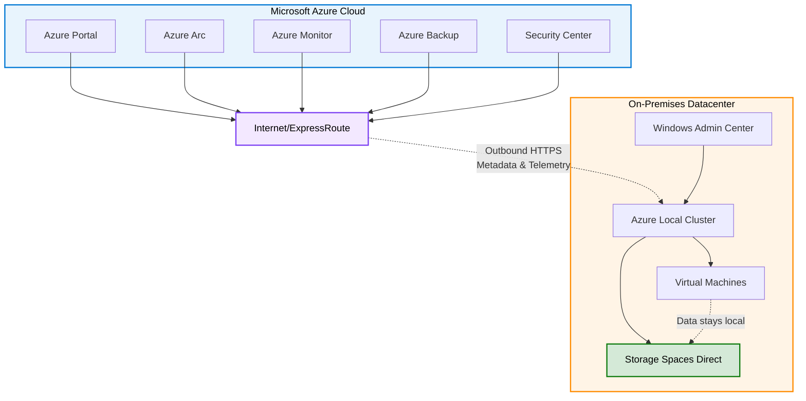

# Azure Local Connected Mode Operations

{: .no_toc }

## Table of Contents

{: .no_toc .text-delta }

1. TOC
{:toc}

---

{: .note }
> ⏱️ **Reading Time:** 15-20 min | 🎯 **Key Topics:** Hybrid management, Azure Arc integration, outbound connectivity | 📋 **Prerequisites:** [Azure Local Overview](azure-local-overview.md)

---

## What is Connected Mode?

**Connected Mode** is the default and recommended deployment mode for Azure Local. In this mode, the cluster maintains regular connectivity to Microsoft Azure services, enabling hybrid cloud capabilities, centralized management, and cloud-based monitoring and backup services.



### Key Characteristics

**Connectivity:**

- Outbound HTTPS connectivity to Azure (no inbound required)
- Intermittent connectivity acceptable (not continuous 24/7)
- Resilient to temporary network outages (hours to days)
- Proxy server support for restricted networks

**Management:**

- Azure portal for cluster overview and management
- Azure Arc for unified hybrid management
- Windows Admin Center for detailed administration
- PowerShell for automation and scripting

**Integration:**

- Full access to Azure hybrid services
- Azure Backup for VM protection
- Azure Monitor for observability
- Azure Security Center for threat protection
- Azure Update Manager for patch management

**[← Back to Azure Local Overview](azure-local-overview)**

---

## Prerequisites and Connectivity Requirements

### Network Requirements

**Minimum Bandwidth:**

- 1-5 Mbps per cluster for basic management
- 10-50 Mbps for monitoring with Azure Monitor
- 100+ Mbps for Azure Backup and Site Recovery

**Recommended Bandwidth:**

- 50-100 Mbps for typical deployments
- 500-1000 Mbps for large clusters with frequent backups
- Varies based on number of VMs and backup frequency

**Latency Tolerance:**

- Target: < 150ms to nearest Azure region
- Acceptable: < 250ms for management operations
- Higher latency impacts admin responsiveness, not VM performance

**Connectivity Type:**

- Direct internet connection (most common)
- Azure ExpressRoute (recommended for large deployments)
- VPN connection (acceptable, ensure sufficient bandwidth)
- Proxy server supported (explicit or transparent)

### Azure Subscription Requirements

**Subscription Type:**

- Any Azure subscription (Pay-as-you-go, Enterprise Agreement, CSP)
- Sufficient permissions to create resources
- Azure Local capacity available in subscription

**Required Permissions:**

- **Owner** or **Contributor** role on subscription or resource group
- Permission to register Azure resource providers
- Permission to create Azure Arc-enabled servers
- Azure AD permissions for service principal creation (or pre-created)

### Firewall and Endpoint Access

**Required Azure Endpoints:**

**Azure Arc Services:**

```text
https://management.azure.com
https://login.microsoftonline.com
https://*.his.arc.azure.com
https://*.guestconfiguration.azure.com
https://gbl.his.arc.azure.com
https://*.dp.kubernetesconfiguration.azure.com
```

**Azure Monitor:**

```text
https://*.ods.opinsights.azure.com
https://*.oms.opinsights.azure.com
https://*.monitoring.azure.com
https://*.agentsvc.azure-automation.net
```

**Azure Update Manager:**

```text
https://*.update.microsoft.com
https://*.windowsupdate.com
https://*.download.microsoft.com
https://*.delivery.mp.microsoft.com
```

**Azure Backup:**

```text
https://*.backup.windowsazure.com
https://*.blob.core.windows.net
```

**Azure Storage:**

```text
https://*.blob.core.windows.net
https://*.table.core.windows.net
https://*.queue.core.windows.net
```

**Other Services:**

```text
https://*.vault.azure.net (Key Vault)
https://*.servicebus.windows.net (Event Hubs)
```

**Port Requirements:**

- Outbound TCP 443 (HTTPS) to all endpoints above
- No inbound connections from internet required
- DNS resolution to Azure public endpoints

**Proxy Configuration:**

- Set via PowerShell: `Set-AzStackHciNetwork -ProxyServer "http://proxy:8080"`
- Supports authenticated proxies
- Bypass local addresses

### Identity and Authentication

**Azure Active Directory:**

- Azure AD tenant required
- Service principal for Arc registration
- Managed identity for Azure services
- Azure AD Connect optional (for AD sync)

**Local Active Directory:**

- Domain-joined servers recommended
- RBAC for administrative access
- Group Policy support
- Certificate-based authentication optional

**Authentication Flow:**

1. Azure Local connects to Azure Arc
2. Azure Arc authenticates to Azure AD
3. Managed identity issued for cluster
4. Identity used for all Azure service access
5. Automatic token refresh (no credential storage)

---

## Real-Time Synchronization with Azure

### How Synchronization Works

Connected Mode maintains near real-time synchronization of metadata and telemetry:

**Sync Frequency:**

- **Heartbeat**: Every 5 minutes
- **Inventory**: Every 24 hours or on-demand
- **Metrics**: Every 1-5 minutes (configurable)
- **Logs**: Every 1-15 minutes (configurable)
- **Alerts**: Real-time (within seconds)

**What Gets Synchronized:**

- Cluster configuration and state
- Node inventory (CPU, memory, storage)
- VM inventory and properties
- Health and fault status
- Performance metrics (CPU, memory, storage, network)
- Event logs (security, system, application)
- Update status and compliance

**What Does NOT Get Synchronized:**

- VM data or application data
- Storage volume contents
- Network traffic payloads
- User files or databases
- Credentials or secrets

### Data Sovereignty in Connected Mode

**Important:** Even in Connected Mode, workload data stays on-premises:

**Data that Stays Local:**

- ✅ VM disks and file systems
- ✅ Storage volume contents
- ✅ Application databases
- ✅ User files and documents
- ✅ Network traffic between VMs
- ✅ Backup data (if backing up locally)

**Metadata Sent to Azure:**

- ⚠️ VM names, sizes, states
- ⚠️ Performance metrics (CPU %, memory %, etc.)
- ⚠️ Event log entries
- ⚠️ Configuration settings
- ⚠️ Fault and health status

**Compliance Considerations:**

- Metadata does not contain sensitive business data
- Meets most data residency requirements
- Configurable log filtering available
- Data encrypted in transit (TLS 1.2+)

**[Review Data Residency Concepts →](data-residency-concepts)**

---

## Feature Availability in Connected Mode

### Management Features

**Azure Portal Integration:**

- ✅ Cluster overview and health dashboard
- ✅ Resource inventory (nodes, VMs, volumes)
- ✅ Performance metrics and charts
- ✅ Alert management
- ✅ Update status
- ✅ Cost tracking (for Azure services)
- ✅ RBAC management

**Azure Arc Capabilities:**

- ✅ Unified multi-cloud management
- ✅ Azure Policy enforcement
- ✅ Resource tagging and organization
- ✅ Azure Resource Manager integration
- ✅ Azure Resource Graph queries
- ✅ Cross-cluster management

**Windows Admin Center:**

- ✅ Full feature set available
- ✅ Remote management
- ✅ VM creation and management
- ✅ Storage configuration
- ✅ Network configuration
- ✅ Cluster updates

### Monitoring and Observability

**Azure Monitor:**

- ✅ Metrics collection and visualization
- ✅ Custom metric queries
- ✅ Pre-built workbooks and dashboards
- ✅ Performance baselines
- ✅ Capacity planning tools
- ✅ Historical data (90+ days)

**Log Analytics:**

- ✅ Centralized log aggregation
- ✅ Advanced queries with KQL
- ✅ Log retention (customizable)
- ✅ Correlation across multiple clusters
- ✅ Integration with Azure Sentinel
- ✅ Custom log parsing

**Alerting:**

- ✅ Metric-based alerts
- ✅ Log-based alerts
- ✅ Anomaly detection
- ✅ Action groups (email, SMS, webhook)
- ✅ Integration with ITSM tools
- ✅ Alert aggregation and correlation

**Azure Monitor Insights:**

- ✅ VM insights (guest performance)
- ✅ Container insights (for AKS)
- ✅ Network insights
- ✅ Storage insights
- ✅ Security insights

### Backup and Disaster Recovery

**Azure Backup:**

- ✅ Agent-based VM backup
- ✅ Application-consistent backups
- ✅ Scheduled backup policies
- ✅ Long-term retention (years)
- ✅ Backup to Azure storage
- ✅ Cross-region backup replication
- ✅ Quick restore capability
- ✅ File-level restore

**Azure Site Recovery:**

- ✅ VM replication to Azure
- ✅ Planned and unplanned failover
- ✅ Failback to on-premises
- ✅ Recovery plans with orchestration
- ✅ Non-disruptive DR testing
- ✅ RTO/RPO in minutes

**Benefits Over Local-Only Backup:**

- Offsite protection against site-wide disasters
- No need for local backup infrastructure
- Cost-effective long-term retention
- Easier management and monitoring
- Compliance with 3-2-1 backup rule

### Security Features

**Azure Security Center:**

- ✅ Security posture assessment
- ✅ Threat detection
- ✅ Vulnerability scanning
- ✅ Security recommendations
- ✅ Regulatory compliance dashboards
- ✅ Integration with Azure Sentinel

**Azure Policy:**

- ✅ Policy assignment and enforcement
- ✅ Compliance reporting
- ✅ Drift detection
- ✅ Auto-remediation
- ✅ Custom policy definitions
- ✅ Initiative bundles (e.g., PCI-DSS, HIPAA)

**Microsoft Defender for Cloud:**

- ✅ Advanced threat protection
- ✅ JIT (Just-in-Time) VM access
- ✅ File integrity monitoring
- ✅ Adaptive application controls
- ✅ Adaptive network hardening

### Update Management

**Azure Update Manager:**

- ✅ Centralized update management
- ✅ Update assessment and reporting
- ✅ Scheduled maintenance windows
- ✅ Cluster-aware updating
- ✅ Pre/post-update scripts
- ✅ Compliance tracking
- ✅ Update history and audit logs

**Automated Capabilities:**

- Automatic update download
- Scheduled deployment
- Node-by-node orchestration (rolling updates)
- Validation at each step
- Rollback on failure

---

## Management and Monitoring Capabilities

### Azure Portal Management

**Cluster Dashboard:**

- Real-time cluster health status
- Node inventory and status
- VM count and states
- Storage capacity and usage
- Network throughput
- Recent alerts

**Resource Management:**

- View and manage VMs
- View storage volumes
- Configure networking
- Apply Azure policies
- Manage updates

**Cost Management:**

- Track Azure service costs
- Cost by resource type
- Budget and spending alerts
- Cost forecasting

### Windows Admin Center

**Comprehensive Management:**

- VM lifecycle management (create, start, stop, delete)
- Storage configuration (volumes, dedupe, compression)
- Network configuration (virtual switches, VLANs, SDN)
- Cluster updates and patching
- Performance monitoring
- Event log viewing
- Remote desktop connections

**Advantages:**

- Rich graphical interface
- No Azure dependency for operations
- Direct cluster access
- Detailed configuration options

### PowerShell Automation

**Azure Local Cmdlets:**

```powershell
# Cluster management
Get-AzStackHci
Get-ClusterNode
Get-ClusterResource

# VM management
Get-VM
New-VM
Start-VM
Stop-VM

# Storage management
Get-StoragePool
Get-Volume
New-Volume

# Network management
Get-VMSwitch
New-VMSwitch
```

**Azure Arc Cmdlets:**

```powershell
# Arc registration
Register-AzStackHCI
Get-AzureStackHCI

# Policy management
Get-AzPolicyAssignment
New-AzPolicyAssignment
```

**Benefits:**

- Automation and scripting
- Bulk operations
- Custom workflows
- Integration with existing tools

---

## Update and Patching Procedures

### Update Types

**1. Windows Server Updates:**

- Monthly cumulative updates
- Security patches
- Feature updates (semi-annual)
- Out-of-band critical patches

**2. Azure Local Platform Updates:**

- Azure Local-specific updates
- Released monthly
- Include feature improvements
- Coordinated with Windows updates

**3. Driver and Firmware Updates:**

- Hardware vendor-specific
- Periodic releases
- Validated by Microsoft
- Applied separately from OS updates

**4. Azure Arc Agent Updates:**

- Automatic updates
- Coordinated with Azure releases
- Minimal downtime

### Cluster-Aware Updating (CAU)

**How CAU Works:**

1. **Pre-Update Assessment:**
   - Check cluster health
   - Validate update packages
   - Verify backup status

2. **Node-by-Node Update:**
   - Drain VMs from node (live migrate)
   - Apply updates to node
   - Reboot node
   - Validate node health
   - Return node to service
   - Move to next node

3. **Post-Update Validation:**
   - Verify cluster health
   - Check all VMs running
   - Validate services operational

**Benefits:**

- Zero VM downtime (with 2+ nodes)
- Automatic orchestration
- Validation at each step
- Rollback capability

**Configuration:**

```powershell
# Enable CAU
Enable-CauClusterRole -ClusterName "AzLocalCluster" `
    -MaxFailedNodes 1 `
    -MaxRetriesPerNode 2

# Set schedule
Set-CauClusterRole -DaysOfWeek Saturday `
    -WeeksOfMonth 2,4 `
    -StartTime 02:00:00
```

### Azure Update Manager

**Advantages:**

- Centralized management across multiple clusters
- Compliance reporting
- Update history and audit trail
- Automated scheduling
- Integration with change management

**Update Orchestration:**

1. Azure Update Manager assesses cluster
2. Admin reviews and approves updates
3. CAU executes updates on schedule
4. Azure Update Manager reports completion

**Best Practices:**

- Schedule during maintenance windows
- Test updates in non-production first
- Monitor cluster health during updates
- Keep backup current before major updates
- Review release notes for breaking changes

---

## Cost Model for Connected Mode

### Azure Service Costs

**Core Azure Local:**

- No additional charge for Azure Arc registration
- Windows Server Datacenter licensing required
- Azure Local software subscription (per core/year)

**Monitoring Services:**

- **Azure Monitor Metrics**: ~$0.10 per million datapoints
- **Log Analytics**: ~$2.30 per GB ingested
- Typical cluster: $50-200/month for monitoring

**Backup Services:**

- **Azure Backup**: ~$10 per VM per month
- Storage costs: ~$0.01-0.05 per GB/month
- Typical cluster (50 VMs): $500-1000/month

**Site Recovery:**

- **Replication**: ~$25 per VM per month
- Compute costs during failover
- Storage costs for replica data

**Security Services:**

- **Azure Security Center**: Free tier available
- **Microsoft Defender**: ~$15 per server per month

**Networking:**

- Outbound data transfer: ~$0.05-0.09 per GB
- ExpressRoute: $50-1000+ per month (depending on bandwidth)

### Cost Optimization Tips

**Reduce Monitoring Costs:**

- Adjust metric collection frequency
- Implement log filtering
- Use data retention policies
- Archive old logs to cheaper storage

**Reduce Backup Costs:**

- Optimize retention policies
- Use incremental backups
- Compress backup data
- Delete obsolete backups

**Reduce Networking Costs:**

- Use ExpressRoute for high-volume scenarios
- Minimize data transfer to Azure
- Use Azure Storage lifecycle policies

**Typical Monthly Costs:**

**Small Deployment (2-node cluster, 25 VMs):**

- Monitoring: $50-100
- Backup: $250-500
- Security: $50-100
- Networking: $50-100
- **Total**: ~$400-800/month

**Medium Deployment (4-node cluster, 100 VMs):**

- Monitoring: $100-200
- Backup: $1000-2000
- Security: $200-400
- Networking: $100-200
- **Total**: ~$1400-2800/month

**Large Deployment (8-node cluster, 500 VMs):**

- Monitoring: $300-500
- Backup: $5000-10000
- Security: $1000-2000
- Networking: $500-1000
- **Total**: ~$6800-13500/month

---

## Performance Characteristics

### Latency Impact

**Management Operations:**

- Azure portal queries: 200-500ms response
- Azure Monitor dashboards: 1-3 second load
- Policy evaluation: Minutes (asynchronous)
- No impact on VM performance

**VM Operations:**

- VM start/stop: Same as Disconnected Mode (local)
- VM migration: Same as Disconnected Mode (local)
- Storage I/O: Same as Disconnected Mode (local)
- Network I/O: Same as Disconnected Mode (local)

**Key Point:** Azure connectivity does not impact VM or storage performance. All workload operations are local.

### Network Bandwidth Usage

**Typical Bandwidth Consumption:**

**Baseline (Idle Cluster):**

- Heartbeat and health: < 1 Kbps
- Minimal impact on network

**With Monitoring:**

- Metrics collection: 10-50 Kbps
- Log collection: 50-500 Kbps (depends on log volume)

**During Backups:**

- Initial backup: Limited by bandwidth and backup policy
- Incremental backups: 1-10 Mbps typical
- Can be scheduled during off-peak hours

**During Updates:**

- Update download: 100-500 MB per node
- Occurs once per month typically
- Can be pre-downloaded and cached

**Total Bandwidth:**

- Typical: 1-5 Mbps sustained
- Peak (backup/update): 50-100 Mbps
- Minimal impact on production WAN

---

## Hybrid Cloud Orchestration

### Workload Placement Strategies

**On-Premises (Azure Local):**

- Latency-sensitive applications
- Data residency-required workloads
- High-throughput databases
- Real-time processing
- Applications with large local datasets

**Azure Cloud:**

- Bursty compute workloads
- Development and testing
- Disaster recovery (replicas)
- Globally distributed applications
- Web applications with internet traffic

**Hybrid Scenarios:**

- **Application tier in Azure, data tier on Azure Local**
- **Primary on Azure Local, DR in Azure**
- **Processing on Azure Local, analytics in Azure**
- **Active-active across both environments**

### Azure Services Integration

**Azure Virtual Desktop:**

- VMs on Azure Local
- Management plane in Azure
- User authentication via Azure AD
- Personal and pooled desktops

**Azure Kubernetes Service (AKS):**

- AKS on Azure Local for edge scenarios
- Management via Azure Arc
- Consistent deployment across hybrid
- GitOps for configuration

**Azure SQL Edge:**

- SQL databases on Azure Local
- Consistent T-SQL experience
- Replication to Azure SQL Database
- Centralized management

**Azure IoT Edge:**

- Edge modules on Azure Local VMs
- Azure IoT Hub integration
- Local processing, cloud analytics
- OTA updates from cloud

---

## Customer Use Cases - Connected Mode

### Use Case 1: Healthcare Provider Network

**Scenario:**

- 10 hospital facilities
- 200 VMs per site (2000 total)
- EMR/EHR systems requiring low latency
- HIPAA compliance requirements
- Need for disaster recovery

**Connected Mode Benefits:**

- Centralized monitoring across all sites
- Azure Backup for off-site protection
- Azure Site Recovery for DR to Azure
- Azure Policy for HIPAA compliance enforcement
- Azure Security Center for threat detection
- Unified management via Azure portal

**Results:**

- ✅ 99.95% uptime across all facilities
- ✅ Sub-5ms latency for EMR access
- ✅ HIPAA compliance maintained
- ✅ 50% reduction in management overhead
- ✅ Successful DR test to Azure

### Use Case 2: Financial Services Branch Network

**Scenario:**

- 100 bank branches
- 2-node Azure Local per branch
- Transaction processing systems
- GDPR and PCI-DSS compliance
- Real-time fraud detection

**Connected Mode Benefits:**

- Azure Arc for unified management of 100 clusters
- Azure Policy for consistent security
- Azure Monitor for centralized observability
- Azure Backup for data protection
- Azure Security Center for threat intelligence

**Results:**

- ✅ Reduced operational cost per branch (30%)
- ✅ Faster security patch deployment
- ✅ Improved audit compliance (100% policy coverage)
- ✅ Detected and prevented 15 security incidents
- ✅ Sub-10ms transaction processing latency

### Use Case 3: Retail Chain with Distribution Centers

**Scenario:**

- 25 distribution centers
- Inventory management systems
- Point-of-sale integration
- Need for real-time analytics
- Periodic WAN outages acceptable

**Connected Mode Benefits:**

- Azure Monitor for inventory visibility
- Azure Backup for data protection
- Azure Arc for multi-site management
- Resilient to temporary outages (hours)
- Azure Data Explorer for analytics

**Results:**

- ✅ Reduced inventory errors (40%)
- ✅ Improved stock visibility
- ✅ Faster response to supply chain issues
- ✅ Analytics insights from 25 locations
- ✅ Zero downtime during WAN outages

### Use Case 4: University Research Labs

**Scenario:**

- 5 research labs with sensitive data
- High-performance computing workloads
- GPU-accelerated ML training
- Collaboration with cloud-based researchers
- Data cannot leave campus

**Connected Mode Benefits:**

- Local compute for sensitive data
- Azure Machine Learning integration
- Azure Monitor for resource optimization
- Azure Backup for research data protection
- Selective cloud publishing for approved results

**Results:**

- ✅ Data sovereignty maintained
- ✅ 60% cost savings vs. cloud GPU compute
- ✅ Seamless collaboration with cloud teams
- ✅ Faster ML training (local GPUs)
- ✅ Compliance with research data policies

---

## Comparison: Connected vs. Disconnected

| Feature | Connected Mode | Disconnected Mode |
|---------|---------------|-------------------|
| **Azure Connectivity** | Required (intermittent OK) | Not required |
| **Internet Dependency** | Low (resilient to outages) | None |
| **Azure Portal Management** | ✅ Full access | ❌ Not available |
| **Azure Arc Management** | ✅ Full integration | ❌ Not available |
| **Azure Monitor** | ✅ Real-time monitoring | ❌ Local only |
| **Azure Backup** | ✅ Available | ❌ Not available |
| **Azure Site Recovery** | ✅ Available | ❌ Not available |
| **Azure Policy** | ✅ Enforced | ❌ Not available |
| **Azure Security Center** | ✅ Threat protection | ❌ Local only |
| **Automatic Updates** | ✅ Via Update Manager | ❌ Manual only |
| **Management Complexity** | 🟢 Lower | 🟡 Higher |
| **Operational Sovereignty** | 🟡 Moderate | ✅ Maximum |
| **Data Sovereignty** | ✅ High | ✅ Maximum |
| **Cost** | 🟡 Azure services fees | 🟢 Lower (no Azure fees) |
| **Best For** | Most production scenarios | Air-gapped requirements |

---

## Troubleshooting Common Issues

### Connectivity Problems

**Symptom: Cluster shows as disconnected in Azure portal**

**Troubleshooting Steps:**

1. Verify internet connectivity: `Test-NetConnection -ComputerName management.azure.com -Port 443`
2. Check proxy settings: `Get-AzStackHciNetwork`
3. Verify firewall allows required endpoints
4. Check Azure Arc agent status: `azcmagent show`
5. Review cluster logs: `Get-ClusterLog`

**Resolution:**

- Fix network connectivity
- Update proxy configuration
- Open required firewall ports
- Restart Azure Arc services

### Azure Arc Registration Issues

**Symptom: Unable to register cluster with Azure**

**Troubleshooting Steps:**

1. Verify Azure subscription is active
2. Check user permissions (Owner/Contributor)
3. Verify resource providers are registered
4. Check for conflicting cluster names
5. Review registration logs

**Resolution:**

- Register required resource providers
- Grant proper permissions
- Use unique cluster name
- Re-run registration script

### Monitoring Data Not Appearing

**Symptom: Metrics or logs not showing in Azure Monitor**

**Troubleshooting Steps:**

1. Verify Log Analytics workspace is configured
2. Check monitoring agent status
3. Verify data collection rules
4. Check for data ingestion delays (can be 5-15 minutes)
5. Review agent logs

**Resolution:**

- Configure workspace connection
- Restart monitoring agents
- Update data collection rules
- Wait for data propagation

---

## Best Practices

### Configuration Best Practices

**1. Use ExpressRoute for Production**

- More reliable than internet VPN
- Lower latency
- Higher bandwidth
- Better security

**2. Configure Log Filtering**

- Reduce log analytics costs
- Filter out noise
- Keep only relevant logs
- Use custom log parsing

**3. Implement Proper RBAC**

- Use Azure AD groups
- Follow least privilege principle
- Separate admin and operator roles
- Regular access reviews

**4. Set Up Alerting**

- Configure proactive alerts
- Use action groups
- Integrate with ITSM
- Test alert flow

**5. Regular Backup Validation**

- Test restores quarterly
- Validate backup success
- Monitor backup failures
- Document restore procedures

### Operational Best Practices

**1. Maintenance Windows**

- Schedule updates during off-hours
- Coordinate across all clusters
- Communicate to stakeholders
- Have rollback plan

**2. Capacity Planning**

- Monitor trends in Azure Monitor
- Plan for growth
- Size appropriately
- Scale before hitting limits

**3. Security Hardening**

- Enable all Azure Security features
- Regular vulnerability scans
- Implement JIT access
- Follow CIS benchmarks

**4. Documentation**

- Document cluster configuration
- Keep runbooks updated
- Document custom policies
- Maintain network diagrams

**5. Training**

- Train staff on Azure tools
- Practice disaster recovery
- Stay current with updates
- Join community forums

---

## Next Steps

**Continue Learning:**

- [Disconnected Mode Operations →](azure-local-disconnected-mode)
- [Hardware Requirements & Planning →](azure-local-hardware)
- [Azure Local Quiz →](azure-local-quiz)

**Back to:**

- [Azure Local Overview →](azure-local-overview)

**External Resources:**

- [Azure Arc Documentation](https://learn.microsoft.com/en-us/azure/azure-arc/)
- [Azure Monitor for Azure Local](https://learn.microsoft.com/en-us/azure/azure-local/manage/monitor-features?view=azloc-2509)
- [Azure Backup for Azure Local](https://learn.microsoft.com/en-us/azure/azure-local/manage/disaster-recovery-vm-resiliency?view=azloc-2509)

---

**Last Updated:** October 2025
