# Azure Local Disconnected Mode Operations

{: .no_toc }

## Table of Contents

{: .no_toc .text-delta }

1. TOC
{:toc}

---

{: .note }
> ⏱️ **Reading Time:** 15-20 min | 🎯 **Key Topics:** Air-gapped operations, manual updates, certificate management | 📋 **Prerequisites:** [Connected Mode](azure-local-connected-mode.md)

---

## What is Disconnected Mode?

**Disconnected Mode** enables Azure Local clusters to operate completely independently without continuous connectivity to Microsoft Azure or the internet. This mode is designed for air-gapped environments, classified networks, and scenarios where data must remain completely isolated.

```mermaid
graph TB
    subgraph AirGap[🔒 Air-Gapped Environment - No External Connectivity]
        subgraph Local[On-Premises Infrastructure]
            Cluster[Azure Local Cluster<br/>Fully Autonomous]
            WAC[Windows Admin Center<br/>Local Management]
            VMs[Virtual Machines]
            Storage[Storage Spaces Direct]
            Backup[Local Backup]
        end

        Admin[Administrator] --> WAC
        WAC --> Cluster
        Cluster --> VMs
        Cluster --> Storage
        VMs --> Backup

        style Local fill:#FFF4E6,stroke:#FF8C00,stroke-width:3px,color:#000
    end

    Azure[Azure Cloud<br/>❌ No Connection]
    Internet[Internet<br/>❌ No Access]

    style AirGap fill:#F8F8F8,stroke:#D13438,stroke-width:3px,stroke-dasharray: 5 5,color:#000
    style Azure fill:#E8F4FD,stroke:#999,stroke-width:1px,stroke-dasharray: 3 3,color:#999
    style Internet fill:#F3E8FF,stroke:#999,stroke-width:1px,stroke-dasharray: 3 3,color:#999
    style Storage fill:#D4E9D7,stroke:#107C10,stroke-width:2px,color:#000
```



### Key Characteristics

**Connectivity:**

- No continuous Azure connectivity required
- Optional periodic connectivity for updates
- Can be completely air-gapped indefinitely
- All management functions available locally

**Management:**

- Windows Admin Center for local management
- PowerShell for automation and scripting
- No Azure portal access
- All operations are on-premises

**Operations:**

- Fully autonomous cluster operation
- No dependency on cloud services
- Local backup and DR solutions
- Manual update deployment
- Complete operational sovereignty

**[← Back to Azure Local Overview](azure-local-overview)**

---

## When Disconnected Mode is Necessary

### Air-Gapped Requirements

**Definition:** An air-gapped environment has no physical or logical connection to external networks, including the internet.

**Common Scenarios:**

- **Classified Government Networks:** Defense, intelligence, national security
- **Secure Research Facilities:** Sensitive R&D, weapons research, national labs
- **Critical Infrastructure:** Power plants, water treatment, nuclear facilities
- **Financial Trading Floors:** High-frequency trading systems
- **Healthcare Isolated Networks:** Psychiatric facilities, research hospitals

**Compliance Drivers:**

- ITAR (International Traffic in Arms Regulations)
- National security requirements
- Top Secret/SCI classifications
- SCIF (Sensitive Compartmented Information Facility)
- Critical infrastructure protection regulations

### Restricted Network Scenarios

Disconnected Mode is also appropriate for:

**Highly Regulated Industries:**

- Banking core systems (SOX, PCI-DSS)
- Healthcare clinical systems (HIPAA)
- Government citizen data (privacy laws)
- Legal case management (attorney-client privilege)

**Operational Requirements:**

- Zero tolerance for internet dependency
- Complete control over all data flows
- No external communication allowed
- Isolation from corporate networks

**Threat Models:**

- Protection against advanced persistent threats (APT)
- Prevention of data exfiltration
- Protection against supply chain attacks
- Insider threat mitigation

### Geographic and Infrastructure Challenges

**Remote Locations:**

- Oil rigs and offshore platforms
- Remote military bases
- Polar research stations
- Ships and submarines
- Mining operations

**Unreliable Connectivity:**

- Locations with frequent outages
- High-latency satellite connections
- Bandwidth-constrained environments
- Networks with unpredictable availability

### Cost and Licensing Considerations

Some organizations choose Disconnected Mode to:

- Avoid cloud service costs
- Reduce WAN bandwidth requirements
- Simplify licensing compliance
- Minimize external dependencies

---

## Feature Limitations vs. Connected Mode

### Not Available in Disconnected Mode

**Azure Integration:**

- ❌ Azure portal management
- ❌ Azure Arc registration
- ❌ Azure Monitor integration
- ❌ Azure Backup to cloud
- ❌ Azure Site Recovery
- ❌ Azure Security Center
- ❌ Azure Policy enforcement
- ❌ Azure Update Manager

**Hybrid Services:**

- ❌ Azure Virtual Desktop (cloud-managed)
- ❌ Azure IoT Hub integration
- ❌ Azure Machine Learning cloud training
- ❌ Azure AD authentication (cloud-only)
- ❌ Automatic updates from Microsoft

**Observability:**

- ❌ Centralized monitoring across clusters
- ❌ Cloud-based log analytics
- ❌ Cross-cluster dashboards
- ❌ Azure-based alerting

### Available in Disconnected Mode

**Core Capabilities:**

- ✅ All VM workloads
- ✅ Storage Spaces Direct
- ✅ Software-defined networking
- ✅ Hyper-V and AKS
- ✅ High availability and failover
- ✅ Local backup solutions
- ✅ GPU acceleration
- ✅ Edge AI/ML workloads

**Management:**

- ✅ Windows Admin Center (local)
- ✅ PowerShell automation
- ✅ Local Active Directory
- ✅ Group Policy
- ✅ Local RBAC
- ✅ Event log monitoring
- ✅ Performance monitoring

**Security:**

- ✅ BitLocker encryption
- ✅ Secure Boot and TPM
- ✅ Network isolation
- ✅ Local firewall
- ✅ Windows Defender
- ✅ Local security policies

**Comparison Table:**

| Feature | Connected Mode | Disconnected Mode |
|---------|---------------|-------------------|
| **VM Workloads** | ✅ Full | ✅ Full |
| **Storage Performance** | ✅ Full | ✅ Full |
| **Networking** | ✅ Full | ✅ Full |
| **High Availability** | ✅ Yes | ✅ Yes |
| **Azure Portal** | ✅ Yes | ❌ No |
| **Azure Monitor** | ✅ Yes | ❌ No (local only) |
| **Cloud Backup** | ✅ Yes | ❌ No |
| **Auto Updates** | ✅ Yes | ❌ Manual only |
| **Cost** | 🟡 Higher | 🟢 Lower |
| **Complexity** | 🟢 Lower | 🟡 Higher |
| **Air-gap Support** | ❌ No | ✅ Yes |

---

## Periodic Synchronization Strategy

Even in Disconnected Mode, periodic synchronization can be beneficial when security policies permit.

### Sync Options

**Option 1: Periodic Network Connection**

- Connect to internet/Azure on schedule (e.g., monthly)
- Download updates and telemetry
- Sync configuration changes
- Disconnect after sync complete

**Frequency:**

- Monthly (most common)
- Quarterly (for very restrictive environments)
- On-demand (when specific updates needed)

**Option 2: Air-Gapped Transfer**

- Download updates to external media
- Physical transfer to disconnected environment
- Apply updates locally
- No network connection required

**Process:**

1. Use connected system to download updates
2. Copy to USB drive or portable hard drive
3. Security scan media before import
4. Transfer to disconnected environment
5. Import and apply updates
6. Document transfer in audit log

**Option 3: One-Way Data Diode**

- Hardware-enforced unidirectional data flow
- Allows updates in, prevents data out
- Used in high-security environments
- Expensive but provides maximum assurance

### What to Synchronize

**Updates:**

- Windows Server cumulative updates
- Azure Local platform updates
- Security patches
- Driver and firmware updates

**Telemetry (Optional):**

- Health and diagnostic data
- Performance metrics
- Fault reports
- For vendor support purposes

**Configuration:**

- Policy updates
- Certificate renewals
- License activations

### Data Consistency Approaches

**Between Sync Periods:**

**Baseline Configuration:**

- Establish approved configuration baseline
- Document any deviations
- Review during next sync
- Restore compliance if needed

**Change Control:**

- Strict change management process
- Document all changes
- Review and approve before implementation
- Audit regularly

**Drift Detection:**

- Regular configuration audits
- Compare against baseline
- Identify unauthorized changes
- Remediate before next sync

---

## Management Without Continuous Cloud Connection

### Windows Admin Center

**Primary Management Interface:**

**Capabilities:**

- Full cluster management
- VM lifecycle operations
- Storage configuration
- Network management
- Performance monitoring
- Update deployment
- Certificate management

**Access Methods:**

- Installed on management workstation
- Installed on cluster nodes (gateway mode)
- Remote access via RDP/VPN
- High availability deployment

**Advantages:**

- Rich graphical interface
- No cloud dependency
- Real-time operations
- Comprehensive feature set

**Reference:** [Windows Admin Center](https://learn.microsoft.com/en-us/windows-server/manage/windows-admin-center/overview)

### PowerShell Management

**Comprehensive Automation:**

**Common Tasks:**

```powershell
# Cluster management
Get-ClusterNode
Get-ClusterResource
Get-ClusterSharedVolume

# VM operations
Get-VM
New-VM -Name "AppServer01" -MemoryStartupBytes 8GB -VHDPath "C:\VMs\App01.vhdx"
Start-VM -Name "AppServer01"

# Storage management
Get-StoragePool
Get-Volume
New-Volume -FriendlyName "Data01" -Size 1TB -ResiliencySettingName "Mirror"

# Network management
Get-VMSwitch
New-VMSwitch -Name "ExternalSwitch" -NetAdapterName "Ethernet"

# Health monitoring
Get-HealthFault
Get-StorageJob
```

**Automation Scripts:**

- Scheduled health checks
- Backup automation
- Report generation
- Configuration validation

### Local Monitoring and Alerting

**Event-Based Monitoring:**

**Windows Event Logs:**

- System logs for cluster events
- Application logs for workloads
- Security logs for auditing
- Forwarding to SIEM (if available)

**Performance Monitor:**

- Real-time performance metrics
- Historical data collection
- Custom counters and alerts
- Performance baselines

**Health Service:**

- Built-in Azure Local health monitoring
- Predictive failure detection
- Storage capacity alerts
- Performance degradation detection

**Custom Monitoring Solutions:**

- SCOM (System Center Operations Manager)
- Nagios, Zabbix, Prometheus
- Custom PowerShell scripts
- Email/SMS alerting

### Update Management

**Manual Update Process:**

**Monthly Update Cycle:**

1. **Preparation (Week 1):**
   - Review Microsoft security bulletin
   - Download updates to test environment
   - Test in non-production cluster
   - Document results

2. **Change Control (Week 2):**
   - Submit change request
   - Get approval from stakeholders
   - Schedule maintenance window
   - Communicate to users

3. **Deployment (Week 3):**
   - Backup cluster configuration
   - Run Cluster-Aware Updating (CAU)
   - Monitor deployment progress
   - Validate after each node

4. **Validation (Week 4):**
   - Full cluster health check
   - Application testing
   - Performance validation
   - Document completion

**Emergency Patching:**

- Expedited process for critical security patches
- Out-of-band deployment
- Shortened testing cycle
- Enhanced monitoring post-deployment

---

## Security in Disconnected Scenarios

### Enhanced Security Posture

Disconnected Mode provides inherent security advantages:

**Attack Surface Reduction:**

- No internet-facing services
- No inbound connections from external networks
- Eliminates entire classes of attacks
- Reduced vulnerability to zero-day exploits

**Data Exfiltration Prevention:**

- Physical air-gap prevents data leakage
- No path for malware to "phone home"
- Insider threats limited to physical access
- Command and control (C2) channels blocked

**Supply Chain Protection:**

- Controlled update process
- Verification of all imported code
- Malicious update prevention
- Reduced risk of compromised dependencies

### Security Hardening

**Baseline Security:**

**Operating System:**

- CIS Benchmark Level 2
- STIG (Security Technical Implementation Guide)
- Minimal installation
- Disabled unnecessary services
- Regular vulnerability scanning

**Network Security:**

- Host-based firewall enabled
- Network segmentation (VLANs)
- Strict access control lists
- Intrusion detection systems (IDS)
- No wireless networks

**Access Controls:**

- Multi-factor authentication (MFA)
- Privileged access management (PAM)
- Just-in-time admin access
- Regular access reviews
- Separation of duties

### Physical Security

Critical for disconnected environments:

**Hardware Security:**

- Locked racks and enclosures
- Tamper-evident seals
- Serial number tracking
- Secure disposal procedures
- No unauthorized devices

**Facility Security:**

- Badge access control
- Video surveillance
- Security guards
- Visitor logs and escorts
- Mantraps and dual authentication

**Media Security:**

- Secure storage for update media
- Chain of custody for transfers
- Media sanitization procedures
- Encrypted storage
- Regular media inventory

### Compliance and Auditing

**Audit Logging:**

- Comprehensive event logging
- Log forwarding to SIEM
- Tamper-proof log storage
- Regular log review
- Long-term retention (7+ years)

**Compliance Frameworks:**

- NIST 800-53 (government)
- ITAR (defense industry)
- HIPAA (healthcare)
- PCI-DSS (payment cards)
- ISO 27001 (information security)

**Regular Audits:**

- Quarterly security assessments
- Annual penetration testing
- Configuration audits
- Access reviews
- Vulnerability scanning

**Documentation:**

- System security plan (SSP)
- Security controls documentation
- Risk assessment
- Incident response plan
- Business continuity plan

---

## Challenges and Mitigation Strategies

### Challenge 1: Manual Update Management

**Problem:**

- Time-consuming process
- Risk of human error
- Delayed patch deployment
- Testing overhead

**Mitigation Strategies:**

- Establish documented procedures
- Automate with PowerShell where possible
- Maintain test environment
- Use CAU for orchestration
- Schedule regular update cycles
- Prioritize critical security patches

### Challenge 2: Limited Observability

**Problem:**

- No centralized monitoring across clusters
- Manual log collection
- Difficult to correlate events
- Reactive rather than proactive

**Mitigation Strategies:**

- Deploy local SIEM solution
- Implement automated health checks
- Use PowerShell for regular reporting
- Establish performance baselines
- Create custom dashboards in Windows Admin Center
- Document normal operational patterns

### Challenge 3: Backup Complexity

**Problem:**

- No cloud-based backup
- Local infrastructure required
- Offsite protection challenges
- Recovery time objectives

**Mitigation Strategies:**

- Deploy secondary Azure Local cluster for local DR
- Use traditional backup solutions (Veeam, Commvault)
- Replicate to secure offsite facility
- Regular restore testing
- Automate backup monitoring
- Implement backup verification

### Challenge 4: Troubleshooting Without Cloud Support

**Problem:**

- No Azure support diagnostics
- Limited remote support options
- Extended resolution times

**Mitigation Strategies:**

- Build strong internal expertise
- Maintain comprehensive documentation
- Establish peer support networks
- Use Microsoft Premier Support effectively
- Collect diagnostic data for offline analysis
- Create detailed runbooks

### Challenge 5: Certificate Management

**Problem:**

- Certificates expire without internet access
- Renewal process is manual
- Risk of expired certificates causing outages

**Mitigation Strategies:**

- Implement internal Certificate Authority (CA)
- Automate certificate monitoring
- Alert 90 days before expiration
- Document renewal procedures
- Test certificate renewal process
- Use longer validity periods (where allowed)

### Challenge 6: Software Licensing

**Problem:**

- Activation and licensing verification
- Volume licensing management
- Offline activation requirements

**Mitigation Strategies:**

- Use Volume Licensing (VL) with KMS
- Implement local Key Management Service
- Document activation procedures
- Plan for periodic re-activation
- Maintain license documentation
- Work with Microsoft licensing team

---

## Customer Use Cases - Disconnected Mode

### Use Case 1: Defense Agency Classified Network

**Scenario:**

- Top Secret/SCI classified network
- Complete air-gap required (no internet)
- 500+ VMs across 8-node cluster
- Mission-critical intelligence applications
- Zero tolerance for data spillage

**Disconnected Mode Implementation:**

- No Azure connectivity ever
- Windows Admin Center for management
- Manual quarterly updates via secure media
- Local backup to secondary cluster
- Physical security controls
- Comprehensive audit logging

**Results:**

- ✅ 100% compliance with security requirements
- ✅ Complete operational sovereignty
- ✅ No risk of data exfiltration
- ✅ 99.9% uptime for 3 years
- ✅ Passed all security audits
- ✅ Zero security incidents

**Key Learnings:**

- Quarterly updates sufficient for security
- Local expertise critical for operations
- Documentation and runbooks essential
- Regular testing of DR procedures mandatory

### Use Case 2: Nuclear Power Plant Control Systems

**Scenario:**

- Nuclear power generation facility
- Critical infrastructure protection requirements
- Real-time SCADA and control systems
- Air-gapped from corporate and internet
- NRC (Nuclear Regulatory Commission) compliance

**Disconnected Mode Implementation:**

- Completely isolated network
- 4-node cluster for redundancy
- Local management only
- Monthly updates via secure process
- Dedicated operations team
- Offline backup and DR

**Results:**

- ✅ NRC compliance maintained
- ✅ Zero unplanned downtime
- ✅ Protection against cyber threats
- ✅ Rapid response to operational needs
- ✅ Complete audit trail
- ✅ Successful disaster recovery tests

**Key Learnings:**

- Physical security as important as cyber
- Change control critical for safety
- Regular training for operations staff
- Simulate failure scenarios regularly

### Use Case 3: Financial High-Frequency Trading

**Scenario:**

- Trading floor with HFT algorithms
- Sub-millisecond latency requirement
- Isolated from corporate network
- Proprietary algorithms (IP protection)
- SEC regulatory requirements

**Disconnected Mode Implementation:**

- Isolated VLAN segment
- No internet or corporate connectivity during market hours
- 2-node cluster with GPU acceleration
- After-hours sync for updates
- Real-time risk monitoring (local)
- Comprehensive audit logging

**Results:**

- ✅ Sub-500 microsecond latency
- ✅ Zero IP leakage incidents
- ✅ SEC compliance maintained
- ✅ 99.99% uptime during market hours
- ✅ Protected proprietary algorithms
- ✅ Successful regulatory audits

**Key Learnings:**

- Network isolation critical for latency
- After-hours maintenance window sufficient
- Local monitoring essential for trading
- Disaster recovery must be seconds, not minutes

### Use Case 4: Pharmaceutical Research Laboratory

**Scenario:**

- Drug discovery research
- Sensitive compound data (IP protection)
- FDA compliance requirements
- Collaboration with external partners (limited)
- High-performance computing for simulations

**Disconnected Mode Implementation:**

- Air-gapped research network
- 8-node cluster with GPU nodes
- Data import via secure transfer process
- Local AI/ML model training
- Monthly external sync for approved data
- Comprehensive data classification

**Results:**

- ✅ Complete IP protection (zero breaches)
- ✅ FDA 21 CFR Part 11 compliance
- ✅ 50% faster drug discovery cycle
- ✅ Successful collaboration with partners
- ✅ Data sovereignty maintained
- ✅ Audit-ready documentation

**Key Learnings:**

- Data classification essential
- Secure data transfer process critical
- GPU acceleration enables faster research
- Periodic sync sufficient for collaboration

### Use Case 5: Remote Mining Operation

**Scenario:**

- Remote mining site in Australia outback
- No reliable internet connectivity
- Operations cannot stop for connectivity
- Safety-critical monitoring systems
- 200+ VMs for various systems

**Disconnected Mode Implementation:**

- Complete offline operation
- Satellite link for emergency only
- 4-node cluster
- Local management team
- Quarterly updates via physical media
- Diesel generators for power

**Results:**

- ✅ Zero downtime due to connectivity
- ✅ Continuous mining operations
- ✅ Safety systems always available
- ✅ Cost savings (no WAN costs)
- ✅ Autonomous operations
- ✅ Improved operational efficiency

**Key Learnings:**

- Disconnected mode enables remote operations
- Local expertise required for maintenance
- Power and cooling more challenging than connectivity
- Regular maintenance schedule critical

---

## Best Practices

### Planning and Design

**1. Comprehensive Baseline:**

- Document approved configuration
- Create detailed architecture diagrams
- Establish security baselines
- Define operational procedures
- Document all dependencies

**2. Test Environment:**

- Mirror production configuration
- Test all updates before deployment
- Practice DR scenarios
- Validate backup/restore
- Document test results

**3. Change Management:**

- Formal change control process
- Risk assessment for all changes
- Approval workflow
- Rollback procedures
- Post-implementation review

### Operational Practices

**1. Regular Health Checks:**

- Daily automated health reports
- Weekly performance review
- Monthly capacity planning
- Quarterly security scans
- Annual full audit

**2. Documentation:**

- Keep all documentation current
- Maintain runbooks for common tasks
- Document all configuration changes
- Create troubleshooting guides
- Regular documentation review

**3. Training:**

- Train multiple staff members
- Cross-train for redundancy
- Regular knowledge refresh
- Simulate failure scenarios
- Document lessons learned

**4. Backup and DR:**

- Daily backups (automated)
- Weekly full backups
- Offsite backup copies
- Monthly DR tests
- Documented recovery procedures

### Security Practices

**1. Defense in Depth:**

- Multiple security layers
- Network segmentation
- Least privilege access
- Regular security assessments
- Continuous monitoring

**2. Access Control:**

- Strong authentication (MFA)
- Regular access reviews
- Privileged access management
- Session recording
- Audit all access

**3. Physical Security:**

- Locked data center
- Video surveillance
- Badge access
- Visitor escorts
- Equipment inventory

**4. Incident Response:**

- Documented IR plan
- Regular IR drills
- Contact information current
- Escalation procedures
- Post-incident review

---

## Comparison: When to Choose Disconnected Mode

### Choose Disconnected Mode If

**✅ Strong Yes:**

- Air-gap requirement (regulatory or policy)
- Classified or top-secret data
- Critical infrastructure protection
- Zero tolerance for internet dependency
- Complete operational sovereignty required
- Protection against advanced persistent threats

**⚠️ Consider Carefully:**

- Staff expertise to manage without cloud support
- Budget for local infrastructure (backup, monitoring)
- Change management discipline
- Physical security capabilities
- Compliance requirements justify the complexity

### Choose Connected Mode If

**✅ Better Choice:**

- No air-gap requirement
- Centralized management desired
- Cloud backup and DR beneficial
- Limited local IT staff
- Multiple clusters to manage
- Cost optimization via cloud services

### Hybrid Approach

**✅ Best of Both:**

- Start in Connected Mode for deployment and validation
- Switch to Disconnected Mode for production
- Periodic sync (monthly/quarterly)
- Emergency reconnect capability
- Balance sovereignty with manageability

---

## Next Steps

**Continue Learning:**

- [Hardware Requirements & Planning →](azure-local-hardware)
- [Connected Mode Operations →](azure-local-connected-mode)
- [Azure Local Quiz →](azure-local-quiz)

**Back to:**

- [Azure Local Overview →](azure-local-overview)

**External Resources:**

- [Azure Local Disconnected Deployment](https://learn.microsoft.com/en-us/azure/azure-local/manage/disconnected-operations-overview?view=azloc-2509)
- [Windows Admin Center](https://learn.microsoft.com/en-us/windows-server/manage/windows-admin-center/overview)
- [Security Hardening Guide](https://learn.microsoft.com/en-us/azure/azure-local/concepts/security-features?view=azloc-2509)

---

**Last Updated:** October 2025
