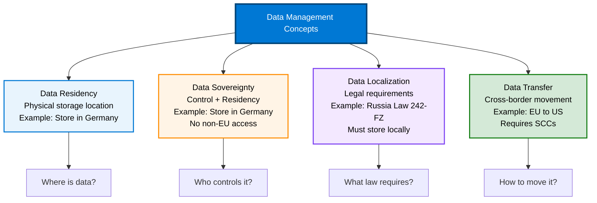

# Data Residency and Localization Concepts

{: .no_toc }

## Table of Contents

{: .no_toc .text-delta }

1. TOC
{:toc}

---

## Introduction

Data residency is a foundational concept in digital sovereignty, referring to the physical or geographic location where data is stored. Understanding data residency requirements and how to implement them is critical for organizations subject to regulatory or business constraints on data location.

---

## Key Definitions



### Data Residency

**Definition:** The physical location (country or region) where data is stored at rest.

**Key Characteristics:**

- Focus on storage location
- Primary and backup data locations
- May include replication sites

**Example:** "Customer data must reside in Germany."

### Data Sovereignty

**Definition:** A broader concept encompassing control over data, including residency, access, and governance.

**Key Characteristics:**

- Includes data residency requirements
- Adds operational and legal control
- Encompasses who can access data and under what laws

**Example:** "Customer data must reside in Germany, with no access by non-EU personnel."

### Data Localization

**Definition:** Legal or regulatory requirements mandating that data be stored within specific geographic boundaries.

**Key Characteristics:**

- Driven by laws and regulations
- May include processing requirements (not just storage)
- Often includes restrictions on cross-border transfers

**Example:** "Russian personal data must be stored on servers located in Russia (Federal Law No. 242-FZ)."

### Data Transfer

**Definition:** The movement of data across geographic or jurisdictional boundaries.

**Key Characteristics:**

- Subject to legal requirements (e.g., GDPR)
- May require additional safeguards
- Can include electronic transmission or physical media

**Example:** "Transfer of EU personal data to the US requires Standard Contractual Clauses (SCCs)."

---

## Why Data Residency Matters

### Regulatory Compliance

Many regulations mandate or encourage data to be stored in specific locations:

**GDPR (EU):**

- No explicit residency requirement
- Restrictions on transfers outside EU/EEA
- Increased scrutiny after Schrems II decision

**Data Localization Laws:**

- **Russia:** Federal Law No. 242-FZ (personal data must be stored in Russia)
- **China:** Cybersecurity Law (critical information infrastructure data in China)
- **Indonesia:** Government Regulation 71/2019 (public sector data in Indonesia)
- **Vietnam:** Cybersecurity Law (specific data types must be localized)

### Legal Risk Mitigation

Data stored in foreign jurisdictions may be subject to:

- **Foreign government access** (e.g., US CLOUD Act, Chinese National Intelligence Law)
- **Legal conflicts** between home and host country laws
- **Difficulty in legal recourse** if data is mishandled

**Example:** European companies storing data in the US face potential US government access under CLOUD Act, creating GDPR compliance challenges.

### Business Continuity

Data residency impacts business operations:

- **Latency:** Data closer to users improves performance
- **Disaster Recovery:** Regional replication for resilience
- **Operational Risk:** Political instability, internet outages
- **Vendor Lock-in:** Difficulty moving data across regions

### Customer Trust

Data residency builds customer confidence:

- **Transparency:** Clear communication about data location
- **Control:** Customers know where their data resides
- **Cultural Expectations:** Some customers prefer local data storage
- **Competitive Advantage:** Demonstrating commitment to sovereignty

---

## Azure Regions and Data Residency

### Azure Global Infrastructure

Microsoft Azure operates **60+ regions** worldwide, more than any other cloud provider.

**Region Components:**

- **Multiple Datacenters:** Physically separate locations
- **Availability Zones:** Isolated locations within a region for high availability
- **Regional Pairs:** Two regions for disaster recovery

### Data Residency in Azure

When you deploy resources in Azure:

**Default Behavior:**

- Data stored in the selected region
- Backup and replication can be configured within region or to paired region
- Some service metadata may be stored globally (documented per service)

**Customer Control:**

- You choose the region for resource deployment
- Azure Policy can enforce regional restrictions
- Geo-replication settings control data replication

### EU Data Boundary

For customers requiring EU data residency:

**Commitment:**

- Customer Data stored and processed within the EU
- Documented and limited exceptions
- Customer controls for support access

**Covered Services:**

- Azure
- Microsoft 365
- Dynamics 365
- Power Platform

**How to Enable:**

1. Select EU regions for resource deployment
2. Configure tenant for EU data boundary
3. Apply governance policies
4. Review service-specific documentation

**Reference:** [EU Data Boundary for Azure](https://learn.microsoft.com/en-us/privacy/eudb/eu-data-boundary-learn)

---

## Types of Data and Residency Considerations

### Customer Data

**Definition:** Data you provide to Microsoft cloud services (content, personal data, etc.)

**Residency Control:**

- Stored in region you select
- You control where it's deployed
- EU Data Boundary applies

**Examples:**

- Files in Azure Storage
- Database records
- Virtual machine disk contents

### Service-Generated Data

**Definition:** Data generated by Microsoft services during operation

**Types:**

- **Operational Logs:** Service health, performance metrics
- **Audit Logs:** Activity logs, security logs
- **System Metadata:** Resource names, configurations

**Residency:**

- Typically stored in same region as service
- Some metadata may have global visibility for service operation
- Customer can often control via configuration

### Personal Data

**Definition:** Data relating to an identified or identifiable individual

**Special Considerations:**

- Subject to GDPR and similar privacy laws
- May require consent for cross-border transfers
- Higher scrutiny on residency and transfers

**Azure Approach:**

- Treated as Customer Data
- Subject to EU Data Boundary commitments
- Additional privacy controls available

### Diagnostic and Telemetry Data

**Definition:** Data collected to improve service quality and security

**Residency:**

- May be transferred globally for service improvement
- Can be disabled or restricted in many cases
- Documented per service

**Customer Control:**

- Diagnostic settings can often be configured
- Privacy controls available
- Transparency through documentation

---

---


---


---

## Implementing Data Residency in Azure

### Step 1: Determine Requirements

**Questions to Answer:**

- What regulations apply to your data?
- Where must data be stored?
- Can data be replicated to other regions?
- Are there restrictions on data transfers?

**Documentation:**

- List applicable regulations
- Document residency requirements by data type
- Identify acceptable regions

### Step 2: Select Appropriate Regions

**Considerations:**

- Proximity to users (latency)
- Regulatory compliance
- Disaster recovery needs
- Service availability in region

**Azure Regions for Common Requirements:**

- **EU Residency:** West Europe, North Europe, France Central, Germany West Central, etc.
- **US Federal:** Azure Government regions (US Gov Virginia, US Gov Texas, etc.)
- **China:** Azure China regions (operated by 21Vianet)
- **UK:** UK South, UK West

**Tool:** [Azure Region Decision Guide](https://learn.microsoft.com/en-us/azure/cloud-adoption-framework/migrate/azure-best-practices/multiple-regions)

### Step 3: Configure Services

**Resource Deployment:**

- Deploy resources in selected region
- Verify service availability
- Configure replication settings

**Storage Accounts:**

```text
- Replication options:
  - LRS (Locally Redundant Storage): Within one region
  - ZRS (Zone-Redundant Storage): Across availability zones in one region
  - GRS (Geo-Redundant Storage): To paired region
  - GZRS (Geo-Zone-Redundant Storage): Zones + paired region
```

**Databases:**

- Primary region selection
- Read replicas in same or different regions
- Backup region configuration

**Virtual Machines:**

- Region selection
- Managed disk location
- Backup vault region

### Step 4: Implement Governance Controls

**Azure Policy:**

- Restrict resource creation to allowed regions
- Enforce naming conventions with region identifiers
- Audit resources for compliance

**Example Policy:** "Allowed Locations"

```json
{
  "policyRule": {
    "if": {
      "not": {
        "field": "location",
        "in": ["westeurope", "northeurope"]
      }
    },
    "then": {
      "effect": "deny"
    }
  }
}
```

**Azure Blueprints:**

- Templates for compliant environments
- Include policies, role assignments, resource templates
- Version control for compliance standards

### Step 5: Monitor and Audit

**Monitoring:**

- Azure Monitor for resource location tracking
- Log Analytics for centralized logs
- Activity logs for resource creation and changes

**Compliance Reporting:**

- Azure Policy compliance reports
- Microsoft Purview Compliance Manager
- Custom dashboards and reports

**Regular Reviews:**

- Quarterly compliance audits
- Review new service deployments
- Update policies as regulations change

---

## Cross-Border Data Transfers

### When Transfers Occur

**Common Scenarios:**

- Support scenarios (with Customer Lockbox)
- Global service features (e.g., Azure Front Door, CDN)
- Backup and disaster recovery
- Service telemetry (if enabled)

**Azure Approach:**

- Document all data transfer scenarios
- Provide customer controls where possible
- Transparency through service documentation

### Legal Mechanisms for Transfers

**GDPR-Compliant Transfers:**

**1. Adequacy Decisions:**

- EU Commission determines country has adequate data protection
- No additional safeguards needed
- Examples: UK (post-Brexit agreement), Japan, Switzerland

**2. Standard Contractual Clauses (SCCs):**

- EU Commission-approved contract templates
- Microsoft provides SCCs for Azure services
- Supplemental measures may be needed (encryption, access controls)

**3. Binding Corporate Rules (BCRs):**

- Internal rules for multinational organizations
- Must be approved by EU data protection authorities
- Microsoft has BCRs in place

**4. Consent:**

- Explicit consent from data subjects
- Rarely practical for business data
- Used for specific, limited scenarios

### Schrems II Decision

**Background:**

- ECJ decision (July 2020) invalidated EU-US Privacy Shield
- Increased scrutiny on data transfers to US
- Standard Contractual Clauses still valid but require assessment

**Implications:**

- Organizations must assess risks of each data transfer
- Supplemental measures often needed
- Encryption, access controls, contractual commitments

**Microsoft's Response:**

- EU Data Boundary commitment
- Enhanced transparency
- Supplemental technical and organizational measures
- Customer tools for compliance

---

## Best Practices for Data Residency

### Design Phase

**✅ Do:**

- Identify data residency requirements early
- Document all data types and their requirements
- Choose appropriate Azure regions
- Design for regional isolation where required

**❌ Don't:**

- Assume all data has the same requirements
- Deploy resources without understanding data flows
- Forget about backup and disaster recovery locations

### Implementation Phase

**✅ Do:**

- Use Azure Policy to enforce regional restrictions
- Implement least-privilege access controls
- Document data flows and transfers
- Configure logging and monitoring

**❌ Don't:**

- Allow unrestricted resource creation
- Use globally replicated storage without justification
- Implement cross-region transfers without legal review

### Operations Phase

**✅ Do:**

- Regular compliance audits
- Monitor for policy violations
- Update configurations as services evolve
- Train staff on data residency requirements

**❌ Don't:**

- Assume configurations remain compliant over time
- Ignore service updates that may affect residency
- Skip documentation updates

---

## Common Pitfalls and Solutions

### Pitfall 1: Service Metadata

**Problem:** Some services store metadata globally for operational purposes

**Solution:**

- Review service-specific documentation
- Understand what data is metadata vs. customer data
- Use services with regional metadata where required
- Implement additional controls (encryption, access restrictions)

### Pitfall 2: Backup and DR

**Problem:** Backups accidentally stored in non-compliant regions

**Solution:**

- Explicitly configure backup vault region
- Use region-specific backup policies
- Test restore procedures to verify data location
- Document disaster recovery data flows

### Pitfall 3: Third-Party Services

**Problem:** Third-party services integrated with Azure may not respect residency

**Solution:**

- Vet third-party services for compliance
- Review data processing agreements
- Implement network controls to restrict data flows
- Consider using Private Link for integration

### Pitfall 4: Developer and Test Environments

**Problem:** Development environments create non-compliant data copies

**Solution:**

- Apply same policies to all environments
- Use synthetic or anonymized data for testing
- Implement environment-specific compliance controls
- Regular audits of non-production environments

---

## Visual Assets for Data Residency

### Suggested Diagrams (Source from Microsoft Learn)

**1. Azure Global Infrastructure Map:**

- **Source:** [Azure global infrastructure](https://azure.microsoft.com/en-us/explore/global-infrastructure/geographies/)
- Shows all Azure regions worldwide
- Illustrates regional pairs and availability zones

**2. EU Data Boundary Illustration:**

- **Source:** [EU Data Boundary documentation](https://learn.microsoft.com/en-us/privacy/eudb/eu-data-boundary-learn)
- Visual representation of data flows
- Shows what data stays in EU vs. exceptions

**3. Data Residency Decision Tree:**

- Custom diagram showing decision process
- Based on regulatory requirements
- Maps to Azure regions and services

**4. Cross-Border Data Transfer Mechanisms:**

- Illustrates SCCs, adequacy decisions, BCRs
- Shows data flow from EU to other regions
- Includes supplemental measures

_Note: Images should be sourced from official Microsoft documentation or created following Microsoft branding guidelines. Place images in `/docs/assets/images/` folder._

---

## Sales & Pre-Sales Talking Points

### Value Proposition

"Azure's global infrastructure gives you the flexibility to store data where you need it, while our EU Data Boundary and governance tools ensure you maintain compliance with data residency requirements."

### Discovery Questions

1. Do you have requirements to store data in specific countries or regions?
2. What regulations govern your data storage and transfer?
3. How do you handle backup and disaster recovery for data residency?
4. Do you need to prove data location to auditors or regulators?
5. Are there any restrictions on cross-border data transfers in your organization?

### Competitive Differentiation

**vs. AWS:**

- More regions globally (60+ vs. ~30)
- Clearer EU Data Boundary commitment
- Stronger compliance documentation

**vs. Google Cloud:**

- More extensive regional footprint
- Earlier and broader EU commitments
- Better tools for governance and compliance (Azure Policy)

---

## Next Steps

- **[Learn about Operational Sovereignty →](operational-sovereignty)**
- **[Review European Digital Commitments →](european-commitments)**
- **[Explore Regulatory Requirements →](regulatory-overview)**
- **[Return to Digital Sovereignty Overview →](digital-sovereignty)**

---

**Last Updated:** October 2025
