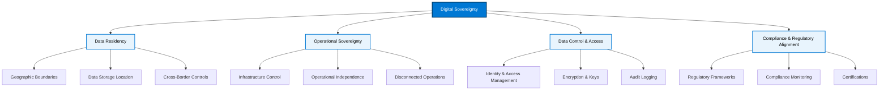

# Digital Sovereignty Fundamentals

{: .no_toc }

## Table of Contents

{: .no_toc .text-delta }

1. TOC
{:toc}

---

## What is Digital Sovereignty?

**Digital sovereignty** refers to the ability of organizations and governments to have control over their digital assets, data, and infrastructure within their jurisdictional boundaries. It encompasses the right and capability to:

- Store and process data within specific geographic regions
- Control who can access data and under what circumstances
- Ensure compliance with local laws and regulations
- Maintain operational independence from external entities
- Protect against unauthorized foreign access

### Why Digital Sovereignty Matters

In an increasingly digital world, data has become a strategic asset. Organizations face:

- **Regulatory Requirements:** GDPR, HIPAA, FedRAMP, and other frameworks mandate data sovereignty
- **National Security:** Governments require control over sensitive information
- **Competitive Advantage:** Data control enables innovation while protecting intellectual property
- **Customer Trust:** Demonstrating data protection builds confidence
- **Legal Liability:** Non-compliance can result in significant penalties

---

## Core Principles of Digital Sovereignty



### 1. Data Residency

**Definition:** Data residency ensures that data is stored and remains within specific geographic boundaries.

**Key Aspects:**

- Physical location of data centers
- Data replication and backup locations
- Cross-border data transfer controls
- Regional storage requirements

**Example Scenario:**
> A European financial institution must ensure all customer data remains within EU borders to comply with GDPR Article 3 requirements.

### 2. Operational Sovereignty

**Definition:** The ability to control and operate IT infrastructure independently, without dependency on external entities.

**Key Aspects:**

- Control over infrastructure access
- Independence from foreign jurisdictions
- Ability to operate in disconnected scenarios
- Local operational teams and processes

**Example Scenario:**
> A defense agency requires complete operational control over their infrastructure with no external dependencies or internet connectivity.

### 3. Data Control and Access

**Definition:** Granular control over who can access data and under what circumstances.

**Key Aspects:**

- Identity and access management
- Encryption and key management
- Access logging and auditing
- Data classification and labeling

**Example Scenario:**
> A healthcare provider implements role-based access controls ensuring patient data is only accessible to authorized medical personnel.

### 4. Compliance and Regulatory Alignment

**Definition:** Adherence to industry-specific regulations and national laws governing data protection.

**Key Aspects:**

- Regulatory framework alignment
- Continuous compliance monitoring
- Audit trail maintenance
- Certification and attestation

---

## Microsoft's Commitment to Digital Sovereignty

Microsoft recognizes that organizations require varying degrees of sovereignty based on their specific needs, regulatory requirements, and risk profiles.

### European Digital Commitments

**[Learn More →](https://learn.microsoft.com/en-us/industry/sovereign-cloud/overview/european-digital-commitments)**

On April 30, 2025, Microsoft announced five commitments for Europe's digital sovereignty:

1. **Expanded cloud regions:** More Azure regions across Europe
2. **Cloud for European data boundary:** Ability to store and process data within EU
3. **Increased capacity:** Infrastructure investments to support growth
4. **Sovereign cloud controls:** Enhanced sovereignty features
5. **Digital skilling:** Training programs for European workforce

### Data Boundary for the European Union

Microsoft's EU Data Boundary commitment ensures:

- Customer data stored and processed within the EU
- Minimal exceptions for specific support scenarios
- Clear documentation of data flows
- Customer control over exceptions

---

## Regulatory Requirements Overview

### Global Regulations

#### GDPR (General Data Protection Regulation)

**Jurisdiction:** European Union  
**Key Requirements:**

- Data minimization and purpose limitation
- Right to erasure ("right to be forgotten")
- Data portability
- Privacy by design and default
- Data protection impact assessments (DPIAs)

**Penalties:** Up to €20 million or 4% of global annual turnover

#### FedRAMP (Federal Risk and Authorization Management Program)

**Jurisdiction:** United States (Federal Government)  
**Key Requirements:**

- Standardized security assessment
- Continuous monitoring
- Incident response capabilities
- US-based data storage for certain impact levels

**Impact Levels:**

- **Low:** Publicly available information
- **Moderate:** Internal government information
- **High:** National security information

### Industry-Specific Regulations

#### HIPAA (Health Insurance Portability and Accountability Act)

**Sector:** Healthcare (United States)  
**Key Requirements:**

- Protected Health Information (PHI) safeguards
- Business Associate Agreements (BAAs)
- Access controls and audit logging
- Breach notification

#### PCI DSS (Payment Card Industry Data Security Standard)

**Sector:** Financial Services (Global)  
**Key Requirements:**

- Cardholder data protection
- Secure network architecture
- Regular security testing
- Access control measures

#### ITAR (International Traffic in Arms Regulations)

**Sector:** Defense (United States)  
**Key Requirements:**

- US persons only access
- Export-controlled data protection
- Physical and logical access controls
- Incident reporting

---

## Sovereignty Spectrum

Organizations have different sovereignty requirements based on their:

- **Industry and sector** (public vs. private)
- **Regulatory obligations** (local vs. international)
- **Risk profile** (sensitivity of data)
- **Operational needs** (connectivity requirements)

### Sovereignty Levels


```text
├── Standard Public Cloud
│   └── Global Azure regions
│   └── Standard compliance certifications
│
├── Enhanced Sovereignty (Sovereign Public Cloud)
│   └── Additional sovereignty controls
│   └── Data residency guarantees
│   └── Operational sovereignty features
│
├── Dedicated Infrastructure (Sovereign Private Cloud)
│   └── Single-tenant environment
│   └── Dedicated hardware
│   └── Enhanced isolation
│
└── Maximum Sovereignty (Air-Gapped/Disconnected)
    └── No external connectivity
    └── Complete operational independence
    └── Local control plane
```

---

## Customer Scenarios

Understanding digital sovereignty through real-world scenarios helps illustrate when and why organizations need specific sovereignty controls.

### Scenario 1: European Financial Institution

**Organization:** Pan-European retail bank with operations in 15 EU countries

**Requirements:**

- GDPR compliance for customer data
- Local banking regulations (e.g., BaFin in Germany, ACPR in France)
- Data residency within EU boundaries
- Ability to demonstrate data sovereignty to regulators

**Sovereignty Needs:**

- **High data residency:** All customer data must remain in EU
- **Moderate operational sovereignty:** EU-based support personnel preferred
- **Strong compliance requirements:** Regular audits and attestations

**Microsoft Solution:** Sovereign Public Cloud with EU Data Boundary

- Data stored and processed within EU regions
- Enhanced sovereignty controls via Sovereign Landing Zone
- Compliance certifications (PCI DSS, ISO 27001, local banking regulations)

**Business Impact:**

- Maintains regulatory compliance across multiple jurisdictions
- Reduces legal risk and potential fines
- Builds customer trust through transparent data practices

---

### Scenario 2: US Federal Agency

**Organization:** Department of Defense contractor handling classified information

**Requirements:**

- FedRAMP High authorization
- ITAR compliance (US persons only access)
- Air-gapped environment for Top Secret workloads
- US-based data centers and operations

**Sovereignty Needs:**

- **Maximum operational sovereignty:** Complete control over infrastructure
- **Strict access controls:** US persons only, background checks required
- **Physical isolation:** No internet connectivity for highest classification

**Microsoft Solution:** Azure Local (Disconnected Mode) + Azure Government

- Air-gapped Azure Local for classified workloads
- Azure Government regions for unclassified/low side data
- Local control plane with no external dependencies

**Business Impact:**

- Meets stringent defense and security requirements
- Enables digital transformation for classified workloads
- Maintains mission-critical operational independence

---

### Scenario 3: Healthcare Provider Network

**Organization:** Multi-state hospital system in the United States

**Requirements:**

- HIPAA compliance for Protected Health Information (PHI)
- State-specific healthcare regulations
- Low-latency access for medical imaging and EHR systems
- Business Associate Agreements (BAAs) with cloud providers

**Sovereignty Needs:**

- **Moderate data residency:** Data in specific US regions
- **Strong access controls:** Role-based access for healthcare workers
- **Audit trails:** Comprehensive logging for compliance

**Microsoft Solution:** Azure with HIPAA compliance + Azure Local for edge locations

- Azure regions with HIPAA BAAs
- Azure Local at hospital campuses for latency-sensitive workloads
- Azure Arc for unified management and compliance

**Business Impact:**

- Improves patient care with faster access to medical data
- Maintains compliance with healthcare regulations
- Reduces infrastructure costs while meeting performance needs

---

### Scenario 4: Defense Manufacturing Contractor

**Organization:** Aerospace company producing components for military aircraft

**Requirements:**

- ITAR compliance for export-controlled technical data
- NIST SP 800-171 for Controlled Unclassified Information (CUI)
- CMMC Level 3 certification required
- US-based operations and personnel

**Sovereignty Needs:**

- **High operational sovereignty:** US persons only access to ITAR data
- **Segregated environments:** ITAR data isolated from non-ITAR
- **Physical and logical controls:** Documented boundaries and access logs

**Microsoft Solution:** Azure Government + Dedicated infrastructure

- Azure Government Secret regions for classified data
- Azure Government regions with ITAR controls
- Azure Local for on-premises CAD/CAM systems

**Business Impact:**

- Enables collaboration while maintaining ITAR compliance
- Supports digital engineering and Industry 4.0 initiatives
- Reduces time to CMMC certification

---

### Scenario 5: Global Manufacturing Company

**Organization:** Multinational manufacturer with plants in 30 countries

**Requirements:**

- Data localization laws in multiple countries (China, Russia, EU)
- Operational technology (OT) security for manufacturing systems
- Low latency for real-time production monitoring
- Hybrid cloud for ERP and supply chain systems

**Sovereignty Needs:**

- **Variable by region:** High sovereignty in some countries, standard in others
- **Edge computing:** Local processing for OT systems
- **Flexible architecture:** Mix of cloud, hybrid, and on-premises

**Microsoft Solution:** Hybrid approach with Azure Local + Azure + National Clouds

- Azure Local at manufacturing plants for OT workloads
- Azure regions for ERP and business systems
- Azure China and other national clouds where required

**Business Impact:**

- Complies with local data laws in all operating countries
- Improves operational efficiency with edge analytics
- Maintains global visibility while respecting local sovereignty

---

## Common Misconceptions About Digital Sovereignty

### Misconception 1: "Sovereignty Means No Cloud"

**Reality:** Sovereignty and cloud are not mutually exclusive. Modern sovereign cloud solutions provide the benefits of cloud computing (scalability, managed services, global reach) while maintaining sovereignty controls.

**Example:** Microsoft's Sovereign Public Cloud offers enhanced sovereignty features within the Azure public cloud, including data residency guarantees and operational sovereignty controls.

---

### Misconception 2: "Public Cloud Can't Be Sovereign"

**Reality:** Public cloud can absolutely support sovereign requirements through architectural controls, dedicated infrastructure options, and enhanced governance.

**What Makes Public Cloud Sovereign:**

- Regional data boundaries and data residency commitments
- Enhanced access controls and identity management
- Compliance certifications and attestations
- Transparency in operations and data handling
- Customer control over encryption keys

**Example:** Germany's Federal Office for Information Security (BSI) recognizes Microsoft's EU Data Boundary as meeting sovereignty requirements for many workloads.

---

### Misconception 3: "Sovereignty Is Only About Data Location"

**Reality:** While data residency is important, sovereignty encompasses multiple dimensions:

**Beyond Data Location:**

- **Operational Control:** Who can access and manage infrastructure
- **Legal Jurisdiction:** Which laws and courts have authority
- **Personnel Location:** Where support staff are based
- **Supply Chain:** Where hardware and software originate
- **Business Continuity:** Independence during geopolitical events

**Example:** A sovereign solution might store data in the EU but fail sovereignty requirements if all operations staff are located outside the EU with no restrictions.

---

### Misconception 4: "Compliance Equals Sovereignty"

**Reality:** Compliance certifications are necessary but not sufficient for sovereignty.

**Compliance vs. Sovereignty:**

- **Compliance:** Meeting specific regulatory requirements (GDPR, HIPAA, FedRAMP)
- **Sovereignty:** Broader concept including control, independence, and jurisdiction

**Example:** A cloud service might be GDPR-compliant but not meet sovereignty requirements if the provider is subject to foreign government data access laws (like CLOUD Act).

**Sovereignty Requires:**

- Compliance certifications PLUS
- Operational controls and transparency PLUS
- Legal and contractual protections PLUS
- Technical architecture that supports independence

---

### Misconception 5: "Sovereignty Is All-or-Nothing"

**Reality:** Sovereignty exists on a spectrum, and organizations can implement different sovereignty levels for different workloads.

**Sovereignty Spectrum Approach:**

- **Standard Cloud:** For non-sensitive data and workloads
- **Enhanced Sovereignty:** For regulated data with residency needs
- **Dedicated Infrastructure:** For highly sensitive workloads
- **Air-Gapped:** For maximum sovereignty and isolation

**Example:** A bank might use standard Azure for marketing websites, Sovereign Public Cloud for customer data, and air-gapped Azure Local for core banking systems.

---

## Decision Framework: Determining Your Sovereignty Requirements

Use this framework to assess your organization's sovereignty needs:

### Step 1: Identify Your Data

**Questions to Ask:**

1. What types of data do you handle? (PII, PHI, financial, classified, etc.)
2. What is the sensitivity level of your data?
3. Where is your data currently stored?
4. Who needs access to this data?

**Classification Example:**

- **Public:** Marketing materials, public websites
- **Internal:** Employee directories, business documents
- **Confidential:** Financial records, customer data
- **Restricted:** Trade secrets, classified information

---

### Step 2: Map Regulatory Requirements

**Questions to Ask:**

1. What regulations apply to your organization? (GDPR, HIPAA, FedRAMP, etc.)
2. What are the data residency requirements?
3. Are there personnel or operational restrictions?
4. What compliance certifications are required?

**Regulatory Mapping:**

- List all applicable regulations
- Identify data residency requirements for each
- Document access control requirements
- Note audit and reporting obligations

---

### Step 3: Assess Operational Needs

**Questions to Ask:**

1. Do you need to operate without internet connectivity?
2. What are your latency and performance requirements?
3. How much operational control do you need?
4. What is your risk tolerance for external dependencies?

**Operational Considerations:**

- Connectivity requirements (always-on vs. disconnected)
- Performance and latency SLAs
- Control plane preferences (cloud-managed vs. local)
- Disaster recovery and business continuity needs

---

### Step 4: Evaluate Risk and Threat Model

**Questions to Ask:**

1. What are your primary threats? (Foreign intelligence, cybercrime, insider threats)
2. What is your risk appetite?
3. Are there geopolitical considerations?
4. What would be the impact of a data breach or service disruption?

**Risk Assessment:**

- Threat modeling exercise
- Impact analysis (financial, reputational, operational)
- Geopolitical risk evaluation
- Business continuity requirements

---

### Step 5: Select Appropriate Sovereignty Model

**Decision Matrix:**

| Requirement Level | Data Residency | Operational Sovereignty | Recommended Model |
|-------------------|----------------|------------------------|-------------------|
| **Low** | No specific requirements | Standard cloud operations | Standard Azure |
| **Moderate** | Regional data storage | Prefer local support | Sovereign Public Cloud |
| **High** | Strict data boundaries | Dedicated operations team | Sovereign Private Cloud |
| **Maximum** | Air-gapped required | Complete independence | Azure Local (Disconnected) |

---

### Step 6: Validate and Implement

**Validation Checklist:**

- ✅ Solution meets all regulatory requirements
- ✅ Data residency and sovereignty needs addressed
- ✅ Operational model aligns with business needs
- ✅ Cost and complexity are acceptable
- ✅ Solution is scalable and sustainable
- ✅ Risk mitigation strategies in place

---

## Key Takeaways

- **Digital sovereignty is multidimensional:** It encompasses data residency, operational control, and regulatory compliance
- **Requirements vary by organization:** Different sectors and regions have unique sovereignty needs
- **Microsoft offers a spectrum of solutions:** From public cloud with enhanced controls to fully disconnected infrastructure
- **Compliance is continuous:** Sovereignty requires ongoing monitoring, auditing, and adaptation
- **Sovereignty is not binary:** Organizations can apply different sovereignty levels to different workloads
- **Business context matters:** The right sovereignty model depends on your specific requirements, risks, and constraints

---

## Sales & Pre-Sales Talking Points

### Value Proposition

"Microsoft's Sovereign Cloud solutions enable your organization to maintain control over your data while leveraging the power of cloud computing. We offer a spectrum of sovereignty options tailored to your specific regulatory and operational requirements."

### Discovery Questions

1. What regulatory frameworks does your organization need to comply with?
2. Where are you required to store and process your data?
3. Do you have any restrictions on who can access your infrastructure?
4. Are there scenarios where you need to operate without cloud connectivity?
5. How important is operational independence to your organization?

### Objection Handling

**Objection:** "Cloud means we lose control of our data."  
**Response:** "Microsoft's Sovereign Cloud solutions provide multiple models that give you control while benefiting from cloud capabilities. From enhanced sovereignty controls in public cloud to fully disconnected infrastructure, we can match your requirements."

**Objection:** "Compliance requirements make cloud impossible for us."  
**Response:** "Microsoft Azure holds more certifications than any other cloud provider. Our Sovereign Cloud offerings are specifically designed to meet the most stringent regulatory requirements, including FedRAMP High, ITAR, and sector-specific regulations."

---

## Technical Considerations

### Architecture Implications

Sovereignty requirements impact:

- **Network design:** Data flow restrictions and isolation
- **Identity management:** Localized identity providers
- **Encryption:** Key management and custody
- **Monitoring:** Localized logging and auditing
- **Updates:** Controlled and tested deployments

### Trade-offs

Higher sovereignty typically involves:

- **Increased complexity:** More stringent controls require careful architecture
- **Reduced flexibility:** Restrictions on data movement and service usage
- **Higher costs:** Dedicated infrastructure and enhanced controls
- **Operational overhead:** Additional monitoring and compliance activities

---

## Deep Dive Topics

This module provides a foundational overview of digital sovereignty. For detailed exploration of specific topics, continue to these pages:

### 📘 Microsoft's European Digital Commitments

**[Read Full Article →](european-commitments)**

Learn about Microsoft's 5 commitments to European sovereignty including:

- EU Data Boundary implementation
- Timeline and progress (2022-2025)
- Customer control mechanisms
- Technical implementations

### 📘 Regulatory Requirements Overview

**[Read Full Article →](regulatory-overview)**

Understand key regulations driving sovereignty requirements:

- GDPR (European Union)
- FedRAMP (United States)
- HIPAA (Healthcare)
- PCI DSS (Payment Card Industry)
- ITAR (Defense)

### 📘 Data Residency vs. Sovereignty

**[Read Full Article →](data-residency-concepts)**

Deep dive into data location and control concepts:

- Key definitions and differences
- Azure regions and data residency
- Legal mechanisms for data transfers
- Implementation best practices

### 📘 Operational Sovereignty

**[Read Full Article →](operational-sovereignty)**

Explore control plane and operational independence:

- Sovereignty spectrum (5 levels)
- Azure Local Connected vs. Disconnected modes
- Personnel access controls
- Implementation guidance

### ✅ Test Your Knowledge

**[Take the Knowledge Check Quiz →](knowledge-check)**

15 questions covering all digital sovereignty fundamentals.

---

## Next Steps

- **[Explore Microsoft Sovereign Cloud Models →](sovereign-cloud-models)**
- **[Learn about Azure Local Overview →](azure-local-overview)**
- **[Review Regulatory Compliance Resources →](../resources/)**

---

## Additional Resources

- **[What is digital sovereignty?](https://learn.microsoft.com/en-us/industry/sovereign-cloud/overview/digital-sovereignty)** - Microsoft Learn
- **[European Digital Commitments](https://learn.microsoft.com/en-us/industry/sovereign-cloud/overview/european-digital-commitments)** - Microsoft Learn
- **[Microsoft Trust Center](https://www.microsoft.com/en-us/trust-center)** - Compliance and certifications
- **[EU Data Boundary](https://aka.ms/eudb)** - Microsoft commitment details

---

**Last Updated:** October 2025
