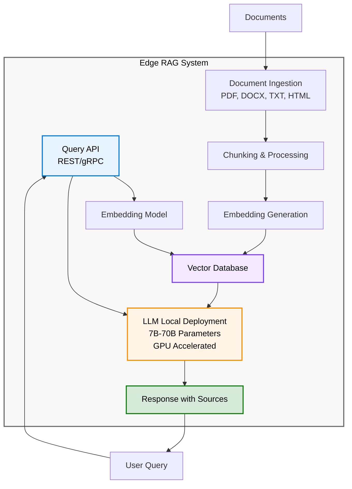

# Edge RAG Architecture

{: .no_toc }

## Table of Contents

{: .no_toc .text-delta }

1. TOC
{:toc}

---

## Edge RAG Reference Architecture

### High-Level Components



### Component Descriptions

**Query API:**

- REST or gRPC interface
- Authentication and authorization
- Rate limiting
- Request logging

**Embedding Model:**

- Converts queries and documents to vectors
- Can be same as used for indexing
- Typically 384-1536 dimensions

**Vector Database:**

- Stores document embeddings
- Fast similarity search
- Metadata filtering

**LLM (Large Language Model):**

- Generates final answer
- Uses retrieved context
- 7B to 70B parameters (larger = better but slower)

**Document Ingestion:**

- Processes new documents
- Chunks text appropriately
- Generates and stores embeddings

---

## Local LLM Deployment Considerations

### Model Size vs. Quality Trade-Off

**7B Parameter Models:**

- **Examples:** LLaMA 2 7B, Mistral 7B
- **Memory:** 14-16 GB VRAM (float16)
- **Quality:** Good for simple Q&A
- **Speed:** Fast (30-50 tokens/sec)
- **Use Case:** High-throughput scenarios

**13B-15B Parameter Models:**

- **Examples:** LLaMA 2 13B, Vicuna 13B
- **Memory:** 26-30 GB VRAM
- **Quality:** Better reasoning, more coherent
- **Speed:** Moderate (20-30 tokens/sec)
- **Use Case:** Balanced scenarios

**30B-40B Parameter Models:**

- **Examples:** Falcon 40B, Code Llama 34B
- **Memory:** 60-80 GB VRAM (requires multi-GPU or quantization)
- **Quality:** Strong performance
- **Speed:** Slower (10-15 tokens/sec)
- **Use Case:** Quality-critical applications

**70B Parameter Models:**

- **Examples:** LLaMA 2 70B
- **Memory:** 140+ GB VRAM (multi-GPU required)
- **Quality:** Excellent, approaches GPT-3.5
- **Speed:** Slow (5-10 tokens/sec)
- **Use Case:** Highest quality requirements

### Quantization Techniques

**What is Quantization:** Reduce model precision to save memory and improve speed.

**INT8 Quantization:**

- 8-bit integers instead of 16-bit floats
- 2x memory reduction
- Minimal quality loss (< 1%)
- Example: 70B model fits in 70 GB instead of 140 GB

**INT4 / GPTQ / GGML:**

- 4-bit quantization
- 4x memory reduction
- Some quality degradation (5-10%)
- 70B model fits in 35 GB

**Recommendations:**

- INT8 for production (good quality/size trade-off)
- INT4 for resource-constrained edge
- Full precision (FP16) only if hardware allows

### Inference Optimization

**vLLM (Fast Inference):**

- PagedAttention algorithm
- 2-4x faster than standard
- Lower memory usage

**Text Generation Inference (TGI):**

- Hugging Face solution
- Production-ready
- Good scaling

**llama.cpp / GGML:**

- C++ implementation
- CPU-friendly
- Apple Silicon optimized

---

## Vector Database at the Edge

### Database Options

**Chroma:**

- **Pros:** Simple, Python-native, easy setup
- **Cons:** Less scalable (< 1M vectors)
- **Best For:** POCs, small deployments

**Milvus:**

- **Pros:** Highly scalable, production-ready, feature-rich
- **Cons:** More complex setup
- **Best For:** Enterprise deployments

**Qdrant:**

- **Pros:** Rust-based (fast), modern API, good filtering
- **Cons:** Newer (less mature ecosystem)
- **Best For:** Performance-critical applications

**FAISS (Facebook AI Similarity Search):**

- **Pros:** Very fast, library (not database), well-tested
- **Cons:** No metadata filtering, not persistent
- **Best For:** In-memory search, prototyping

### Indexing Strategies

**Flat Index:**

- Exact search
- Slow for large datasets
- 100% recall

**IVF (Inverted File):**

- Cluster vectors, search nearest clusters
- Fast, good recall (95-99%)
- Good balance

**HNSW (Hierarchical Navigable Small World):**

- Graph-based index
- Very fast queries
- High memory usage

**PQ (Product Quantization):**

- Compress vectors
- Lower memory usage
- Some accuracy loss

**Recommendation:** HNSW for most cases, IVF for memory-constrained.

---

## Data Ingestion and Indexing Pipeline

### Document Processing Steps

**1. Document Loading:**

```text
Supported formats: PDF, DOCX, TXT, HTML, MD, CSV
Tools: PyPDF2, python-docx, Beautiful Soup, Unstructured.io
```

**2. Text Extraction:**

- Extract clean text
- Preserve structure (headings, lists)
- Handle tables and images (OCR if needed)

**3. Chunking:**

- Split into overlapping chunks
- Typical: 500-1000 tokens per chunk
- Overlap: 100-200 tokens

**4. Metadata Extraction:**

- Document title, author, date
- Section/chapter
- Tags/categories
- Source URL or file path

**5. Embedding Generation:**

- Run embedding model on each chunk
- Batch processing for efficiency
- Store embeddings with metadata

**6. Vector Database Indexing:**

- Insert embeddings into vector DB
- Build search index
- Enable metadata filters

### Continuous Ingestion

**Watch Folder Pattern:**

```text
1. Monitor directory for new files
2. Detect new/changed documents
3. Process and index automatically
4. Update vector database
```

**Scheduled Batch Jobs:**

- Run nightly or weekly
- Process accumulated documents
- Rebuild indices if needed

**Event-Driven:**

- Triggered by application events
- Real-time indexing
- Good for dynamic content

---

## Query Processing and Response Generation

### Query Flow

```text
1. User submits natural language query
   ↓
2. Query → Embedding Model → Query Vector
   ↓
3. Vector Database Search (top K similar documents)
   ↓
4. Retrieved documents + Query → Prompt for LLM
   ↓
5. LLM generates answer with citations
   ↓
6. Response returned to user
```

### Prompt Engineering for RAG

**Template:**

```text
Context: {retrieved_documents}

Question: {user_query}

Instructions:
- Answer the question based only on the context provided
- If the context doesn't contain enough information, say so
- Cite the source for each fact you use
- Be concise but complete

Answer:
```

**Best Practices:**

- Clear instructions to use context
- Request citations
- Specify answer format/length
- Include examples if helpful

### Retrieval Strategies

**Top-K Retrieval:**

- Return K most similar documents (typically 3-5)
- Simple and effective

**MMR (Maximal Marginal Relevance):**

- Balance similarity and diversity
- Avoid redundant results

**Re-ranking:**

- Initial retrieval: top 20-50
- Re-rank with more sophisticated model
- Return top 5 to LLM

**Hybrid Search:**

- Combine vector and keyword search
- Weighted fusion of results
- More robust

---

## Orchestration and Response Generation

### RAG Orchestration Tools

**LangChain:**

```python
from langchain.chains import RetrievalQA

qa_chain = RetrievalQA.from_chain_type(
    llm=local_llm,
    retriever=vector_store.as_retriever(),
    return_source_documents=True
)

result = qa_chain({"query": "What is Azure Local?"})
answer = result['result']
sources = result['source_documents']
```

**LlamaIndex:**

```python
from llama_index import VectorStoreIndex, ServiceContext

service_context = ServiceContext.from_defaults(llm=local_llm)
index = VectorStoreIndex.from_documents(documents, service_context=service_context)

query_engine = index.as_query_engine()
response = query_engine.query("What is Azure Local?")
```

### Streaming Responses

**Why Streaming:**

- Better user experience (see tokens as generated)
- Lower perceived latency
- Ability to cancel long responses

**Implementation:**

```python
for token in llm.stream("Query..."):
    print(token, end="", flush=True)
```

---

## Caching and Performance Optimization

### Caching Strategies

**Query Caching:**

- Cache common queries and responses
- Instant response for repeated questions
- Use semantic similarity for cache lookup

**Embedding Caching:**

- Cache document embeddings
- Avoid re-computing for unchanged documents

**Retrieved Context Caching:**

- Cache retrieval results for popular queries
- Reduces vector DB load

### Performance Optimizations

**Batch Processing:**

- Process multiple documents at once
- Batch embed generation
- More efficient GPU utilization

**Asynchronous Processing:**

- Non-blocking I/O
- Process queries in parallel
- Better throughput

**Load Balancing:**

- Multiple LLM instances
- Distribute queries
- Horizontal scaling

---

## Integration with Azure Services (Connected Mode)

### Optional Cloud Integration

When deployed in Connected Mode on Azure Local:

**Azure OpenAI (for comparison/fallback):**

- Use cloud LLM for complex queries
- Hybrid approach (edge for sensitive, cloud for general)

**Azure Cognitive Search:**

- Offload some vector search to cloud
- Hybrid local + cloud knowledge base

**Azure Monitor:**

- Query performance telemetry
- Model performance metrics
- Usage analytics

**Azure Blob Storage:**

- Backup vector database
- Archive old documents
- Disaster recovery

**Important:** Only sync approved, non-sensitive data to cloud!

---

## Disconnected Operation Scenarios

### Fully Air-Gapped Deployment

**Requirements:**

- All models pre-downloaded
- Vector database fully local
- No internet dependency

**Challenges:**

- Model updates manual
- Document ingestion from local sources only
- No cloud-based monitoring

**Solutions:**

- USB/physical media for updates
- Local monitoring dashboards
- Comprehensive local logging

### Update Management

**Model Updates:**

- Download new models in secure environment
- Transfer to air-gapped network
- Test before deploying
- Rollback capability

**Document Updates:**

- Scheduled ingestion from local repositories
- Version control for knowledge base
- Incremental indexing

---

## Monitoring and Maintenance at the Edge

### Key Metrics to Monitor

**Query Performance:**

- Query latency (end-to-end)
- Retrieval time
- LLM inference time
- Queries per second

**Quality Metrics:**

- User satisfaction scores
- Answer accuracy (if ground truth available)
- Citation accuracy

**Resource Utilization:**

- GPU utilization
- Memory usage
- Storage usage
- CPU utilization

**Failure Metrics:**

- Query errors
- Timeout rate
- Model load failures

### Maintenance Tasks

**Regular:**

- Monitor disk space
- Review slow queries
- Update monitoring dashboards

**Weekly:**

- Analyze usage patterns
- Review user feedback
- Plan capacity

**Monthly:**

- Evaluate model performance
- Consider index rebuild
- Review and update documents

---

## Hardware Requirements

**Minimum (7B Model):**

- GPU: NVIDIA RTX 4090 (24 GB) or A10 (24 GB)
- RAM: 32 GB
- Storage: 500 GB SSD
- CPU: 8+ cores

**Recommended (13B Model):**

- GPU: NVIDIA A100 (40 GB) or A30 (24 GB)
- RAM: 64 GB
- Storage: 1 TB NVMe SSD
- CPU: 16+ cores

**Enterprise (70B Model):**

- GPU: 2x NVIDIA A100 (80 GB) or H100
- RAM: 256 GB
- Storage: 2 TB NVMe SSD
- CPU: 32+ cores

---

## Next Steps

- [Edge RAG Use Cases →](edge-rag-use-cases)
- [RAG Fundamentals →](rag-fundamentals)
- [Edge RAG Quiz →](edge-rag-quiz)
- [Back to Edge RAG Overview →](edge-rag-concepts)

---

**Last Updated:** October 2025
