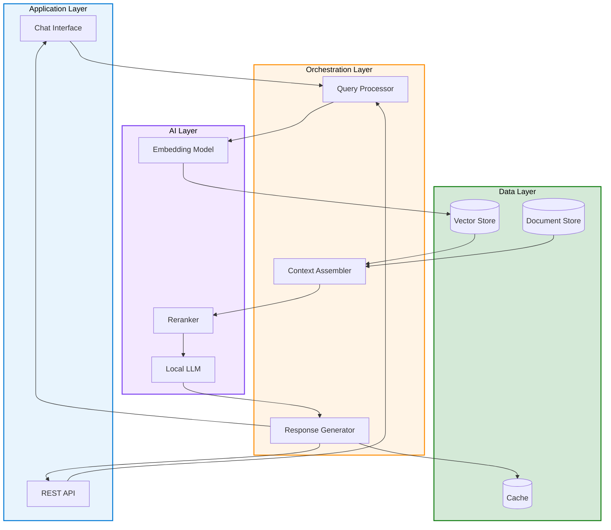

# Edge RAG Concepts

{: .no_toc }

## Table of Contents

{: .no_toc .text-delta }

1. TOC
{:toc}

---

## Overview

{: .important }
> **Preview Status:** Edge RAG, enabled by Azure Arc, is currently in **Preview**. Features and availability may change before general availability. See [Supplemental Terms of Use for Microsoft Azure Previews](https://azure.microsoft.com/support/legal/preview-supplemental-terms/).

{: .note }
> **📝 Source:** [What is Edge Retrieval Augmented Generation (RAG)?](https://learn.microsoft.com/en-us/azure/azure-arc/edge-rag/overview) — Microsoft Learn (November 2025)

**Edge RAG** (Retrieval-Augmented Generation at the Edge) combines the power of large language models with local data retrieval, running entirely on-premises or at the edge. This approach enables organizations to leverage generative AI capabilities while maintaining complete data sovereignty and control.

Edge RAG is an **Azure Arc-enabled Kubernetes extension** that enables you to search on-premises data with generative AI. It is supported and validated on Azure Arc-enabled Kubernetes on Azure Local infrastructure.

### What is RAG?

**Retrieval-Augmented Generation (RAG)** is an AI pattern that enhances large language model (LLM) responses by retrieving relevant information from a knowledge base before generating answers.

**Traditional LLM:**

```text
User Question → LLM → Answer (based only on training data)
```

**RAG System:**

```text
User Question → Retrieve Relevant Docs → LLM + Context → Enhanced Answer
```

### What is Edge RAG?

**Edge RAG** deploys this entire system on-premises or at the edge:

- Local LLM deployment
- Local document storage and indexing
- Local query processing
- No cloud dependency for sensitive data

**Key Benefits:**

- Complete data sovereignty
- Sub-second response times
- No internet dependency
- Privacy-preserving AI
- Compliance with data residency requirements

### Microsoft Edge RAG Capabilities

Based on the official Microsoft Edge RAG solution, the platform provides:

| Capability | Description |
|------------|-------------|
| **Local GenAI Models** | Choice of language models (Phi, Mistral, etc.) running locally on CPU or GPU |
| **Turnkey RAG Pipeline** | Pre-built data ingestion, chunking, embedding, and retrieval workflows |
| **Azure RBAC Integration** | Role-based access control using Microsoft Entra ID |
| **Prompt Engineering Tools** | Out-of-the-box UI for building, evaluating, and deploying chat solutions |
| **Azure-Equivalent APIs** | Familiar APIs for integration into business applications |
| **Multiple Search Types** | Vector search, full-text search, hybrid search, and multimodal search |

**Data Sovereignty Guarantee:**

- All customer data stays within on-premises network boundaries
- Only system metadata (subscription ID, cluster names) sent to Microsoft
- Customer content is never transmitted to the cloud

---

## Edge RAG System Architecture

<details class="diagram-container" open>
<summary>View Diagram: Edge RAG System Architecture</summary>
<div class="diagram-content" markdown="1">



_Figure 1: Edge RAG system architecture showing the four main layers_

</div>
</details>

---

## Traditional LLMs vs. RAG-Augmented Systems

### Limitations of Traditional LLMs


**1. Knowledge Cutoff:**

- Training data has a cutoff date
- No awareness of recent events
- Cannot access proprietary information

**2. Hallucinations:**

- May generate plausible but incorrect information
- No citation of sources
- Difficult to verify accuracy

**3. Lack of Context:**

- No access to organization-specific data
- Cannot reference internal documents
- Generic answers without customization

**4. Privacy Concerns:**

- Queries may be sent to cloud
- Sensitive data exposure risk
- Compliance challenges

### How RAG Solves These Problems

**1. Current Information:**

- Retrieves from up-to-date knowledge base
- Access to latest documents and data
- Real-time information availability

**2. Grounded Responses:**

- Answers based on retrieved documents
- Citations and sources provided
- Verifiable and traceable

**3. Organizational Context:**

- Access to internal knowledge
- Customized to your domain
- Relevant examples and references

**4. Data Privacy:**

- Queries processed locally
- Sensitive data never leaves premises
- Compliance-friendly architecture

---

## Why RAG for Enterprise Applications

### Business Drivers

**Knowledge Management:**

- Make organizational knowledge accessible
- Reduce time to find information
- Improve decision-making quality

**Customer Service:**

- Faster, more accurate responses
- Consistent answers across team
- 24/7 availability

**Compliance:**

- Meet data residency requirements
- Audit trail for responses
- Control over data access

**Cost Efficiency:**

- Reduce cloud API costs
- Lower support overhead
- Improve productivity

### Technical Advantages

**Accuracy:**

- Reduce hallucinations (LLM making up facts)
- Ground answers in real data
- Provide source citations

**Flexibility:**

- Update knowledge without retraining LLM
- Support multiple knowledge domains
- Easy to expand capabilities

**Control:**

- Manage what information is accessible
- Control response quality
- Implement security policies

---

## Edge RAG Definition and Benefits

### What Makes It "Edge" RAG?

**Deployment Location:**

- On-premises data centers
- Branch offices
- Remote facilities
- Manufacturing plants
- Retail locations

**Local Processing:**

- LLM runs on local hardware
- Document retrieval from local storage
- Query processing locally
- Results generated on-site

**Optional Cloud Connectivity:**

- Can sync approved content to cloud
- Hybrid scenarios supported
- Disconnected operation capable

---

## Edge RAG Deployment Topology Options


---

### Benefits of Edge Deployment

**1. Data Sovereignty:**

- Sensitive data never leaves premises
- Meet GDPR, HIPAA, FedRAMP requirements
- Complete control over data flow

**2. Latency and Performance:**

- Sub-second query responses
- No internet round-trip delay
- Local GPU acceleration

**3. Reduced Bandwidth:**

- No constant cloud API calls
- Lower WAN costs
- Resilient to internet outages

**4. Privacy-Preserving AI:**

- Queries stay on-premises
- Employee/customer privacy protected
- Competitive intelligence secured

**5. Cost Efficiency:**

- No per-query cloud costs
- Predictable infrastructure costs
- Better ROI for high-volume use cases

**6. Operational Independence:**

- Works during internet outages
- No cloud service dependencies
- Local control and troubleshooting

---

## Connection to Sovereign Cloud Strategies

### Data Sovereignty Alignment

**Data Residency:**

- All documents and knowledge stay local
- Query logs remain on-premises
- Compliance with data localization laws

**Operational Sovereignty:**

- Independent operation capability
- Local control over AI capabilities
- No external dependencies

**[Review Digital Sovereignty Concepts →](digital-sovereignty)**

### Integration with Azure Local

**Perfect Combination:**

- Azure Local provides infrastructure
- Edge RAG provides AI capabilities
- Both support sovereignty requirements

**Architecture:**

```text
┌─────────────────────────────────────┐
│     Azure Local Cluster              │
│  ┌───────────────────────────────┐  │
│  │   Edge RAG Components          │  │
│  │   - Local LLM                  │  │
│  │   - Vector Database            │  │
│  │   - Document Storage           │  │
│  │   - Query API                  │  │
│  └───────────────────────────────┘  │
│                                      │
│  Data stays on-premises              │
└──────────────────────────────────────┘
```

**[Learn About Azure Local →](azure-local-overview)**

---

## Common Misconceptions About RAG and AI

### Misconception 1: "RAG Requires Cloud"

**Reality:** RAG can run entirely on-premises. Edge RAG specifically addresses local deployment with no cloud dependency.

### Misconception 2: "Too Expensive for Most Organizations"

**Reality:** With local deployment, costs are predictable and often lower than cloud APIs for high-volume use cases. Open-source LLMs available.

### Misconception 3: "Not Accurate Enough"

**Reality:** RAG significantly improves accuracy by grounding responses in real documents. Citation of sources enables verification.

### Misconception 4: "Requires PhD-Level Expertise"

**Reality:** Modern RAG frameworks and tools make deployment accessible. Pre-built solutions available for common scenarios.

### Misconception 5: "Can't Handle Large Document Sets"

**Reality:** Vector databases scale to millions of documents. Efficient indexing and retrieval handle enterprise-scale knowledge bases.

---

## Customer Scenarios

### Scenario 1: Healthcare Documentation Assistant (Disconnected Edge)

**Industry:** Healthcare  
**Organization:** Regional hospital network (5 facilities)  
**Challenge:** Access patient records and clinical guidelines quickly while maintaining HIPAA compliance

**Problem:**

- 10,000+ pages of clinical guidelines
- Complex patient histories
- Need instant access for doctors
- Data must stay on-premises (HIPAA)
- Cannot send queries to cloud

**Solution: Edge RAG with Local LLM**

**Implementation:**

- Deploy LLM on Azure Local cluster at each hospital
- Index clinical guidelines and protocols
- Local vector database for document embeddings
- Secure API for clinical staff access
- No internet connectivity required

**Components:**

- LLaMA 2 70B model (locally hosted)
- Chroma vector database
- 50,000 clinical documents indexed
- Sub-second query response times

**Results:**

- ✅ 100% HIPAA compliance maintained
- ✅ Doctors find information 5x faster
- ✅ Zero patient data exposure
- ✅ 95% reduction in research time
- ✅ Improved patient care quality
- ✅ Passed compliance audit without findings

**ROI:**

- Saved 2 hours per doctor per day
- $500K annual productivity improvement
- Reduced medical errors
- Better patient outcomes

---

### Scenario 2: Manufacturing Knowledge Worker Support (Connected Edge)

**Industry:** Manufacturing  
**Company:** Automotive parts manufacturer  
**Challenge:** 5,000+ equipment manuals need to be searchable for factory floor workers

**Problem:**

- Complex machinery with detailed manuals
- Troubleshooting time-critical
- Workers need instant answers
- 200+ different machine models
- Frequent equipment updates

**Solution: Edge RAG with Periodic Sync**

**Implementation:**

- Edge RAG at each of 10 factory locations
- Local LLM for query processing
- Equipment manuals and troubleshooting guides indexed
- Mobile app for workers
- Nightly sync of new documentation from central repository

**Components:**

- GPT-3.5 equivalent open-source model
- Pinecone-compatible vector store
- 10,000+ equipment documentation pages
- Real-time query API

**Results:**

- ✅ 80% reduction in troubleshooting time
- ✅ Workers self-serve answers (no expert needed)
- ✅ 50% reduction in equipment downtime
- ✅ Knowledge accessible 24/7
- ✅ Consistent answers across shifts

**ROI:**

- $2M annual savings from reduced downtime
- 30% improvement in Mean Time To Repair (MTTR)
- Worker satisfaction increased

---

### Scenario 3: Financial Advisor AI Assistant (Connected Edge)

**Industry:** Financial Services  
**Company:** Regional investment bank  
**Challenge:** Provide advisors with instant access to financial research and compliance documents

**Problem:**

- 100,000+ research reports and compliance docs
- Need personalized financial advice
- Data residency requirements (EU)
- Cannot send client data to cloud
- Real-time market data integration

**Solution: Hybrid Edge RAG**

**Implementation:**

- Edge RAG deployed on-premises
- Client data and interactions stay local
- General research synced from cloud
- Local LLM for query processing
- Integration with trading systems

**Components:**

- Azure OpenAI (API) for general queries
- Local LLM for sensitive client queries
- Hybrid vector database (local + cloud)
- Encrypted sync for approved content

**Results:**

- ✅ GDPR compliance maintained
- ✅ Advisors 3x more productive
- ✅ Personalized client recommendations
- ✅ Real-time access to research
- ✅ Zero client data exposure

**ROI:**

- $3M additional revenue from improved advice
- 40% faster client interaction
- Improved client satisfaction scores

---

### Scenario 4: Research Lab Data Analysis (Hybrid)

**Industry:** Pharmaceutical Research  
**Organization:** Drug discovery lab  
**Challenge:** Analyze sensitive research data and scientific literature

**Problem:**

- Proprietary research data (IP protection)
- 50,000+ scientific papers to search
- Complex chemistry and biology queries
- Data cannot leave facility
- Need collaboration with cloud-based researchers (limited)

**Solution: Hybrid Edge RAG with Selective Sharing**

**Implementation:**

- Edge RAG for proprietary research
- Separate system for public literature
- Selective result sharing to cloud (anonymized)
- Local GPU cluster for model inference
- Approval workflow for cloud sync

**Components:**

- LLaMA 2 70B for chemistry queries
- BioGPT for biology-specific questions
- Local vector database (1M+ documents)
- Approval gateway for cloud export

**Results:**

- ✅ IP protection maintained (zero leaks)
- ✅ 10x faster literature review
- ✅ Accelerated drug discovery
- ✅ Collaboration enabled (with controls)
- ✅ Compliance with research data policies

**ROI:**

- 6 months faster time-to-discovery
- $10M+ value from accelerated pipeline
- Competitive advantage preserved

---

### Scenario 5: Government Agency Internal Portal (Disconnected Edge)

**Industry:** Government  
**Organization:** National security agency  
**Challenge:** Search classified documents and intelligence reports

**Problem:**

- Top Secret / SCI classified data
- Complete air-gap requirement
- 500,000+ classified documents
- Multiple analysts need access
- No cloud connectivity allowed

**Solution: Fully Disconnected Edge RAG**

**Implementation:**

- Completely air-gapped deployment
- Local LLM trained on cleared data
- Classified document indexing
- Role-based access control
- Comprehensive audit logging

**Components:**

- Falcon 40B model (cleared for use)
- Milvus vector database (air-gapped)
- Full-text and semantic search
- Multi-level security (MLS) support

**Results:**

- ✅ 100% classification compliance
- ✅ Analysts find intel 10x faster
- ✅ Zero spillage incidents
- ✅ Improved operational tempo
- ✅ Passed security audit

**ROI:**

- Mission-critical intelligence faster
- Improved national security outcomes
- Analyst productivity doubled

---

## Next Steps

Continue your learning journey:

### [RAG Fundamentals Deep Dive →](rag-fundamentals)

Explore the technical foundations of RAG, including embedding models, vector databases, and retrieval algorithms.

**Duration:** 20-25 minutes

---

### [Edge RAG Architecture →](edge-rag-architecture)

Learn the reference architecture for deploying RAG systems at the edge, including hardware requirements and component selection.

**Duration:** 25-30 minutes

---

### [RAG Use Cases and Implementation →](edge-rag-use-cases)

Discover industry-specific use cases and practical implementation guidance for Edge RAG systems.

**Duration:** 20-25 minutes

---

### [Edge RAG Knowledge Check Quiz →](edge-rag-quiz)

Test your understanding with 15 questions covering RAG concepts, architecture, and use cases.

**Duration:** 15-20 minutes

---

## Additional Resources

### Microsoft Learn

- **[Azure OpenAI Service](https://learn.microsoft.com/en-us/azure/ai-services/openai/)**
  - Foundation for understanding LLMs
  - RAG patterns and best practices

- **[Azure Cognitive Search](https://learn.microsoft.com/en-us/azure/search/)**
  - Vector search capabilities
  - Semantic ranking

### Open-Source Resources

- **[LangChain Documentation](https://python.langchain.com/)**
  - RAG implementation framework
  - Extensive tutorials and examples

- **[LlamaIndex (GPT Index)](https://gpt-index.readthedocs.io/)**
  - Data framework for LLM applications
  - RAG-specific tools

### Community

- **[Hugging Face](https://huggingface.co/)**
  - Open-source LLMs
  - Model fine-tuning resources

- **[Azure AI Community](https://techcommunity.microsoft.com/t5/azure-ai-services/ct-p/AzureAIServices)**
  - AI services updates
  - Community best practices

---

**Last Updated:** October 2025
