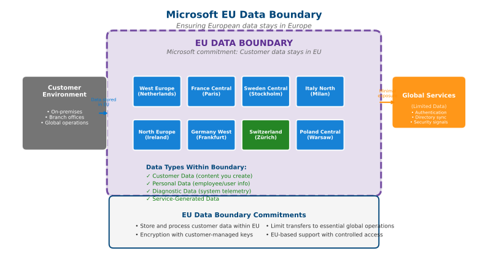

# Microsoft's European Digital Commitments

{: .no_toc }

## Table of Contents

{: .no_toc .text-delta }

1. TOC
{:toc}

---

## Overview

On April 30, 2025, Microsoft announced five comprehensive commitments to support digital sovereignty and innovation across Europe. These commitments demonstrate Microsoft's recognition that European organizations require enhanced control, transparency, and sovereignty over their digital infrastructure and data.

**Official Announcement:** [Microsoft's European Digital Commitments](https://blogs.microsoft.com/on-the-issues/2025/04/30/european-digital-commitments/)

---

## The Five Commitments

### 1. Expanded Cloud Regions Across Europe

**Commitment:** Increase the number of Azure cloud regions and datacenters throughout Europe to provide broader geographic coverage and enhanced data residency options.

**Implementation:**

- New datacenter regions launched in multiple European countries
- Expanded capacity in existing regions
- Enhanced availability zones for resilience

**Customer Benefits:**

- More choices for data residency
- Lower latency for European users
- Improved disaster recovery options within Europe
- Compliance with local data laws

**Status (2025):** Microsoft now operates Azure regions in multiple European countries including Germany, France, Switzerland, Sweden, Norway, Poland, and more.

---

### 2. EU Data Boundary for the Microsoft Cloud

**Commitment:** Enable customers to store and process their data within the European Union, with limited and transparent exceptions.

View Diagram: EU Data Boundary

_Figure: Microsoft EU Data Boundary showing data residency and processing within EU/EFTA countries_

**Key Features:**

**Data Residency:**

- Customer data stored within the EU
- Data processing occurs in EU datacenters
- Backup and disaster recovery within EU

**Exceptions (Documented and Transparent):**

- Some support scenarios (customer can control)
- Certain metadata for service functionality
- Features requiring global routing (e.g., Azure Front Door)

**Customer Control:**

- Customers can view data transfer scenarios
- Lockbox controls for support access
- Audit logs for all data access

**Services Covered:**

- Azure
- Microsoft 365
- Dynamics 365
- Power Platform

**Implementation Timeline:**

- Initial services available: 2022
- Expanded coverage: 2023-2024
- Ongoing enhancements: 2025+

---

### 3. Increased Capacity and Investment

**Commitment:** Significant financial investment in European cloud infrastructure to meet growing demand and support digital transformation.

**Investments Include:**

**Infrastructure:**

- Datacenter construction and expansion
- Network connectivity enhancements
- Renewable energy projects
- Edge computing facilities

**Economic Impact:**

- Billions in capital investment
- Thousands of jobs created (construction, operations, support)
- Support for European technology ecosystem
- Partnership with local suppliers

**Sustainability:**

- Carbon-negative by 2030 commitment
- 100% renewable energy for datacenters
- Water-positive datacenters
- Circular economy initiatives for hardware

---

### 4. Expanded Sovereign Cloud Controls

**Commitment:** Provide enhanced sovereignty features and controls within the Azure platform to meet strict European requirements.

**Sovereign Capabilities:**

**Sovereign Landing Zone (SLZ):**

- Enhanced governance and compliance controls
- Policy-driven architecture
- Identity and access management enhancements
- Audit and monitoring capabilities

**Confidential Computing:**

- Data encrypted in use, at rest, and in transit
- Hardware-based trusted execution environments
- Secure enclaves for sensitive workloads
- Attestation and verification

**Key Management:**

- Customer-managed encryption keys
- Bring Your Own Key (BYOK)
- Hold Your Own Key (HYOK) options
- Hardware Security Module (HSM) integration

**Access Controls:**

- Customer Lockbox for support access
- Just-in-time access mechanisms
- Privileged access management
- EU-based support personnel options

---

### 5. Digital Skilling and Training for Europe

**Commitment:** Invest in training and education to build digital skills across the European workforce.

**Programs and Initiatives:**

**Skills for the Future:**

- Free training programs for millions of Europeans
- Focus on in-demand cloud and AI skills
- Partnerships with educational institutions
- Industry certifications and credentials

**Target Audiences:**

- Job seekers and career changers
- Students and recent graduates
- IT professionals seeking upskilling
- Business leaders and decision-makers

**Training Formats:**

- Microsoft Learn (free online platform)
- Virtual training days
- Instructor-led courses
- Hands-on labs and workshops

**Focus Areas:**

- Cloud computing (Azure)
- Data and AI
- Cybersecurity
- Digital transformation

**Impact:**

- Millions trained since program launch
- Improved employability and career advancement
- Support for European digital economy
- Reduced skills gap in technology sector

---

## EU Data Boundary: Deep Dive

The EU Data Boundary is one of the most significant commitments for organizations with strict sovereignty requirements.

### What Is the EU Data Boundary?

A commitment to store and process customer data within the European Union, with clear documentation of any exceptions.

**Scope:**

- **Customer Data:** All data customers provide to Microsoft cloud services
- **Personal Data:** Data subject to GDPR
- **Service-Generated Data:** Data created during service operation

### How It Works

**Data Storage:**

- Primary storage in EU datacenters
- Backup and disaster recovery within EU
- No routine data transfers outside EU

**Data Processing:**

- Computation occurs in EU regions
- Service operations within EU
- Support scenarios controlled by customer

**Exceptions (Transparent and Documented):**

1. **Customer-Initiated Transfers:**
   - Customer explicitly configures data to leave EU
   - Example: Customer creates resource in non-EU region

2. **Support Scenarios:**
   - Customer Lockbox provides control
   - Support personnel access only with approval
   - Time-limited and logged access

3. **Specific Service Features:**
   - Global routing (Azure Front Door, Traffic Manager)
   - Threat intelligence (security services)
   - Service telemetry (can be disabled)

**Documentation and Transparency:**

- Published list of data flows
- Regular updates and communications
- Customer controls and options
- Audit logs and reporting

### Benefits for Customers

**Regulatory Compliance:**

- Simplifies GDPR compliance
- Supports Schrems II requirements
- Addresses data localization laws
- Reduces legal complexity

**Risk Reduction:**

- Minimizes cross-border data transfers
- Reduces exposure to foreign laws (e.g., CLOUD Act)
- Clear audit trail for compliance
- Transparent operations

**Business Confidence:**

- Predictable data handling
- Clear contractual commitments
- Microsoft's reputation and scale
- Continuous improvement and investment

---

## Progress and Timeline

### 2022

- **Q1:** EU Data Boundary architecture defined
- **Q2:** First services available with EU boundary
- **Q3-Q4:** Expanded service coverage

### 2023

- **Q1-Q2:** Sovereign Landing Zone GA (Generally Available)
- **Q3:** Additional datacenter regions launched
- **Q4:** Enhanced confidential computing capabilities

### 2024

- **Q1-Q4:** Continued expansion of EU Data Boundary services
- Additional regions and capacity
- Enhanced sovereign controls

### 2025 (Current)

- **April 30:** Five commitments announced
- **Ongoing:** Full EU Data Boundary for core services
- New sovereignty features and capabilities
- Continued investment and expansion

---

## Industry and Government Recognition

**German Federal Office for Information Security (BSI):**

- Recognition of Microsoft's sovereign capabilities
- C5 attestation for Azure

**European Commission:**

- Engagement on digital sovereignty initiatives
- Collaboration on GAIA-X and European cloud projects

**Financial Services:**

- Adoption by major European banks
- Support for financial services regulations

**Public Sector:**

- Government cloud offerings
- Support for national digital strategies

---

## Comparison: Standard Azure vs. Sovereign Capabilities

| Feature | Standard Azure | With Sovereign Controls |
|---------|---------------|------------------------|
| **Data Residency** | Customer chooses region | EU Data Boundary enforced |
| **Data Processing** | May occur globally | Guaranteed within EU |
| **Support Access** | Standard support model | Customer Lockbox required |
| **Key Management** | Microsoft-managed option | Customer-managed mandatory |
| **Compliance** | Standard certifications | Enhanced attestations |
| **Access Controls** | Standard RBAC | Enhanced IAM with SLZ |
| **Audit Logs** | Standard logging | Enhanced audit trail |
| **Personnel** | Global support teams | EU-based support option |

---

## How to Enable EU Data Boundary

### For New Customers

1. **Select EU Regions:** Choose Azure regions within the EU for resource deployment
2. **Configure Tenant:** Set tenant location to EU country
3. **Enable Policies:** Apply Sovereign Landing Zone policies
4. **Configure Services:** Ensure services respect data boundary

### For Existing Customers

1. **Assessment:** Review current data locations and flows
2. **Migration Planning:** Plan migration to EU regions
3. **Policy Application:** Implement governance controls
4. **Validation:** Verify data boundary compliance
5. **Ongoing Monitoring:** Continuous compliance checking

### Best Practices

- Use Azure Policy to enforce regional restrictions
- Enable Customer Lockbox for all subscriptions
- Implement customer-managed keys (CMK)
- Regular compliance audits and reviews
- Training for operations teams on sovereignty requirements

---

## Sales & Pre-Sales Talking Points

### Value Proposition

"Microsoft's European Digital Commitments demonstrate our long-term investment in European digital sovereignty. The EU Data Boundary ensures your data remains in Europe, with transparent operations and enhanced controls that support your compliance and business requirements."

### Discovery Questions

1. Do you have requirements to keep data within the EU?
2. Are you subject to Schrems II or other data transfer restrictions?
3. What level of control do you need over support access?
4. Do you require EU-based operations personnel?
5. How important is transparency in cloud operations for your organization?

### Competitive Differentiation

**vs. AWS:**

- More comprehensive EU data boundary commitment
- Clearer documentation of exceptions
- Stronger sovereign capabilities (SLZ)

**vs. Google Cloud:**

- Earlier and broader implementation
- More extensive datacenter footprint in Europe
- Deeper integration with existing enterprise workloads

**vs. European Cloud Providers:**

- Global scale with local sovereignty
- Broader service portfolio
- Continuous innovation and investment

---

## Additional Resources

### Official Documentation

- **[EU Data Boundary](https://learn.microsoft.com/en-us/privacy/eudb/eu-data-boundary-learn)** - Complete technical documentation
- **[Data Residency](https://learn.microsoft.com/en-us/privacy/eudb/eu-data-boundary-learn)** - Azure data residency information
- **[Sovereign Landing Zone](https://learn.microsoft.com/en-us/industry/sovereign-cloud/sovereign-public-cloud/sovereign-landing-zone/overview-slz)** - SLZ architecture

### Microsoft Learn

- **[Get started with Microsoft Cloud for Sovereignty](https://learn.microsoft.com/en-us/training/paths/get-started-sovereignty/)** - Training path

### Blog Posts and Announcements

- **[Microsoft Blog: EU Data Boundary](https://blogs.microsoft.com/eupolicy/)** - Policy and announcements
- **[Azure Blog](https://azure.microsoft.com/en-us/blog/)** - Technical updates

---

## Next Steps

- **[Learn about Regulatory Requirements →](regulatory-overview)**
- **[Explore Data Residency Concepts →](data-residency-concepts)**
- **[Return to Digital Sovereignty Overview →](digital-sovereignty)**

---

**Last Updated:** October 2025
