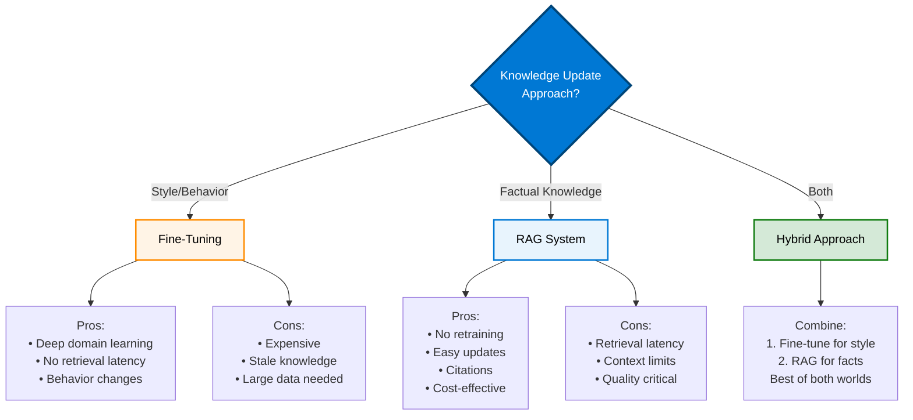

# RAG Fundamentals Deep Dive

{: .no_toc }

## Table of Contents

{: .no_toc .text-delta }

1. TOC
{:toc}

---

## Traditional LLMs and Their Limitations

### How LLMs Work

**Large Language Models** are neural networks trained on massive text corpora to predict the next word in a sequence.

**Training Process:**

1. Ingest billions of words from internet, books, code
2. Learn patterns, grammar, facts, reasoning
3. Generate coherent, contextual responses

**Strengths:**

- General knowledge across many domains
- Strong language understanding
- Creative text generation
- Code generation and explanation

### Key Limitations

**1. Knowledge Cutoff:**

- Training data has a cutoff date (e.g., September 2021)
- No awareness of events after training
- Cannot access proprietary organizational data

**2. Hallucinations:**

- May generate plausible but false information
- Confident incorrect answers
- No way to verify claims without external validation

**3. Lack of Source Attribution:**

- Cannot cite sources for information
- Difficult to verify accuracy
- No audit trail

**4. Static Knowledge:**

- Knowledge frozen at training time
- Cannot be easily updated
- Retraining is expensive ($millions)

**5. Context Window Limitations:**

- Limited context size (4K-32K tokens typical)
- Cannot process entire large documents
- Loses context in long conversations

---

## Information Retrieval Basics

### What is Information Retrieval?

Process of finding relevant documents from a collection based on a query.

**Traditional Search:**

- Keyword matching (TF-IDF, BM25)
- Boolean queries (AND, OR, NOT)
- Fast but limited by exact matches

**Semantic Search:**

- Understanding meaning, not just keywords
- Finds conceptually similar documents
- Better handles synonyms and paraphrasing

### Vector Search Fundamentals

**Core Concept:** Represent text as numerical vectors (embeddings) in high-dimensional space. Similar meanings → similar vectors.

**Process:**

1. Convert query to vector
2. Find nearest vectors in database
3. Return corresponding documents

**Advantages:**

- Semantic similarity
- Language-independent (with multilingual models)
- Efficient at scale

---

## Embedding Models and Representation Learning

### What Are Embeddings?

**Definition:** Dense numerical vector representations of text that capture semantic meaning.

**Example:**

```text
"king" → [0.2, 0.5, -0.1, ..., 0.3]  (768 dimensions)
"queen" → [0.18, 0.52, -0.09, ..., 0.29]  (similar vector!)
```

**Key Property:** Semantically similar text has similar embeddings.

### Popular Embedding Models

**OpenAI text-embedding-ada-002:**

- 1536 dimensions
- General purpose
- Cloud API

**sentence-transformers (Open-Source):**

- all-MiniLM-L6-v2: Fast, 384 dimensions
- all-mpnet-base-v2: Better quality, 768 dimensions
- Can run locally

**Domain-Specific Models:**

- BioBERT for biomedical text
- FinBERT for financial documents
- CodeBERT for source code

### Embedding Generation Process

```python
# Example with sentence-transformers
from sentence_transformers import SentenceTransformer

model = SentenceTransformer('all-MiniLM-L6-v2')

# Generate embeddings
text = "Azure Local provides sovereign cloud capabilities"
embedding = model.encode(text)
# embedding.shape = (384,)
```

---

## Vector Databases and Similarity Search

### What is a Vector Database?

Specialized database optimized for storing and querying high-dimensional vectors.

**Key Capabilities:**

- Store millions to billions of vectors
- Fast similarity search (nearest neighbors)
- Metadata filtering
- Hybrid search (vector + keyword)

### Popular Vector Databases

**Cloud:**

- Azure Cognitive Search (with vector support)
- Pinecone
- Weaviate Cloud

**Self-Hosted / Edge:**

- Chroma
- Milvus
- Qdrant
- FAISS (Facebook AI Similarity Search)

### Similarity Metrics

**Cosine Similarity:**

- Measures angle between vectors
- Range: -1 to 1 (higher = more similar)
- Most common for text

**Euclidean Distance:**

- Straight-line distance
- Lower = more similar
- Sensitive to magnitude

**Dot Product:**

- Inner product of vectors
- Higher = more similar
- Fast to compute

### Search Algorithms

**Exact Search:**

- Brute force comparison
- 100% accurate
- Slow for large datasets (O(n))

**Approximate Nearest Neighbor (ANN):**

- Trade accuracy for speed
- 95-99% recall typical
- Much faster (sub-linear time)
- Algorithms: HNSW, IVF, LSH

---

## Fine-Tuning vs. RAG Trade-Offs



### Fine-Tuning

**What It Is:** Further training an LLM on domain-specific data.

**Pros:**

- Model learns domain knowledge deeply
- No retrieval latency
- Can change model behavior/style

**Cons:**

- Expensive (compute, time, expertise)
- Risk of catastrophic forgetting
- Knowledge becomes stale
- Requires significant data (1000s+ examples)

**Best For:**

- Changing model style/tone
- Learning specialized vocabulary
- Task-specific optimization

### RAG (Retrieval-Augmented Generation)

**What It Is:** Retrieve relevant documents and provide as context to LLM.

**Pros:**

- No model retraining needed
- Easy to update knowledge (just add documents)
- Grounded responses with citations
- Cost-effective
- Transparent and auditable

**Cons:**

- Retrieval latency added
- Limited by context window
- Retrieval quality critical

**Best For:**

- Factual question answering
- Knowledge-intensive tasks
- Frequently changing information
- Providing citations

### Hybrid Approach

**Combine Both:**

1. Fine-tune LLM on domain for style and vocabulary
2. Use RAG for up-to-date factual information

**Example:** Fine-tune on medical language, retrieve latest research papers.

---

## Evaluation Metrics for RAG Systems

### Retrieval Metrics

**Precision:**

- Of retrieved documents, how many are relevant?
- Precision = Relevant Retrieved / Total Retrieved

**Recall:**

- Of all relevant documents, how many were retrieved?
- Recall = Relevant Retrieved / Total Relevant

**F1 Score:**

- Harmonic mean of precision and recall
- F1 = 2 × (Precision × Recall) / (Precision + Recall)

**Mean Reciprocal Rank (MRR):**

- How high is the first relevant result?
- MRR = 1 / rank_of_first_relevant_document

### Generation Metrics

**Faithfulness:**

- Is the generated answer supported by retrieved documents?
- Manually evaluated or with LLM-as-judge

**Answer Relevance:**

- Does the answer address the question?

**Groundedness:**

- Is every claim in the answer backed by sources?

**BLEU / ROUGE (for reference answers):**

- Compare generated answer to gold standard
- Measures n-gram overlap

### End-to-End Metrics

**Answer Accuracy:**

- Is the final answer factually correct?
- Requires gold standard QA pairs

**Latency:**

- Time from query to answer
- Target: < 2-5 seconds for good UX

**Cost:**

- Per-query cost (LLM API, compute)
- Important for ROI calculations

---

## RAG Components and Data Flow


---

## Practical RAG Components and Tools

### RAG Framework Comparison

**LangChain:**

- Most popular RAG framework
- Python and JavaScript
- Extensive integrations
- Modular and flexible

**LlamaIndex (GPT Index):**

- Specialized for RAG
- Better for complex queries
- Strong data connectors
- Query optimization built-in

**Haystack:**

- Production-ready
- Good for Q&A systems
- Pipeline architecture
- Open-source

### Complete RAG Stack Example

**Document Processing:**

- Unstructured.io for document parsing
- LangChain document loaders

**Embedding:**

- Sentence-Transformers (local)
- OpenAI embeddings (cloud)

**Vector Database:**

- Chroma (local, simple)
- Milvus (production, scalable)

**LLM:**

- LLaMA 2 (open-source, local)
- GPT-4 (cloud, highest quality)

**Framework:**

- LangChain for orchestration

### Minimal RAG Implementation

```python
from langchain.document_loaders import DirectoryLoader
from langchain.text_splitter import RecursiveCharacterTextSplitter
from langchain.embeddings import HuggingFaceEmbeddings
from langchain.vectorstores import Chroma
from langchain.llms import LlamaCpp
from langchain.chains import RetrievalQA

# 1. Load documents
loader = DirectoryLoader('./documents')
documents = loader.load()

# 2. Split into chunks
text_splitter = RecursiveCharacterTextSplitter(chunk_size=1000, chunk_overlap=100)
texts = text_splitter.split_documents(documents)

# 3. Create embeddings
embeddings = HuggingFaceEmbeddings()

# 4. Store in vector database
vectorstore = Chroma.from_documents(texts, embeddings)

# 5. Create retriever
retriever = vectorstore.as_retriever()

# 6. Load LLM
llm = LlamaCpp(model_path="./llama-2-7b.gguf")

# 7. Create RAG chain
qa_chain = RetrievalQA.from_chain_type(llm=llm, retriever=retriever)

# 8. Query
answer = qa_chain.run("What are the benefits of Azure Local?")
print(answer)
```

---

## Best Practices

**1. Chunk Sizing:**

- Balance between too small (loss of context) and too large (irrelevant content)
- Typical: 500-1000 tokens
- Use overlap (100-200 tokens) to preserve context

**2. Metadata Filtering:**

- Add metadata to documents (date, author, category)
- Enable filtered retrieval
- Improves precision

**3. Hybrid Search:**

- Combine vector similarity with keyword matching
- Best of both worlds
- More robust

**4. Reranking:**

- Initial retrieval: top 20-50 results
- Rerank with more sophisticated model
- Return top 3-5 to LLM

**5. Prompt Engineering:**

- Clear instructions to LLM
- Ask for citations
- Specify answer format

---

## Next Steps

- [Edge RAG Architecture →](edge-rag-architecture)
- [Edge RAG Use Cases →](edge-rag-use-cases)
- [Edge RAG Quiz →](edge-rag-quiz)
- [Back to Edge RAG Overview →](edge-rag-concepts)

---

**Last Updated:** October 2025
