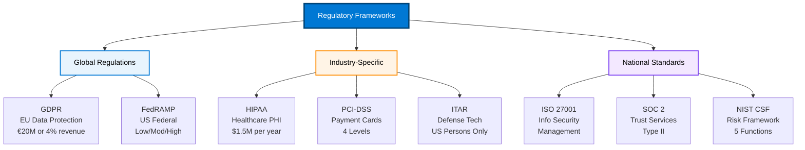

# Regulatory Requirements Overview

{: .no_toc }

## Table of Contents

{: .no_toc .text-delta }

1. TOC
{:toc}

---

## Introduction

Digital sovereignty requirements are driven by a complex landscape of regulations, compliance frameworks, and industry standards. Understanding these regulatory requirements is essential for designing sovereign cloud solutions that meet legal and business needs.

This overview provides a high-level introduction to the major regulatory frameworks that drive sovereignty requirements.

---

## Regulatory Comparison

---

## Global Regulations

### GDPR (General Data Protection Regulation)

**Jurisdiction:** European Union (EU) and European Economic Area (EEA)  
**Effective Date:** May 25, 2018  
**Scope:** All organizations processing personal data of EU residents

#### Key Principles

1. **Lawfulness, Fairness, and Transparency:** Clear communication about data processing
2. **Purpose Limitation:** Data collected for specified, legitimate purposes
3. **Data Minimization:** Only collect necessary data
4. **Accuracy:** Keep data accurate and up to date
5. **Storage Limitation:** Retain data only as long as necessary
6. **Integrity and Confidentiality:** Appropriate security measures
7. **Accountability:** Demonstrate compliance

#### Sovereignty-Relevant Requirements

**Data Residency:**

- No explicit requirement, but data transfers outside EU must meet strict conditions
- Adequacy decisions or Standard Contractual Clauses (SCCs) for transfers
- Schrems II decision impacts cloud provider selection

**Data Subject Rights:**

- Right to access personal data
- Right to erasure ("right to be forgotten")
- Right to data portability
- Right to object to processing

**Data Protection by Design:**

- Privacy considerations from project inception
- Technical and organizational measures
- Data Protection Impact Assessments (DPIAs)

**Data Processing Agreements:**

- Contracts required with data processors
- Processor obligations clearly defined
- Sub-processor management

#### Penalties

- Up to €20 million or 4% of global annual turnover (whichever is higher)
- Significant reputational damage
- Potential legal actions from data subjects

#### Azure Compliance

- **EU Data Boundary:** Supports GDPR data localization needs
- **Standard Contractual Clauses:** Available for data transfers
- **Data Processing Agreement:** Included in Microsoft terms
- **Compliance Documentation:** Extensive GDPR resources

**Reference:** [GDPR Compliance on Azure](https://learn.microsoft.com/en-us/compliance/regulatory/gdpr)

---

### FedRAMP (Federal Risk and Authorization Management Program)

**Jurisdiction:** United States Federal Government  
**Effective Date:** June 2011  
**Scope:** Cloud services used by US federal agencies

#### Impact Levels

**Low Impact:**

- Public information
- Minimal impact if compromised
- Example: Public websites

**Moderate Impact:**

- Internal government information
- Moderate impact if compromised
- Example: Email, collaboration tools
- Most common authorization level

**High Impact:**

- National security information
- Severe impact if compromised
- Example: Law enforcement, intelligence data
- Strictest security requirements

#### Key Requirements

**Security Controls:**

- Based on NIST SP 800-53
- Extensive security control families (18 families)
- Continuous monitoring required

**Authorization Process:**

- Agency authorization (ATO - Authority to Operate)
- Joint Authorization Board (JAB) authorization
- Significant time and resource investment

**Sovereignty Requirements:**

- Data stored in US regions
- US-based operations personnel for High impact
- Segregated infrastructure for government

**Continuous Monitoring:**

- Monthly security scanning
- Annual assessments
- Incident reporting

#### Azure Compliance

- **Azure Government:** Dedicated environment for FedRAMP
- **FedRAMP High:** Authorized at High impact level
- **Separate Regions:** US Gov regions (Virginia, Texas, Arizona)
- **Restricted Access:** Screened personnel only

**Reference:** [FedRAMP on Azure Government](https://learn.microsoft.com/en-us/azure/compliance/offerings/offering-fedramp)

---

## Industry-Specific Regulations

### HIPAA (Health Insurance Portability and Accountability Act)

**Jurisdiction:** United States Healthcare Industry  
**Effective Date:** 1996 (Privacy Rule: 2003, Security Rule: 2005)  
**Scope:** Healthcare providers, payers, and their business associates

#### Key Requirements

**Protected Health Information (PHI):**

- Any health information that can identify an individual
- Includes medical records, billing information, test results
- Electronic PHI (ePHI) covered by Security Rule

**Privacy Rule:**

- Limits use and disclosure of PHI
- Gives patients rights over their health information
- Sets boundaries on PHI use for marketing and research

**Security Rule:**

- Administrative safeguards (policies, procedures)
- Physical safeguards (facility access, device controls)
- Technical safeguards (access controls, encryption, audit logs)

**Breach Notification:**

- Notification required for breaches affecting 500+ individuals
- Individual notification within 60 days
- HHS and media notification for large breaches

#### Business Associate Agreements (BAA)

**Required for:**

- Cloud service providers
- Any organization handling PHI on behalf of covered entity

**Key Terms:**

- Permitted and required uses of PHI
- Safeguards implementation
- Breach reporting obligations
- Termination provisions

#### Azure Compliance

- **HIPAA BAA:** Available for Azure services
- **Compliance Documentation:** Extensive HIPAA guidance
- **Encryption:** At rest and in transit
- **Access Controls:** Robust IAM capabilities
- **Audit Logs:** Comprehensive logging for compliance

**Reference:** [HIPAA on Azure](https://learn.microsoft.com/en-us/compliance/regulatory/offering-hipaa-hitech)

---

### PCI DSS (Payment Card Industry Data Security Standard)

**Jurisdiction:** Global (Payment Card Industry)  
**Version:** 4.0 (March 2022)  
**Scope:** Organizations that store, process, or transmit cardholder data

#### 12 Requirements

**Build and Maintain Secure Network:**

1. Install and maintain network security controls
2. Apply secure configurations to all system components

**Protect Account Data:**
3. Protect stored account data
4. Protect cardholder data with strong cryptography during transmission

**Maintain Vulnerability Management Program:**
5. Protect systems and networks from malicious software
6. Develop and maintain secure systems and software

**Implement Strong Access Control:**
7. Restrict access to system components and cardholder data
8. Identify users and authenticate access
9. Restrict physical access to cardholder data

**Monitor and Test Networks:**
10. Log and monitor all access to system components and cardholder data
11. Test security of systems and networks regularly

**Maintain Information Security Policy:**
12. Support information security with organizational policies and programs

#### Compliance Levels

- **Level 1:** 6+ million transactions annually - Annual on-site audit required
- **Level 2:** 1-6 million transactions - Annual Self-Assessment Questionnaire
- **Level 3:** 20,000-1 million e-commerce transactions - Annual Self-Assessment Questionnaire
- **Level 4:** <20,000 e-commerce transactions - Annual Self-Assessment Questionnaire

#### Azure Compliance

- **PCI DSS Attestation of Compliance (AoC):** Azure maintains Level 1 compliance
- **Shared Responsibility:** Clear guidance on customer vs. Microsoft responsibilities
- **Compliance Manager:** Tools to track PCI DSS compliance
- **Secure Services:** Pre-configured compliant architectures available

**Reference:** [PCI DSS on Azure](https://learn.microsoft.com/en-us/compliance/regulatory/offering-pci-dss)

---

### ITAR (International Traffic in Arms Regulations)

**Jurisdiction:** United States Defense Industry  
**Authority:** US Department of State  
**Scope:** Export-controlled defense articles and services

#### Key Requirements

**US Persons Only:**

- Access restricted to US citizens and permanent residents
- Non-US persons require specific authorization
- Documented access controls and personnel screening

**Export Controls:**

- Technical data cannot be exported without license
- Includes electronic transmission to foreign nationals
- "Deemed exports" (access by foreign nationals in US)

**Physical and Logical Segregation:**

- ITAR data separated from non-ITAR data
- Documented security boundaries
- Access logging and monitoring

**Registration:**

- Organizations must register with DDTC (Directorate of Defense Trade Controls)
- Annual fees and reporting requirements

#### Compliance Challenges

**Cloud Computing:**

- Traditional ITAR guidance assumed on-premises
- Cloud requires careful architecture
- Service provider personnel access must be controlled

**Global Operations:**

- Challenging for multinational organizations
- Separate systems often required
- Complex access management

#### Azure Compliance

- **Azure Government Secret:** Supports ITAR workloads
- **US Persons Access:** Restricted to screened US persons
- **Dedicated Regions:** Separate infrastructure
- **Compliance Documentation:** ITAR implementation guidance

**Reference:** [ITAR Compliance on Azure Government](https://learn.microsoft.com/en-us/azure/compliance/offerings/offering-itar)

---

## Regulatory Comparison Matrix

| Regulation | Jurisdiction | Primary Focus | Data Residency | Access Controls | Key Penalties |
|------------|--------------|---------------|----------------|-----------------|---------------|
| **GDPR** | EU/EEA | Privacy, data protection | Not required but common | Strong consent requirements | Up to €20M or 4% revenue |
| **FedRAMP** | US Federal | Security authorization | US regions | Role-based, US persons for High | Loss of federal business |
| **HIPAA** | US Healthcare | Health information protection | Not specified | PHI access restrictions | $50K per violation, criminal charges |
| **PCI DSS** | Global Payments | Cardholder data protection | Not specified | Need-to-know access | Fines, loss of payment processing |
| **ITAR** | US Defense | Export control | US regions | US persons only | Criminal penalties, debarment |

---

## Common Sovereignty Requirements Across Regulations

### Data Residency

**Requirement:** Data must be stored in specific geographic regions

**Regulations:** GDPR (implicit), FedRAMP, ITAR  
**Azure Solution:** Regional deployment, EU Data Boundary, Azure Government regions

### Access Controls

**Requirement:** Restrict who can access data and systems

**Regulations:** All  
**Azure Solution:** Azure AD/Entra ID, RBAC, Customer Lockbox, Privileged Identity Management

### Encryption

**Requirement:** Protect data at rest and in transit

**Regulations:** All  
**Azure Solution:** Encryption by default, customer-managed keys, confidential computing

### Audit Logging

**Requirement:** Comprehensive logs of access and changes

**Regulations:** All  
**Azure Solution:** Azure Monitor, Log Analytics, audit logs, immutable storage

### Personnel Screening

**Requirement:** Background checks for personnel with access

**Regulations:** FedRAMP, ITAR, HIPAA (BAA terms)  
**Azure Solution:** Screened personnel for Azure Government, documented processes

---

## Determining Applicable Regulations

### By Industry

**Healthcare:** HIPAA (US), GDPR (EU)  
**Financial Services:** PCI DSS, GDPR, local banking regulations  
**Government:** FedRAMP (US), GDPR (EU), national security frameworks  
**Defense:** ITAR (US), GDPR (EU), export controls  
**Retail:** PCI DSS, GDPR, consumer protection laws

### By Geography

**European Union:** GDPR mandatory  
**United States Federal:** FedRAMP for government work  
**United States Healthcare:** HIPAA if handling PHI  
**Global Payments:** PCI DSS if processing payments  
**US Defense:** ITAR for defense articles and services

### Assessment Questions

1. What industry does your organization operate in?
2. What geographic regions do you operate in?
3. What type of data do you handle? (Personal, health, payment, classified)
4. Who are your customers? (Consumers, businesses, government)
5. Do you process payments or handle financial transactions?
6. Do you work with defense or export-controlled information?

---

## Azure Compliance Resources

### Compliance Offerings

- **[Microsoft Compliance Offerings](https://learn.microsoft.com/en-us/compliance/regulatory/offering-home)** - Complete list of certifications
- **[Azure Compliance Documentation](https://learn.microsoft.com/en-us/azure/compliance/)** - Compliance resources

### Tools and Services

- **[Microsoft Purview Compliance Manager](https://learn.microsoft.com/en-us/purview/compliance-manager)** - Compliance assessment and tracking
- **[Azure Policy](https://learn.microsoft.com/en-us/azure/governance/policy/)** - Enforce compliance controls
- **[Azure Blueprints](https://learn.microsoft.com/en-us/azure/governance/blueprints/)** - Compliant environment templates

### Trust Center

- **[Microsoft Trust Center](https://www.microsoft.com/en-us/trust-center)** - Security, privacy, and compliance information
- **[Service Trust Portal](https://servicetrust.microsoft.com/)** - Audit reports and compliance documents

---

## Next Steps

- **[Explore Data Residency Concepts →](data-residency-concepts)**
- **[Learn about Operational Sovereignty →](operational-sovereignty)**
- **[Review European Digital Commitments →](european-commitments)**
- **[Return to Digital Sovereignty Overview →](digital-sovereignty)**

---

**Last Updated:** October 2025
