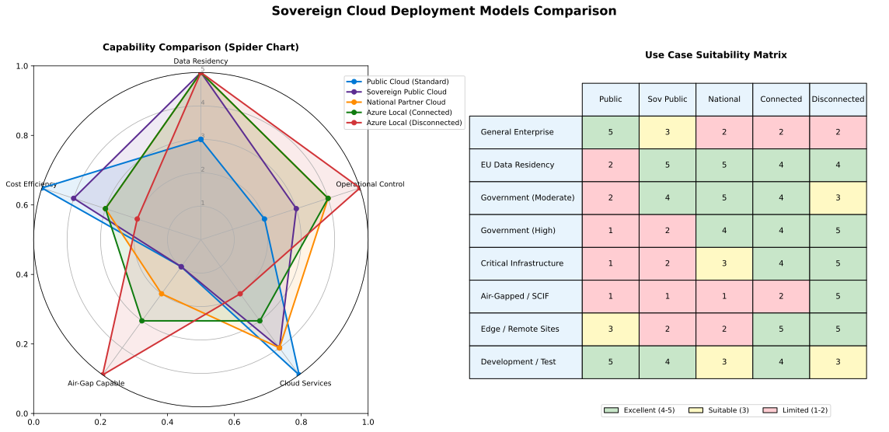
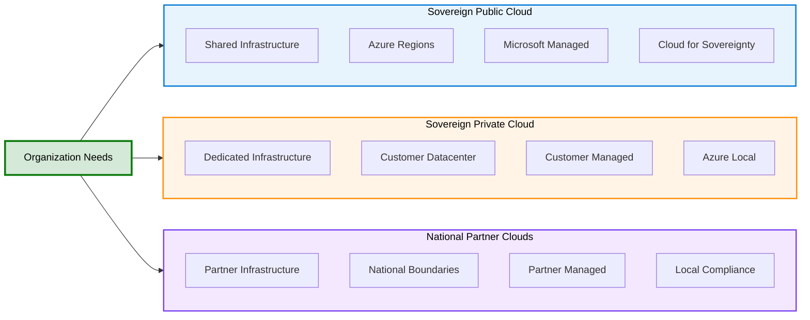
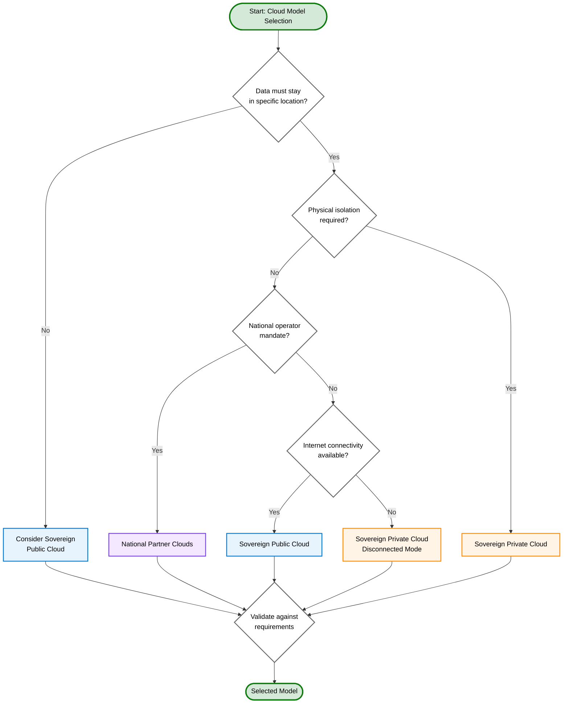

# Microsoft Sovereign Cloud Models

{: .no_toc }

View Diagram: Sovereign Cloud Models Comparison

_Figure 1: Comparison of sovereign cloud deployment models_

## Table of Contents

{: .no_toc .text-delta }

1. TOC
{:toc}

---

## Overview

Microsoft recognizes that organizations have diverse sovereignty requirements based on their industry, regulatory obligations, and operational needs. To address this spectrum of requirements, Microsoft offers **three distinct sovereign cloud models** that provide varying levels of control, isolation, and compliance capabilities.

These models enable organizations to:

- **Balance sovereignty needs with cloud benefits:** Maintain control while leveraging cloud innovation
- **Meet regulatory requirements:** Comply with local laws and industry-specific regulations
- **Optimize for specific use cases:** Choose the right model based on workload characteristics
- **Scale as needs evolve:** Transition between models as requirements change

### Why Multiple Models Matter

Different organizations have different sovereignty needs:

- A European bank may need data residency guarantees but can operate in a shared infrastructure
- A defense contractor requires physical isolation and no external connectivity
- A government agency needs infrastructure operated by local entities with regional compliance certifications

**No single solution fits all scenarios.** Microsoft's three-model approach provides flexibility while maintaining high security and compliance standards.

---

## The Three Sovereign Cloud Models

### 1. Sovereign Public Cloud

**Definition:** Azure public cloud with enhanced sovereignty controls, data residency guarantees, and additional compliance features.

**Key Characteristics:**

- Shared infrastructure with logical isolation
- Enhanced sovereignty controls via Microsoft Cloud for Sovereignty
- Data stored and processed in specific regions
- Customer Lockbox for access control
- Azure Policy for compliance automation
- Confidential computing capabilities

**Best For:**

- Regulated industries (finance, healthcare, energy)
- Organizations requiring GDPR, HIPAA, or similar compliance
- Workloads needing cloud scalability with data residency
- Customers wanting balance between control and cloud benefits

**[Learn More →](sovereign-public-cloud)**

---

### 2. Sovereign Private Cloud

**Definition:** Dedicated infrastructure running Azure services on-premises via Azure Local (formerly Azure Stack HCI), providing physical isolation and local control.

**Key Characteristics:**

- Dedicated, single-tenant infrastructure
- Physical hardware in customer-controlled facilities
- Connected mode (hybrid with Azure) or Disconnected mode (air-gapped)
- Local control plane option for maximum sovereignty
- Azure-consistent services and management
- Validated hardware from Microsoft partners

**Best For:**

- Defense and intelligence agencies
- Highly regulated industries requiring physical isolation
- Latency-sensitive workloads needing edge computing
- Organizations with air-gap or disconnected requirements
- Scenarios requiring complete operational independence

**[Learn More →](sovereign-private-cloud)**

---

### 3. National Partner Clouds

**Definition:** Azure infrastructure operated by trusted national partners, providing sovereign cloud services with local data governance, operations, and support.

**Key Characteristics:**

- Infrastructure operated by in-country partners
- Local data governance and legal jurisdiction
- Regional compliance certifications
- Isolated from global Azure (logical separation)
- Local support and operations teams
- Tailored to national requirements

**Examples:**

- **Azure Government (United States)** - FedRAMP High, DoD IL5, ITAR
- **Azure China (21Vianet operated)** - China data residency laws
- **Azure Germany (discontinued 2021)** - Lessons learned for future models

**Best For:**

- Government agencies and public sector
- Critical national infrastructure
- Organizations subject to national cloud requirements
- Workloads requiring local operator model

**[Learn More →](national-partner-clouds)**

---

## Model Comparison Matrix

| Feature / Attribute | Sovereign Public Cloud | Sovereign Private Cloud | National Partner Clouds |
|---------------------|------------------------|-------------------------|-------------------------|
| **Infrastructure** | Shared (logical isolation) | Dedicated (physical isolation) | Shared (partner-operated) |
| **Deployment Location** | Azure regions | Customer data center / edge | National partner data centers |
| **Data Residency** | Configurable by region | Complete control | National boundaries |
| **Operational Control** | Microsoft-managed with customer controls | Customer-managed or Microsoft-managed | Partner-managed |
| **Connectivity** | Always-on internet | Connected or Disconnected | Always-on internet |
| **Control Plane** | Azure (cloud) | Azure or local | Partner-controlled Azure |
| **Scalability** | Virtually unlimited | Limited by hardware | High (within region) |
| **Management** | Azure Portal, APIs | Azure Arc + local tools | Partner portal + Azure tools |
| **Update Cadence** | Microsoft-managed | Customer-controlled | Partner-managed |
| **Compliance** | Global + regional certs | Customer-specific | National certifications |
| **Cost Model** | Pay-as-you-go, reserved | CapEx + subscription | Pay-as-you-go (partner) |
| **Time to Deploy** | Minutes to hours | Weeks to months | Days to weeks |
| **Typical TCO** | $ (lowest) | $$$ (highest) | $$ (moderate) |
| **Azure Services** | All services | Subset of services | Most services |
| **Multi-Region DR** | Native Azure DR | Requires multiple sites | Within partner network |

---

## Decision Framework

Choosing the right sovereign cloud model depends on multiple factors. Use this framework to guide your decision:

---

### Step 1: Assess Data Sovereignty Requirements

**Questions to Ask:**

- Where must data be stored and processed?
- What are the regulatory requirements (GDPR, FedRAMP, sector-specific)?
- Are there restrictions on data leaving geographic boundaries?
- What compliance certifications are required?

**Decision Path:**

- **Low-Moderate Requirements:** Data residency in specific regions → **Sovereign Public Cloud**
- **High Requirements:** Physical data isolation needed → **Sovereign Private Cloud**
- **National Requirements:** Local operator mandate → **National Partner Clouds**

---

### Step 2: Evaluate Operational Control Needs

**Questions to Ask:**

- Who needs to manage the infrastructure?
- Do you need to operate without internet connectivity?
- What level of control over updates and maintenance is required?
- Are there restrictions on who can access infrastructure?

**Decision Path:**

- **Cloud-Managed Acceptable:** Microsoft or partner management → **Sovereign Public Cloud** or **National Partner Clouds**
- **Customer-Managed Required:** Full control needed → **Sovereign Private Cloud** (Disconnected Mode)
- **Hybrid Approach:** Mix of cloud and local management → **Sovereign Private Cloud** (Connected Mode)

---

### Step 3: Consider Technical Requirements

**Questions to Ask:**

- What are latency requirements?
- Do workloads need specific Azure services?
- Is disconnected operation necessary?
- What are scalability needs?

**Decision Path:**

- **Low Latency Critical:** Edge computing needed → **Sovereign Private Cloud**
- **Full Azure Services:** All capabilities needed → **Sovereign Public Cloud**
- **Air-Gap Required:** No external connectivity → **Sovereign Private Cloud** (Disconnected)
- **Standard Latency Acceptable:** Internet-based access fine → **Sovereign Public Cloud** or **National Partner Clouds**

---

### Step 4: Analyze Cost and Resource Constraints

**Questions to Ask:**

- What is the budget for infrastructure (CapEx vs OpEx)?
- Do you have personnel to manage on-premises infrastructure?
- What is the acceptable time to deploy?
- What is the expected TCO over 3-5 years?

**Decision Path:**

- **Limited CapEx Budget:** OpEx model preferred → **Sovereign Public Cloud** or **National Partner Clouds**
- **On-Premises Skills Available:** Can manage hardware → **Sovereign Private Cloud**
- **Fast Deployment Needed:** Quick time to value → **Sovereign Public Cloud**
- **Long-Term Investment:** Strategic infrastructure → **Sovereign Private Cloud**

---

### Step 5: Determine Compliance and Audit Needs

**Questions to Ask:**

- What audit and compliance reporting is required?
- Are there specific national certifications needed?
- Who will conduct security assessments?
- What transparency into operations is required?

**Decision Path:**

- **Global Certifications:** ISO, SOC, CSA STAR → **Sovereign Public Cloud**
- **National Certifications:** FedRAMP, national standards → **National Partner Clouds**
- **Custom Compliance:** Unique requirements → **Sovereign Private Cloud**

---

## Customer Scenarios

Real-world examples illustrating when and why organizations choose each sovereign cloud model.

### Scenario 1: European Banking - Sovereign Public Cloud

**Organization:** Multi-national retail bank operating across 12 EU countries

**Challenge:**

- GDPR compliance for customer financial data
- Multiple national banking regulations (BaFin, ACPR, ECB)
- Data residency within EU boundaries mandatory
- Need for elastic scalability during peak transaction periods
- Integration with global Azure services for innovation

**Sovereignty Requirements:**

- **Data Residency:** High - All customer data in EU
- **Operational Sovereignty:** Moderate - Prefer EU support personnel
- **Compliance:** Extensive - Banking regulations, GDPR, PCI DSS
- **Connectivity:** Always-on required for 24/7 operations

**Solution: Sovereign Public Cloud (Microsoft Cloud for Sovereignty)**

**Implementation:**

- Deploy workloads in Azure Germany West Central and Azure France Central regions
- Enable Microsoft Cloud for Sovereignty guardrails
- Configure EU Data Boundary for all customer data
- Implement Azure Policy to enforce data residency
- Use Customer Lockbox for support access control
- Deploy Azure Key Vault with customer-managed keys
- Enable Azure Confidential Computing for sensitive calculations

**Benefits Realized:**

- ✅ Maintained GDPR compliance across all operating countries
- ✅ Achieved elasticity during payment processing peaks (3x capacity on-demand)
- ✅ Reduced infrastructure costs by 40% vs. on-premises
- ✅ Passed ECB and national regulator audits
- ✅ Enabled AI-powered fraud detection using Azure Cognitive Services
- ✅ Customer data never leaves EU, with audit trail proof

**Sales Talking Points:**

- "You get all the benefits of Azure's 200+ services while meeting strict European banking regulations"
- "Elastic scalability means you only pay for what you use, with 40% cost reduction typical"
- "Microsoft Cloud for Sovereignty provides automated compliance guardrails, reducing audit preparation time by 60%"

**Discovery Questions:**

- "What regions do you operate in, and what are the specific data residency requirements?"
- "How do you handle peak transaction periods today?"
- "What compliance certifications and audits do you undergo annually?"
- "Are there restrictions on where support personnel can be located?"

---

### Scenario 2: Defense Contractor - Sovereign Private Cloud (Disconnected)

**Organization:** Aerospace company producing components for military aircraft, handling ITAR-controlled technical data

**Challenge:**

- ITAR compliance requiring US persons-only access
- CMMC Level 3 certification required for DoD contracts
- Export-controlled technical data (CAD/CAM files, specifications)
- Air-gapped environment for classified design work
- Disconnected operations in secure facilities
- Modern development tools needed for digital engineering

**Sovereignty Requirements:**

- **Data Residency:** Maximum - No data egress permitted
- **Operational Sovereignty:** Complete - Full control, US persons only
- **Compliance:** ITAR, CMMC Level 3, NIST SP 800-171
- **Connectivity:** Disconnected/air-gapped for classified work

**Solution: Sovereign Private Cloud (Azure Local - Disconnected Mode)**

**Implementation:**

- Deploy Azure Local clusters in secure facility (4-node cluster)
- Configure Disconnected Mode (no internet connectivity)
- Deploy local identity (Active Directory on cluster)
- Use Windows Admin Center for local management
- Deploy Arc-enabled Kubernetes for containerized applications
- Set up local SQL Managed Instance for design databases
- Implement offline update process via secure media transfer
- Deploy Azure Virtual Desktop for secure remote access within facility

**Benefits Realized:**

- ✅ Achieved CMMC Level 3 certification in 6 months
- ✅ Maintained ITAR compliance with US persons-only access
- ✅ Enabled digital engineering with modern tools (Azure DevOps Server, CAD applications)
- ✅ Reduced time-to-design by 30% with collaborative tools
- ✅ Passed DoD security assessments
- ✅ Maintained operational independence from external networks

**Sales Talking Points:**

- "Azure Local Disconnected Mode provides Azure-consistent services without any external connectivity"
- "You can achieve CMMC Level 3 compliance while enabling digital transformation"
- "Local control plane means no dependencies on Microsoft for day-to-day operations"
- "Validated hardware from Dell, HPE, Lenovo ensures supportability"

**Discovery Questions:**

- "What classification level does your data reach, and what are connectivity restrictions?"
- "Do you currently have CMMC certification, and what level are you targeting?"
- "Who has access to your secure facilities, and what clearance levels are required?"
- "How do you update and patch systems in air-gapped environments today?"

---

### Scenario 3: National Government - National Partner Cloud

**Organization:** Federal government department managing citizen services and sensitive government data

**Challenge:**

- FedRAMP High authorization required
- US Government data sovereignty requirements
- Isolation from commercial cloud tenants
- Need for government-cleared support personnel
- Compliance with federal procurement regulations
- Integration with government-wide identity systems

**Sovereignty Requirements:**

- **Data Residency:** US Government regions only
- **Operational Sovereignty:** Government-cleared operations team
- **Compliance:** FedRAMP High, CJIS, IRS 1075
- **Connectivity:** Government networks (dedicated circuits)

**Solution: National Partner Cloud (Azure Government)**

**Implementation:**

- Deploy in Azure Government regions (Virginia, Texas, Arizona)
- Implement FedRAMP High controls and monitoring
- Connect via ExpressRoute with government network peering
- Use Azure Government Active Directory for identity
- Deploy Government-specific services (Azure Government Secret regions for classified)
- Implement continuous compliance monitoring
- Use US Government-cleared Microsoft support personnel

**Benefits Realized:**

- ✅ Achieved FedRAMP High authorization in 12 months
- ✅ Physically and logically isolated from commercial Azure
- ✅ All support personnel are US citizens with clearances
- ✅ Integrated with government-wide identity systems
- ✅ Met federal procurement requirements
- ✅ Enabled digital services for citizens while maintaining sovereignty

**Sales Talking Points:**

- "Azure Government is physically and logically separated from commercial Azure"
- "All support personnel are US citizens who have passed government background checks"
- "Over 90 FedRAMP High authorized services available"
- "Government-specific compliance offerings include CJIS, IRS 1075, DoD IL5"

**Discovery Questions:**

- "What FedRAMP impact level do you require (Low, Moderate, High)?"
- "Do you have any classified workloads requiring DoD IL5 or IL6?"
- "What are your requirements for support personnel clearances?"
- "Are you currently authorized, or are you pursuing authorization?"

---

### Scenario 4: Healthcare Provider - Sovereign Public Cloud

**Organization:** Regional hospital network with 15 facilities across 3 states, managing patient health records

**Challenge:**

- HIPAA compliance for Protected Health Information (PHI)
- State-specific healthcare privacy regulations
- Integration with regional health information exchanges
- Low latency for medical imaging and EHR systems
- Scalability for seasonal patient surges
- Business Associate Agreement (BAA) required with cloud provider

**Sovereignty Requirements:**

- **Data Residency:** Moderate - US regions only, prefer specific states
- **Operational Sovereignty:** Low-Moderate - Cloud management acceptable
- **Compliance:** HIPAA, HITECH, state privacy laws
- **Connectivity:** Always-on with low-latency requirements

**Solution: Sovereign Public Cloud + Azure Local (Hybrid)**

**Implementation:**

- Deploy core EHR systems in Azure US regions (East US, Central US) with HIPAA BAA
- Implement Azure Policy for HIPAA compliance automation
- Deploy Azure Local at main hospital campuses for medical imaging (PACS)
- Use Azure Arc to manage hybrid infrastructure
- Enable Azure Monitor for compliance and performance monitoring
- Implement Azure Private Link for secure connectivity
- Deploy Azure API for FHIR for health information exchange

**Benefits Realized:**

- ✅ HIPAA compliance maintained across all facilities
- ✅ Reduced medical imaging access latency by 80% with Azure Local
- ✅ Improved patient care with faster access to imaging studies
- ✅ Scaled capacity during COVID-19 surge without infrastructure delays
- ✅ Integrated with state health information exchanges
- ✅ Reduced IT costs by 35% vs. traditional data center

**Sales Talking Points:**

- "Hybrid approach combines cloud scalability with edge performance for medical imaging"
- "Azure offers more HIPAA-compliant services than any other cloud provider"
- "Azure Local at hospital campuses provides <10ms latency for critical applications"
- "Azure Arc provides unified management across cloud and edge"

**Discovery Questions:**

- "What are your most latency-sensitive applications?"
- "How do you handle patient data surges during flu season or emergencies?"
- "What health information exchanges do you participate in?"
- "Do you have existing on-premises infrastructure investments?"

---

### Scenario 5: Global Manufacturing - Multi-Model Approach

**Organization:** Multinational manufacturer with plants in 30 countries, producing automotive components

**Challenge:**

- Data localization laws in multiple countries (China, Russia, EU)
- Operational technology (OT) security for manufacturing systems
- Low latency for real-time production monitoring
- Varying sovereignty requirements by region
- Global visibility with local compliance
- Integration with suppliers and partners worldwide

**Sovereignty Requirements:**

- **Data Residency:** Varies by region (high in some, low in others)
- **Operational Sovereignty:** High for OT, moderate for IT
- **Compliance:** ISO 27001, local data protection laws, industry standards
- **Connectivity:** Mixed (OT air-gapped, IT cloud-connected)

**Solution: Multi-Model Approach**

**Implementation:**

- **Sovereign Private Cloud (Azure Local Disconnected):** Manufacturing plants with OT systems, air-gapped for security
- **National Partner Cloud (Azure China):** Operations in China using 21Vianet-operated Azure
- **Sovereign Public Cloud:** Global ERP, supply chain, and collaboration systems in regional Azure
- **Azure Arc:** Unified management and governance across all environments

**Architecture:**

- Azure Local at each of 30 manufacturing plants running MES, SCADA systems
- Azure China for Chinese operations (data sovereignty compliance)
- Azure Germany/France for EU operations (GDPR compliance)
- Global Azure for non-sovereign workloads (development, testing, corporate)
- Azure Arc provides unified policy, monitoring, and security across all

**Benefits Realized:**

- ✅ Complies with data localization laws in all 30 countries
- ✅ Secured OT systems with air-gapped Azure Local
- ✅ Improved production efficiency with edge analytics
- ✅ Maintained global visibility across operations
- ✅ Reduced compliance complexity with unified policy via Azure Arc
- ✅ Enabled predictive maintenance reducing downtime by 25%

**Sales Talking Points:**

- "Microsoft's three sovereign cloud models allow you to meet diverse regional requirements with a single vendor"
- "Azure Arc provides unified governance even across air-gapped environments"
- "You're not locked into one model - use the right model for each workload"
- "Hybrid approach allows gradual migration while maintaining existing investments"

**Discovery Questions:**

- "In which countries do you operate, and what are the data localization requirements?"
- "Which of your systems are air-gapped or isolated for OT security?"
- "How do you currently manage IT infrastructure across 30 countries?"
- "What is your strategy for OT/IT convergence and Industry 4.0?"

---

## Sales & Pre-Sales Talking Points

### Positioning Microsoft's Three-Model Approach

**Unique Value Proposition:**
"Microsoft is the only cloud provider offering a complete spectrum of sovereignty options - from public cloud with sovereignty controls, to dedicated on-premises infrastructure, to partner-operated national clouds. This flexibility means you can choose the right model for each workload, while maintaining consistent management, security, and compliance."

### Key Differentiators

**1. Flexibility Without Lock-In**

- Start with Sovereign Public Cloud, move to Private if needs change
- Use multiple models simultaneously (hybrid sovereignty)
- Azure Arc provides consistent management across all models
- No need to rearchitect applications when moving between models

**2. Compliance Leadership**

- More certifications than AWS or Google Cloud
- Only provider with national partner clouds in multiple countries
- FedRAMP High, DoD IL6, ITAR authorizations
- GDPR, CCPA, LGPD, and regional compliance built-in

**3. Operational Consistency**

- Same Azure services across all models (subset on Azure Local)
- Consistent management tools (Azure Portal, CLI, ARM templates)
- Same identity and security model (Azure AD, RBAC)
- Same monitoring and logging (Azure Monitor, Log Analytics)

**4. Innovation Without Compromise**

- Access to Azure AI, Machine Learning, and analytics services
- Latest security features (Confidential Computing, Always Encrypted)
- Continuous updates and new service releases
- Microsoft research investments benefit all models

### Competitive Differentiation

| Capability | Microsoft | AWS | Google Cloud |
|------------|-----------|-----|--------------|
| **Sovereign Public Cloud** | ✅ Microsoft Cloud for Sovereignty with policy-driven controls | ⚠️ Limited sovereignty controls in public cloud | ⚠️ Region-based only |
| **Sovereign Private Cloud** | ✅ Azure Local with Connected/Disconnected modes | ⚠️ AWS Outposts (connected only) | ⚠️ Anthos (Kubernetes only) |
| **National Partner Clouds** | ✅ Multiple countries (US Gov, China) | ✅ AWS GovCloud (US only) | ⚠️ No national clouds |
| **Disconnected Operations** | ✅ Full Azure Local disconnected mode | ❌ Not available | ❌ Not available |
| **Unified Management** | ✅ Azure Arc across all models | ⚠️ Separate tools for each | ⚠️ Anthos for some scenarios |
| **Compliance Certifications** | ✅ 100+ certifications | ⚠️ 80+ certifications | ⚠️ 60+ certifications |
| **FedRAMP High** | ✅ Yes (Azure Government) | ✅ Yes (AWS GovCloud) | ⚠️ Limited regions |
| **DoD IL5/IL6** | ✅ Yes (Azure Government Secret) | ⚠️ IL5 only | ❌ No |

### Value Messaging by Model

**Sovereign Public Cloud:**

- "Get all the benefits of cloud - scalability, innovation, cost optimization - while meeting sovereignty requirements"
- "Pay only for what you use, with sovereignty controls automated through policy"
- "Microsoft Cloud for Sovereignty provides guardrails so you can't accidentally violate compliance"

**Sovereign Private Cloud:**

- "Azure Local brings Azure services to your data center, not your data to Azure"
- "Disconnected mode means you can operate completely independently - no internet required"
- "Validated hardware from tier-1 OEMs ensures enterprise support and reliability"

**National Partner Clouds:**

- "Local operator model means your cloud is run by a trusted in-country partner"
- "Meet national cloud requirements while accessing Azure's global innovation"
- "Government-cleared support personnel ensure sovereignty at all levels"

---

## Technical Implementation Considerations

### Migration Strategies

#### Migrating to Sovereign Public Cloud

**Assessment Phase:**

1. Identify all data types and classification levels
2. Map current data locations and flows
3. Identify regulatory and compliance requirements
4. Assess application architecture and dependencies

**Planning Phase:**

1. Select target Azure regions based on data residency needs
2. Design network topology (VNets, subnets, NSGs)
3. Plan identity integration (Azure AD, hybrid identity)
4. Define Azure Policy set for compliance automation
5. Design encryption strategy (Azure Key Vault, customer-managed keys)

**Migration Phase:**

1. Set up landing zones with Microsoft Cloud for Sovereignty
2. Migrate non-production workloads first (dev/test)
3. Implement monitoring and compliance reporting
4. Migrate production workloads in waves
5. Validate compliance and performance
6. Decommission old infrastructure

**Timeline:** 3-6 months for typical enterprise migration

---

#### Deploying Sovereign Private Cloud

**Planning Phase:**

1. Assess workloads for Azure Local compatibility
2. Determine operating mode (Connected vs. Disconnected)
3. Size infrastructure (compute, storage, network)
4. Select validated hardware from Microsoft partners
5. Plan integration with Azure (if Connected mode)

**Procurement Phase:**

1. Select Azure Local Integrated System partner (Dell, HPE, Lenovo)
2. Order hardware with appropriate specifications
3. Plan data center space, power, and cooling
4. Arrange logistics and delivery

**Deployment Phase:**

1. Install and rack hardware
2. Deploy Azure Local cluster
3. Configure networking and storage
4. Deploy Azure Arc agents (if Connected)
5. Deploy workloads and applications
6. Configure backup and disaster recovery

**Timeline:** 2-4 months from planning to production

---

#### Adopting National Partner Cloud

**Assessment Phase:**

1. Verify eligibility for national partner cloud (government, critical infrastructure)
2. Understand partner's operational model and SLAs
3. Review compliance certifications and attestations
4. Assess application compatibility

**Onboarding Phase:**

1. Complete partner's onboarding process
2. Establish connectivity (ExpressRoute, VPN)
3. Set up identity federation (if applicable)
4. Configure Azure subscriptions and resources
5. Implement governance and compliance policies

**Migration Phase:**

1. Migrate workloads to partner cloud
2. Validate compliance and performance
3. Train operations team on partner-specific processes
4. Establish support channels with partner

**Timeline:** 1-3 months for onboarding and initial migration

---

## Discovery Questions for Customer Conversations

### Understanding Sovereignty Needs

**Data Sovereignty:**

1. "What types of data do you handle, and what are the sensitivity levels?"
2. "Are there specific geographic restrictions on where data can be stored or processed?"
3. "What data residency requirements do you have from regulators or customers?"
4. "Do you need to demonstrate data sovereignty to auditors or customers?"

**Operational Sovereignty:**
5. "Do you require the ability to operate without internet connectivity?"
6. "Who needs to have access to your infrastructure (personnel location, clearances)?"
7. "What level of control do you need over updates and maintenance windows?"
8. "Are there restrictions on who can provide support for your systems?"

**Compliance and Regulatory:**
9. "What regulatory frameworks apply to your organization (GDPR, FedRAMP, HIPAA, ITAR)?"
10. "What compliance certifications are you required to maintain?"
11. "How frequently are you audited, and by whom?"
12. "Are there industry-specific regulations you must comply with?"

### Technical Requirements

**Architecture and Performance:**
13. "What are your latency requirements for critical applications?"
14. "Do you have workloads that require specific Azure services?"
15. "What are your high availability and disaster recovery requirements?"
16. "How do you currently handle peak capacity demands?"

**Integration and Migration:**
17. "What is your current infrastructure (on-premises, other clouds, hybrid)?"
18. "What are your application dependencies and integration points?"
19. "What is your timeline for migration or new deployments?"
20. "Do you have plans for modernization or re-architecture?"

### Business and Cost

**Budget and Resources:**
21. "What is your preference for CapEx vs. OpEx spending?"
22. "Do you have personnel trained on cloud or on-premises infrastructure?"
23. "What is your expected TCO over the next 3-5 years?"
24. "Are there budget constraints or procurement requirements?"

**Strategic Direction:**
25. "What is your cloud strategy (cloud-first, hybrid, multi-cloud)?"
26. "How important is vendor consolidation to your organization?"
27. "What are your top 3 business drivers for this initiative?"
28. "How do you measure success for cloud investments?"

---

## Competitive Differentiation

### vs. AWS

**Microsoft Advantages:**

1. **Disconnected Operations:**
   - ✅ Microsoft: Azure Local Disconnected Mode for air-gapped environments
   - ❌ AWS: Outposts requires persistent connectivity to AWS

2. **Unified Management:**
   - ✅ Microsoft: Azure Arc manages all three models with single control plane
   - ⚠️ AWS: Separate tools for different deployment models

3. **Sovereign Public Cloud:**
   - ✅ Microsoft: Microsoft Cloud for Sovereignty with policy-driven controls
   - ⚠️ AWS: No specific sovereign public cloud offering

4. **Compliance Breadth:**
   - ✅ Microsoft: 100+ compliance certifications including DoD IL6
   - ⚠️ AWS: 80+ certifications, no DoD IL6

5. **National Partner Clouds:**
   - ✅ Microsoft: Multiple national clouds (US, China)
   - ⚠️ AWS: GovCloud US only

**When to Mention:**

- Customer requires air-gapped operations
- Customer needs unified management across hybrid environments
- Customer requires DoD IL6 or specific national cloud
- Customer wants policy-driven sovereignty controls

---

### vs. Google Cloud

**Microsoft Advantages:**

1. **Sovereign Private Cloud:**
   - ✅ Microsoft: Full Azure Local with broad service portfolio
   - ⚠️ Google: Anthos limited to Kubernetes workloads

2. **National Partner Clouds:**
   - ✅ Microsoft: Azure Government (US), Azure China
   - ❌ Google: No national partner clouds

3. **Government Compliance:**
   - ✅ Microsoft: FedRAMP High, DoD IL5/IL6, ITAR
   - ⚠️ Google: Limited FedRAMP High regions, no DoD IL6

4. **Enterprise Integration:**
   - ✅ Microsoft: Seamless integration with Microsoft 365, Dynamics, Power Platform
   - ⚠️ Google: Limited enterprise suite integration

5. **Compliance Certifications:**
   - ✅ Microsoft: 100+ certifications, most comprehensive
   - ⚠️ Google: ~60 certifications, fewer than Microsoft or AWS

**When to Mention:**

- Customer has Microsoft enterprise agreement
- Customer requires government-specific compliance
- Customer needs more than Kubernetes on-premises
- Customer requires national partner cloud operations

---

## Best Practices and Common Pitfalls

### Best Practices

#### For All Models

✅ **Start with Data Classification**

- Map all data types and sensitivity levels
- Document data flows and processing locations
- Align cloud model choice with data requirements
- Implement data lifecycle management

✅ **Implement Policy-Driven Compliance**

- Use Azure Policy to enforce sovereignty requirements
- Automate compliance checks and reporting
- Implement deny policies for non-compliant configurations
- Regular policy audits and updates

✅ **Design for Resilience**

- Implement high availability within sovereignty boundaries
- Plan disaster recovery within compliant regions
- Test failover and recovery procedures
- Document recovery time objectives (RTO) and recovery point objectives (RPO)

✅ **Plan for Growth**

- Choose model that scales with your needs
- Consider future regulatory changes
- Design for model transition if requirements change
- Maintain flexibility in architecture

---

#### Sovereign Public Cloud Specific

✅ **Use Microsoft Cloud for Sovereignty**

- Deploy sovereignty guardrails from day one
- Configure data residency policies
- Enable Customer Lockbox for support scenarios
- Implement confidential computing for sensitive workloads

✅ **Leverage Azure Policy**

- Enforce regional restrictions on resource creation
- Audit compliance continuously
- Implement automatic remediation where possible
- Document policy exceptions with justification

---

#### Sovereign Private Cloud Specific

✅ **Right-Size Your Hardware**

- Plan for 3-5 year capacity needs
- Include growth buffer (20-30%)
- Consider seasonal or burst capacity requirements
- Validate hardware specifications with Azure Local requirements

✅ **Plan Update Strategy**

- Document update and patch process
- For Disconnected: Plan offline update delivery
- Test updates in non-production first
- Maintain update history and documentation

✅ **Implement Monitoring**

- Deploy monitoring before production workloads
- Set up alerting for capacity and performance
- Monitor hardware health and predictive failures
- Document operational procedures

---

### Common Pitfalls

#### ❌ Choosing the Wrong Model

**Pitfall:** Selecting model based on perception rather than requirements

**Example:** Choosing Sovereign Private Cloud because "it sounds more secure" when Sovereign Public Cloud meets requirements at lower cost

**How to Avoid:**

- Complete thorough requirements assessment
- Use decision framework systematically
- Consider total cost of ownership
- Prototype/POC before full commitment

---

#### ❌ Underestimating Operational Complexity

**Pitfall:** Assuming on-premises Azure Local is "as easy as cloud"

**Example:** Deploying Azure Local without trained staff or operational procedures

**How to Avoid:**

- Invest in training for operations team
- Start with Connected mode before Disconnected
- Document operational runbooks
- Plan for ongoing maintenance and support

---

#### ❌ Ignoring Network Requirements

**Pitfall:** Not planning for bandwidth, latency, and connectivity needs

**Example:** Deploying Azure Local in Connected mode without sufficient internet bandwidth

**How to Avoid:**

- Assess network requirements for chosen model
- Plan for ExpressRoute if needed
- Consider bandwidth for updates, backups, and monitoring
- Test connectivity and latency before go-live

---

#### ❌ Over-Complicating with Multiple Models

**Pitfall:** Using all three models when one would suffice

**Example:** Deploying Azure Local "just in case" when all requirements can be met in Sovereign Public Cloud

**How to Avoid:**

- Start with simplest model that meets requirements
- Add complexity only when justified
- Consider management overhead of multiple models
- Plan integration and governance strategy

---

#### ❌ Forgetting About Data Egress

**Pitfall:** Not considering data transfer costs and restrictions

**Example:** Regular large data transfers from Sovereign Private Cloud to Azure for analytics

**How to Avoid:**

- Understand data residency vs. data processing requirements
- Plan for data minimization and edge analytics
- Consider costs of data egress in model selection
- Implement data lifecycle policies

---

## Visual Asset Placeholder

---

---

---

## Deep Dive Topics

For detailed exploration of each sovereign cloud model, continue to these pages:

### 📘 Sovereign Public Cloud

**[Read Full Article →](sovereign-public-cloud)**

Deep dive into Azure with enhanced sovereignty controls:

- Microsoft Cloud for Sovereignty capabilities
- Data residency and compliance automation
- Customer Lockbox and access controls
- Confidential computing scenarios
- Implementation best practices
- Use cases and customer stories

### 📘 Sovereign Private Cloud

**[Read Full Article →](sovereign-private-cloud)**

Comprehensive guide to Azure Local:

- Connected vs. Disconnected operating modes
- Hardware requirements and validated partners
- Deployment and management strategies
- Integration with Azure Arc
- Use cases for defense, healthcare, and manufacturing
- Total cost of ownership analysis

### 📘 National Partner Clouds

**[Read Full Article →](national-partner-clouds)**

Understanding partner-operated sovereign clouds:

- Azure Government (US FedRAMP)
- Azure China (21Vianet operated)
- Local operations and support models
- Compliance certifications by region
- Onboarding process and requirements
- Partner ecosystem and value chain

### ✅ Test Your Knowledge

**[Take the Cloud Models Quiz →](cloud-models-quiz)**

12-15 questions covering all three sovereign cloud models, decision criteria, and use case selection.

---

## Next Steps

After completing this module:

1. ✅ **Review the three sovereign cloud models** and their key differentiators
2. ✅ **Study the decision framework** to understand model selection criteria
3. ✅ **Read the customer scenarios** to see real-world applications
4. ✅ **Explore deep dive pages** for detailed technical information
5. 🎯 **Take the quiz** to validate your understanding
6. 🎯 **[Proceed to Azure Local Overview →](azure-local-overview)** (Module 3)

---

## Additional Resources

### Microsoft Learn

- **[Microsoft Cloud for Sovereignty](https://learn.microsoft.com/en-us/industry/sovereign-cloud/)** - Official sovereignty documentation hub
- **[Azure Local overview](https://learn.microsoft.com/en-us/azure/azure-local/overview)** - Comprehensive Azure Local guide
- **[Azure Government documentation](https://learn.microsoft.com/en-us/azure/azure-government/)** - Azure Government specifics
- **[National clouds overview](https://learn.microsoft.com/en-us/azure/active-directory/develop/authentication-national-cloud)** - National cloud authentication

### Training Paths

- **[Get started with Microsoft Cloud for Sovereignty](https://learn.microsoft.com/en-us/training/paths/get-started-sovereignty/)** - 4 modules, ~3 hours
- **[Azure fundamentals](https://learn.microsoft.com/en-us/training/paths/azure-fundamentals/)** - Essential Azure background
- **[Hybrid cloud infrastructure](https://learn.microsoft.com/en-us/training/paths/manage-hybrid-infrastructure-with-azure-arc/)** - Azure Arc and hybrid scenarios

### Community and Support

- **[Microsoft Tech Community - Sovereign Cloud](https://techcommunity.microsoft.com/t5/sovereign-cloud/ct-p/SovereignCloud)** - Community discussions
- **[Azure Local YouTube Channel](https://www.youtube.com/@AzureStackHCI)** - Video tutorials and demos
- **[Azure Government Blog](https://devblogs.microsoft.com/azuregov/)** - Updates and announcements

---

**Last Updated:** October 2025
