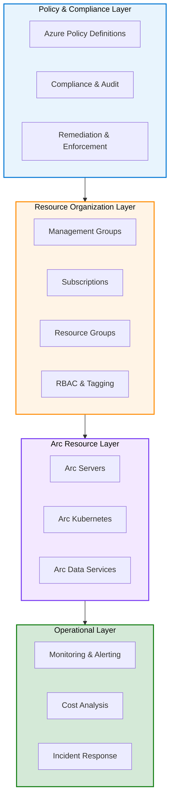

## Overview

Azure Arc advanced management enables organizations to scale their hybrid and multi-cloud operations through centralized governance, policy enforcement, cost optimization, and security hardening. This module explores enterprise-grade techniques for managing hundreds or thousands of Arc-managed resources across diverse environments while maintaining compliance, security, and cost efficiency.

### Prerequisites

- Completion of Level 100: Azure Arc Introduction
- Understanding of basic Arc concepts (servers, Kubernetes, data services)
- Familiarity with Azure governance basics

### Learning Objectives

By completing this module, you will:

- Master Azure Policy for Arc at scale
- Implement governance frameworks across multi-environment deployments
- Optimize costs in hybrid and multi-cloud environments
- Design enterprise Arc governance architectures
- Implement security and compliance automation

---

## Complete System Architecture for Enterprise Arc

### Four-Layer Enterprise Governance Model



### Governance Pillars

1. **Policy Enforcement**
   - Configuration enforcement across environments
   - Compliance automation and remediation
   - Audit trail and reporting
   - Custom policy development

2. **Cost Management**
   - Per-environment cost analysis
   - Reserved capacity planning
   - Resource right-sizing recommendations
   - Budget allocation and tracking

3. **Security Hardening**
   - Zero-trust security implementation
   - Encryption and secret management
   - Network security policies
   - Vulnerability management

4. **Enterprise Scale**
   - Governance across management groups
   - Multi-tenant and multi-subscription patterns
   - Federation and hub-and-spoke models
   - Disaster recovery integration

---

## Azure Policy for Arc at Scale

### Policy Implementation Framework

Azure Policy enables organizations to enforce configurations across hundreds or thousands of Arc-managed resources automatically.

#### Policy Scope Management

```text
Enterprise
├── Management Group 1 (Policy Scope A)
│   ├── Subscription 1 (Inherits A)
│   │   ├── Arc Server 1 (Compliant)
│   │   ├── Arc Server 2 (Compliant)
│   │   └── Arc Kubernetes (Compliant)
│   └── Subscription 2 (Inherits A)
│       ├── Arc Data Services (Compliant)
│       └── Arc Server 3 (Non-Compliant - Triggers Remediation)
└── Management Group 2 (Policy Scope B)
    ├── Subscription 3 (Inherits B)
    └── Subscription 4 (Inherits B)
```

#### Core Policy Categories for Arc

1. **Configuration Policies**
   - Mandatory tagging on Arc resources
   - Required extensions installation (monitoring, updates, security)
   - Network configuration requirements
   - Disk encryption enforcement

2. **Compliance Policies**
   - Patch compliance thresholds
   - Antivirus protection requirements
   - Log analytics workspace connection
   - Backup and disaster recovery configuration

3. **Cost Policies**
   - Allowed regions for new Arc resources
   - Resource type restrictions
   - Size enforcement (e.g., minimum CPU cores)
   - Deprovisioning of idle resources

4. **Security Policies**
   - Endpoint protection requirements
   - TLS version enforcement
   - Encryption algorithm standards
   - Secret management policies

### Policy Remediation Strategies

#### Automatic Remediation

- **DeployIfNotExists:** Automatically deploys extensions or configurations
- **Modify:** Automatically modifies resource properties
- **Append:** Automatically adds tags or properties
- **AuditIfNotExists:** Logs non-compliance for review

Example: Auto-deploy monitoring agent to all Arc servers

```PowerShell
# Policy effect: DeployIfNotExists
# This automatically deploys the Azure Monitor Agent to Arc servers
# with specified resource types and extensions

$policyDefinition = @{
    Name        = "Deploy-Monitor-Agent-Arc"
    Description = "Deploy Azure Monitor Agent to Arc servers"
    Mode        = "Indexed"
    Effect      = "DeployIfNotExists"
    Condition   = "Arc-server-without-monitor-agent"
    Deployment  = "Deploy-AMA-Extension"
}
```

#### Manual Remediation Workflow

- Identify non-compliant resources (Azure Policy dashboard)
- Create remediation task for specific scope
- Select automatic or manual remediation
- Track remediation status and failures
- Generate compliance reports

### Custom Policy Development

Creating organization-specific policies:

```PowerShell
# Example: Custom policy for Arc servers in sovereign clouds
# Requirement: All Arc servers must have encryption enabled

$policyDefinition = @{
    name    = "Enforce-Encryption-Arc-Servers"
    type    = "Microsoft.Authorization/policyDefinitions"
    mode    = "Indexed"

    properties = @{
        displayName = "Enforce encryption on Arc servers"
        description = "Ensure all Arc servers in sovereign regions have encryption"

        policyRule = @{
            if = @{
                allOf = @(
                    @{ field = "type"; equals = "Microsoft.HybridCompute/machines" },
                    @{ field = "location"; in = @("westeurope", "germanywestcentral") }
                )
            }
            then = @{
                effect = "audit"
                details = @{
                    type            = "Microsoft.HybridCompute/machines"
                    name            = "osProfile.encryptionStatus"
                    evaluationDelay = "AfterProvisioning"
                    existenceCondition = @{
                        field = "Microsoft.HybridCompute/machines/osProfile.encryptionAtRestEnabled"
                        equals = "true"
                    }
                }
            }
        }
    }
}
```

---

## Enterprise Deployment Patterns

### Pattern 1: Hub-and-Spoke Governance

**Use Case:** Multi-division enterprise with centralized compliance

```text
                    ┌─────────────────┐
                    │   Hub (Central) │
                    │  Arc Management │
                    │   & Compliance  │
                    └────────┬────────┘
                             │
        ┌────────────────────┼────────────────────┐
        │                    │                    │
   ┌────▼────┐          ┌────▼────┐          ┌────▼────┐
   │ Spoke 1  │          │ Spoke 2  │          │ Spoke 3  │
   │Division A│          │Division B│          │Division C│
   │ 50 Arcs  │          │ 75 Arcs  │          │ 100 Arcs │
   └──────────┘          └──────────┘          └──────────┘

• Central policy enforcement across all spokes
• Shared compliance reporting and audit trails
• Each spoke manages own resources within policies
• Centralized cost chargeback model
```

**Implementation:**

- Create hub management group with policy definitions
- Create spoke management groups under hub
- Inherit policies from hub automatically
- Override policies in spokes only when justified
- Report compliance across entire hub-spoke structure

### Pattern 2: Multi-Cloud Federation

**Use Case:** Organizations using Arc with multiple cloud providers

```text
┌──────────────────────────────────────────────────────┐
│      Arc Federation Control Plane (Central)          │
│  - Policy Aggregation & Enforcement                  │
│  - Cost Analysis across clouds                       │
│  - Compliance & Security Posture                     │
└──────────────────┬───────────────────────────────────┘
                   │
    ┌──────────────┼──────────────┐
    │              │              │
┌───▼────┐   ┌────▼────┐    ┌───▼────┐
│Azure    │   │AWS      │    │GCP     │
│Arc      │   │Arc      │    │Arc     │
│Servers  │   │Servers  │    │Servers │
│(On-Prem)│   │(On-Prem)│    │(On-Prem)│
└────────┘   └─────────┘    └────────┘
```

**Implementation:**

- Unified policy evaluation across cloud providers
- Standardized tagging and resource naming
- Centralized monitoring and alerting
- Cost allocation by cloud provider
- Security posture management

### Pattern 3: Zero-Trust Security Model

**Principle:** Never trust, always verify

```text
Arc Resource Request Flow:
┌─────────────┐
│Arc Resource │
└──────┬──────┘
       │
       ▼
┌─────────────────────────────┐
│Identity Verification         │
│- Service Principal Auth      │
│- Managed Identity            │
│- Certificate Validation      │
└──────┬──────────────────────┘
       │
       ▼
┌─────────────────────────────┐
│Access Control (RBAC)         │
│- Role-based permissions      │
│- Least privilege principle   │
│- Time-bound access           │
└──────┬──────────────────────┘
       │
       ▼
┌─────────────────────────────┐
│Policy Evaluation              │
│- Security policies           │
│- Compliance requirements     │
│- Network policies            │
└──────┬──────────────────────┘
       │
       ▼
┌─────────────────────────────┐
│Audit & Logging               │
│- All access logged           │
│- Compliance reporting        │
│- Alert on anomalies          │
└─────────────────────────────┘
```

---

## Cost Optimization Across Hybrid Environments

### Cost Analysis Framework

#### Per-Environment Cost Breakdown

Example: Enterprise with 500 Arc resources

```text
Environment Analysis:
┌─────────────────────────────────────────┐
│On-Premises (450 Arc Servers)            │
│- Resource cost: $0 (existing hardware)  │
│- Arc licensing: $200/month              │
│- Azure Extensions: $500/month           │
│- Monitoring & Log Analytics: $300/month │
│- Total: ~$1,000/month                   │
│                                         │
│AWS (30 Arc Servers)                    │
│- Resource cost: $1,500/month           │
│- Arc licensing: $100/month              │
│- Extensions: $150/month                 │
│- Total: ~$1,750/month                   │
│                                         │
│GCP (20 Arc Servers)                    │
│- Resource cost: $800/month              │
│- Arc licensing: $70/month               │
│- Extensions: $100/month                 │
│- Total: ~$970/month                     │
│                                         │
│TOTAL ENTERPRISE COST: ~$3,720/month     │
│Annual: ~$44,640                         │
└─────────────────────────────────────────┘
```

### Cost Optimization Strategies

1. **Right-Sizing**
   - Analyze actual resource utilization
   - Downsize over-provisioned resources
   - Example savings: 20-30% reduction

2. **Reserved Capacity**
   - Commit to Arc licenses annually
   - Typical discount: 20-25% vs. pay-as-you-go
   - Example: 500 Arc servers × $3/month × 12 months = $18,000/year
   - With reservation: $18,000 × 0.78 = $14,040/year
   - Savings: $3,960/year

3. **Extension Consolidation**
   - Reduce number of active extensions per resource
   - Bundle related extensions
   - Example savings: $50-100 per resource annually

4. **Chargeback Models**
   - Allocate costs to departments/projects
   - Incentivize efficient resource usage
   - Create accountability for resource consumption

---

## Security Hardening in Arc Deployments

### Security Layer Implementation

#### 1. Identity & Access Control

- **Service Principals:** Arc agents authenticate with Azure AD
- **Managed Identities:** Workloads access Azure services securely
- **RBAC:** Role-based access to Arc resources
- **MFA:** Multi-factor authentication for admin access

#### 2. Network Security

- **Private Endpoints:** Secure connectivity to Azure services
- **Network Security Groups (NSG):** Restrict traffic to Arc resources
- **Azure Firewall:** Centralized firewall for Arc traffic
- **VPN/ExpressRoute:** Encrypted connectivity to Azure

#### 3. Data Protection

- **Encryption at Rest:** Disk encryption for Arc servers
- **Encryption in Transit:** TLS for all communications
- **Key Vault Integration:** Centralized secret management
- **Azure Disk Encryption:** Automatic encryption policies

#### 4. Threat Detection

- **Microsoft Defender for Cloud:** Vulnerability scanning
- **Azure Sentinel:** Centralized SIEM for Arc resources
- **Behavioral Analysis:** Anomaly detection and alerting
- **Incident Response:** Automated response playbooks

---

## Enterprise Customer Scenarios

### Scenario 1: Financial Services - Multi-Region Compliance

**Organization:** Global bank with 12 regional data centers and compliance requirements (PCI-DSS, SOX, regulatory)

**Challenge:**

- 2,500 Arc servers across multiple jurisdictions
- Strict compliance requirements (encryption, audit trails)
- Need for cost visibility and chargeback
- Regulatory audit requirements

**Arc Advanced Management Solution:**

- **Policy:** Enforce encryption, audit logging, specific TLS versions
- **Governance:** Hub-and-spoke per region with local compliance override
- **Cost:** $15,000/month for Arc services + extensions
- **Security:** Zero-trust security model with Azure Sentinel integration
- **Result:** 100% compliance audit-ready, 25% reduction in management overhead

**Key Talking Points:**

- Automatic compliance enforcement across regions
- Centralized audit trails for regulatory reporting
- Cost visibility at department/region level
- Reduced compliance violation risk

---

### Scenario 2: Manufacturing - Industrial IoT at Scale

**Organization:** Global manufacturing with 50 factories running industrial IoT and control systems

**Challenge:**

- 5,000 edge devices and Arc servers
- Mixed environments (on-premises, private cloud, regional clouds)
- Need for predictive maintenance and cost optimization
- Security threats to operational technology (OT)

**Arc Advanced Management Solution:**

- **Pattern:** Multi-cloud federation with standardized policies
- **Cost Optimization:** Reserved capacity + right-sizing = 30% savings
- **Security:** Network segmentation, zero-trust for OT access
- **Monitoring:** Centralized alerting for production issues
- **Result:** 40% reduction in downtime, 30% cost savings, unified security posture

**Key Talking Points:**

- Unified management across 50 factory locations
- Predictive alerts prevent production disruptions
- Significant cost savings through consolidation
- Enhanced security for critical systems

---

### Scenario 3: Healthcare - Data Sovereignty & Privacy

**Organization:** Healthcare provider with patient data across EU, US, and Asia

**Challenge:**

- 1,500 Arc servers in sovereign cloud regions
- GDPR, HIPAA, and local regulations compliance
- Patient data privacy and encryption requirements
- Need for fast deployment in new regions

**Arc Advanced Management Solution:**

- **Governance:** Regional Arc policies with data residency enforcement
- **Compliance:** Automated policy to ensure data stays in region
- **Security:** End-to-end encryption with regional key management
- **Scalability:** Quick deployment of new Arc resources in compliant regions
- **Result:** 100% compliance with regional regulations, GDPR audit-ready

**Key Talking Points:**

- Automatic enforcement of data residency rules
- Compliance ready for regulatory audits
- Simplified onboarding of new regions
- Patient privacy guaranteed

---

### Scenario 4: Retail - Edge Computing at Stores

**Organization:** Retail chain with 10,000 stores running point-of-sale and edge analytics

**Challenge:**

- 10,000 Arc edge devices across global stores
- Real-time analytics and inventory management
- Cost control with thousands of small deployments
- Centralized security updates and patches

**Arc Advanced Management Solution:**

- **Scale:** Policy-based deployment across 10,000 devices
- **Cost:** Bulk pricing and reserved capacity = $8,000/month
- **Security:** Automated patch management and security updates
- **Monitoring:** Dashboard showing store-level performance
- **Result:** 45% cost reduction, zero-touch security patching, real-time insights

**Key Talking Points:**

- Manage 10,000 devices from central console
- Automatic security patches reduce IT overhead
- Real-time analytics improve store operations
- Massive cost savings at scale

---

## Advanced Topics

### Multi-Site Active-Active Management

Managing Arc resources across multiple active sites with automatic failover:

- **Site Affinity:** Resources prefer local site, failover to secondary
- **Policy Consistency:** Same policies applied across all active sites
- **Cost Allocation:** Per-site cost tracking and budgeting
- **Conflict Resolution:** Automatic resolution of simultaneous updates

### Arc Extensions Management at Scale

Deploying hundreds of Arc extensions consistently:

- **Extension Dependencies:** Automatic dependency resolution
- **Batched Deployment:** Deploy in waves to minimize disruption
- **Rollback Capability:** Automatic rollback on failures
- **Version Management:** Track and update extension versions

### Integration with DevOps Pipelines

Incorporate Arc governance into CI/CD:

- **Infrastructure as Code (IaC):** Define Arc policies in code
- **Policy Testing:** Test policies before production deployment
- **Automated Deployment:** Deploy Arc resources with policies
- **Continuous Compliance:** Validate compliance in pipelines

---

## Sales Talking Points

1. **"We help enterprises scale from hundreds to thousands of hybrid resources with centralized governance"**
   - One policy framework across entire estate
   - Automatic enforcement reduces manual work
   - Compliance automation reduces audit risk

2. **"Achieve cost transparency across hybrid and multi-cloud environments"**
   - Break down costs by environment, region, department
   - Right-sizing recommendations save 20-30%
   - Reserved capacity discounts save additional 20-25%

3. **"Implement zero-trust security across your entire hybrid infrastructure"**
   - Identity-based access control
   - Automatic threat detection and response
   - Unified security posture across all environments

4. **"Reduce operational overhead by automating compliance and security"**
   - Policies self-remediate non-compliance
   - Automatic patching and updates
   - Centralized monitoring and alerting

5. **"Ensure regulatory compliance with audit-ready governance"**
   - Complete audit trails across all environments
   - Automated compliance reporting
   - Policy-driven compliance enforcement

6. **"Enable rapid deployment to new regions while maintaining compliance"**
   - Inherit policies from parent management group
   - Automatic enforcement in new environments
   - No manual compliance validation needed

7. **"Federate Arc management across multiple cloud providers"**
   - Unified governance across AWS, GCP, Azure, on-premises
   - Single pane of glass for multi-cloud resources
   - Consistent security posture everywhere

8. **"Optimize costs and performance through enterprise-scale governance"**
   - Data-driven sizing recommendations
   - Budget alerts and spending controls
   - Performance baselines across environments

---

## Discovery Questions for Solution Design

1. **Governance & Scale:**
   - How many Arc resources does your organization plan to manage?
   - What governance model do you currently use (centralized, federated)?
   - Do you need different policies for different business units or regions?
   - What are your compliance and audit requirements?

2. **Cost Management:**
   - How do you currently track and allocate cloud costs?
   - Do you have visibility into per-environment and per-region costs?
   - What cost optimization goals do you have (e.g., 20% reduction)?
   - How do you manage budgets and spending controls?

3. **Security & Compliance:**
   - What security frameworks must you comply with (e.g., zero-trust)?
   - Are you subject to data residency regulations (e.g., GDPR)?
   - How do you currently manage patches and security updates?
   - What's your incident response process?

4. **Multi-Environment Challenges:**
   - Do you manage resources across multiple clouds or regions?
   - How do you maintain consistency across different environments?
   - What's the biggest pain point in your current multi-environment setup?
   - How many IT staff currently manage these resources?

5. **Operations at Scale:**
   - What's your current manual overhead for compliance and security?
   - How often do you perform manual remediation of non-compliant resources?
   - What percentage of time is spent on routine operational tasks?
   - How would you measure success in automation?

6. **Integration & Automation:**
   - Are you using Infrastructure as Code (IaC) for resource deployment?
   - Do you have CI/CD pipelines that could benefit from Arc integration?
   - What monitoring and alerting tools do you currently use?
   - How mature is your DevOps practice?

7. **Enterprise Patterns:**
   - Which governance pattern best matches your organization (hub-spoke, federation)?
   - Do you need multi-tenant support?
   - How many management groups would you need?
   - What's your risk tolerance for policy enforcement?

8. **Future Roadmap:**
   - What are your growth plans for Arc adoption?
   - Are you planning to expand to new regions or cloud providers?
   - What new workloads are you considering for Arc management?
   - How will Arc governance evolve as you scale?

---

## Deep Dive Topics

### Sub-Topic 1: Arc Policy and Governance

**[Read: arc-policy-and-governance.md](./arc-policy-and-governance.md)**

Master Azure Policy for Arc, compliance automation, audit and monitoring, remediation strategies, and custom policy development.

### Sub-Topic 2: Arc Cost Optimization

**[Read: arc-cost-optimization.md](./arc-cost-optimization.md)**

Learn cost analysis frameworks, optimization strategies, right-sizing recommendations, TCO analysis, and budget controls.

### Sub-Topic 3: Arc Enterprise Patterns

**[Read: arc-enterprise-patterns.md](./arc-enterprise-patterns.md)**

Explore hub-and-spoke governance, federation patterns, multi-cloud management, security at scale, and zero-trust architecture.

### Assessment

**[Take the Knowledge Check: arc-advanced-knowledge-check.md](./arc-advanced-knowledge-check.md)**

Validate your understanding with 18 advanced scenario-based questions covering enterprise governance, cost optimization, and patterns.

---

## Visual Assets

The following diagrams support this module:

1. **arc-policy-enforcement-flow.svg** - How policies are evaluated, enforced, and remediated at scale
2. **arc-cost-optimization-strategies.svg** - Cost reduction techniques and their impact
3. **arc-enterprise-governance-model.svg** - Governance structure for large enterprises
4. **arc-multi-environment-orchestration.svg** - Multi-cloud management patterns

---

## Next Steps

1. **Review** the key concepts in this module
2. **Explore** sub-topics for deep dives into specific areas
3. **Take** the assessment quiz to validate understanding
4. **Apply** enterprise governance patterns to your organization
5. **Advance** to Level 200 Module 3 (Edge RAG Implementation) for additional advanced topics

**Estimated Time:** 8-10 hours to complete this module

---

## Related Resources

- **Level 100 Module 4:** Azure Arc Introduction (foundation concepts)
- **Level 100 Module 5:** Edge RAG Concepts (Edge computing context)
- **Level 200 Module 1:** Azure Local Architecture Deep Dive (on-premises patterns)
- **Level 200 Module 3:** Edge RAG Implementation (enterprise edge deployment)

---

_Last Updated: October 21, 2025_
