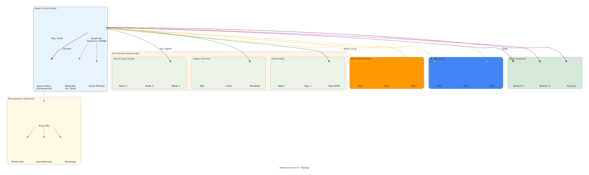

# Enterprise Governance and Deployment Patterns

## Overview

<details class="diagram-container">
<summary>View Diagram: Enterprise Arc Topology</summary>
<div class="diagram-content" markdown="1">


_Figure 1: Enterprise Azure Arc hub-spoke governance topology_

</div>
</details>

Large enterprises require proven patterns for deploying Azure Arc at scale while maintaining security, compliance, cost control, and operational excellence. This page covers the most successful enterprise governance models and their applications.

---

## Hub-and-Spoke Governance Model

The hub-and-spoke pattern is the most common enterprise governance model.

### Architecture

```text
                    ┌─────────────────┐
                    │   Hub            │
                    │ Management Group │
                    │  & Policies      │
                    └────────┬─────────┘
                             │
        ┌────────────────────┼────────────────────┐
        │                    │                    │
   ┌────▼──────┐      ┌──────▼──────┐     ┌──────▼──────┐
   │ Spoke 1    │      │ Spoke 2      │     │ Spoke 3     │
   │ Division A │      │ Division B   │     │ Division C  │
   │ 300 Arcs   │      │ 200 Arcs     │     │ 500 Arcs    │
   └────────────┘      └──────────────┘     └─────────────┘
```

### Governance Flow

1. **Central Hub** - Enterprise sets baseline policies
   - All Arc resources must have monitoring
   - Encryption enforcement
   - Tagging standards
   - Security baseline

2. **Spoke Inheritance** - Each division inherits hub policies
   - Policies automatically applied
   - Compliance enforced centrally
   - Reporting unified

3. **Spoke Override** - Divisions override policies as needed
   - Request exception for specific requirements
   - Approval workflow
   - Audit trail maintained

### Hub-and-Spoke Implementation

```powershell
# Create hub-and-spoke structure
$structure = @{
    RootManagementGroup = "Contoso-Enterprise"

    # Hub with baseline policies
    Hub = @{
        Name     = "Hub-Central-Governance"
        Policies = @(
            "Enforce-Monitoring",
            "Enforce-Encryption",
            "Enforce-Tagging",
            "Enforce-TLS-1.2"
        )
        Scope    = "All Hub child groups"
    }

    # Spokes inherit hub policies
    Spokes = @(
        @{
            Name     = "Sales-Division"
            Parent   = "Hub-Central-Governance"
            Policies = "Inherit all" # + Sales-specific policies
        },
        @{
            Name     = "Engineering-Division"
            Parent   = "Hub-Central-Governance"
            Policies = "Inherit all" # + Engineering-specific policies
        },
        @{
            Name     = "Finance-Division"
            Parent   = "Hub-Central-Governance"
            Policies = "Inherit all" # + Compliance-specific policies
        }
    )
}
```

### Benefits

- ✅ **Consistency** - Baseline policies enforced everywhere
- ✅ **Flexibility** - Divisions customize as needed
- ✅ **Scalability** - Add new divisions easily
- ✅ **Governance** - Central visibility and control
- ✅ **Cost** - Unified billing, but per-division breakdown

### Best For

- Multi-division enterprises
- Federated organizational structure
- Mix of centralized and decentralized decision-making
- Organizations with compliance requirements

---

## Multi-Cloud Federation Pattern

Manage Arc resources across multiple cloud providers with unified governance.

### Architecture

```text
┌────────────────────────────────────────────────────┐
│   Federation Control Plane                         │
│  • Unified Policy Evaluation                       │
│  • Centralized Compliance Reporting                │
│  • Cost Analysis across clouds                     │
│  • Security Posture Management                     │
└──────────────┬──────────────────────────────────┬─┘
               │                                  │
        ┌──────▼────────┐              ┌─────────▼──────┐
        │ Azure Region A │              │ AWS Region     │
        │ Arc Servers:30 │              │ Arc Servers:40 │
        │ Arc K8s: 5     │              │ Arc K8s: 8     │
        └────────────────┘              └────────────────┘
               │                                  │
        ┌──────▼──────┐              ┌──────────▼──────┐
        │ Azure Region│               │ GCP Region      │
        │ Arc Servers:│               │ Arc Servers:50  │
        │ Arc Data:10 │               │ Arc K8s: 10     │
        └─────────────┘               └─────────────────┘

Federation Features:
├─ Single policy evaluation across all clouds
├─ Unified monitoring and alerting
├─ Consolidated cost tracking
├─ Federated identity (single sign-on)
└─ Coordinated disaster recovery
```

### Federation Implementation

```powershell
# Define federated policy applied across clouds
$federatedPolicy = @{
    Name          = "Enterprise-Security-Baseline"
    AppliesTo     = @("Azure", "AWS", "GCP", "On-Premises")

    PolicyRules = @(
        @{
            Rule   = "Mandatory-Encryption"
            Clouds = "All"
            Effect = "Deny non-encrypted resources"
        },
        @{
            Rule   = "Mandatory-Tagging"
            Clouds = "All"
            Tags   = @("Owner", "CostCenter", "Environment")
        },
        @{
            Rule   = "Mandatory-Monitoring"
            Clouds = "All"
            Target = "Centralized Log Analytics"
        },
        @{
            Rule   = "Compliant-Regions"
            Clouds = "AWS/GCP"
            Regions = @("us-east-1", "eu-west-1", "asia-southeast-1")
        }
    )

    ComplianceReporting = @{
        Frequency = "Daily"
        Scope     = "All 4 clouds"
        Dashboard = "Enterprise-Federated-Compliance"
    }
}
```

### Federation Benefits

- ✅ **Unified Governance** - Same policies across all clouds
- ✅ **Avoid Vendor Lock-in** - Manage multi-cloud as single unit
- ✅ **Cost Optimization** - Unified cost visibility and allocation
- ✅ **Disaster Recovery** - Coordinated DR across clouds
- ✅ **Operational Excellence** - Single team, single processes

### Best For

- Multi-cloud enterprises
- Organizations committed to avoiding vendor lock-in
- Workloads that span multiple cloud providers
- Industries with specific cloud requirements (defense, healthcare)

---

## Zero-Trust Security Architecture

Implement zero-trust principles: "Never trust, always verify"

### Zero-Trust Principles for Arc

```text
Traditional Security:
Perimeter-based trust
├─ If you're inside network → trusted
├─ If you're outside network → untrusted
└─ Flat network = lateral movement risk

Zero-Trust Security:
Identity-based trust
├─ Every request evaluated individually
├─ Every identity verified
├─ Every action logged and monitored
└─ Least privilege always enforced
```

### Zero-Trust Implementation Layers

#### 1. Identity Verification

```powershell
# All Arc resource access requires identity verification
$identityVerification = @{
    AuthenticationMethod = @(
        "Service Principal with certificate",
        "Managed Identity",
        "Multi-Factor Authentication"
    )

    RenewalRequirements = @(
        "Certificates: Rotate every 90 days",
        "Tokens: Expire every 1 hour",
        "Credentials: MFA required every session"
    )
}
```

#### 2. Access Control (RBAC)

```text
Role-Based Access Control:
├─ Arc Reader: View resources only
├─ Arc Operator: Deploy/update/manage
├─ Arc Administrator: Full control
├─ Scope: Limited to necessary resources

Example:
├─ Developers: Arc Operator on Dev Arc resources
├─ Operations: Arc Operator on Prod Arc resources
├─ Security Team: Arc Reader on all Arc resources
```

#### 3. Network Security

```text
Network Zero-Trust:
├─ Private Endpoints: Secure connectivity to Azure
├─ Network Security Groups: Restrict traffic
├─ Azure Firewall: Centralized egress control
├─ VPN/ExpressRoute: Encrypt all connectivity
├─ No public IPs: All Arc management private

Example NSG Rules:
├─ Allow Arc API: 443/TCP from private subnet only
├─ Deny HTTP: All 80/TCP traffic
├─ Allow monitoring egress: Private endpoint only
└─ Deny all by default, allow specific
```

#### 4. Data Protection

```text
Data Protection Controls:
├─ Encryption at Rest: Mandatory AES-256
├─ Encryption in Transit: TLS 1.2 minimum
├─ Key Management: Azure Key Vault integration
├─ Secret Rotation: Automatic every 90 days

Certificate Pinning Example:
├─ Arc Agent validates Azure endpoint certificate
├─ Prevents Man-in-the-Middle attacks
├─ Certificate renewal automatic
```

#### 5. Threat Detection & Response

```text
Continuous Threat Detection:
├─ Monitor: All Arc resource access
├─ Detect: Anomalous behavior patterns
├─ Alert: Real-time security alerts
├─ Respond: Automated incident response

Alert Examples:
├─ Multiple failed auth attempts → Lock account
├─ Bulk resource deletion → Trigger approval
├─ Off-hours access → Require MFA re-auth
├─ Unexpected region access → Block + alert
```

### Zero-Trust Architecture Diagram

```text
Arc Resource Request
        │
        ▼
┌──────────────────────┐
│ 1. Identify          │
│ - Service Principal  │
│ - Managed Identity   │
│ - User Account       │
└──────┬───────────────┘
       │
       ▼
┌──────────────────────┐
│ 2. Authenticate      │
│ - Certificate valid? │
│ - Token valid?       │
│ - MFA passed?        │
└──────┬───────────────┘
       │
       ▼
┌──────────────────────┐
│ 3. Authorize         │
│ - RBAC check         │
│ - Policy evaluation  │
│ - Conditional access │
└──────┬───────────────┘
       │
       ▼
┌──────────────────────┐
│ 4. Encrypt           │
│ - TLS tunnel         │
│ - Data encrypted     │
│ - End-to-end secure  │
└──────┬───────────────┘
       │
       ▼
┌──────────────────────┐
│ 5. Audit             │
│ - Log all access     │
│ - Monitor behavior   │
│ - Alert anomalies    │
└──────┬───────────────┘
       │
       ▼
    Request Executed
```

---

## Disaster Recovery Patterns

### Active-Active Multi-Region

Both regions actively serving traffic:

```text
Primary Region (US-East)          Secondary Region (EU-West)
├─ 300 Arc servers                ├─ 300 Arc servers
├─ Active workloads               ├─ Active workloads
├─ Serving 50% traffic            ├─ Serving 50% traffic
└─ Real-time replication          └─ Real-time replication
         ↔ Continuous sync ↔
         RPO = ~5 minutes
         RTO = seconds (automatic failover)
```

### Active-Passive Multi-Region

Primary region active, secondary standby:

```text
Primary Region (US-East)          Secondary Region (EU-West)
├─ 500 Arc servers                ├─ 0 Arc servers (standby)
├─ All workloads active           ├─ Backup configurations ready
├─ Serving 100% traffic           ├─ Data replicated
└─ Hourly backup snapshots        └─ Waiting for failover
         ↓ Backup + Async replication ↓
         RPO = ~1 hour
         RTO = 15-30 minutes (manual failover)
```

### Implementation

```powershell
# Define DR architecture
$drArchitecture = @{
    Pattern         = "Active-Passive Multi-Region"
    PrimaryRegion   = "US-East"
    SecondaryRegion = "EU-West"

    # RPO/RTO Targets
    RPO             = "1 hour"
    RTO             = "30 minutes"

    # Replication
    ReplicationMethod = "Azure Site Recovery"
    ReplicationFreq   = "Every 1 hour"

    # Testing
    DRTests = @{
        Frequency = "Monthly"
        Duration  = "2 hours"
        Scope     = "Full regional failover"
        Success   = "RTO met in all tests"
    }
}
```

---

## Compliance Automation Pattern

Automate compliance for regulated industries:

```text
Compliance Requirements Automation:

Financial Services (PCI-DSS):
├─ Policy: Encryption mandatory
├─ Monitoring: Log all access
├─ Audit: Monthly compliance reports
└─ Remediation: Auto-remediate violations

Healthcare (HIPAA):
├─ Policy: Data residency enforcement
├─ Monitoring: HIPAA-compliant logging
├─ Audit: Audit trails immutable
└─ Remediation: Manual approval for exceptions

Government (FedRAMP):
├─ Policy: Sovereign cloud only
├─ Monitoring: 24/7 threat detection
├─ Audit: Real-time audit for compliance
└─ Remediation: Immediate isolation on violation
```

### Compliance Automation Architecture

```text
Compliance Requirements
        │
        ▼
Convert to Azure Policies
├─ Policy 1: Encryption
├─ Policy 2: Monitoring
├─ Policy 3: Tagging
└─ Policy 4: Residency
        │
        ▼
Deploy Policies to Arc
        │
        ▼
Continuous Evaluation
├─ Real-time compliance check
├─ Non-compliance detected → Alert
├─ Auto-remediation triggered
└─ Compliance dashboard updated
        │
        ▼
Monthly Compliance Report
├─ Audit trail
├─ Exceptions approved
├─ Historical trends
└─ Executive summary
```

---

## Cost Allocation Pattern

Charge back costs to business units:

```text
Enterprise Cost Structure:

Corporate (10%):
├─ Enterprise Arc licensing: $15K/month
├─ Central monitoring: $5K/month
└─ Security team: $20K/month

Sales Division (35%):
├─ CRM systems: $25K/month
├─ Analytics: $8K/month
└─ Sales tools: $12K/month

Engineering (40%):
├─ Development: $18K/month
├─ Testing: $10K/month
├─ Build systems: $12K/month
└─ Production: $40K/month

Finance (15%):
├─ ERP systems: $15K/month
├─ Data warehouse: $8K/month
└─ Compliance: $2K/month

Total: $190K/month
```

### Implementation Using Tags

```powershell
# Tag-based cost allocation
$costAllocationTags = @{
    "CostCenter" = @("Sales", "Engineering", "Finance", "Corporate")
    "Department" = @("DeptCode-100", "DeptCode-200", ...)
    "Project"    = @("Project-A", "Project-B", ...)
    "Environment"= @("Production", "Staging", "Development")
}

# Monthly cost analysis by cost center:
$costAnalysis = @{
    Sales      = $45000
    Engineering= $90000
    Finance    = $25000
    Corporate  = $30000
    ────────────────────
    Total      = $190000
}
```

---

## Best Practices Summary

### Governance

1. ✅ Start with hub-and-spoke or federation model
2. ✅ Implement policies incrementally (audit → enforce)
3. ✅ Regular policy reviews (quarterly)
4. ✅ Clear exception process with approval workflow
5. ✅ Centralized compliance reporting

### Security

1. ✅ Implement zero-trust architecture
2. ✅ Use Managed Identities where possible
3. ✅ Enforce encryption everywhere
4. ✅ Enable threat detection and response
5. ✅ Regular security audits and penetration testing

### Operations

1. ✅ Automated deployment with consistent configurations
2. ✅ Centralized monitoring and alerting
3. ✅ Runbooks for common scenarios
4. ✅ Regular DR testing
5. ✅ Automation for routine tasks

### Cost Management

1. ✅ Implement cost allocation and chargeback
2. ✅ Regular cost reviews and optimization
3. ✅ Reserve capacity for stable workloads
4. ✅ Right-size resources quarterly
5. ✅ Monitor cost anomalies

---

_Last Updated: October 21, 2025_
