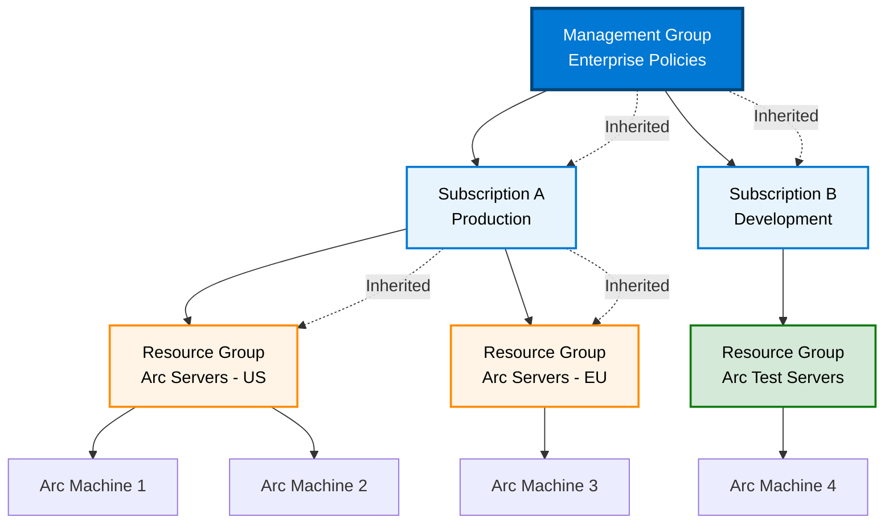

# Azure Policy and Governance for Arc

## Overview

<details class="diagram-container">
<summary>View Diagram: Policy Inheritance Flow</summary>
<div class="diagram-content" markdown="1">



_Figure 1: Azure Policy inheritance from management groups to Arc resources_

</div>
</details>

Azure Policy is the cornerstone of Arc governance at scale. This page covers how to design, deploy, and manage policies that enforce compliance, security, and operational standards across thousands of Arc-managed resources in hybrid and multi-cloud environments.

---

## Azure Policy Fundamentals

### Policy Structure

Every policy consists of:

1. **Policy Definition** - The rule that defines what is allowed or required
2. **Policy Effect** - The action taken when compliance is checked (Audit, Deny, DeployIfNotExists, Modify, Append)
3. **Policy Assignment** - The scope where the policy applies (management group, subscription, resource group)
4. **Policy Remediation** - The action to fix non-compliant resources

### Policy Effects for Arc

```text
Policy Effect     | Action                      | Use Case
────────────────────────────────────────────────────────────────────
Audit            | Log compliance violation    | Initial compliance review
Deny             | Block non-compliant action  | Critical security policies
DeployIfNotExists| Auto-deploy if missing     | Auto-configure extensions
Modify           | Auto-change resource       | Fix tags, encryption settings
Append           | Auto-add property          | Enforce tags on resources
```

### Example Policy: Enforce Monitoring Agent on Arc Servers

```powershell
# Policy: Deploy Azure Monitor Agent to all Arc servers
$policy = @{
    name       = "Enforce-Monitoring-Arc-Servers"
    displayName = "Deploy Azure Monitor Agent to Arc Servers"
    description = "Automatically deploys monitoring agent to Arc-managed servers"
    mode       = "Indexed"
    effect     = "DeployIfNotExists"

    # Condition: applies to Arc machines only
    condition = @{
        field  = "type"
        equals = "Microsoft.HybridCompute/machines"
    }

    # Existence: check if agent is already deployed
    existenceCondition = @{
        allOf = @(
            @{ field = "Microsoft.HybridCompute/machines/extensions/*/type"; equals = "Microsoft.Compute/virtualMachines/extensions" },
            @{ field = "Microsoft.HybridCompute/machines/extensions/*/name"; like = "AzureMonitorAgent*" }
        )
    }

    # Deployment: if agent missing, deploy it
    deployment = @{
        properties = @{
            mode      = "incremental"
            template  = @{
                apiVersion = "2019-05-01"
                type        = "Microsoft.HybridCompute/machines/extensions"
                name        = "[concat(parameters('vmName'), '/AzureMonitorAgent')]"
                location    = "[parameters('location')]"
                properties  = @{
                    publisher              = "Microsoft.Azure.Monitor"
                    type                   = "AzureMonitorWindowsAgent"
                    typeHandlerVersion     = "1.10"
                    autoUpgradeMinorVersion = true
                    enableAutomaticUpgrade = true
                }
            }
        }
    }
}
```

---

## Compliance Automation

### Compliance Dashboard

The Azure Policy compliance dashboard provides:

- **Compliance Percentage** - % of resources compliant with each policy
- **Non-Compliant Resources** - List of resources not meeting policy
- **Audit Results** - History of compliance changes
- **Remediation Progress** - Status of automatic and manual remediation

Example dashboard view:

```text
Policy Name                          | Compliant | Non-Compliant | Compliance %
─────────────────────────────────────────────────────────────────────────────
Enforce Encryption                   |   4,850   |     150       |    97.0%
Deploy Monitor Agent                 |   4,900   |     100       |    98.0%
Enforce TLS 1.2                      |   4,800   |     200       |    96.0%
Require Backup Configuration         |   4,750   |     250       |    95.0%
Enforce Mandatory Tags               |   4,650   |     350       |    93.0%
────────────────────────────────────────────────────────────────────────────
Enterprise Overall Compliance        |  23,950   |   1,050       |    95.8%
```

### Automated Remediation at Scale

#### Remediation Task Creation

```powershell
# Create remediation task for non-compliant resources
$remediationTask = @{
    Name                = "Remediate-Encryption-Arc-Servers"
    PolicyAssignmentId  = "/subscriptions/{subId}/providers/Microsoft.Authorization/policyAssignments/enforce-encryption"
    PolicyDefinitionId  = "/subscriptions/{subId}/providers/Microsoft.Authorization/policyDefinitions/enforce-encryption"
    ResourceCount       = 250  # Number of non-compliant resources
    FailureThreshold    = 0.05 # Fail if >5% of remediation attempts fail
    ParallelBatches     = 10   # Deploy in 10 parallel batches
    BatchSize           = 25   # 25 resources per batch
}

# Typical remediation timeline:
# T+0:00   - Remediation task starts
# T+0:15   - First batch of 25 resources begins remediation
# T+1:00   - All 10 batches deployed (250 resources total)
# T+5:00   - All resources verified as compliant
```

#### Handling Remediation Failures

Non-compliant resources that fail remediation:

1. **Retry** - Automatic retry with exponential backoff
2. **Alert** - Generate alert for IT team
3. **Manual Review** - Mark for manual investigation
4. **Escalate** - Escalate to security team if critical

```powershell
# Example: Policy remediation with retry logic
$remediationRetryPolicy = @{
    InitialRetryDelay   = "PT1M"      # Start with 1 minute
    MaxRetryDelay       = "PT1H"      # Cap at 1 hour
    RetryAttempts       = 5           # Try max 5 times
    CriticalFailAlert   = $true       # Alert on critical failures
    EscalationThreshold = 10          # Escalate if 10+ failures
}
```

---

## Audit and Monitoring

### Activity Log Integration

Track all policy-related changes:

```text
Activity Type      | Resource      | Action                    | Time
──────────────────────────────────────────────────────────────────
Policy Assignment  | Subscription  | Assignment created        | 10/21 09:00
Policy Remediation | Arc Server 1  | Encryption deployed       | 10/21 09:15
Compliance Check   | Arc Server 2  | Non-compliant detected    | 10/21 09:30
Policy Remediation | Arc Server 2  | Remediation started       | 10/21 09:45
Policy Remediation | Arc Server 2  | Remediation succeeded     | 10/21 10:00
```

### Reporting for Compliance & Audit

Generate compliance reports for:

- **Regulatory Compliance** - HIPAA, PCI-DSS, SOX, GDPR compliance status
- **Executive Dashboards** - High-level compliance metrics
- **Detailed Audit Reports** - Individual resource compliance history
- **Trend Analysis** - Compliance improvements over time

Example compliance report structure:

```text
═══════════════════════════════════════════════════════════
  MONTHLY COMPLIANCE REPORT - October 2025
═══════════════════════════════════════════════════════════

Overall Compliance: 95.8% (↑2.3% from September)

By Policy:
├─ Encryption Enforcement: 97.0% (↑1.5%)
├─ Monitoring Deployment: 98.0% (→ unchanged)
├─ TLS Version: 96.0% (↑0.5%)
├─ Backup Configuration: 95.0% (↓1.0%)
└─ Tagging: 93.0% (↑3.0%)

By Environment:
├─ On-Premises: 96.5% (450/467 compliant)
├─ AWS: 94.2% (28/30 compliant)
├─ GCP: 95.0% (19/20 compliant)
└─ Azure: 98.0% (49/50 compliant)

By Resource Type:
├─ Arc Servers: 95.2%
├─ Arc Kubernetes: 96.5%
└─ Arc Data Services: 98.0%

Action Items:
├─ 35 resources require manual remediation
├─ 15 policies need review for alignment
└─ 2 policies have unacceptable failure rates (>10%)

Recommendations:
├─ Investigate high failure rate on Backup Configuration policy
├─ Schedule policy update review for next quarter
└─ Increase monitoring for AWS Arc servers (lowest compliance)

═══════════════════════════════════════════════════════════
```

---

## Custom Policy Development

### Creating Organization-Specific Policies

Most organizations need policies specific to their requirements.

#### Policy for Sovereign Cloud Compliance

Example: All Arc servers in European sovereign clouds must have encryption enabled

```powershell
# Custom policy: Enforce encryption in sovereign clouds
$sovereignCloudEncryption = @{
    name              = "Enforce-Encryption-Sovereign-Clouds"
    displayName       = "Enforce Encryption on Arc Servers in Sovereign Clouds"
    description       = "Ensures all Arc servers in EU and Germany sovereign clouds have encryption"
    mode              = "Indexed"

    policyRule = @{
        if = @{
            allOf = @(
                @{ field = "type"; equals = "Microsoft.HybridCompute/machines" },
                @{
                    field = "location"
                    in    = @("westeurope", "germanywestcentral", "uknorth", "uksouth")
                },
                @{
                    field = "tags['sovereignty-required']"
                    equals = "true"
                }
            )
        }
        then = @{
            effect = "audit"
            details = @{
                type             = "Microsoft.HybridCompute/machines"
                evaluationDelay  = "AfterProvisioning"
                existenceCondition = @{
                    field  = "Microsoft.HybridCompute/machines/osProfile.encryptionAtRestEnabled"
                    equals = "true"
                }
            }
        }
    }
}
```

#### Policy for Financial Services - Data Residency

```powershell
# Custom policy: Restrict Arc resources to approved regions only
$dataResidencyPolicy = @{
    name        = "Restrict-Arc-To-Approved-Regions"
    displayName = "Arc Resources Must Be in Approved Regions"
    description = "Financial services: Arc servers only in pre-approved regions"
    mode        = "Indexed"

    policyRule = @{
        if = @{
            allOf = @(
                @{ field = "type"; equals = "Microsoft.HybridCompute/machines" },
                @{
                    field = "location"
                    notIn = @("eastus", "westus", "westeurope")
                }
            )
        }
        then = @{
            effect = "deny"
        }
    }
}
```

---

## Policy Initiatives (Policy Sets)

Group related policies into initiatives for easier management:

```text
Initiative: "Enterprise Security Baseline"
├─ Enforce Encryption
├─ Deploy Monitoring Agent
├─ Enforce TLS 1.2 or Higher
├─ Require Backup Configuration
├─ Enforce Mandatory Tags
└─ Deploy Antivirus Protection

Assigned to: Enterprise management group
Result: Entire enterprise automatically compliant with all 6 policies
```

### Initiative Benefits

1. **Simplicity** - Assign one initiative instead of 6 individual policies
2. **Consistency** - Ensure security baseline across entire organization
3. **Scalability** - Add new policies to initiative as requirements evolve
4. **Compliance Tracking** - Single compliance score for entire baseline

---

## Exemption Management

Sometimes resources need exceptions from policies:

```powershell
# Create policy exemption for specific resource
$exemption = @{
    PolicyAssignmentId = "/subscriptions/{subId}/providers/Microsoft.Authorization/policyAssignments/enforce-encryption"
    ResourceId         = "/subscriptions/{subId}/resourceGroups/{rgName}/providers/Microsoft.HybridCompute/machines/arc-server-test"
    ExemptionCategory  = "Mitigated"  # Waived, Mitigated, Expired
    DisplayName        = "Testing environment - temporary exemption"
    ExpiresOn          = "2025-12-31"
    Description        = "This test server needs encryption disabled for compatibility testing"

    # Record reason and approval
    ApprovedBy         = "security-team@contoso.com"
    Justification      = "Required for compatibility testing with legacy system"
}
```

---

## Policy Best Practices

### 1. Start with Audit, Progress to Enforcement

```text
Phase 1 (Month 1-2):     Audit Mode - Identify non-compliant resources
                         ↓
Phase 2 (Month 2-3):     DeployIfNotExists - Auto-remediate where possible
                         ↓
Phase 3 (Month 3-4):     Deny Mode - Block non-compliant deployments
```

### 2. Test Policies Before Enterprise Rollout

1. Deploy policy to test resource group
2. Monitor for 1-2 weeks
3. Verify expected behavior
4. Adjust policy if needed
5. Roll out to enterprise scope

### 3. Version and Document Policies

Maintain policy versioning:

```powershell
# Policy naming convention
{PolicyCategory}-{Purpose}-{Version}

Examples:
- Security-Enforce-Encryption-v1
- Compliance-Deploy-Monitoring-v2
- Cost-Restrict-VM-Sizes-v3
```

### 4. Regular Policy Review

- **Quarterly:** Review policy effectiveness
- **Semi-Annually:** Assess if policies meet evolving requirements
- **Annually:** Complete policy audit and update initiative baseline

---

## Common Policy Patterns for Arc

### Pattern 1: Mandatory Extension Deployment

Deploy required extensions to all Arc servers automatically:

```text
Policy: DeployIfNotExists
Effect: Automatically deploy Azure Monitor Agent, Antivirus, Update Manager
Result: 100% of Arc servers have required extensions within 24 hours
```

### Pattern 2: Tag Enforcement

Require specific tags on all Arc resources:

```text
Required Tags:
├─ Environment: (prod, staging, dev)
├─ CostCenter: (department code)
├─ Owner: (email address)
└─ DataClassification: (public, internal, confidential)

Policy: DeployIfNotExists + Modify
Result: All resources properly tagged for chargeback and cost allocation
```

### Pattern 3: Encryption Enforcement

Ensure all Arc servers have encryption:

```text
Policy: DeployIfNotExists for encryption configuration
        Modify to enforce encryption settings
Result: All Arc servers encrypted within compliance window
```

---

## Troubleshooting Non-Compliant Resources

### Investigation Steps

1. **Identify** - Find non-compliant resource in Policy dashboard
2. **Analyze** - Check why resource is non-compliant
3. **Investigate** - Review resource configuration and logs
4. **Resolve** - Either remediate or create exemption
5. **Prevent** - Update policy to prevent future occurrences

### Common Issues

**Issue:** Policy evaluates but remediation fails

_Solution:_ Check service principal permissions, extension dependencies, network connectivity

**Issue:** Resource becomes compliant after deployment

_Solution:_ Policy may have been auto-remediated by another policy or manual action

**Issue:** Policy too restrictive, blocking legitimate deployments

_Solution:_ Review policy conditions, consider exemptions, or adjust policy parameters

---

## Next Steps

1. Review your organization's compliance requirements
2. Map requirements to specific Azure Policies
3. Start with audit-mode policies to establish baseline
4. Gradually progress to enforcement-mode policies
5. Establish regular policy review cadence

---

_Last Updated: October 21, 2025_
