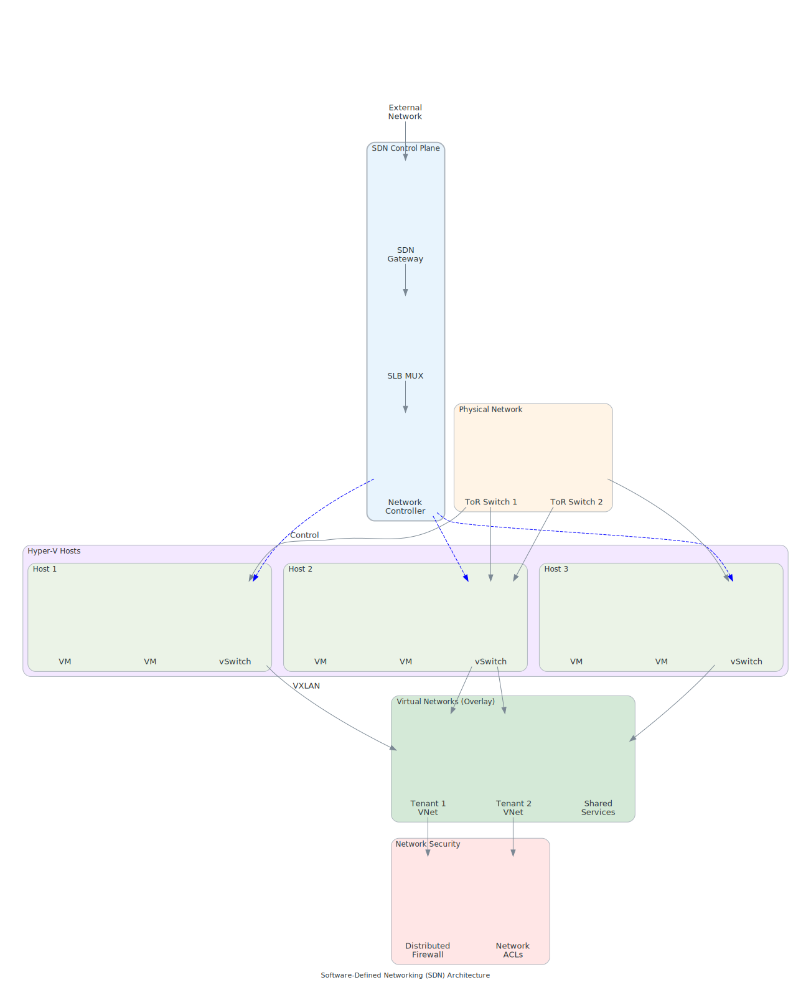

# Advanced Networking

Network design significantly impacts Azure Local performance and reliability. This section covers advanced networking patterns used in enterprise deployments.

<details class="diagram-container">
<summary>View Diagram: Software-Defined Networking Architecture</summary>
<div class="diagram-content">


_Figure 1: Azure Local Software-Defined Networking (SDN) architecture_

</div>
</details>

## Switch Embedded Teaming (SET)

Modern Azure Local deployments use SET for network adapter redundancy and performance.

### Basic Concepts

**What is SET?**

- Virtual switch-based teaming (replaces older NIC teaming)
- Hardware-independent
- Built into Hyper-V switch
- Supports bandwidth aggregation and failover

**Teaming Modes:**

- **Switch-Independent:** Each team member operates independently
- **LACP (Link Aggregation Control Protocol):** Coordinated with physical switch
- **Static:** Simplified LACP without negotiation

### Configuration

**Creating SET Teams:**

```powershell
New-VMSwitch -Name "ConvergedSwitch" -NetAdapterName @("NIC1", "NIC2") `
  -AllowManagementOS $true -EnableEmbeddedTeaming $true

Set-VMSwitch -Name "ConvergedSwitch" -DefaultFlowMinimumBandwidthWeight 20
```

**Benefits:**

- Automatic failover (sub-second)
- Load balancing across adapters
- No special switch configuration needed (switch-independent mode)
- Native Hyper-V integration

## VLAN Configuration

VLANs logically separate network traffic without physical separation.

### VLAN Planning

**Management VLAN:**

- Management OS network
- Azure Local system management
- Out-of-band connectivity
- Typical: VLAN 100-199 range

**Storage VLAN:**

- Storage Spaces Direct replication
- RDMA-optimized
- Ultra-low latency requirement
- Typical: VLAN 200-299 range

**Cluster VLAN:**

- Inter-node cluster communication
- Heartbeat and status monitoring
- Moderate latency tolerance
- Typical: VLAN 300-399 range

**Customer VLANs:**

- Virtual machine workload networks
- One or more per tenant
- Isolated for security
- Typical: VLAN 400-4000 range

### VLAN Tagging

**Physical Port Configuration:**

```text
Physical NIC 1 → Untagged (Native) VLAN 100 (management)
Physical NIC 2 → Tagged VLAN 200, 300, 400-420
Physical NIC 3 → Tagged VLAN 200 (storage redundancy)
```

**Virtual Port Configuration:**

```powershell
# Management virtual NIC (on management OS)
Add-VMNetworkAdapter -ManagementOS -Name "Management" -SwitchName "ConvergedSwitch" -Vlan 100

# Storage virtual NIC
Add-VMNetworkAdapter -ManagementOS -Name "Storage" -SwitchName "ConvergedSwitch" -Vlan 200

# Cluster virtual NIC
Add-VMNetworkAdapter -ManagementOS -Name "Cluster" -SwitchName "ConvergedSwitch" -Vlan 300
```

## RDMA Optimization

RDMA (Remote Direct Memory Access) enables high-performance storage communication.

### iWARP vs. RoCE

**iWARP (Recommended for Most):**

- Works over standard Ethernet
- No special switch requirements
- Lower latency than TCP/IP
- Easier to troubleshoot
- Supported by most vendors

**RoCE (Higher Performance):**

- More complex setup
- Requires Priority Flow Control (PFC)
- Congestion management (ECN)
- Lower latency than iWARP
- Requires network expertise

### RDMA Configuration

**Prerequisites:**

- Network adapter supporting RDMA (Mellanox, Intel, Chelsio, etc.)
- Latest drivers installed
- Network properly segmented (no congestion)
- Quality of Service configured

**Enable RDMA:**

```powershell
Enable-NetAdapterRdma -Name "Storage"
Get-NetAdapterRdma -Name "Storage" | Select-Object Name, RdmaVersion, Enabled
```

**Verify Performance:**

```powershell
# Run RDMA test
ntttcp -r -m 16,*, 10.0.20.5 -x -t 30 -l 100000 -tcp
```

## Quality of Service (QoS)

QoS ensures critical traffic (storage) maintains performance even under heavy load.

### QoS Policies

**Priority Levels:**

```text
Priority 7 (Highest): Storage traffic (RDMA)
Priority 6: Cluster heartbeat
Priority 5: Management
Priority 1-4: Customer workload traffic
Priority 0 (Lowest): Best-effort background
```

**Configuration:**

```powershell
# Create storage priority policy
New-NetQosPolicy -Name "Storage" -VlanTag 200 -PriorityValue 7 -PolicyDirection Both

# Create cluster priority policy
New-NetQosPolicy -Name "Cluster" -VlanTag 300 -PriorityValue 6 -PolicyDirection Both
```

### Bandwidth Allocation

**Per-Virtual NIC:**

```powershell
# Minimum guarantee for management
Set-VMNetworkAdapterBandwidthLimit -ManagementOS -VMNetworkAdapterName "Management" `
  -MinimumBandwidthAbsolute 100Mbps

# Minimum guarantee for storage
Set-VMNetworkAdapterBandwidthLimit -ManagementOS -VMNetworkAdapterName "Storage" `
  -MinimumBandwidthAbsolute 1Gbps
```

## Network Performance Monitoring

### Key Metrics

**Latency:**

- Storage network: < 500 microseconds ideal
- Management network: < 1 millisecond acceptable
- Cluster network: < 5 milliseconds

**Throughput:**

- Storage: 20-25 Gbps typical utilization (25 Gbps line)
- Management: < 1 Gbps typical
- Cluster: < 1 Gbps typical

**Packet Loss:**

- Target: < 0.001% (1 in 100,000)
- Monitor: Use network switch counters

### Monitoring Tools

**PowerShell Cmdlets:**

```powershell
# Network adapter statistics
Get-NetAdapterStatistics -Name "Storage"

# Virtual switch port statistics
Get-VMSwitchExtensionPortFeature -SwitchName "ConvergedSwitch"

# Live migration/storage performance
Get-StorageJob | Select-Object Name, PercentComplete, BytesProcessed
```

**Performance Monitor Counters:**

- Hyper-V Virtual Network Adapter (bytes sent/received)
- Network Interface (packets/sec, errors)
- Storage (I/O latency, queue depth)

## Multi-Path I/O (MPIO)

MPIO provides redundant paths for storage access.

### Configuration

**Supported Storage Types:**

- Fibre Channel SANs
- iSCSI targets (rarely used with Azure Local)
- Parallel SCSI (legacy)

**Note:** Azure Local Storage Spaces Direct doesn't require MPIO (built-in redundancy via mirrors).

## Network Troubleshooting

### Common Issues and Solutions

**High Storage Latency:**

- Check for network congestion (use Performance Monitor)
- Verify RDMA enabled on all adapters
- Check for VLAN configuration errors
- Verify QoS policies in place

**Intermittent VM Connectivity:**

- Check for packet loss on network path
- Verify no VLAN tag mismatches
- Check physical switch spanning-tree convergence
- Monitor for network timeouts in cluster events

**Storage Rebuild Slow:**

- Check network saturation
- Verify no concurrent heavy workloads
- Consider network bandwidth bottleneck
- Review storage latency

---

## Key Takeaways

1. **Network Segmentation:** Use VLANs for logical separation
2. **Redundancy:** Team adapters for automatic failover
3. **Performance:** Enable RDMA and QoS for storage traffic
4. **Monitoring:** Track latency, throughput, and packet loss
5. **Troubleshooting:** Start with connectivity, then performance
