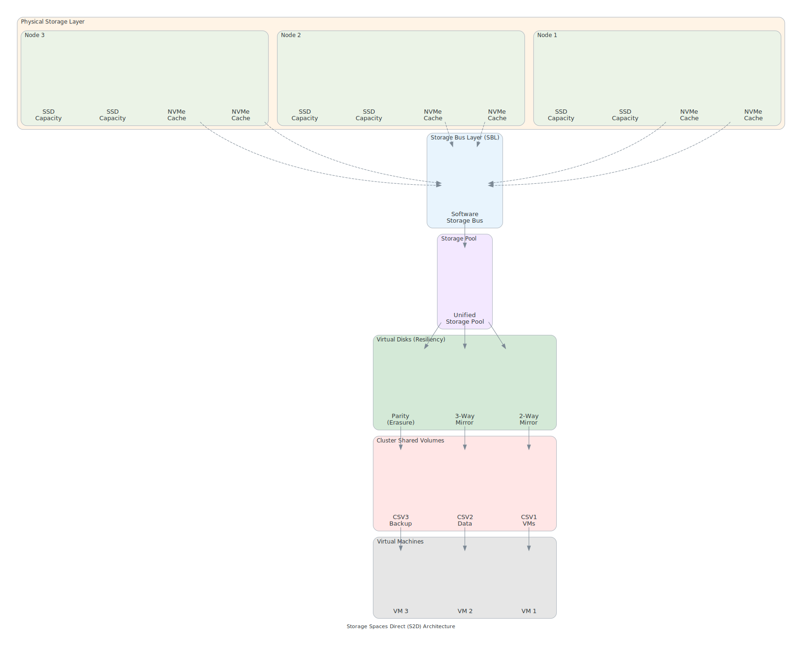

## Overview

{: .note }
> ⏱️ **Reading Time:** 30-40 min | 🎯 **Key Topics:** S2D, SDN, cluster architecture, capacity planning | 📋 **Prerequisites:** [Azure Local Overview](../level-100/azure-local-overview.md)

Building on the foundational knowledge from Level 100 Module 3 (Azure Local Overview), this module explores the advanced technical architecture of Azure Local systems. This deep dive is designed for technical professionals and solutions architects who need to plan, deploy, and optimize production Azure Local environments.

This module covers:

- Complete system architecture from hardware through management layers
- Network and storage design patterns for enterprise deployments
- High availability and disaster recovery strategies
- Advanced hardware planning and capacity optimization
- Real-world deployment patterns for organizations of all sizes

**Prerequisites:** You should have completed Level 100, particularly Module 3 (Azure Local Overview). Familiarity with Hyper-V, Windows Server, and enterprise networking concepts is recommended.

---

## Complete System Architecture

<details class="diagram-container">
<summary>View Diagram: Storage Spaces Direct Architecture</summary>
<div class="diagram-content">


_Figure 1: Storage Spaces Direct (S2D) architecture with tiering and resiliency_

</div>
</details>

Azure Local's architecture can be understood through four interconnected layers, each designed to work together seamlessly.

### Hardware Layer

The foundation of Azure Local starts with carefully selected, enterprise-grade hardware:

**CPU Architecture:**

- Modern multi-core processors (3rd Gen Intel Xeon or AMD EPYC)
- NUMA architecture for optimal memory access
- CPU core allocation split between control plane and compute workloads
- Typically 48-64 cores per node for production deployments
- Hyper-threading enabled for increased VM density

**Memory Architecture:**

- DDR5 memory for latest hardware generation (older systems support DDR4)
- Typical configurations: 256 GB - 1 TB per node
- ECC memory required for data integrity
- Memory divided between host OS and VM workloads
- Proper NUMA alignment critical for performance

**Storage Subsystem:**

- NVMe drives for ultra-low latency cache
- SSD capacity for primary storage (typically 800GB - 2TB per drive)
- HDD archive tier for long-term retention (optional, 2-10TB per drive)
- Minimum of 4 drives per node for redundancy
- PCIe lanes configured for maximum throughput

**Network Adapters:**

- Multiple 25Gbps or 100Gbps adapters (depending on workload)
- Typically 2-4 adapters per node for segmentation
- One management adapter (out-of-band connectivity)
- Storage adapters supporting RDMA (iWARP or RoCE)
- Cluster communication adapters for high-speed inter-node traffic

### Virtualization Layer

The hypervisor layer provides isolated, secure environments for workloads:

**Hyper-V Architecture:**

- Type 1 hypervisor for maximum efficiency
- Partition 0 (management) runs Windows Server 2022 or 2025
- Partition N (child partitions) run customer workloads
- Virtual switching for flexible network topologies
- Integration with Storage Spaces Direct (S2D)

**VM Networking:**

- Virtual switching supporting various network modes
- Hyper-V network virtualization (HNVE) for multi-tenant isolation
- Virtual NIC pass-through for high-performance requirements
- RDMA passthrough for data-intensive workloads

**Storage Virtualization:**

- Virtual disks (VHDX format) for VM storage
- Pass-through disks for specialized workloads
- Shared disks for cluster-aware applications
- Snapshot capabilities for backup and recovery

### Azure Local System Layer

The platform software provides management and orchestration:

**Control Plane:**

- Azure Local system services running on all nodes
- Distributed fault-tolerant design
- Automatic health monitoring and remediation
- REST API for programmatic access
- PowerShell for automation

**Data Plane:**

- Compute workload execution
- Storage I/O processing
- Network traffic handling
- Completely isolated from control plane for resilience

**Storage Spaces Direct (S2D):**

- Distributed storage providing shared pool
- Automatic fault tolerance (2-way mirror, 3-way mirror, parity)
- Cache tier management (RAM → SSD → HDD)
- Capacity distribution across cluster nodes

### Management and Orchestration Layer

Enterprise-grade management capabilities:

**Azure Local System UI:**

- Web-based dashboard for cluster monitoring
- VM lifecycle management (create, start, stop, delete)
- Storage pool and volume management
- Network configuration
- Update and patch management

**PowerShell Management:**

- Complete automation capability
- ClusterShell module for cluster operations
- StorageSpacesDirect cmdlets for storage management
- VM management through Hyper-V module

**Azure Arc Integration:**

- Hybrid server management
- Azure Policy enforcement
- Centralized monitoring and alerting
- Patch management across hybrid environment
- Single pane of glass for multi-site deployments

---

## Network Architecture

Network design is critical for Azure Local performance and reliability. Most production deployments use a converged network architecture with logical segmentation through VLANs.

### Network Segments

**Management Network:**

- Out-of-band management connectivity
- Separate from data traffic
- Bandwidth: 1 Gbps per node typically sufficient
- Low latency requirements (< 1ms)
- Dedicated gateway for secure access

**Storage Network:**

- High-speed fabric for S2D communication
- RDMA-capable (iWARP or RoCE preferred)
- Bandwidth: 25 Gbps or 100 Gbps per node
- Ultra-low latency critical (< 0.5ms)
- Redundant paths required

**Cluster Network:**

- Inter-node cluster heartbeat
- Bandwidth: 10 Gbps minimum, 25 Gbps recommended
- Latency requirements: < 5ms acceptable
- Must have redundancy

**Customer/Workload Network:**

- Virtual machine traffic to external clients
- Bandwidth requirements depend on workload
- Multiple VLANs for tenant isolation
- Quality of Service (QoS) for traffic management

### Network Design Patterns

**Converged Networking (Recommended):**

- Single set of physical adapters with logical segmentation
- More cost-effective than separate adapters
- Requires careful QoS configuration
- Works well for most deployments

**Separate Physical Networks:**

- Dedicated adapters for each network type
- Higher resilience and performance isolation
- More expensive but clearer operational model
- Often used in large enterprise deployments

### Bandwidth Calculations

For a 3-node cluster with 500 GB storage and typical workloads:

- Management: 50 Mbps average, 500 Mbps during updates
- Storage: 3-5 Gbps depending on workload type
- Cluster: 100 Mbps average (spikes during failures)
- Workload: Depends on customer requirements (1-10+ Gbps)

**Rule of thumb:** Size management links at 1-2 Gbps per node, storage links at 25 Gbps minimum, cluster links at 10-25 Gbps.

### VLAN Strategy

```text
Physical Port 1 (Mgmt) → VLAN 100 (Management)
Physical Port 2 (Converged) → VLAN 200 (Storage) + VLAN 300 (Cluster) + VLAN 400-420 (Customer VMs)
Physical Port 3 (Backup) → VLAN 200 (Storage backup path)
```

---

## Storage Architecture

### Storage Pool Architecture

Azure Local creates a distributed storage pool across all cluster nodes:

**Single Storage Pool Model:**

- All nodes participate in shared storage pool
- Automatic distribution of data across nodes
- Provides resilience to node failures
- Typical capacity: 2-20 TB per node

**Multi-Pool Model (Advanced):**

- Separate pools for different SLA tiers
- Useful for performance segregation
- Rare in smaller deployments

### Cache Hierarchy

Storage performance depends on intelligent cache management:

**Tier 1 - RAM Cache:**

- 10-20 GB reserved per node for hot data
- Lowest latency (< 1 microsecond)
- Survives node restart but not power loss
- Managed automatically

**Tier 2 - NVMe/SSD Cache:**

- Read-write cache in NVMe (if present) or SSD
- Read-only cache in SSD (if NVMe absent)
- Latency: 100-200 microseconds
- Persistent across power cycles
- 10-50x larger than RAM cache

**Tier 3 - Capacity Tier:**

- SSD primary storage (1-2 TB per node)
- HDD archive tier (optional, 2-10 TB per node)
- Latency: 1-10 milliseconds
- All data stored here eventually

### Storage Resilience Models

**2-Way Mirror:**

- Data stored on exactly 2 nodes
- Survives 1 node failure
- Overhead: 50% (1 TB data = 2 TB storage)
- Minimum 2 nodes required
- Recommended for non-critical workloads

**3-Way Mirror:**

- Data stored on 3 nodes
- Survives 2 simultaneous node failures
- Overhead: 67% (1 TB data = 3 TB storage)
- Minimum 3 nodes required
- Recommended for production critical

**Parity (Dual Parity):**

- Data + parity stored using RAID-like algorithm
- Survives 2 failures with lower overhead
- Overhead: 50% (1 TB data = 2 TB storage equivalent)
- Lower performance than mirrors
- Recommended for archival data

### Capacity Planning Example

For 3-node cluster with 2 TB SSD per node + 1 TB NVMe cache:

```text
Raw storage: 3 nodes × 2 TB = 6 TB
With 3-way mirror: 6 TB ÷ 3 = 2 TB usable
Available for VMs: ~1.8 TB (accounting for OS and system)
```

---

## Deployment Patterns

### Single-Node Deployment

**Use Case:** Proof of concept, testing, development

**Hardware Requirements:**

- Single server with minimum 256 GB RAM, 8 cores
- Local NVMe or SSD storage
- Sufficient power supply

**Characteristics:**

- No high availability
- Storage resilience limited to backup/restore
- Useful for evaluating capabilities
- Limited to single failure domain

**When to Use:**

- Pilot projects
- Development/testing environments
- Technology evaluation
- Edge scenarios with single server

### 2-Node Cluster

**Use Case:** High availability with moderate redundancy

**Hardware Requirements:**

- Two identical or similar servers
- Shared storage fabric (converged network)
- File share witness or cloud witness for quorum

**Characteristics:**

- Survives 1 node failure
- 2-way mirror storage resilience
- Active-active or active-passive deployment
- Lower cost than 3-node

**Challenges:**

- Both nodes must be healthy for quorum (no split-brain scenario)
- Witness requirement adds operational complexity
- Limited failure scenarios

### 3-Node Cluster (Production Standard)

**Use Case:** Production deployments with enterprise resilience

**Hardware Requirements:**

- Three identical servers
- Enterprise-grade network (25 Gbps+ storage)
- Distributed or converged networking

**Characteristics:**

- Survives 1 automatic node failure
- 3-way mirror storage possible
- Node quorum by majority (no witness needed, though recommended)
- Auto-remediation capabilities

**Advantages:**

- Industry standard for production
- Strong resilience properties
- Self-healing through automatic recovery
- Scales well to moderate sizes

### 4+ Node Clusters

**Use Case:** Large deployments, multi-site scenarios

**Hardware Requirements:**

- 4-10 identical servers per cluster
- High-speed fabric (100 Gbps storage network)
- Sophisticated network architecture

**Characteristics:**

- Multiple simultaneous failures survivable
- Larger storage capacity
- Scale-out compute
- Multi-site active-active possible

**Federation:**

- Multiple clusters managed together
- Each cluster independent but coordinated
- Useful for large enterprises with multiple locations
- Centralized management through Azure Arc

---

## High Availability & Disaster Recovery

### Failure Domains

Resilience design requires understanding failure modes:

**Node Failure:**

- Single node stops responding
- Workloads migrate to surviving nodes
- Storage automatically recovers from mirrors
- Typical recovery time: 5-15 minutes

**Network Segment Failure:**

- Network partition between cluster nodes
- Quorum mechanism prevents split-brain
- Nodes without quorum shut down
- Manual intervention typically required

**Storage Failure:**

- Loss of individual drive
- Replaced by spare or new drive
- Data automatically reconstructed
- Temporary performance impact

**Entire Site Failure:**

- Complete data center loss
- Requires multi-site setup
- Manual failover or automatic replication
- RTO/RPO depends on configuration

### Quorum Strategies

**Node Quorum (2 or 3 nodes):**

- Majority of nodes decides cluster health
- 3-node cluster needs 2 healthy nodes
- No external witness required
- Automatic decision making

**File Share Witness (2-node clusters):**

- External file share provides tiebreaker
- Allows automatic failover in 2-node setup
- Requires management infrastructure
- Cloud witness available for cloud-based deployments

**Cloud Witness:**

- Azure Storage account provides witness
- No on-premises infrastructure needed
- Latency consideration for quorum decisions
- Suitable for hybrid/cloud scenarios

### Failover Mechanisms

**Automatic VM Failover:**

- VM on failed node restarts on survivor
- Typically transparent to clients
- Storage state preserved through mirrors
- Network may briefly interrupt

**Storage Rebuild:**

- Failed node's storage mirrors rebuilt
- Automatic process starting immediately
- Significant I/O activity during rebuild
- Requires spare capacity on surviving nodes

**Application-Aware Failover:**

- Cluster-aware applications (SQL Server, etc.)
- Database-level recovery
- Requires application support
- More complex but optimized behavior

### Backup and Restore

**VM-Level Backup:**

- Snapshot-based backups
- App-consistent or crash-consistent
- Stored on separate storage
- Faster recovery for single VM loss

**Cluster-Level Backup:**

- Configuration backup for cluster
- Not substitute for data backup
- Contains cluster settings only
- Used for disaster recovery planning

**Replication-Based DR:**

- Real-time or scheduled replication to secondary site
- Automatic or manual failover
- Various RTO/RPO objectives possible
- Higher cost but near-zero data loss

### RTO/RPO Targets

**Typical Recovery Objectives:**

```text
Single Node Failure:
  RTO: 5-15 minutes (automatic)
  RPO: 0 minutes (no data loss with mirrors)

Multi-Node Failure:
  RTO: 30 minutes - hours (depends on recovery strategy)
  RPO: Depends on backup/replication configuration

Complete Site Loss:
  RTO: 1 hour - days (depends on multi-site setup)
  RPO: 1 hour - depends on replication lag
```

---

## Customer Scenarios

### Scenario 1: Large Manufacturing Enterprise (3-Node Cluster)

**Organization Profile:**

- 1,200 employees across three facilities
- Critical production planning and MES (Manufacturing Execution System) workloads
- Existing SAP ERP system running in traditional datacenter
- Mixed Windows and Linux workloads

**Current Challenge:**

- Aging datacenter infrastructure (15-year-old servers)
- RTO requirement: 30 minutes for critical workloads
- Cannot tolerate data loss for production systems
- Need for edge intelligence at manufacturing lines
- Existing 10 Gbps datacenter connectivity

**Azure Local Solution:**

- Deploy single 3-node Azure Local cluster in facility 1 (company headquarters)
- Host Azure Kubernetes Service (AKS) for containerized edge services
- VM containers for SAP workload testing and development
- Real-time production data aggregation and analysis

**Technical Architecture:**

```text
Headquarters (3-node cluster):
  - Production planning system (2 VMs, HA)
  - Real-time analytics (Kubernetes cluster)
  - Database tier (SQL Server 2022 on VMs)

Network:
  - 25 Gbps management network to HQ datacenter
  - Local 100 Gbps SAN for storage
  - Two internet paths for Arc connectivity

Storage:
  - 3-way mirror for critical database (2 TB)
  - 2-way mirror for analytics (1 TB)
  - Parity for test/dev (2 TB)
  - Total: ~3.3 TB usable
```

**Expected Outcomes:**

- Reduced infrastructure costs 40% within 3 years
- Improved RTO from 2 hours to 15 minutes
- Zero data loss for critical systems (3-way mirror)
- Simplified operations through unified management
- Discovery Questions for Sales:
  - What's your current RTO for production systems?
  - Do you have infrastructure at multiple sites?
  - What's the typical size of your VMs?
  - How important is data locality for compliance?

---

### Scenario 2: Financial Services (2-Node Active-Passive)

**Organization Profile:**

- Regional bank with 50 branches
- Regulatory requirements: SOC 2 Type II compliance
- Trading systems requiring sub-second latency
- Data residency requirements (must stay in-country)

**Current Challenge:**

- Current datacenter at 85% capacity
- Cannot expand existing building
- Regulatory audit requires documented disaster recovery
- Branch IT infrastructure aging and expensive to maintain
- Sub-second latency needed for trading desk

**Azure Local Solution:**

- Deploy 2-node cluster in HQ as primary (active)
- 2-node cluster in secondary location as standby (passive)
- Real-time replication between sites
- Automatic failover with 5-minute RTO

**Technical Architecture:**

```text
Primary (2-node, Active):
  - Trading systems (2 VMs)
  - Branch connectivity hub
  - Active database replica

Secondary (2-node, Passive):
  - Standby replicas with automated failover
  - Real-time database replication (synchronous)
  - Cross-site network latency < 5ms

Network:
  - 100 Mbps replication link
  - Separate quorum witness in cloud (Azure Storage)
  - Dedicated trading network (isolated VLAN)

Storage:
  - 2-way mirror on both sites (high performance)
  - Synchronous replication for zero RPO
```

**Expected Outcomes:**

- Regulatory compliance verified and documented
- Disaster recovery tested quarterly
- Sub-second trading latency maintained
- Infrastructure cost savings from consolidation
- Discovery Questions for Sales:
  - What are your compliance mandates?
  - What's your acceptable RTO and RPO?
  - Do you need geo-redundancy?
  - What latency SLAs do you need to meet?

---

### Scenario 3: Healthcare System (4-Node + Geo-Redundancy)

**Organization Profile:**

- Large hospital network (5 hospitals, 20 clinics)
- HIPAA compliance required
- PACS (Picture Archiving and Communication System) workloads
- Electronic health records mission-critical

**Current Challenge:**

- Compliance with state data residency laws
- Must survive datacenter failure
- Patient data cannot leave state
- Growing storage needs for medical imaging
- HIPAA audit requirements

**Azure Local Solution:**

- Deploy 4-node cluster in Hospital A (Site 1)
- Deploy 3-node cluster in Hospital B (Site 2)
- Asynchronous replication between sites with 1-hour RPO
- Centralized management through Azure Arc

**Technical Architecture:**

```text
Hospital A (4-node, Primary):
  - PACS primary database (3-way mirror, 10 TB)
  - EHR system (3-way mirror, 5 TB)
  - Backup tier (parity, 20 TB archive)

Hospital B (3-node, Secondary):
  - Asynchronous replicas with 1-hour lag
  - Local patient care workloads
  - Automated backup storage

Network:
  - 1 Gbps dedicated replication circuit
  - Hospitals connected via healthcare-grade network
  - Separate VLAN for PACS (low-latency requirement)

Storage Tiers:
  - Hot: Patient data accessed < 30 days (SSD)
  - Warm: Historical imaging < 2 years (archive)
  - Cold: Compliance hold > 2 years (archive only)
```

**Expected Outcomes:**

- HIPAA compliance matrix completed
- Disaster recovery capability for entire health system
- Imaging retrieval < 2 seconds (no geographic delay)
- Storage costs reduced 35% vs. traditional SAN
- Discovery Questions for Sales:
  - What's your data residency requirement?
  - How much medical imaging storage needed?
  - What's your tolerance for replication lag?
  - Do you have multiple facilities to connect?

---

### Scenario 4: Research Institute (Single Node POC)

**Organization Profile:**

- University research center
- 80 researchers and 200 graduate students
- Compute-intensive workloads (AI, simulation)
- Limited IT infrastructure budget

**Current Challenge:**

- Aging HPC cluster (7 years old)
- Difficult to scale for new research projects
- Limited storage for research data
- Cannot justify capital expenditure for new infrastructure
- Need flexibility for different research needs

**Azure Local Solution:**

- Deploy single-node Azure Local system for POC
- Prove concept before multi-node investment
- Containerized research applications via AKS
- Direct local storage for research data

**Technical Architecture:**

```text
Single Node Server:
  - 48 cores, 512 GB RAM
  - 4 TB SSD storage
  - Local backup to external storage

Deployment:
  - Ubuntu Linux on Hyper-V
  - Kubernetes cluster (3 pods)
  - Jupyter notebook servers
  - GPU pass-through (if available)

Network:
  - 10 Gbps connection to research network
  - Direct access to university data repository
```

**Expected Outcomes:**

- Rapid POC completion (3 months)
- Reduced compute time by 40% vs. old HPC
- Flexible resource allocation for different projects
- Clear path to 3-node production system
- Discovery Questions for Sales:
  - What types of research workloads?
  - How many simultaneous projects?
  - Storage growth trajectory?
  - Is this a precursor to larger deployment?

---

### Scenario 5: Retail Chain (3-Node Clusters at Multiple Locations)

**Organization Profile:**

- 250-store retail chain (US-based)
- Point of sale, inventory, and customer analytics
- Corporate HQ with central IT
- Store connectivity via corporate VPN

**Current Challenge:**

- Store infrastructure aged and difficult to manage remotely
- Internet connectivity variable across stores
- Inventory sync must be real-time
- Corporate compliance and security requirements
- Want edge capabilities for in-store analytics

**Azure Local Solution:**

- Deploy 3-node Azure Local clusters at 10 regional distribution centers (RDCs)
- Each RDC cluster serves 25 nearby stores
- Sync inventory every 15 minutes to HQ
- Local POS redundancy per RDC

**Technical Architecture:**

```text
Regional Distribution Center (3-node):
  - Point of Sale systems (VM cluster)
  - Inventory database (SQL Server)
  - Local Kubernetes for analytics

Store Connectivity:
  - Stores connect to nearest RDC (local latency)
  - Heartbeat to corporate HQ
  - Failover to secondary RDC if primary fails

Data Flow:
  - Real-time: Sales to RDC (local)
  - Every 15 min: RDC to HQ (batch sync)
  - Every hour: RDC replication (inter-RDC)

Network:
  - Each RDC: 25 Mbps per 25 stores (625 Mbps aggregate)
  - To HQ: 100 Mbps for sync and management
  - Inter-RDC: 1 Gbps replication (scheduled windows)
```

**Expected Outcomes:**

- Point of sale availability improved from 99% to 99.95%
- Inventory accuracy improved through local caching
- Reduced WAN bandwidth by 60%
- In-store edge analytics (customer patterns, demand forecast)
- Discovery Questions for Sales:
  - How many stores and RDCs?
  - What's your current inventory sync frequency?
  - POS RTO requirement?
  - Interest in edge analytics?

---

## Advanced Topics

### GPU Acceleration

Azure Local supports GPU pass-through for accelerated workloads:

- Machine learning training and inference
- Video transcoding and processing
- Scientific computing and simulations
- GPU types supported: NVIDIA A100, RTX series
- Performance limited by PCIe bandwidth, not virtualization overhead
- Useful for AI model training at edge locations

### FPGA Support

Field-programmable gate arrays for specialized workloads:

- Custom hardware acceleration
- Real-time signal processing
- Certain Azure Local SKUs support FPGAs
- Lower power consumption than GPU
- Requires specialized drivers and programming

### Live Migration

Moving running VMs between nodes without downtime:

- Critical for maintenance and updates
- Storage must be on cluster shared storage
- Network remains connected through virtual switching
- Quorum loss during single-node maintenance requires multiple operations

### Backup Solutions

**Native Backup Options:**

- Snapshot-based backups
- Backup to separate storage
- Integration with Windows Backup/Recovery

**Third-Party Solutions:**

- Commvault, Veeam, Nakivo support
- Application-aware backups
- Multi-site backup coordination
- Cloud backup integration

### Security Hardening

Defense-in-depth approach:

- UEFI Secure Boot on all nodes
- TPM 2.0 for measured boot
- Encrypted cluster communications
- Windows Defender Exploit Guard
- Host-based firewall rules
- Network microsegmentation via Windows Firewall

---

## Operational Considerations

### Monitoring and Alerting

**Key Metrics:**

- Node CPU, memory, disk utilization
- Storage pool health and rebuild status
- Network latency and throughput
- VM performance and resource contention
- Cluster event log monitoring

**Alerting Strategy:**

- Critical alerts: Node down, storage degraded, quorum loss
- Warning alerts: High resource utilization (> 80%), rebuild in progress
- Informational: Maintenance windows, routine operations

### Performance Tuning

- Balance workload across nodes to prevent hot-spotting
- Right-size VMs to avoid memory pressure
- Monitor storage cache hit rates
- Consider storage tier placement for different workload classes
- Network QoS configuration for priority applications

### Capacity Planning

**Growth Projections:**

- Track VM count and resource consumption over time
- Storage growth trajectory (critical for sizing new tiers)
- Plan for 18-month growth horizon
- Consider peak vs. average utilization

**Scaling Strategies:**

- Add nodes to existing cluster (horizontal)
- Upgrade individual node specs (vertical)
- Deploy new cluster for different workload class
- Multi-cluster federation for organization

### Maintenance and Updates

- Monthly Windows Updates applied with rolling restart
- Azure Local software updates (quarterly)
- Firmware updates (drivers, BIOS)
- Storage firmware updates
- Network firmware updates (NIC)

Plan maintenance windows with business stakeholders.

### Troubleshooting Methodology

1. **Collect Information**
   - Cluster status and event logs
   - Failing VM or node information
   - Recent changes (updates, configuration)
   - Network connectivity verification

2. **Isolate Problem**
   - Determine if issue is node, storage, network, or VM
   - Check quorum status
   - Verify storage pool health
   - Test network connectivity

3. **Apply Solution**
   - Follow documented runbooks
   - Test in non-production if possible
   - Document workarounds
   - Escalate if needed

---

## Sales Talking Points

1. **Enterprise-Grade Architecture Out of the Box**
   - Built-in redundancy and high availability
   - No additional licensing for clustering
   - Integrated monitoring and management

2. **Proven High Availability Patterns**
   - Architected for cloud-scale resilience
   - Based on Azure datacenter learnings
   - Automatically handles failure scenarios

3. **Flexible Scaling from 1 to 100+ Nodes**
   - Single node for POC
   - 3 nodes for production standard
   - Federation for large enterprises

4. **Compliance-Ready Architecture**
   - Data residency control (on-premises)
   - Audit logging and compliance reporting
   - Encryption at rest and in transit

5. **Disaster Recovery Integrated**
   - Multi-site replication built-in
   - Automated failover capability
   - Documented recovery procedures

6. **Multi-Site Federation Capabilities**
   - Centralized management across clusters
   - Consistent policy enforcement
   - Single pane of glass through Azure Arc

7. **Performance Optimized for Workloads at Edge**
   - Sub-millisecond storage latency
   - Multi-speed storage tiers
   - GPU acceleration for advanced workloads

---

## Discovery Questions

1. What's your current infrastructure footprint (number of servers, datacenters)?
2. How many simultaneous node failures can your business tolerate?
3. What are your specific RTO and RPO requirements?
4. Do you need multi-site redundancy, and if so, what's acceptable replication lag?
5. What's the bandwidth capacity between your facilities?
6. What types of workloads are you planning (databases, VMs, containers, HPC)?
7. What's your compliance posture (HIPAA, SOC 2, FedRAMP, other)?
8. How many Azure Local clusters are you planning to deploy?

---

## Deep Dive Topics

For more detailed information on specific topics:

- [Hardware Planning and Sizing](./azure-local-hardware-planning.md) - Detailed hardware specifications and capacity calculations
- [High Availability Patterns](./azure-local-ha-patterns.md) - Advanced HA/DR strategies and quorum options
- [Advanced Networking](./azure-local-advanced-networking.md) - Network design, RDMA optimization, and QoS configuration
- [Knowledge Check](./azure-local-deep-dive-knowledge-check.md) - Test your understanding with scenario-based questions
