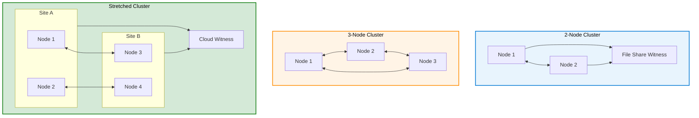

# High Availability Patterns

This section covers advanced strategies for building highly available and resilient Azure Local deployments. Understanding these patterns is essential for designing mission-critical systems.

<details class="diagram-container">
<summary>View Diagram: HA Topology Options</summary>
<div class="diagram-content" markdown="1">



_Figure 1: Azure Local cluster topology options for different HA requirements_

</div>
</details>

## Cluster Quorum Options

Quorum prevents split-brain scenarios where cluster nodes become isolated and make conflicting decisions.

### Node Majority Quorum

**How It Works:**

- Requires more than half of nodes to be healthy
- 3-node cluster: 2 nodes needed for quorum
- 5-node cluster: 3 nodes needed for quorum
- Completely distributed, no external dependency

**Advantages:**

- Simple to understand and operate
- No external infrastructure required
- Automatic decision making
- Scales well to any size

**Limitations:**

- Only works with odd number of nodes (3, 5, 7...)
- 2-node cluster cannot use node quorum alone

### File Share Witness

**How It Works:**

- External server hosts witness file share
- Provides tiebreaker for 2-node clusters
- Any node plus witness can form quorum
- Requires Windows Server 2022 or later on witness

**Configuration:**

- Must be accessible via 1 Gbps network minimum
- Witness file share ≥ 5 GB
- Separate from cluster nodes (different server)
- Can be on different site or cloud

**Best Practices:**

- Place witness at third location for geo-redundancy
- Use Azure Storage file share for cloud-based witness
- Monitor witness connectivity regularly
- Test failover with witness offline

### Cloud Witness (Azure Storage)

**How It Works:**

- Uses Azure Storage account as quorum witness
- Virtual quorum resource in Azure Storage
- Suitable for hybrid or disconnected scenarios
- Requires internet connectivity

**Configuration:**

```powershell
Set-ClusterQuorum -CloudWitness -AccountName "mystorageaccount" `
  -AccessKey "storagekey123..."
```

**Considerations:**

- Network latency to Azure must be < 1 second
- Internet connectivity required
- Cost: Minimal (~$1-2/month for witness account)
- Useful for disconnected edge scenarios

## Multi-Node Failure Scenarios

### Single Node Failure (Automatic Recovery)

**What Happens:**

1. Cluster detects node timeout (5-30 seconds)
2. Cluster declares node offline
3. VMs on failed node restart on surviving node
4. Storage mirrors rebuild data from surviving copies
5. Services resume within 5-15 minutes

**Recovery Timeline:**

- Detection: 5-30 seconds
- VM failover: 30-120 seconds
- VM application start: 1-5 minutes
- Storage rebuild: Hours (dependent on data volume)

**Data Loss:**

- Zero data loss with mirrors (2-way or 3-way)
- Network storage retained
- VM state maintained through mirror

### Two-Node Failure (Planned Maintenance)

**Scenario:** One node down for maintenance, second node fails unexpectedly

**With 3-Node Cluster:**

- Node 1 down (maintenance)
- Node 2 fails
- Node 3 survives with quorum
- Cluster continues (degraded mode)
- VMs resume on Node 3
- Storage rebuilds automatically

**With 2-Node Cluster:**

- Node 1 down (maintenance)
- Node 2 fails
- Loss of quorum
- Cluster stops (automatic failover not possible)
- Manual intervention required

**Mitigation:**

- Never perform maintenance on more than one node
- Keep witness online during maintenance
- Test failover scenarios regularly

### Network Partition (Split-Brain Prevention)

**Scenario:** Network link between cluster nodes fails

**Detection:**

- Nodes cannot communicate within heartbeat timeout
- Quorum mechanism activates
- Nodes without quorum stop services
- Nodes with quorum continue

**With 3-Node Cluster (Network Split):**

```text
Scenario 1: 2 nodes on side A, 1 node on side B
- Side A: 2/3 nodes = quorum (continues)
- Side B: 1/3 nodes = no quorum (stops)

Scenario 2: Equal split (impossible with odd node count)
```

**Cluster Mode (Not Possible):**

```text
Scenario 1: 2 nodes on side A, 1 on side B
- Side A: 2/3 = quorum (continues)
- Side B: 1/3 = no quorum (stops VMs)

Result: Automatic prevention of split-brain
```

**Recovery:**

- Reconnect network
- Stopped cluster automatically rejoins
- Storage automatically synchronizes
- No data loss with synchronous replication

## Failover Mechanisms

### Automatic VM Failover

**Prerequisites:**

- VMs stored on cluster shared storage (not local)
- Cluster monitoring enabled
- Health policy configured

**Failover Process:**

1. Source node fails
2. Cluster detects failure
3. Cluster runs HA policy for VMs
4. VM marked as "failed-over"
5. Surviving node starts VM from storage
6. VM connections resume after restart

**Application Considerations:**

- Connection timeout: 2-5 minutes typical
- Application must handle restart
- Stateless services recover automatically
- Stateful services may need recovery scripts

### Storage Rebuild

**Automatic Start:**

- Begins immediately when node fails
- Lower priority than live workloads
- Can be paused if performance impact too high

**Rebuild Performance:**

- Typical: 200-500 MB/s read from mirrors
- Write: 100-300 MB/s to replacement location
- Time to complete: Hours to days
  - 1 TB storage: 2-5 hours
  - 10 TB storage: 20-50 hours

**Operational Impact:**

- Performance degradation during rebuild
- Reduced fault tolerance during rebuild
- No redundancy if second failure occurs during rebuild
- Monitor rebuild progress

**Optimization:**

- Schedule during low-traffic windows
- Use spare drive in pool for faster rebuild
- Rebuild within same node group if possible

### Multi-Site Active-Active

**Architecture:**

- Two clusters at different locations
- Synchronized storage replication
- Independent VM workloads
- Coordinated through Arc management

**Benefits:**

- Workload distribution across sites
- Local compute for latency-sensitive apps
- Automated failover per site
- No single point of failure

**Challenges:**

- Consistent configuration across sites
- Network latency between sites
- Replication overhead
- Debugging failures across geography

### Multi-Site Active-Passive

**Architecture:**

- Primary cluster handles all workloads
- Secondary cluster on standby
- Asynchronous replication
- Manual or automated failover

**Deployment:**

```text
Primary Site:
  - 3-node Azure Local cluster
  - All VMs and data

Secondary Site:
  - 3-node Azure Local cluster (idle)
  - Replica of primary data
  - No VMs running

Replication:
  - 1-hour RPO (asynchronous)
  - Bandwidth: 100 Mbps minimum
  - Via WAN or dedicated link
```

**Failover Process:**

1. Primary site fails
2. Ops team initiates failover
3. Secondary cluster promoted to primary
4. VMs started on secondary
5. Applications resume from replicas
6. RTO: 15-30 minutes (manual)
7. RPO: 1 hour (data loss risk)

**Advantages:**

- Simpler than active-active
- Lower replication bandwidth
- Lower cost (secondary can be smaller)
- Well-understood recovery process

## Disaster Recovery Runbooks

### Node Failure Recovery

**1. Detection Phase:**

```text
- Monitor: Check cluster event log
- Diagnosis: Is node physically dead or network issue?
- Decision: Restart node or replace hardware?
```

**2. Recovery Options:**

**Option A: Restart Failed Node**

```text
1. Power cycle server
2. Wait for node to rejoin cluster
3. Monitor storage rebuild
4. Verify cluster health
```

**Option B: Hardware Replacement**

```text
1. Remove failed node from cluster
2. Replace hardware
3. Rejoin node to cluster (fresh install)
4. Monitor storage rebuild
5. Verify all disks recognized
```

**3. Post-Recovery:**

- Verify all VMs running
- Check storage pool status
- Monitor rebuild progress
- Document timeline and issues

### Storage Pool Degradation

**Detection:**

```text
Alert triggers: Storage pool showing "degraded" status
- Cluster event: "Physical disk offline"
- Alarm: Low redundancy warning
```

**Investigation:**

```text
1. Which physical disk failed?
   Get-StoragePool | Get-PhysicalDisk | Where Status -ne Healthy

2. Is it NVMe, SSD, or HDD?

3. Can it be recovered (reseat connector)?

4. Is spare capacity available?
```

**Recovery:**

```text
1. If disk can be recovered:
   - Reseat connection
   - Monitor for reintegration

2. If disk must be replaced:
   - Remove old disk
   - Insert new disk
   - Monitor automatic rebuild
   - Verify: Get-PhysicalDisk

3. Monitor rebuild:
   - Check: Get-StorageJob
   - Expected time: 1-5 hours per TB
```

### Network Partition Recovery

**Detection:**

```text
- Cluster stops responding
- VMs appear frozen
- Management interfaces inaccessible
```

**Investigation:**

```text
1. Check network connectivity between nodes
   ping node2 (from node1)
   ping node3 (from node1)

2. Check network switch:
   - Verify ports active
   - Check VLAN configuration
   - Verify QoS settings

3. Check if quorum present:
   Get-ClusterQuorum
```

**Recovery:**

```text
1. Restore network connection:
   - Fix network switch
   - Reconnect cable
   - Verify VLAN is correct

2. Monitor cluster recovery:
   - Cluster should automatically rejoin
   - VMs restart
   - Storage synchronizes

3. If manual recovery needed:
   - See network troubleshooting section
```

### Complete Site Failure

**Recovery Procedures:**

**Step 1: Assess Damage**

- Determine if site is recoverable
- Estimate recovery timeline
- Check backup/replica status

**Step 2: Failover to Secondary**

- Confirm primary site completely down
- Promote secondary cluster to primary
- Update DNS/network routing
- Start VMs on secondary

**Step 3: Validate Applications**

- Test critical business functions
- Verify data integrity
- Check for replication lag issues
- Notify stakeholders

**Step 4: Plan Site Recovery**

- Assess what failed (hardware? Power? Network?)
- Repair infrastructure
- Restore from backups if needed
- Test before returning to production

**Example Timeline:**

```text
T+0:00    Primary site goes offline
T+0:05    Alert received and investigated
T+0:15    Decision made to failover to secondary
T+0:20    Secondary promoted to primary
T+0:30    First VM starts on secondary
T+1:00    All critical VMs running on secondary
T+2:00    All applications validated
T+4:00    Begin primary site recovery
T+8:00    Primary site infrastructure repaired
T+10:00   Data synchronized back to primary
T+12:00   Failback to primary completed
```

## Testing HA and DR

### Regular Failover Exercises

**Monthly Test Procedure:**

1. Notify operations team (not real emergency)
2. Simulate node failure (stop Hyper-V service)
3. Monitor cluster response
4. Verify VMs restart
5. Check alert notifications
6. Document any issues
7. Resume normal operation

**Quarterly Full DR Test:**

1. Test secondary site startup
2. Verify data replicas are current
3. Perform application testing
4. Measure actual RTO (recovery time)
5. Document results
6. Update runbooks

### RTO/RPO Validation

**RTO Measurement:**

```text
RTO = Time from failure start to service restoration

Measure:
- T0: Failure event
- T1: Detection (cluster recognizes failure)
- T2: VM restart initiated
- T3: VM operating system boots
- T4: Application services start
- T5: Applications accepting requests

Typical breakdown for 3-node cluster:
- T1-T0: 30 seconds (failure detection)
- T2-T1: 5 seconds (orchestration)
- T3-T2: 2 minutes (OS boot)
- T4-T3: 2 minutes (application startup)
- T5-T4: 30 seconds (warming up)
Total RTO: ~5 minutes
```

**RPO Measurement:**

```text
RPO = Maximum data loss acceptable

Depends on:
- Storage mirror type (synchronous = 0)
- Replication strategy
- Backup frequency

Example:
- 3-way mirror + synchronous: RPO = 0 (no data loss)
- Async replication to secondary: RPO = 1 hour
- Nightly backups only: RPO = 24 hours
```

---

## Key Takeaways

1. **Quorum Selection:** Node majority for 3+ nodes, file share witness for 2-node
2. **Failure Scenarios:** Plan for single node, double node, and network partition
3. **Automatic Recovery:** Most scenarios recover automatically; understand which don't
4. **Testing:** Regularly test failover and measure RTO/RPO
5. **Documentation:** Maintain current runbooks for all failure scenarios
