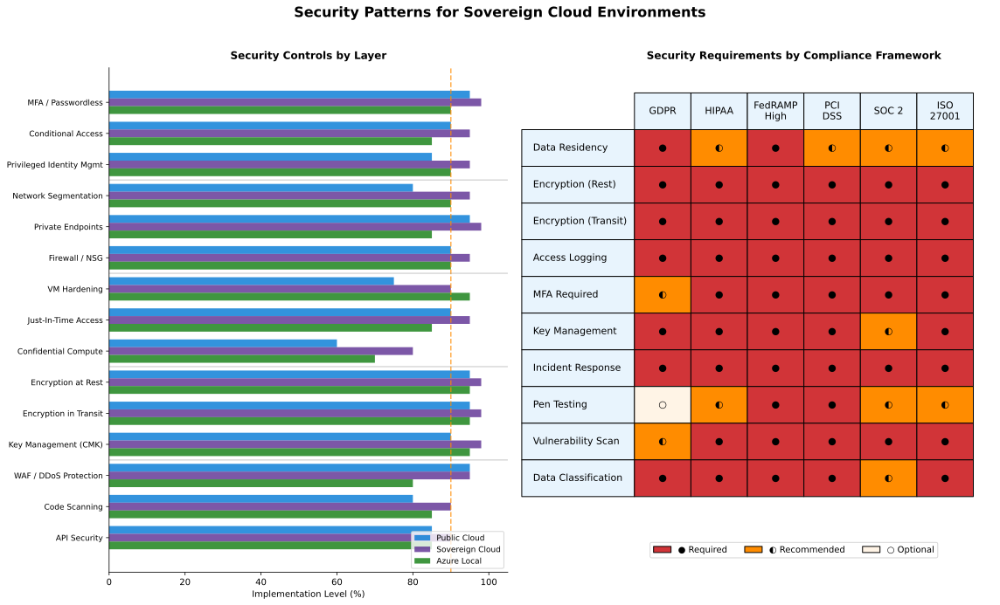
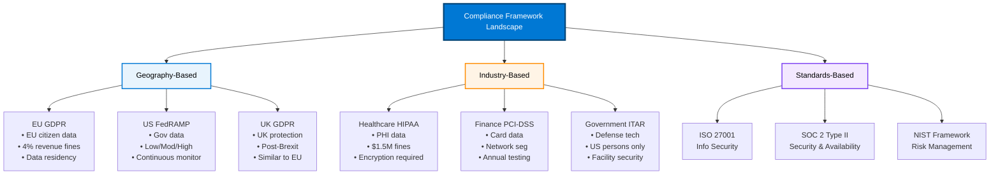

# Compliance & Security Patterns

## Overview

<details class="diagram-container">
<summary>View Diagram: Security Patterns Matrix</summary>
<div class="diagram-content">


_Figure 1: Compliance framework coverage matrix for sovereign cloud security_

</div>
</details>

Security and compliance are foundational requirements for enterprise deployments of sovereign cloud solutions. This module covers compliance frameworks, security hardening patterns, encryption strategies, and security architecture for Microsoft Sovereign Cloud, Azure Local, and Edge AI deployments.

### Prerequisites

- Completion of Level 200 Modules 1-4
- Understanding of security concepts (authentication, encryption, access control)
- Familiarity with compliance frameworks (GDPR, FedRAMP, HIPAA)
- Azure security concepts and Azure Arc management

### Learning Objectives

By completing this module, you will:

- Implement GDPR compliance patterns in sovereign cloud deployments
- Understand FedRAMP authorization requirements and processes
- Design encryption strategies for data at rest and in transit
- Implement security hardening and zero-trust architecture
- Manage encryption keys and secrets effectively
- Build compliant audit and monitoring systems
- Address industry-specific compliance requirements

---

## Security & Compliance Foundation

### The Compliance Landscape



### Security Pillars

```text
Microsoft Sovereign Cloud Security Model
════════════════════════════════════════

1. IDENTITY & ACCESS MANAGEMENT (Zero-Trust)
   ├─ Authentication: MFA, passwordless (FIDO2)
   ├─ Authorization: Role-based access control (RBAC)
   ├─ Conditional access: Risk-based access policies
   └─ Audit: All access logged and monitored

2. NETWORK SECURITY
   ├─ Perimeter: Firewall, DDoS protection, WAF
   ├─ Network segmentation: Virtual networks, subnets
   ├─ Encryption: TLS 1.3 for all transit
   └─ VPN/Private endpoints: Encrypted tunnels

3. DATA PROTECTION
   ├─ Encryption at rest: AES-256 (all storage)
   ├─ Encryption in transit: TLS 1.3 (all data movement)
   ├─ Key management: HSM-backed key vault
   └─ Data classification: PII, confidential, internal, public

4. APPLICATION SECURITY
   ├─ Secure development: SSDLC (secure software dev lifecycle)
   ├─ Code scanning: SAST (static analysis), DAST (dynamic)
   ├─ Dependency scanning: Vulnerable library detection
   └─ Runtime protection: Runtime application self-protection

5. OPERATIONAL SECURITY
   ├─ Vulnerability management: Patch management, scanning
   ├─ Threat detection: EDR, XDR, SIEM
   ├─ Incident response: Detection, containment, recovery
   └─ Disaster recovery: Backup, business continuity

6. COMPLIANCE & GOVERNANCE
   ├─ Policy enforcement: Azure Policy, compliance automation
   ├─ Audit trails: Immutable logging, audit history
   ├─ Access reviews: Quarterly access certification
   └─ Compliance reporting: Automated compliance reports
```

---

## Compliance Framework Implementation

### GDPR Compliance Architecture

```text
GDPR REQUIREMENTS → AZURE IMPLEMENTATION
═════════════════════════════════════════════════════════════

1. DATA RESIDENCY
   Requirement: EU citizen data must stay in EU
   Azure Solution:
   ├─ EU data center (Germany, France)
   ├─ Azure Local for on-premises (disconnected)
   └─ Azure Private Link for encrypted data flow

2. DATA PROCESSING AGREEMENT (DPA)
   Requirement: Contract defining data processor role
   Azure Solution:
   ├─ Microsoft Standard DPA terms
   ├─ Data Processing Amendment (DPA)
   └─ Sub-processor list maintained

3. DATA SUBJECT RIGHTS
   Requirement: Users can access, correct, delete their data
   Azure Solution:
   ├─ Data export tools (PowerShell, APIs)
   ├─ Purge capabilities (GDPR right to be forgotten)
   ├─ Data modification (update incorrect data)
   └─ Audit trail (track all changes)

4. PRIVACY BY DESIGN
   Requirement: Privacy built into systems from start
   Azure Solution:
   ├─ Encryption by default (AES-256 at rest)
   ├─ Minimal data collection (only what's needed)
   ├─ Access controls (least privilege)
   ├─ Data retention policies (auto-delete after period)
   └─ Privacy impact assessment (DPIA)

5. INCIDENT NOTIFICATION
   Requirement: Notify authorities within 72 hours of breach
   Azure Solution:
   ├─ Azure Security Center (real-time threat detection)
   ├─ Incident response process (defined SLA)
   ├─ Breach assessment tools
   └─ Notification templates and tracking

EXAMPLE DEPLOYMENT: EU Healthcare Organization
───────────────────────────────────────────────
Organization: German hospital network
Data type: Patient health records (PHI + GDPR protected)
Deployment: Azure Local in Germany + Azure Arc

Architecture:
┌──────────────────────────────┐
│ Healthcare Application       │
│ (Runs on-premises)           │
└──────┬───────────────────────┘
       │ (All data stays in Germany)
┌──────▼───────────────────────┐
│ Azure Local (Germany):       │
│ ├─ Database (patient data)   │
│ ├─ Encryption (AES-256)      │
│ └─ Backup (local Germany)    │
└──────┬───────────────────────┘
       │ (Audit logs encrypted to cloud)
┌──────▼───────────────────────┐
│ Azure Arc (telemetry only):  │
│ ├─ Monitoring (no patient data)
│ └─ Audit logs (encrypted)    │
└──────────────────────────────┘

GDPR Compliance Checklist:
✓ Data stays in Germany (no transfer)
✓ Encryption AES-256 at rest + TLS in transit
✓ DPA in place with Microsoft
✓ Data subject access (export, delete, correct)
✓ Incident response < 72 hour notification
✓ DPIA completed and documented
✓ Privacy policy updated for patient notices
```

### FedRAMP Compliance Path

```text
FedRAMP AUTHORIZATION LEVELS
════════════════════════════════════════════════════════════

LOW (Baseline)
├─ Data classification: Unclassified
├─ Security controls: 50 required controls
├─ Assessment: Annual
├─ Cost: ~$50-100K
└─ Timeline: 6-12 months

MODERATE (Common)
├─ Data classification: Sensitive unclassified information
├─ Security controls: 110 required controls
├─ Assessment: Annual
├─ Cost: $100-300K
├─ Timeline: 12-24 months
└─ Most common for federal agencies

HIGH
├─ Data classification: Classified, critical infrastructure
├─ Security controls: 170+ required controls
├─ Assessment: Annual + continuous monitoring
├─ Cost: $300-500K+
├─ Timeline: 24+ months
└─ For national security systems

FEDRAMP AUTHORIZATION PROCESS
──────────────────────────────
Step 1: Readiness Assessment (Weeks 1-4)
├─ Document current security controls
├─ Identify gaps vs. FedRAMP baseline
├─ Estimate remediation effort
├─ Cost: ~$10K consulting

Step 2: SSP Development (Weeks 5-12)
├─ Write System Security Plan (detailed security architecture)
├─ Document all 110 (moderate) controls
├─ Include: system diagram, data flows, boundaries
├─ Cost: ~$30-50K

Step 3: Assessment (Weeks 13-24)
├─ Independent assessor tests all controls
├─ Penetration testing, vulnerability scanning
├─ Documentation review
├─ Cost: ~$50-100K

Step 4: Authorization (Week 24+)
├─ Agency AO (Authorizing Official) reviews
├─ Issues Authority to Operate (ATO)
├─ Continuous monitoring obligations begin
├─ Cost: ~$10K

Step 5: Continuous Monitoring (Ongoing)
├─ Annual assessment by authorized assessor
├─ Monthly security updates and patches
├─ Quarterly control validation
├─ Cost: ~$30-50K annually

TOTAL 2-YEAR FEDRAMP COST: $140-240K initial + $30-50K annual

AZURE SERVICES FOR FEDRAMP
──────────────────────────
Pre-authorized FedRAMP services:
├─ Azure Government (general support)
├─ Azure Government Secret (classified data)
├─ Azure Government Top Secret (national security)
├─ Azure Local (can be FedRAMP-authorized)
├─ Dynamics 365 Government
└─ Microsoft 365 Government

Benefits of using pre-authorized services:
✓ Accelerates approval process (months → weeks)
✓ Reduces assessment cost (already validated)
✓ Reduces risk (proven security posture)
✓ Continuous compliance monitoring by Microsoft
```

---

## Encryption & Key Management

### Encryption Strategy

```text
LAYERED ENCRYPTION APPROACH
════════════════════════════════════════════════════════════

LAYER 1: ENCRYPTION AT REST (Storage)
─────────────────────────────────
Data stored on disk/storage: AES-256
Applies to:
├─ Database files
├─ Backups
├─ Archive storage
├─ Virtual disks
└─ File shares

Implementation:
┌─────────────────┐
│ Application     │
│ (needs data)    │
└────────┬────────┘
         │ (reads in plaintext)
┌────────▼────────┐
│ Database        │
│ (decrypted)     │
└────────┬────────┘
         │ (encrypted before write)
┌────────▼────────────────┐
│ Storage Encryption      │
│ (AES-256)               │
└────────┬────────────────┘
         │ (write to disk)
┌────────▼────────────────┐
│ Physical Disk           │
│ (encrypted data)        │
└─────────────────────────┘

LAYER 2: ENCRYPTION IN TRANSIT (Network)
──────────────────────────────────────
Data in motion over network: TLS 1.3
Applies to:
├─ Client-server communication
├─ Service-to-service
├─ Replication between sites
└─ Backup transmission

Implementation:
┌──────────────┐
│ Client       │
│ (App Server) │
└──────┬───────┘
       │
       │ TLS 1.3 encrypted tunnel
       │
┌──────▼────────────────┐
│ Database Server       │
│ (sees plaintext only) │
└──────────────────────┘

LAYER 3: APPLICATION-LEVEL ENCRYPTION
──────────────────────────────────────
Sensitive fields encrypted: Customer-managed keys
Applies to:
├─ Personal data (PII)
├─ Payment data
├─ Credentials
└─ Proprietary data

Implementation:
┌────────────────────────┐
│ Plaintext Data         │
│ (e.g., patient name)   │
└────────┬───────────────┘
         │ (encrypt with app key)
┌────────▼───────────────────┐
│ Ciphertext (encrypted)     │
│ (e.g., [encrypted bytes])  │
└────────┬───────────────────┘
         │ (store in DB)
┌────────▼───────────────────┐
│ Database                    │
│ (doubly encrypted: DB + app)│
└─────────────────────────────┘

ENCRYPTION KEY HIERARCHY
────────────────────────
┌─────────────────────────────┐
│ Root Key (Master)           │
│ ├─ Stored in HSM            │
│ ├─ 256-bit encryption       │
│ └─ Rotated annually         │
└─────────┬───────────────────┘
          │
    ┌─────┴─────┐
    │           │
┌───▼──────┐ ┌─▼─────────┐
│ Data Key │ │ Backup Key│
│ ├─ DB    │ │ ├─ Backups│
│ ├─ Files │ │ └─ DR     │
│ └─ 30d   │ └───────────┘
└──────────┘

Key Rotation:
├─ Data keys: Every 90 days
├─ Backup keys: Every 180 days
├─ Root keys: Annually
└─ Emergency: Immediately if compromised
```

### Azure Key Vault & Secrets Management

```text
KEY VAULT ARCHITECTURE
══════════════════════════════════════════════════════════

Typical Deployment:
┌────────────────────────────────────┐
│ Application / Microservice         │
│ ├─ Request: Get secret "db-pwd"   │
│ └─ Use: Connect to database        │
└────────────┬──────────────────────┘
             │
             │ (Managed Identity)
┌────────────▼──────────────────────┐
│ Azure Key Vault                    │
│ ├─ db-pwd: [encrypted]            │
│ ├─ api-key: [encrypted]           │
│ ├─ cert: [encrypted]              │
│ └─ ssh-key: [encrypted]           │
└────────────┬──────────────────────┘
             │ (Audit log)
┌────────────▼──────────────────────┐
│ Azure Monitor                      │
│ └─ Logged: Who accessed what, when│
└────────────────────────────────────┘

ACCESS CONTROL (RBAC)
─────────────────────
Role: Database Administrator
├─ Get secrets: db-pwd (allowed)
├─ Get secrets: api-key (denied)
└─ Delete secrets: (denied)

Role: Application (Managed Identity)
├─ Get secrets: db-pwd (allowed)
├─ List secrets: (denied)
└─ Modify: (denied)

SECRETS HIERARCHY
─────────────────
Environment-Specific:
├─ dev: dev-db-pwd = [dev password]
├─ test: test-db-pwd = [test password]
├─ prod: prod-db-pwd = [prod password]
└─ dr: dr-db-pwd = [dr password]

Rotation Schedule:
├─ Database passwords: Every 90 days (automated)
├─ API keys: Every 60 days (manual rotation)
├─ Certificates: 30 days before expiry (auto-renewal)
└─ SSH keys: Annual key rotation
```

---

## Security Hardening

### Zero-Trust Security Model

```text
ZERO-TRUST PRINCIPLE: "Trust Nothing, Verify Everything"
════════════════════════════════════════════════════════════

Traditional Model (Perimeter Security):
┌────────────────────────────┐ ← Trust boundary
│ "Inside is safe"           │
│ ├─ Users: trusted          │
│ ├─ Devices: trusted        │
│ ├─ Apps: trusted           │
│ └─ → Minimal internal checks│
└────────────────────────────┘

Problems:
✗ Assumes internal threats don't exist
✗ One compromise = full access
✗ Lateral movement easy
✗ Doesn't scale to hybrid/multi-cloud

Zero-Trust Model (Identity-Centric):
                    Every Access
                    ↓
    ┌───────────────┴───────────────┐
    │                               │
User             Device           Application
├─ MFA            ├─ Compliance    ├─ Authentication
├─ Risk-based     ├─ Encryption    ├─ Authorization
├─ Location       ├─ Updates       ├─ Rate limiting
└─ Behavior       └─ Audit         └─ Logging
    │                               │
    └───────────────┬───────────────┘
                    │
            ┌───────▼────────┐
            │ Resource Grant │
            │ (time-limited) │
            └────────────────┘

IMPLEMENTATION PILLARS
──────────────────────

1. IDENTITY VERIFICATION
   ├─ Multi-factor authentication (MFA)
   │  ├─ Password (something you know)
   │  ├─ Authenticator app (something you have)
   │  └─ Biometric (something you are)
   ├─ Passwordless authentication
   │  ├─ Windows Hello
   │  ├─ FIDO2 security keys
   │  └─ Phone sign-in
   └─ Continuous verification
      ├─ Location check
      ├─ Device health
      └─ Risk assessment

2. DEVICE COMPLIANCE
   ├─ Operating system version (patched)
   ├─ Antivirus status (active)
   ├─ Disk encryption (enabled)
   ├─ Firewall (enabled)
   └─ Conditional access
      ├─ Compliant device: Full access
      ├─ Non-compliant: Restricted access
      └─ Suspicious: Block

3. APPLICATION ACCESS
   ├─ Service principal authentication
   │  ├─ Certificate-based (preferred)
   │  ├─ Managed identity (recommended)
   │  └─ Secret-based (legacy)
   ├─ Scope limiting
   │  ├─ API permissions (fine-grained)
   │  ├─ Resource permissions (RBAC)
   │  └─ Time-limited access (just-in-time)
   └─ Audit all access

4. NETWORK MICROSEGMENTATION
   ├─ Deny all by default
   ├─ Allow specific flows
   │  ├─ Source IP/range
   │  ├─ Destination IP/range
   │  ├─ Port (specific only)
   │  └─ Protocol (TLS 1.3 only)
   ├─ Encryption all traffic (TLS 1.3 minimum)
   └─ DDoS protection (Azure DDoS)

5. THREAT DETECTION & RESPONSE
   ├─ Continuous monitoring
   │  ├─ Endpoint Detection & Response (EDR)
   │  ├─ Security Information & Event Mgmt (SIEM)
   │  └─ User & Entity Behavior Analysis (UEBA)
   ├─ Automated response
   │  ├─ Block suspicious user
   │  ├─ Require MFA again
   │  ├─ Revoke tokens
   │  └─ Isolate compromised device
   └─ Incident response
      ├─ Detection < 1 hour
      ├─ Containment < 4 hours
      └─ Recovery < 24 hours
```

### Azure Policy for Compliance Automation

```text
AZURE POLICY FRAMEWORK
════════════════════════════════════════════════════════════

Policy = Rule that enforces compliance automatically

EXAMPLE POLICY 1: Enforce Encryption
─────────────────────────────────────
Rule: All storage must have encryption enabled
┌─────────────────────────────────┐
│ Policy Initiative: "Encryption" │
├─ Resource: Storage Account      │
├─ Requirement: Encryption = on   │
└─────────────────────────────────┘

Enforcement:
├─ Audit: Existing resources (report non-compliance)
├─ Deny: New resources without encryption (prevent creation)
└─ DeployIfNotExists: Create encryption config automatically

EXAMPLE POLICY 2: Enforce Network Security
──────────────────────────────────────────
Rule: All VMs must have NSG and firewall
┌──────────────────────────────────────────────────────┐
│ Policy: "Network Security Group Required"           │
├─ Resource: Virtual Machines                         │
├─ Requirement: NSG attached = yes                    │
├─ Requirement: Firewall enabled = yes                │
└──────────────────────────────────────────────────────┘

EXAMPLE POLICY 3: Enforce GDPR Compliance
─────────────────────────────────────────
Rule Set: All GDPR requirements
┌──────────────────────────────────────────────────────┐
│ Policy Initiative: "GDPR Compliance"                 │
│                                                      │
│ ├─ Data must be in EU regions                        │
│ │  ├─ Allowed: West Europe, North Europe            │
│ │  └─ Denied: US, Asia regions                      │
│ │                                                    │
│ ├─ Encryption must be enabled                        │
│ │  ├─ At rest: AES-256                             │
│ │  └─ In transit: TLS 1.3                          │
│ │                                                    │
│ ├─ Audit logs must be centralized                   │
│ │  ├─ Retention: 1 year minimum                     │
│ │  └─ Immutable: cannot be deleted                  │
│ │                                                    │
│ ├─ Access must be reviewed quarterly                │
│ │  └─ Automated alerts for compliance gaps          │
│ │                                                    │
│ └─ Backup must be outside of EU (DR)               │
│    └─ Geo-redundant storage required                │
└──────────────────────────────────────────────────────┘

MONITORING & REPORTING
──────────────────────
Compliance Dashboard:
├─ Total resources: 247
├─ Compliant: 240 (97%)
├─ Non-compliant: 5 (2%)
│  ├─ Storage without encryption: 3
│  ├─ VMs without NSG: 2
│  └─ Databases in wrong region: 0
├─ Exempt: 2 (1%)
└─ Not scanned: 0

Compliance Trend (last 90 days):
Day 1:  85% (started initiative)
Day 30: 92% (remediated known issues)
Day 60: 96% (infrastructure update)
Day 90: 97% (new policy prevents future gaps)
```

---

## Audit & Compliance Reporting

### Audit Trail Architecture

```text
IMMUTABLE AUDIT LOGGING
════════════════════════════════════════════════════════════

Every Action Logged:
┌────────────────────────────────────────┐
│ User: alice@company.com                │
│ Action: Read patient record #12345     │
│ Resource: database/healthcare/records  │
│ Timestamp: 2025-10-21 14:32:15.456 UTC│
│ Result: Success                        │
│ IP Address: 203.0.113.42               │
│ Device: Desktop (Windows 11, compliant)│
│ MFA: Yes (authenticator app)           │
│ Purpose: Patient scheduled appointment │
└────────────────────────────────────────┘
        ↓ (immediately immutable)
┌────────────────────────────────────────┐
│ Azure Storage (Write-Once-Read-Many)   │
│ ├─ Append-only blob storage            │
│ ├─ Cannot be modified/deleted          │
│ ├─ 7-year retention (compliant)        │
│ └─ Geo-replicated backup               │
└────────────────────────────────────────┘

Log Aggregation Pipeline:
┌──────────────────────────┐
│ Application/Service      │
│ └─ Audit event generated │
└───────────┬──────────────┘
            │ (JSON format)
┌───────────▼──────────────┐
│ Azure Event Hubs         │
│ └─ Collect millions/sec  │
└───────────┬──────────────┘
            │
            ├──→ Azure Storage (long-term)
            │    └─ 7+ year retention
            │
            ├──→ Log Analytics (queries)
            │    └─ Real-time analysis
            │
            └──→ SIEM (threat detection)
                 └─ Correlate events

AUDIT QUERIES (Sample)
──────────────────────
Q1: Who accessed patient data today?
   SELECT user, action, resource, timestamp
   WHERE action = 'Read' AND resource LIKE '%patient%'
   AND timestamp > TODAY - 1 day

Q2: Any failed authentication attempts?
   SELECT user, source_ip, attempt_count
   WHERE action = 'Failed Authentication'
   AND attempt_count > 3 IN (1 hour)
   → Alert: Potential brute force

Q3: Data exports (potential exfiltration)?
   SELECT user, data_volume, destination
   WHERE action = 'Data Export'
   AND data_volume > 100MB
   → Alert: Unusual data movement

Q4: After-hours access to sensitive systems?
   SELECT user, resource, timestamp
   WHERE timestamp BETWEEN 22:00 AND 06:00
   AND resource = 'Production Database'
   → Alert: After-hours access
```

---

## Compliance Roadmap

### Phased Compliance Implementation

```text
PHASE 1: FOUNDATION (Weeks 1-4)
═════════════════════════════════════════════════════════════

Week 1-2: Assessment & Planning
├─ Current state security audit
├─ Compliance gap analysis
├─ Budget and resource allocation
└─ Define compliance roadmap

Week 3-4: Core Security Implementation
├─ Enable Azure Policy (enforce encryption)
├─ Implement MFA organization-wide
├─ Set up audit logging and SIEM
└─ Configure backup and disaster recovery

Success Metrics:
✓ 80%+ resources compliant with policies
✓ MFA enforced for all users
✓ Audit logging enabled for all services
✓ Backup strategy in place

PHASE 2: COMPLIANCE HARDENING (Weeks 5-12)
═════════════════════════════════════════════════════════════

Week 5-8: Compliance Framework Implementation
├─ GDPR: Implement data residency, DPA, data subject rights
├─ Network security: Deploy zero-trust, microsegmentation
├─ Identity: Implement Conditional Access policies
└─ Encryption: Rotate keys, test recovery

Week 9-12: Audit & Documentation
├─ Third-party security assessment
├─ Vulnerability scanning and remediation
├─ Document security architecture
└─ Privacy impact assessment (DPIA)

Success Metrics:
✓ 95%+ audit control implementation
✓ Zero critical vulnerabilities
✓ Compliance documentation complete
✓ DPIA approved by DPO

PHASE 3: CERTIFICATION (Weeks 13-26)
═════════════════════════════════════════════════════════════

For GDPR (Certification-less):
├─ Document compliance evidence
├─ Ready for audit if requested
└─ Annual compliance review

For FedRAMP (Requires Authorization):
├─ Weeks 13-20: Work with assessor on SSP
├─ Weeks 21-26: Assessment and remediation
├─ Weeks 27+: Await ATO (Authority to Operate)

For ISO 27001 (Optional but valuable):
├─ Weeks 13-20: Gap analysis and planning
├─ Weeks 21-26: Implementation
├─ Weeks 27-52: Certification audit

Success Metrics:
✓ Compliance certification(s) achieved
✓ Continuous monitoring in place
✓ Incident response tested and working
✓ Training completed for all staff

ONGOING: COMPLIANCE MAINTENANCE
═════════════════════════════════════════════════════════════

Monthly:
├─ Review compliance dashboards
├─ Patch management execution
└─ Access review for sensitive resources

Quarterly:
├─ Compliance gap assessment
├─ Access certification review
├─ Security awareness training
└─ Audit log review

Annually:
├─ External security assessment
├─ Penetration testing
├─ Key rotation
├─ Compliance certification renewal
└─ Executive compliance report
```

---

## Related Topics

- **Main Module Topics:**
  - [GDPR Implementation & Data Residency](./gdpr-implementation.md)
  - [FedRAMP Compliance Path](./fedramp-compliance.md)
  - [Encryption & Key Management](./encryption-key-management.md)
  - [Security Hardening Patterns](./security-hardening.md)
  - [Knowledge Check](./compliance-knowledge-check.md)

- **Supporting Modules:**
  - [Pre-Sales & Solution Design](./presales-solution-design.md)
  - [Edge RAG Implementation](./edge-rag-implementation.md)
  - [Arc Advanced Management](./arc-advanced-management.md)

---

_Last Updated: October 21, 2025_
