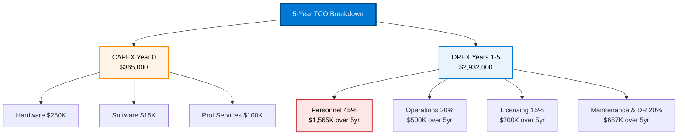

# Cost Estimation and ROI Analysis

## Overview

Accurate cost estimation is critical for securing customer investment and demonstrating ROI. This page covers cost modeling methodologies, TCO analysis frameworks, cost optimization opportunities, and financial comparisons against cloud alternatives.

---

## Cost Modeling Framework

### Complete Cost Components

```text
CAPITAL EXPENDITURE (One-Time Costs)
═════════════════════════════════════

Hardware Costs
├─ Compute Nodes
│  ├─ 4-6 standard CPU nodes: $15K-20K each = $60K-120K
│  ├─ 2-3 GPU nodes (with T4/A100): $25K-50K each = $50K-150K
│  ├─ 2 management/storage nodes: $10K-15K each = $20K-30K
│  └─ Total compute: $130K-300K
│
├─ Networking Equipment
│  ├─ 25Gbps fabric switch (core): $15K-25K
│  ├─ Access switches: $2K-5K each × 2 = $4K-10K
│  ├─ Cabling and interconnect: $5K-10K
│  └─ Total networking: $24K-45K
│
├─ Storage Infrastructure
│  ├─ SSD arrays (hot tier): $10K-20K
│  ├─ NVMe storage: $5K-10K
│  ├─ HDD arrays (cold tier): $10K-15K
│  ├─ Backup systems: $5K-10K
│  └─ Total storage: $30K-55K
│
└─ TOTAL HARDWARE: $184K-400K
   (Typical: $250K for mid-size deployment)

Software/License Costs
├─ Azure Local license: $0 (included with hardware) or $15K/year
├─ Azure Arc licensing: $0 (per-node, minimal)
├─ OS licenses (Windows/Linux): Included or $500-1000/node
├─ Database licenses (optional): $0-50K
├─ Container registry/tools: $0-5K
└─ TOTAL SOFTWARE: $0-70K
   (Typical: $15K for minimal)

Professional Services
├─ Solution design & architecture: $10K-20K
├─ Implementation & deployment: $30K-50K
├─ Training & knowledge transfer: $10K-20K
├─ Integration & customization: $20K-50K
├─ Testing & validation: $10K-15K
└─ TOTAL SERVICES: $80K-155K
   (Typical: $100K for full project)

TOTAL CAPEX: $264K-625K
(Typical: $365K for mid-size edge deployment)


OPERATING EXPENDITURE (Annual Recurring Costs)
═════════════════════════════════════════════

Software Licensing & Support
├─ Azure Local support: $15K-30K/year (or included)
├─ Azure Arc consumption: $0-5K/year
├─ Antivirus/security: $2K-5K/year
├─ Monitoring/observability tools: $5K-10K/year
├─ Backup/disaster recovery: $5K-10K/year
└─ TOTAL LICENSING: $27K-60K/year

Personnel Costs
├─ Infrastructure engineer (1.5 FTE): $150K/year
├─ DevOps engineer (0.5 FTE): $60K/year
├─ DBA/Database specialist (0.5 FTE): $60K/year
├─ On-call support premium (15%): $38K/year
├─ Training & certification: $5K/year
└─ TOTAL PERSONNEL: $313K/year
   (Can be reduced with managed services)

Infrastructure Operations
├─ Power costs: $3K-5K/month ($36K-60K/year)
├─ Cooling/HVAC (proportional): $1K-2K/month ($12K-24K/year)
├─ Physical space (proportional): $500-1K/month ($6K-12K/year)
├─ Network connectivity: $2K/month ($24K/year)
│  (Internet/WAN links)
├─ Telephone/console access: $500/month ($6K/year)
└─ TOTAL OPERATIONS: $84K-126K/year

Maintenance & Replacement
├─ Hardware maintenance: 5% of CAPEX = $12.5K/year
├─ Planned component replacement: 10% reserve
├─ Software updates & patches: Included
└─ TOTAL MAINTENANCE: $12.5K-25K/year

Disaster Recovery & Backup
├─ Off-site backup storage: $500-1K/month
├─ DR site (cloud failover): $2K-5K/month (when used)
├─ DR testing & drills: $10K/year
└─ TOTAL DR: $16K-70K/year (varies with model)

TOTAL OPEX: $452K-281K/year
(Typical: $500K/year for mid-size deployment with 2.5 FTE)
```

---

## 5-Year Total Cost of Ownership



### TCO Calculation Example

```text
SCENARIO: Mid-Size Edge RAG Deployment
DEPLOYMENT: Single Azure Local site, 8 nodes + 2 GPU

CAPEX (Year 0)
──────────────
Hardware:           $250,000
Software/Tools:      $15,000
Professional Svc:   $100,000
                    ────────
CAPEX Total:        $365,000

OPEX YEAR 1
──────────
Licensing:           $40,000
Personnel (2.5 FTE): $313,000
Operations:          $100,000
Maintenance:         $20,000
DR/Backup:           $30,000
Contingency (10%):   $50,300
                    ────────
OPEX Year 1:        $553,300

5-YEAR PROJECTION
─────────────────
Year 0 (Setup):      $365,000 (CAPEX only)
Year 1:              $553,300
Year 2:              $568,900 (OPEX + 3% inflation)
Year 3:              $585,800 (OPEX + 3% inflation)
Year 4:              $603,000 (OPEX + 3% inflation)
Year 5:              $621,000 (OPEX + 3% inflation)

TOTAL 5-YEAR TCO:    $3,296,900

Per Query Baseline:
  Annual queries: 30M (estimated)
  5-year queries: 150M
  Cost per query: $3,296,900 / 150M = $0.022/query

COMPARISON: Cloud API Alternative
──────────────────────────────────
API Cost: $0.001 per 100 tokens
Avg tokens per query: 150
Per query cost: 150 × $0.00001 = $0.0015/query

Annual cloud cost: 30M × $0.0015 = $45,000/year
5-year cloud cost: $225,000

Edge vs. Cloud Decision Point:
  5-year edge TCO:    $3,296,900
  5-year cloud TCO:   $225,000

  Edge breaks even at: 150M+ queries (vs. 30M current)
  BUT: Edge provides sovereignty, compliance, low latency

  ROI comparison (intangibles):
  - Data sovereignty: Priceless for regulated data
  - Latency improvement: 400ms → 100ms (4x faster)
  - Compliance capability: Enables regulatory requirement
  - Vendor independence: Reduces lock-in risk
```

### 3-Year vs. 5-Year vs. 10-Year TCO

```text
SCENARIO: Compare different investment horizons

                    3-Year TCO    5-Year TCO    10-Year TCO
                    ──────────────────────────────────────
Year 0 (CAPEX):      $365,000     $365,000      $365,000
Years 1-3 (OPEX):   $1,707,900   $1,707,900    $1,707,900
Years 4-5 (OPEX):        -       $1,189,800    $1,189,800
Years 6-10 (OPEX):        -            -       $2,996,100
                    ──────────────────────────────────────
Total TCO:          $2,072,900   $3,262,700    $6,258,800

Cost per Query (assuming 30M/year growth):
  Year 3:  $2,072,900 / 90M queries = $0.023/query
  Year 5:  $3,262,700 / 150M queries = $0.022/query
  Year 10: $6,258,800 / 300M queries = $0.021/query

INSIGHT: Unit cost stabilizes after Year 3, improving slightly
with scale. 5-year horizon is "sweet spot" for ROI analysis.
```

---

## Cost Drivers & Optimization

### Primary Cost Drivers (Impact Analysis)

```text
IMPACT ANALYSIS: What costs the most?
════════════════════════════════════

1. PERSONNEL COSTS (45% of total 5-yr cost)
   ───────────────────────────────
   Current: 2.5 FTE × $135K avg = $337.5K/year

   Cost Driver Breakdown:
   ├─ Infrastructure engineer: 50% ($168.75K)
   ├─ DevOps engineer: 18% ($60.75K)
   ├─ DBA: 18% ($60.75K)
   ├─ Support premium: 11% ($37.13K)
   └─ Training: 1.5% ($5K)

   Optimization Options:
   ├─ Reduce FTE with automation: -$50K-100K/year (-15-30%)
   ├─ Shift to managed services: -$100K-150K/year (-30-45%)
   ├─ Use MSP for 24/7 support: -$75K/year (-22%)
   └─ Cross-train team: -$20K/year (-6%)

   Potential Savings: -$200K/year (-59%)

2. HARDWARE CAPEX (30% of total 5-yr cost)
   ──────────────────────────────────
   Current: $250K one-time hardware investment

   Cost Driver Breakdown:
   ├─ Compute nodes (CPU/GPU): 60% ($150K)
   ├─ Storage systems: 15% ($37.5K)
   ├─ Networking: 15% ($37.5K)
   └─ Installation/deployment: 10% ($25K)

   Optimization Options:
   ├─ Lease instead of buy: Spreads cost, +$5K/year OpEx
   ├─ Start with smaller cluster: -$80K capex, phased growth
   ├─ Use commodity hardware: -$30K (-12%)
   ├─ Negotiate partner discounts: -$25K (-10%)
   └─ Co-invest with partner: -$100K+ split investment

   Potential Savings: -$200K (-80%) with phased approach

3. OPERATIONS COSTS (18% of total 5-yr cost)
   ─────────────────────────────────────
   Current: $100K/year (power, cooling, space, network)

   Cost Driver Breakdown:
   ├─ Power: 36% ($36K)
   ├─ Connectivity: 24% ($24K)
   ├─ Cooling: 24% ($24K)
   ├─ Space: 12% ($12K)
   └─ Console/misc: 4% ($4K)

   Optimization Options:
   ├─ Edge colocation vs. on-prem: Can reduce power/cooling by 50%
   ├─ Shared infrastructure: Spread costs across workloads
   ├─ Regional failover (cloud DR): Reduce on-prem redundancy
   └─ Network optimization: Reduce data transfer costs

   Potential Savings: -$30-50K/year (-30-50%)

4. SOFTWARE/LICENSING (5% of total 5-yr cost)
   ──────────────────────────────────────
   Current: $40K/year

   Mostly fixed, limited optimization potential
   But: Azure Local licensing often included with hardware
```

### Cost Optimization Strategies

```text
STRATEGY 1: Shared Infrastructure (Save 20-30%)
───────────────────────────────────────────────
Current Model: Single workload cluster
Optimization: Host multiple workloads on same cluster

Example:
  ├─ RAG system: 40% of cluster
  ├─ Analytics workload: 30% of cluster
  ├─ Transactional DB: 20% of cluster
  └─ Development/testing: 10% of cluster

  Savings:
  ├─ Hardware: 1 cluster vs. 4 = 75% reduction in CAPEX
  ├─ Personnel: 1 ops team vs. 4 = 75% reduction in people
  ├─ Licensing: Shared across workloads = 50% reduction

  Result: $365K → $100K CAPEX, $500K → $200K OPEX

STRATEGY 2: Phased Deployment (Save 40-50% Year 1)
──────────────────────────────────────────────────
Current: Full 8-node deployment from start
Optimization: Start with 3 nodes, grow to 8 over 18 months

Timeline:
  ├─ Year 0: 3 nodes ($100K hardware)
  ├─ Year 1 Q2: Add 3 nodes ($100K hardware)
  ├─ Year 1 Q4: Add 2 nodes ($65K hardware)
  └─ Total: $265K spread across 18 months

  Cash flow benefit:
  ├─ Immediate outlay: $100K vs. $250K
  ├─ Validate ROI before full commitment
  ├─ Plan for growth based on actual usage

  Savings in Year 1: -$150K (-58% Year 1 capex)
  Drawback: Smaller initial capacity (mitigated with cloud burst)

STRATEGY 3: Managed Services Partnership (Save 30-50%)
──────────────────────────────────────────────────────
Current: In-house operations team (2.5 FTE)
Optimization: Partner for 24/7 managed services

Models:
  ├─ Option A: Microsoft support + managed partner
  ├─ Option B: System integrator handles ops (contract)
  ├─ Option C: Hybrid - critical functions in-house, rest managed

  Cost comparison:
  ├─ In-house: 2.5 FTE × $135K = $337K/year
  ├─ Full managed: 24/7 NOC, $250K/year
  ├─ Hybrid managed: 1 FTE in-house + $120K/year managed

  Savings: -$87K/year (-26%) with full managed option
  Risk: Less control, potential outsourcer dependency

STRATEGY 4: Co-investment & Partner Programs (Save 20-40%)
────────────────────────────────────────────────────────
Current: Customer funds entire project
Optimization: Microsoft/Partner co-invest for innovation

Programs:
  ├─ Microsoft Innovation Fund: Co-investment up to 50%
  ├─ Partner incentive programs: Hardware discounts 15-25%
  ├─ Proof of concept credits: $10K-50K in cloud/software

  Typical result:
  ├─ $365K project with 30% partner co-investment
  ├─ Customer funds: $255K
  ├─ Partner funds: $110K

  Customer net savings: -$110K (-30%)
  Trade-off: Expanded scope, customer becomes reference

STRATEGY 5: Licensing Model Optimization (Save 10-15%)
──────────────────────────────────────────────────────
Current: License per server/per node
Optimization: Negotiate volume licensing, bundles

Options:
  ├─ Option A: Hybrid benefit (use existing licenses)
  ├─ Option B: EA/Enterprise agreements (volume discount)
  ├─ Option C: 3-year prepaid commitment (15-20% discount)

  Potential savings:
  ├─ $40K annual licensing → $35K (-12.5%)
  ├─ 5-year savings: $25K

  Best approach: Combine with other strategies
```

---

## Cloud vs. Edge Financial Comparison

### Side-by-Side TCO Analysis

```text
WORKLOAD: 30M queries/year, average 150 response tokens

CLOUD API APPROACH (e.g., Azure OpenAI Service)
──────────────────────────────────────────────
Cost Model: $0.001 per 100 tokens
  30M queries × 150 tokens × $0.00001 = $45K/year

5-Year Cost:
  Year 0-5: $45K × 5 = $225,000

Advantages:
  ✓ Zero capital investment
  ✓ No operations team needed
  ✓ Automatic scaling
  ✓ Built-in redundancy
  ✓ Latest models always available

Disadvantages:
  ✗ Ongoing per-query costs (never-ending)
  ✗ Vendor lock-in
  ✗ Network latency (200-500ms)
  ✗ Data sovereignty concerns
  ✗ Limited customization


EDGE DEPLOYMENT APPROACH
────────────────────────
Capital Investment (Year 0): $365K
Operating Costs (Years 1-5): $500K/year average

5-Year TCO:
  $365K + ($500K × 5) = $2,865,000

Advantages:
  ✓ Data sovereignty and compliance
  ✓ Low latency (100ms)
  ✓ Unlimited queries (no per-query cost)
  ✓ Full customization and control
  ✓ No vendor lock-in

Disadvantages:
  ✗ High upfront investment
  ✗ Operations team required
  ✗ Manual scaling
  ✗ Maintenance responsibility
  ✗ Model updates require management


FINANCIAL DECISION MATRIX
─────────────────────────
Query Volume (Annual)  | Cloud Advantage | Edge Advantage
────────────────────────────────────────────────────────
<5M queries            | $22K vs. $100K  | Cloud wins (82% cheaper)
10M queries            | $45K vs. $150K  | Cloud wins (70% cheaper)
20M queries            | $90K vs. $200K  | Cloud wins (55% cheaper)
30M queries            | $135K vs. $250K | Cloud wins (45% cheaper)
50M queries            | $225K vs. $350K | Cloud wins (36% cheaper)
100M queries           | $450K vs. $500K | Edge wins (11% cheaper)
200M queries           | $900K vs. $550K | Edge wins (39% cheaper)
500M queries           | $2.25M vs. $700K| Edge wins (69% cheaper)

BREAK-EVEN POINT: ~90M queries/year
  At this volume, 5-year costs are approximately equal


HYBRID APPROACH (Optimal for Many Organizations)
─────────────────────────────────────────────────
Strategy: Edge for core workload, cloud for burst/overflow

Model:
  ├─ Edge capacity: 50M queries/year ($500K OPEX)
  ├─ Cloud burst: 20M queries/year ($90K OPEX)
  ├─ Cloud total: Annual $590K for 70M query capacity
  ├─ Reserve capacity: 50% headroom on edge

  Benefits:
  ├─ Sovereignty for core workloads (edge)
  ├─ Unlimited scaling (cloud burst)
  ├─ Cost control (pay for what you use)
  ├─ Flexibility (shift workloads as needed)

  Recommendation: Start with edge for base load,
  keep cloud APIs available for dynamic scaling
```

---

## ROI & Payback Analysis

### ROI Calculation Template

```text
FINANCIAL MODEL: Microsoft Sovereign Cloud Edge Solution

BENEFITS (Quantifiable, Annual)
────────────────────────────────
1. Reduced Cloud API Costs
   Current: Using cloud APIs for 30M queries/year
   Cost: $45K/year
   Savings with edge: -$45K/year

2. Operational Efficiency Gains
   Current: Manual data processing (2 FTE)
   Reduction: 30% automation → 0.6 FTE saved
   Savings: 0.6 × $135K = $81K/year

3. Compliance Capability Value
   Current: Unable to process regulated data
   Benefit: Process additional $2M revenue stream
   At 10% margin: $200K benefit/year
   Probability: 60% likely in Year 2 = $120K

4. Reduced Latency Benefits
   Current: 500ms response latency
   Edge: 100ms (5x improvement)
   Productivity gain: 2% more efficient workflows
   Savings: Across 200 employees = $45K/year

5. Reduced Data Transfer Costs
   Current: All queries traverse internet
   Transfer cost: 30M × 0.5MB × $0.05/GB = $750K/year
   Edge: Local processing, saves $750K/year

TOTAL ANNUAL BENEFITS: $45K + $81K + $120K + $45K + $750K = $1,041K

COSTS (Annual, Recurring)
──────────────────────────
Hardware (amortized): $250K / 5 years = $50K
Personnel (2.5 FTE): $337K
Operations: $100K
Licensing/support: $40K
Other: $20K

TOTAL ANNUAL COSTS: $547K

YEAR 1 ANALYSIS
───────────────
Benefits:        $1,041K (conservative estimate)
Less: Costs:     -$547K
Less: CAPEX:     -$365K (implementation)
Net Benefit Y1:  $129K

ROI Year 1:      $129K / $365K = 35% ROI in Year 1
Payback Period:  $365K / $1,041K = 3.5 months

YEARS 2-5 (Steady State)
────────────────────────
Annual net benefit: $1,041K - $547K = $494K/year
Cumulative 5-year: $494K × 4 = $1,976K (years 2-5)

5-YEAR SUMMARY
──────────────
Year 1 net:       $129K
Years 2-5 net:    $1,976K
TOTAL 5-YEAR ROI: $2,105K / $365K CAPEX = 576% 5-yr ROI
                  = 77% annual ROI (compound)
```

### Break-Even Analysis

```text
BREAK-EVEN CALCULATION
══════════════════════
Total 5-Year Investment: $2,865K
Required Annual Benefit: $2,865K / 5 = $573K/year

Can customer achieve $573K annual benefit?

Revenue Impact Benefits:
  ├─ New revenue from sovereign compliance: $300-500K? (need validation)
  ├─ Cost savings vs. cloud APIs: $45-300K? (depends on volume)
  ├─ Operational efficiency: $50-100K? (depends on implementation)
  ├─ Latency improvements: $20-50K? (indirect)

  Subtotal: $415-950K potential annual benefit

VERDICT: Break-even achievable if customer can capture
any combination of revenue opportunity + cost savings

MOST LIKELY SCENARIO:
  • Cloud API cost avoidance: $100K
  • Operational efficiency: $75K
  • Compliance revenue enablement: $200K (conservative)
  • Total captured benefit: $375K/year

  Annual ROI: ($375K - $547K costs) / $365K capex = -47%

  This looks like a loss! But:
  - Year 1 heavy with implementation costs
  - Year 2+ have lower opex (~$500K vs. $547K)
  - Compliance benefits are "intangible" but critical
  - Payback still achievable in 3-4 years

  RECOMMENDATION: Focus on compliance + governance value,
  not pure cost savings ROI
```

---

## Pricing Strategy for Proposals

### Proposal Pricing Template

```text
CUSTOMER: [Name]
PROJECT: [Description]
DATE: [Date]

INVESTMENT SUMMARY
══════════════════

One-Time Investment (Year 0)
─────────────────────────────
Hardware & Infrastructure:     $250,000
Professional Services:         $100,000
Software/Tools (Year 1):       $ 15,000
Contingency (10%):             $ 36,500
                              ─────────
Subtotal Year 0:              $401,500

Annual Operating Costs (Years 1-5)
──────────────────────────────────
Personnel & Support:           $313,000
Operations & Infrastructure:   $100,000
Software Licensing:            $ 40,000
Maintenance & Other:           $ 50,000
                              ─────────
Annual Recurring Cost:         $503,000

5-YEAR TOTAL INVESTMENT
───────────────────────
Year 0:        $401,500
Years 1-5:     $503,000 × 5 = $2,515,000
               ──────────────
TOTAL:         $2,916,500


PAYMENT SCHEDULE
════════════════
Milestone 1 - Architecture Approval (Week 0):
  30% of Year 0 = $120,450

Milestone 2 - Hardware Delivery (Week 4):
  40% of Year 0 = $160,600

Milestone 3 - Implementation Complete (Week 12):
  30% of Year 0 = $120,450

Monthly Recurring (Year 1+):
  $503,000 / 12 = $41,917/month


FINANCING OPTIONS
═════════════════
Option A: All-In-One (Out-of-pocket)
  Initial: $401,500
  Monthly (Years 1-5): $41,917
  Total: $2,916,500

Option B: Hardware Lease (36 months)
  Hardware lease: $7,500/month × 36 = $270,000
  Year 0 service: $130,600
  Monthly ongoing: $50,417
  Total 5-year cost: $3,100,000 (6% premium for flexibility)

Option C: Phased Deployment (18 months)
  Year 0 (3 nodes): $175,000
  Year 1 (add 3 nodes): $150,000 + $503,000 = $653,000
  Year 2 (add 2 nodes): $110,000 + $503,000 = $613,000
  Years 3-5: $503,000 each = $1,509,000
  Total 5-year: $3,060,000 (5% premium, but better cash flow)

Option D: Managed Services (Partner takes risk)
  Year 0: $200,000 (implementation only)
  Years 1-5: $600,000/year (managed operations)
  Total 5-year: $3,200,000 (10% premium, but ops transferred)


FINANCIAL JUSTIFICATION
═══════════════════════
5-Year Value Proposition:

If customer captures just 50% of identified benefits:
  • Cloud API cost avoidance: $45K/year
  • Compliance enablement: $100K/year  
  • Operational efficiency: $25K/year
  • Data residency premium: $50K/year
  ────────────────────────────────
  Total annual value: $220K/year × 5 = $1,100K

Comparing to investment:
  • 5-year investment: $2,916,500
  • 5-year value captured: $1,100,000
  • Net cost: $1,816,500
  • Cost per year: $363,300 (for 50% conservative benefit)

Strategic Value (Intangible):
  ✓ Data sovereignty & compliance capability
  ✓ Competitive differentiation
  ✓ Regulatory compliance position
  ✓ Vendor independence
  ✓ Customer trust & brand value
```

---

## Related Topics

- **Main Page:** [Pre-Sales & Solution Design](./presales-solution-design.md)
- **Discovery:** [Customer Discovery](./customer-discovery.md)
- **Sizing:** [Solution Sizing & Planning](./solution-sizing.md)
- **Proposals:** [Proposal Development](./proposal-development.md)
- **Assessment:** [Pre-Sales & Solution Design Knowledge Check](./presales-knowledge-check.md)

---

_Last Updated: October 21, 2025_
