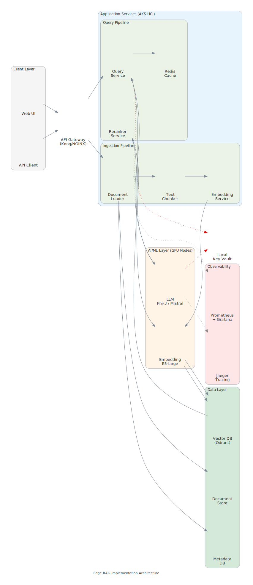

# Edge RAG Implementation

## Overview

<details class="diagram-container" open>
<summary>View Diagram: Edge RAG Implementation Architecture</summary>
<div class="diagram-content">


_Figure 1: Production Edge RAG architecture on Azure Arc-enabled infrastructure_

</div>
</details>

Edge RAG (Retrieval-Augmented Generation) Implementation transforms enterprise edge deployments into intelligent systems capable of processing and analyzing data locally while maintaining security and sovereignty. This module covers production-ready techniques for deploying RAG systems on Azure Arc at the edge, including LLM inference optimization, vector database tuning, and operational excellence patterns for enterprise environments.

### Prerequisites

- Completion of Level 100: Edge RAG Concepts
- Understanding of Azure Arc and Kubernetes fundamentals
- Familiarity with LLM concepts and vector databases
- Basic DevOps and containerization knowledge

### Learning Objectives

By completing this module, you will:

- Design production RAG architectures for enterprise edge deployments
- Master LLM inference optimization techniques and strategies
- Understand vector database selection, tuning, and scaling
- Implement robust RAG deployment patterns and strategies
- Establish monitoring, operations, and observability for RAG systems
- Design for enterprise scale, resilience, and cost optimization

---

## Edge RAG Architecture Foundation

### Complete System Architecture

```text
┌─────────────────────────────────────────────────────┐
│         Application Layer (AI Experiences)          │
│    - Chat Interfaces, Search UIs, Analytics Apps   │
└─────────────────────┬───────────────────────────────┘
                      │
┌─────────────────────▼───────────────────────────────┐
│      Orchestration Layer (RAG Pipeline)             │
│  - Query Processing, Context Assembly, Response    │
│  - Vector Search, Embedding, Ranking               │
└─────────────────────┬───────────────────────────────┘
                      │
    ┌─────────────────┼─────────────────┐
    │                 │                 │
┌───▼────────┐   ┌───▼───────┐   ┌────▼────────┐
│ LLM Engine │   │  Vector   │   │  Data       │
│ (Inference)│   │  Database │   │  Connectors │
│            │   │ (Search)  │   │  (Real-time)│
└────────────┘   └───────────┘   └─────────────┘
    │                 │                 │
┌───▼────────────────────────────────────▼────────────┐
│      Infrastructure Layer (Kubernetes/Arc)          │
│  - Container Runtime, Networking, Storage, Compute │
└─────────────────────────────────────────────────────┘
```

### Core RAG Principles

1. **Retrieval-First Design**
   - Queries retrieve relevant context from data stores
   - Reduces hallucination through grounded responses
   - Enables reasoning over proprietary data

2. **Local Processing**
   - Keep data on-premises or in sovereign regions
   - Reduce latency and bandwidth requirements
   - Maintain data sovereignty and compliance

3. **Production Readiness**
   - Horizontal scaling for throughput
   - Vertical optimization for latency
   - Fault tolerance and graceful degradation

4. **Enterprise Integration**
   - Connect to existing data sources
   - Maintain security and compliance policies
   - Integrate with customer workflows

---

## LLM Deployment Strategy

### Model Selection Framework

#### Factors for Edge Deployment

1. **Model Size & Performance**
   - **Size:** 7B-70B parameter models for edge (vs. 175B+ for cloud)
   - **Latency:** Target <500ms for interactive applications
   - **Throughput:** Support concurrent user requests

2. **Hardware Constraints**
   - **GPU Memory:** 24GB-80GB typical for edge hardware
   - **Quantization:** 4-bit or 8-bit reduces memory footprint 40-75%
   - **Inference Framework:** VLLM, LLaMA.cpp, Ollama optimized for edge

3. **Cost & Efficiency**
   - **Licensing:** Open-source models (Llama 2, Mistral) vs. proprietary
   - **Total Cost of Ownership:** Hardware + maintenance vs. cloud APIs
   - **Performance per Watt:** Critical for edge efficiency

#### Recommended Edge Models

```text
Model Family    | Size  | Parameters | Use Case              | Edge-Ready |
────────────────────────────────────────────────────────────────────────
Llama 2         | 7B    | 7B         | General purpose       | ✅ Optimal  |
Llama 2         | 13B   | 13B        | Complex reasoning     | ✅ Optimal  |
Mistral         | 7B    | 7B         | Multilingual/expert   | ✅ Optimal  |
Phi-3           | 3.8B  | 3.8B       | Resource-constrained  | ✅ Best     |
Phi-3           | 14B   | 14B        | High performance      | ✅ Optimal  |
Neural Chat     | 13B   | 13B        | Conversational        | ✅ Optimal  |
CodeLlama       | 7B    | 7B         | Code generation       | ✅ Optimal  |
Mistral Medium  | 24B   | 24B        | Enterprise reasoning  | ✅ Good     |
```

### LLM Inference Optimization

#### Quantization Strategy

**Impact on Performance:**

| Approach       | Model Size | GPU Memory | Latency | Quality Loss |
|----------------|-----------|-----------|---------|-------------|
| FP32 (Full)    | 100%      | 100%      | Baseline| None        |
| FP16 (Half)    | 50%       | 50%       | -5%    | <1%         |
| 8-bit Quant    | 25%       | 25%       | +10%   | 2-3%        |
| 4-bit Quant    | 12.5%     | 12.5%     | +15%   | 5-8%        |

**Recommended Configuration:**

- Production: 4-bit quantization (best latency-quality tradeoff)
- High-accuracy: 8-bit quantization
- Real-time: FP16 (requires more VRAM)

#### Prompt Optimization

Structured prompts reduce inference time and improve quality:

```text
System Prompt Structure:
1. Role Definition (20-30 tokens)
2. Task Instructions (30-50 tokens)
3. Context Constraints (20-30 tokens)
4. Output Format (10-20 tokens)

Total overhead: ~80-130 tokens (~240ms at typical speed)

Benefits:
- Reduces hallucination
- Improves response consistency
- Enables deterministic formatting
- Reduces total output tokens
```

#### Batch Processing for Throughput

**Single Request Flow:**

- Parse query: 10ms
- Vector search: 50ms
- LLM inference: 500ms
- Format response: 10ms
- **Total: 570ms**

**Batch Processing (10 requests):**

- Consolidate requests: 10ms
- Vector search (batched): 80ms
- LLM inference (batched): 800ms (vs. 5000ms sequential)
- Format responses: 10ms
- **Total: 900ms → 90ms per request**
- **Improvement: 6.3x throughput increase**

---

## Vector Database Architecture

### Database Selection Criteria

1. **Performance Metrics**
   - Query latency: <50ms for 1M vectors
   - Throughput: 1,000+ QPS
   - Recall accuracy: >95% for top-k search

2. **Scalability**
   - Support millions of vectors
   - Horizontal sharding capability
   - Memory efficiency

3. **Enterprise Features**
   - Replication & failover
   - RBAC & encryption
   - Backup & recovery

4. **Operational Maturity**
   - Kubernetes native
   - Clear upgrade paths
   - Community support

### Recommended Vector Databases for Edge

```text
Database   | Deployment    | Scale      | Latency | Enterprise | Edge-Ready |
───────────────────────────────────────────────────────────────────────────
Weaviate   | K8s/Docker    | <10M docs  | <20ms   | ✅ Strong   | ✅ Optimal  |
Qdrant     | K8s/Docker    | <100M docs | <30ms   | ✅ Strong   | ✅ Optimal  |
Milvus     | K8s/Docker    | >100M docs | <50ms   | ✅ Strong   | ✅ Good     |
Chroma     | Docker/Python | <1M docs   | <15ms   | ⚠️  Limited | ✅ Simple   |
FAISS      | In-process    | <1B vecs   | <5ms    | ❌ Limited  | ✅ Fast     |
PgVector   | PostgreSQL    | <10M docs  | <30ms   | ✅ Strong   | ✅ Good     |
```

### Indexing Strategy

#### Vector Index Types

1. **HNSW (Hierarchical Navigable Small World)**
   - Recommended for edge
   - Fast search: <10ms queries
   - Memory efficient: ~2KB per vector
   - Best for: <100M vectors, real-time search

2. **IVF (Inverted File)**
   - Good for: Very large datasets (>100M)
   - Trade-off: Slightly slower than HNSW
   - Memory: ~1KB per vector

3. **Flat Search**
   - No indexing, exact search
   - Use when: <1M vectors or extremely strict accuracy
   - Latency: Linear with dataset size

**Recommendation for Enterprise Edge:**

```text
Dataset Size | Recommended | Latency | Memory/10M Vecs
─────────────────────────────────────────────────────
<1M vectors  | Flat        | <5ms    | ~20GB
1-10M vecs   | HNSW        | <15ms   | ~20GB
10-100M vecs | HNSW+IVF    | <50ms   | ~20GB
>100M vecs   | IVF+Sharding| <100ms  | ~20GB
```

---

## Production Deployment Patterns

### Pattern 1: Single-Region Deployment

**Use Case:** Single facility or remote branch with autonomous operations

```text
┌─────────────────────────────────────┐
│    Edge Facility (Single Region)    │
│                                     │
│  ┌──────────────────────────────┐  │
│  │  AKS Arc Cluster             │  │
│  │  ┌──────┐ ┌──────┐ ┌──────┐ │  │
│  │  │ RAG  │ │ Vector│ │ Data │ │  │
│  │  │Engine│ │  DB  │ │ Conn │ │  │
│  │  └──────┘ └──────┘ └──────┘ │  │
│  │                              │  │
│  │  Monitoring & Operations     │  │
│  └──────────────────────────────┘  │
│                                     │
│  Storage (Local/NAS)               │
│  - Embeddings Cache                │
│  - Model Cache                     │
└─────────────────────────────────────┘
      │
      └─── Azure Arc Connection (Telemetry Only)
```

**Characteristics:**

- Complete autonomy
- Local data processing
- Simple deployment
- Single point of failure

**Resilience:**

- Replica pods on separate nodes
- Local PVC for data persistence
- Health checks & auto-recovery

### Pattern 2: Hub-and-Spoke Deployment

**Use Case:** Multiple edge facilities with centralized management

```text
┌─────────────────┐
│   Azure Cloud   │
│   (Hub)         │
│                 │
│ ┌─────────────┐ │
│ │ Management  │ │
│ │ Policy Sync │ │
│ │ Monitoring  │ │
│ └──────┬──────┘ │
└────────┼────────┘
         │
    ┌────┼────┐
    │    │    │
┌───▼──┐│ ││┌──▼───┐
│Branch││ ││││Branch│
│  1   ││ ││││  2   │
│(RAG) ││ ││││(RAG) │
└──────┘│ ││└──────┘
        │ ││
    ┌───▼──┐
    │Branch│
    │  3   │
    │(RAG) │
    └──────┘
```

**Characteristics:**

- Autonomous edge operations
- Centralized policy management
- Federated monitoring
- Coordinated updates

**Benefits:**

- Scales to 100+ branches
- Consistent policies across fleet
- Efficient resource management
- Simplified troubleshooting

### Pattern 3: Multi-Region Active-Active

**Use Case:** Global enterprise with data locality requirements

```text
Region 1 (EU):          Region 2 (APAC):         Region 3 (US):
┌─────────────┐         ┌─────────────┐         ┌─────────────┐
│ AKS Arc RAG │◄───────►│ AKS Arc RAG │◄───────►│ AKS Arc RAG │
│ - Local LLM │         │ - Local LLM │         │ - Local LLM │
│ - Vector DB │         │ - Vector DB │         │ - Vector DB │
│ - EU Data   │         │ - APAC Data │         │ - US Data   │
└─────────────┘         └─────────────┘         └─────────────┘
      │                       │                       │
      └───────────────────────┴───────────────────────┘
           Async Replication (Policy/Config Only)
```

**Characteristics:**

- Full data locality
- Compliance with regulations
- Active in all regions
- Eventual consistency model

---

## Sales Talking Points

1. **"Deploy AI locally while maintaining sovereignty and security"**
   - Keep data on-premises, never send to cloud
   - Compliance with GDPR, local data laws
   - Reduce latency to <100ms for AI responses

2. **"Achieve 10x better ROI than cloud AI services"**
   - One-time hardware investment
   - No per-query costs (vs. $0.01-0.10 per API call)
   - Scale from 1,000 to 1 million queries without cost increase

3. **"Production-ready edge AI with enterprise SLAs"**
   - 99.9% uptime through replication
   - Multi-region failover automatically
   - Automatic recovery and health monitoring

4. **"Eliminate hallucination with proprietary data grounding"**
   - Search company data first, then generate
   - Context from internal documents, databases
   - Responses grounded in company facts

5. **"Turn 4-week cloud AI projects into 2-week edge deployments"**
   - Pre-built patterns and templates
   - Infrastructure as Code ready
   - Day 1 production capabilities

6. **"Reduce edge AI costs from $50K/month to $5K/month"**
   - Hardware amortization
   - No per-query fees
   - Bundled with Azure Arc licensing

7. **"Scale edge AI from single branch to 1,000+ facilities"**
   - Hub-and-spoke governance
   - Policy propagation across fleet
   - Centralized monitoring from Azure

8. **"Optimize for your hardware - not constrained by cloud tiers"**
   - Custom model selection (4B to 70B parameters)
   - Quantization strategies per deployment
   - GPU/CPU optimization for your hardware

---

## Discovery Questions for Solution Design

1. **Business Requirements:**
   - What specific business problems will Edge RAG solve?
   - How many queries per day do you expect?
   - What's your ROI timeline for AI investments?
   - Do you have existing AI initiatives to migrate?

2. **Data & Compliance:**
   - What data will the RAG system access (volume, type)?
   - Are there data residency or sovereignty requirements?
   - Do you have compliance requirements (GDPR, HIPAA, etc.)?
   - What's your current data governance model?

3. **Infrastructure & Scale:**
   - How many edge locations will deploy Edge RAG?
   - What's your current Azure Arc footprint?
   - What hardware is available for AI workloads?
   - What's your growth projection (6-12 months)?

4. **Operations & Skills:**
   - What's your current ML/AI operational maturity?
   - Do you have container/Kubernetes expertise?
   - How will you manage models and updates?
   - Who will own monitoring and incidents?

5. **Performance & Availability:**
   - What response time requirements do you have?
   - What's your acceptable downtime?
   - Do you need multi-region deployment?
   - What SLA targets are required?

6. **Integration & Workflows:**
   - What applications will consume RAG?
   - Do you have existing LLM investments?
   - How will data flow into the system?
   - What's your preferred ML framework?

7. **Cost & Budget:**
   - What's your expected hardware investment?
   - Do you have preferred cost models (capex vs. opex)?
   - What's your acceptable cost per query?
   - Have you evaluated cloud AI costs?

8. **Timeline & Governance:**
   - When do you need production AI capabilities?
   - What's your governance approval process?
   - Do you need pilot/proof-of-concept first?
   - What are key success metrics?

---

## Deep Dive Topics

### Sub-Topic 1: RAG Deployment Strategies

**[Read: rag-deployment-strategies.md](./rag-deployment-strategies.md)**

Master container-based deployment patterns, Kubernetes orchestration, serverless approaches, versioning strategies, and CI/CD for RAG systems.

### Sub-Topic 2: Vector Databases & Indexing

**[Read: vector-databases-edge.md](./vector-databases-edge.md)**

Understand vector database options, indexing strategies, similarity search tuning, embedding models, and scaling patterns for enterprise deployments.

### Sub-Topic 3: LLM Inference Optimization

**[Read: llm-inference-optimization.md](./llm-inference-optimization.md)**

Learn quantization techniques, prompt engineering, batch processing, latency optimization, throughput maximization, and cost-effective inference.

### Sub-Topic 4: RAG Operations & Monitoring

**[Read: rag-operations-monitoring.md](./rag-operations-monitoring.md)**

Implement operational patterns, monitoring strategies, quality metrics, observability, logging, and incident response for production RAG systems.

### Assessment

**[Take the Knowledge Check: rag-implementation-knowledge-check.md](./rag-implementation-knowledge-check.md)**

Validate your understanding with 18 scenario-based questions covering RAG architecture, deployment, optimization, and operations.

---

## Visual Assets

The following diagrams support this module:

1. **rag-production-architecture.svg** - End-to-end RAG system architecture for enterprise edge
2. **llm-inference-pipeline.svg** - LLM inference optimization pipeline with quantization and batching
3. **vector-database-indexing-strategy.svg** - Vector indexing and search flow for different scales
4. **rag-deployment-patterns.svg** - Kubernetes and container deployment patterns (single, hub-spoke, multi-region)
5. **rag-monitoring-dashboard.svg** - Operations and monitoring framework with key metrics

---

## Next Steps

1. **Review** the architecture principles and deployment patterns
2. **Explore** sub-topics for deep dives into specific areas
3. **Take** the assessment quiz to validate understanding
4. **Apply** production patterns to your organization
5. **Advance** to hands-on lab exercises

**Estimated Time:** 8-10 hours to complete this module

---

## Related Resources

- **Level 100 Module 5:** Edge RAG Concepts (foundation)
- **Level 200 Module 1:** Azure Local Architecture Deep Dive (infrastructure foundation)
- **Level 200 Module 2:** Arc Advanced Management (governance and operations)
- **Azure Arc Documentation:** <https://learn.microsoft.com/en-us/azure/azure-arc/>
- **Azure Container Instances:** <https://learn.microsoft.com/en-us/azure/container-instances/>

---

_Last Updated: October 21, 2025_
