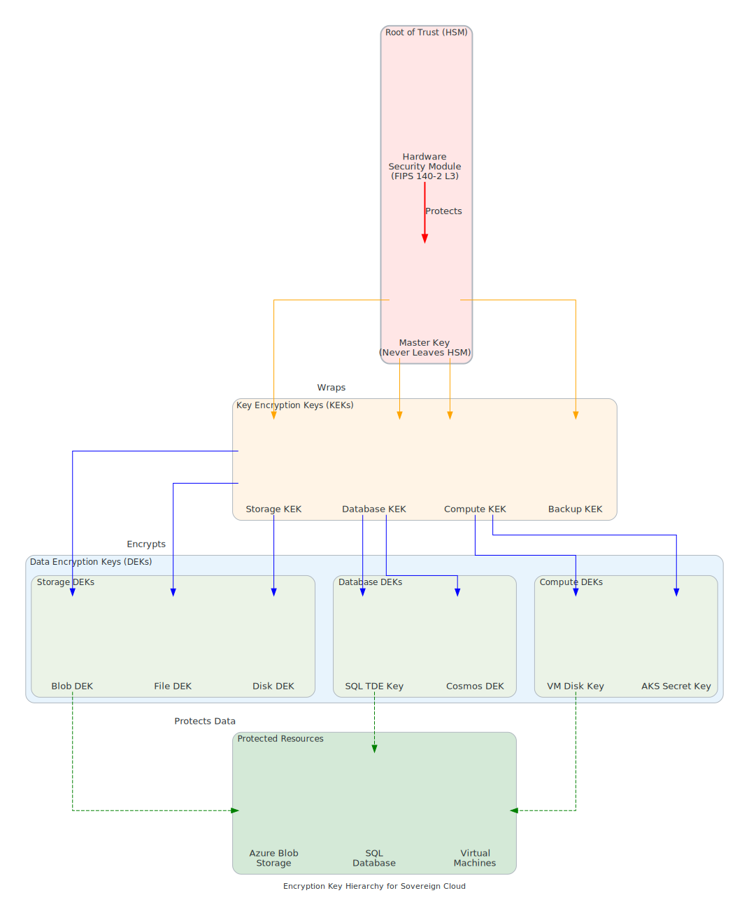

# Encryption & Key Management

{: .note }
> ⏱️ **Reading Time:** 25-30 min | 🎯 **Key Topics:** Key Vault, HSM, BYOK, key rotation, GDPR/FedRAMP | 📋 **Prerequisites:** [Security Compliance Basics](../level-50/security-compliance-basics.md)

## Overview

<details class="diagram-container" open>
<summary>View Diagram: Encryption Key Hierarchy</summary>
<div class="diagram-content" markdown="1">


_Figure 1: Azure Key Vault key hierarchy and management architecture_

</div>
</details>

Encryption is the foundation of data protection in Microsoft Sovereign Cloud deployments. This page covers encryption algorithms, key lifecycle management, Azure Key Vault architecture, disaster recovery, and compliance evidence collection for regulatory requirements like GDPR and FedRAMP.

---

## Encryption Fundamentals

### Encryption Concepts

```text
ENCRYPTION BASICS
═════════════════════════════════════════════════════════════

WHAT IS ENCRYPTION?
─────────────────────────────────────────────────────────
Mathematical transformation of plaintext (readable) into
ciphertext (unreadable) using a cryptographic key.

PLAINTEXT + KEY + ALGORITHM → CIPHERTEXT
(readable)     (secret)  (math)      (encrypted)

Example:
Original message: "Password: secret123"
Encrypted message: "7e8f9a1b2c3d4e5f6a7b8c9d0e1f2a3b"
(Only someone with the KEY can decrypt back to original)

WHY ENCRYPTION MATTERS
─────────────────────────────────────────────────────────
✓ Confidentiality: Even if stolen, data is unreadable
✓ Compliance: Required by GDPR, FedRAMP, HIPAA, PCI-DSS
✓ Trust: Customers trust data is protected
✓ Governance: Regulatory requirement for data residency
✓ Incident response: Reduces harm if breach occurs

WHEN ENCRYPTION IS NEEDED
─────────────────────────────────────────────────────────
Encrypt in Transit:
├─ When data moves across network (within data center)
├─ When data moves across internet (to on-premises)
├─ When data moves between data centers (replication)
└─ When data accessed by client (web/API)

Encrypt at Rest:
├─ When data sits in storage (database, blob)
├─ When data sits in backup (long-term retention)
├─ When data sits on disk (VM storage)
└─ When data sits in cache (Redis, Cosmos DB)

Encrypt in Use:
├─ When data is being processed (memory, CPU)
├─ Using confidential computing (Intel SGX, AMD SEV-SNP)
├─ For highly sensitive workloads (healthcare, finance)
└─ Advanced capability (additional cost)

TYPES OF ENCRYPTION
─────────────────────────────────────────────────────────

Symmetric Encryption (Same key for encryption & decryption):
├─ Algorithm: AES (Advanced Encryption Standard)
├─ Key size: 128, 192, or 256 bits
├─ Speed: Fast (high throughput)
├─ Use case: File, database, volume encryption
├─ Example: "A" encrypts with key K → "B" decrypts with same K
└─ Azure service: AES-256 (default standard)

Asymmetric Encryption (Public key + Private key):
├─ Algorithm: RSA, Elliptic Curve (EC)
├─ Key size: 2048, 3072, 4096 bits (RSA) or 256/384 bits (EC)
├─ Speed: Slower (CPU intensive)
├─ Use case: Key exchange, digital signatures, certificates
├─ Example: "A" encrypts with B's public key → only B with private key can decrypt
└─ Azure service: Certificate management, TLS handshake

Hashing (One-way transformation, not decryptable):
├─ Algorithm: SHA-256, SHA-512, MD5 (deprecated)
├─ Output: Fixed-length hash (256 or 512 bits)
├─ Speed: Very fast
├─ Use case: Password storage, data integrity verification
├─ Example: Password stored as hash, cannot decrypt to original
└─ Azure service: Key Vault secrets, password hashing
```

### Encryption Standards & Algorithms

```text
AZURE ENCRYPTION STANDARDS
═════════════════════════════════════════════════════════════

ENCRYPTION AT REST (Data Stored)
─────────────────────────────────

Standard: AES-256 (Advanced Encryption Standard, 256-bit key)

Why AES-256?
├─ NIST approved (FIPS 197)
├─ Military-grade (NSA Suite B approved)
├─ Unbreakable (2^256 possible keys = brute force infeasible)
├─ Industry standard (used by all major cloud providers)
├─ Compliance: Required by GDPR, FedRAMP, HIPAA, DoD
└─ Performance: Efficient enough for all storage types

Key Derivation:
├─ Master Key (Microsoft-managed or customer-managed)
├─ Data Encryption Key (per-resource)
├─ Authentication Tag (verify data not tampered with)
└─ Nonce/IV (Initialization Vector, prevents pattern repetition)

Azure Storage at-rest encryption:
┌─────────────────────────────────────────┐
│ Plaintext data file                     │
│ (123 MB patient medical records)        │
│         ↓                               │
│ [AES-256 Encryption Engine]             │
│  ├─ Algorithm: Rijndael (AES)           │
│  ├─ Key: 256-bit key from Key Vault     │
│  ├─ Mode: CBC or GCM (authenticated)    │
│  └─ IV: Random per encryption           │
│         ↓                               │
│ Encrypted ciphertext                    │
│ (123 MB of random-looking bytes)        │
└─────────────────────────────────────────┘

ENCRYPTION IN TRANSIT (Data Moving)
─────────────────────────────────────

Standard: TLS 1.3 (Transport Layer Security, latest)

Why TLS 1.3?
├─ IETF approved (RFC 8446)
├─ Faster: 1-RTT handshake (TLS 1.2 was 2-RTT)
├─ More secure: Removed weak algorithms
├─ Perfect forward secrecy: Session key not compromised even if private key stolen
├─ Compliance: Required by modern regulations
└─ Performance: Lower latency, reduced CPU usage

TLS Handshake (simplified):
Step 1: Client sends "Hello" with supported ciphers
Step 2: Server responds with certificate + selected cipher
Step 3: Asymmetric key exchange (RSA or ECDHE)
Step 4: Symmetric session key established
Step 5: Encrypted communication begins
Total: ~100-200ms for handshake

Available Cipher Suites:
├─ ECDHE_RSA_AES_256_GCM_SHA384 (preferred)
├─ ECDHE_RSA_AES_128_GCM_SHA256
├─ DHE_RSA_AES_256_GCM_SHA384
└─ (Weak ciphers disabled for security)

Certificate Requirements:
├─ Valid from trusted CA (Certificate Authority)
├─ Not expired (Azure auto-renews)
├─ Domain matches (CN or SAN)
├─ RSA 2048+ or ECDSA 256+
└─ Signature algorithm: SHA-256 or stronger

Azure Service Examples:
├─ HTTPS (API calls): TLS 1.3 mandatory
├─ Database connections: TLS 1.2+ mandatory
├─ Replication: Internal TLS 1.3 for inter-data center
├─ Backups: Encrypted in transit to recovery vault
└─ ExpressRoute: Encrypted private circuits (not public internet)

AZURE KEY VAULT ENCRYPTION
──────────────────────────

Key Vault stores cryptographic material:
├─ Keys (2048/3072/4096-bit RSA or 256/384-bit EC)
├─ Secrets (passwords, connection strings)
├─ Certificates (X.509 public key certificates)
└─ Storage account keys (for customer-managed encryption)

Master key protection:
├─ At rest: HSM (Hardware Security Module) encrypted
├─ In transit: TLS 1.3 encrypted
├─ Access: RBAC + network policies
├─ Audit: Every access logged
└─ Compliance: FIPS 140-2 Level 3 (or higher)
```

---

## Azure Key Vault Architecture

### Key Vault Design Patterns

```text
AZURE KEY VAULT ARCHITECTURE
═════════════════════════════════════════════════════════════

WHAT IS AZURE KEY VAULT?
─────────────────────────────────────────────────────────

Purpose: Centralized cryptographic key management
├─ Store keys securely (not in code/config files)
├─ Manage key lifecycle (creation, rotation, deletion)
├─ Control access (who can use keys)
├─ Audit usage (track all key operations)
├─ Enable disaster recovery (backup & geo-replication)
└─ Comply with regulations (FIPS 140-2, audit trails)

SERVICE TIER COMPARISON
───────────────────────

Standard Tier:
├─ Cost: ~$0.03 per 10K operations
├─ Protection: Software-backed (encrypted keys)
├─ Performance: Standard (suitable for most workloads)
├─ Compliance: FIPS 140-2 Level 1
├─ Use case: Non-sensitive applications, development
└─ Example: Configuration encryption, non-critical data

Premium Tier (with HSM):
├─ Cost: ~$1.50/hour + operations
├─ Protection: HSM-backed (physical hardware security)
├─ Performance: High (dedicated HSM)
├─ Compliance: FIPS 140-2 Level 3
├─ Use case: Sensitive data, regulated workloads
└─ Example: Healthcare, financial, government

HSM (Hardware Security Module):
├─ Physical device: Tamper-resistant, armed secure processor
├─ Keys never leave: HSM-specific, even Microsoft can't access
├─ Certification: NSA approved for classified data
├─ Compliance: Meets FedRAMP, HIPAA, PCI-DSS requirements
└─ Cost: Higher (~$1.50/hour) but justified for compliance

SINGLE VAULT ARCHITECTURE
──────────────────────────

Simple deployment (single region):

┌─────────────────────────────────────┐
│ Azure Key Vault (West Europe)       │
│                                     │
│ Contents:                           │
│ ├─ Master key (AES-256)             │
│ ├─ Database password                │
│ ├─ API certificate                  │
│ ├─ Customer-managed keys            │
│ └─ Service account credentials      │
│                                     │
│ Access Control:                     │
│ ├─ Azure AD authentication          │
│ ├─ RBAC roles assigned              │
│ ├─ Network: Private endpoint        │
│ └─ Audit: All access logged         │
└─────────────────────────────────────┘

Used by:
├─ Web application (retrieves DB password at startup)
├─ VM extension (retrieves certificate at deployment)
├─ Data factory (retrieves credentials for data sync)
└─ Managed identity (no credentials stored, just Key Vault access)

GEO-REPLICATED VAULT ARCHITECTURE (High Availability)
──────────────────────────────────────

Multi-region deployment:

Primary Vault                    Secondary Vault
(West Europe)                    (North Europe)
┌─────────────────┐             ┌─────────────────┐
│ Azure Key Vault │◄────────────│ Azure Key Vault │
│                 │ Replication │                 │
│ Master key      │ (automatic) │ Master key      │
│ Database pwd    │             │ Database pwd    │
│ Certificates    │ (read-only) │ Certificates    │
│                 │             │                 │
│ Read/Write      │             │ Read-only*      │
└─────────────────┘             └─────────────────┘
        ↑                               ↑
        └──────────────────────────────┘
            Automatic failover if
            primary region down

* Secondary vault becomes read-write during failover

Failover Scenario:
├─ Primary region power outage
├─ Automatic: DNS points to secondary
├─ Promotion: Secondary becomes read-write
├─ Applications: Automatically retry and connect to secondary
├─ Data loss: Zero (real-time sync)
└─ Recovery: 5-10 minutes typical

MANAGED IDENTITY INTEGRATION
────────────────────────────

Scenario: Application needs to access database

Traditional approach (problematic):
├─ Store DB password in config file
├─ Problem: Password in plaintext
├─ Problem: Rotation requires code deployment
├─ Problem: Audit trail weak
└─ Risk: High

Better approach (managed identity + Key Vault):

Application
    │
    ├─ Request: "I'm web-app-prod"
    │ (no password required)
    │
    ↓
Azure AD
    │
    ├─ Verify: "Yes, you are web-app-prod"
    │ (issued when VM created)
    │
    ↓
Key Vault
    │
    ├─ Check RBAC: Can web-app-prod access database secret?
    │ (Yes, assigned role allows it)
    │
    ├─ Return: Database password/connection string
    │ (temporary token, expires in 1 hour)
    │
    ↓
Application
    │
    ├─ Connect to database with credentials
    └─ Audit: Logged who accessed secret and when

Benefits:
├─ No passwords in code/config
├─ Automatic rotation (Key Vault handles it)
├─ Zero downtime rotation (app retries if secret version changed)
├─ Full audit trail (every access logged)
├─ Fine-grained access (RBAC controls)
└─ Multi-cloud compatible (same pattern on AWS/GCP)
```

### Key Rotation Policy

```text
KEY ROTATION LIFECYCLE
═════════════════════════════════════════════════════════════

WHY ROTATE KEYS?
─────────────────────────────────────────────────────────

Risk mitigation:
├─ Compromised key: Limiting exposure window
├─ Employee departure: Revoke old key version
├─ Compliance requirement: Regulations mandate rotation
├─ Cryptanalysis: Old keys more likely to be broken
└─ Best practice: Industry standard (every 90-365 days)

ROTATION POLICY SETUP
─────────────────────

Step 1: Define Rotation Schedule
└─ Frequency: Every 90 days (quarterly)
│  Alternative: Every 30 days (highest security)
│  Alternative: Every 365 days (minimum compliance)
│
├─ Timing: During maintenance window
│  ├─ Example: 2 AM UTC Saturday (low traffic)
│  ├─ Reason: Minimize impact on production
│  └─ Window: 4-hour window for rotation
│
└─ Notification: 7 days before rotation
   └─ Alert: Team reviews, approves rotation

Step 2: Automatic Rotation Configuration

Azure Key Vault Automated Rotation:
├─ Create: New key version automatically
├─ Update: Applications switch to new version
├─ Delete: Old key version (after grace period, default 30 days)
├─ Audit: Track all versions and rotations
└─ Verification: Test new key immediately

Configuration Example:
```

policy {
  rotation_enabled: true
  rotation_interval: 90 days
  notification_before_rotation: 7 days
  auto_rotate: true
  keep_old_versions: true  // for recovery
}

```text

Step 3: Version Management

Key versions:
├─ Version 1: Created Jan 1, 2025
│  ├─ Active: Jan 1 - Mar 31
│  ├─ Retired: Apr 1 (new version created)
│  ├─ Retained: 30 days (recovery)
│  └─ Deleted: May 1
│
├─ Version 2: Created Apr 1, 2025
│  ├─ Active: Apr 1 - Jun 30
│  ├─ Retired: Jul 1
│  └─ Status: Current version
│
└─ Version 3: Created Jul 1, 2025
   ├─ Active: Jul 1 - Sep 30
   └─ Status: Latest version

Application handles versions transparently:
├─ Reference: Key by name, not version
├─ Latest: Always retrieves current version
├─ Fallback: Can request specific version (for recovery)
└─ No code change: Required for rotation

ZERO-DOWNTIME ROTATION PROCESS
───────────────────────────────

Scenario: Rotating database encryption key

Time 0 (Before rotation):
Database encrypted with Key Version 1
├─ Ciphertext: AES-256 with Key V1
├─ All queries: Read existing encrypted data
└─ All writes: Encrypt with Key V1

Time -7 days (Notification):
├─ Alert sent: "Key rotation in 7 days"
├─ Team reviews: "Is rotation safe? Any active backups?"
└─ Approval: "Approved" (or request delay)

Time 0 (Rotation starts):
Step 1: Generate new key
└─ Key Vault: Creates Key V2 (automatically)

Step 2: Configure dual-key decryption
└─ Database: Configure to try V2 first, fall back to V1

Step 3: Re-encrypt existing data (background job)
├─ Job: Scan all encrypted rows
├─ Decrypt: Using Key V1
├─ Re-encrypt: Using Key V2
├─ Update: Database with new ciphertext
├─ Progress: 10,000 rows/second (depending on data volume)
├─ Monitoring: Dashboard shows progress
└─ Duration: For 1TB database, ~24-30 hours

Step 4: Monitor applications
├─ Metrics: Error rates, latency
├─ Alerts: If anything abnormal
├─ Rollback plan: Ready if needed (rare)
└─ Status: Continue with old key if issues

Step 5: Mark old key as retired
├─ Timing: After re-encryption complete
├─ Status: Old key: "Retired" (but kept)
├─ Reason: Can decrypt old versions for compliance
└─ Duration: Keep for 30 days minimum

Time +30 days (Safe deletion):
└─ Old key: Permanently deleted (after grace period)

COMPLIANCE EVIDENCE
──────────────────

For FedRAMP/GDPR auditor:

Audit Report:
┌────────────────────────────────────┐
│ Key Rotation Report: Oct-Dec 2025  │
│                                    │
│ Master Encryption Key (DB):        │
│ ├─ Last Rotation: Sep 30, 2025     │
│ ├─ Next Rotation: Dec 31, 2025     │
│ ├─ Age: 91 days (within policy)    │
│ ├─ Compliance: ✓ PASS              │
│ └─ Version count: 3 versions       │
│                                    │
│ API Certificate Key:               │
│ ├─ Last Rotation: Aug 15, 2025     │
│ ├─ Next Rotation: Nov 15, 2025     │
│ ├─ Age: 77 days (within policy)    │
│ ├─ Compliance: ✓ PASS              │
│ └─ Duration: 90 days per policy    │
│                                    │
│ Key Vault Access Log:              │
│ ├─ Total accesses: 1,247 (month)   │
│ ├─ Authorized accesses: 1,247      │
│ ├─ Denied accesses: 0              │
│ ├─ Anomalous patterns: None        │
│ └─ Status: ✓ PASS (secure)         │
│                                    │
│ COMPLIANCE STATUS: ✓ PASS          │
└────────────────────────────────────┘
```

---

## Disaster Recovery & Backup

### Backup & Recovery Strategy

```text
KEY VAULT BACKUP & DISASTER RECOVERY
═════════════════════════════════════════════════════════════

BACKUP REQUIREMENTS
─────────────────────────────────────────────────────────

Compliance mandates:
├─ GDPR: Backup required for data recovery
├─ FedRAMP: Daily backup required
├─ HIPAA: Business continuity plan required
├─ PCI-DSS: Recovery capability documented
└─ Industry best practice: RPO < 24 hours

Backup types:

Full Backup (All keys, secrets, certificates):
├─ Frequency: Daily
├─ Scope: All content in Key Vault
├─ Storage: Separate geographic region
├─ Encryption: Encrypted backup (can't be read)
└─ Duration: Retained 30 days minimum

Differential Backup (Changes since last full):
├─ Frequency: Every 6 hours
├─ Scope: Only new/modified items
├─ Size: Smaller than full backup
├─ Cumulative: Requires last full backup for restore
└─ Use case: Faster recovery, more frequent restores

BACKUP ARCHITECTURE
───────────────────

Primary Key Vault              Backup Storage
(West Europe)                  (North Europe)
┌──────────────────┐           ┌──────────────┐
│ Key Vault        │──Daily──→│ Backup Vault │
│ ├─ Master key    │ Encrypted├─ Copy of all │
│ ├─ DB password   │  backup  │   keys       │
│ ├─ Certificates  │          │              │
│ └─ Credentials   │          │              │
└──────────────────┘           └──────────────┘
                                    │
                                    ├─ Stored: Encrypted
                                    │ at rest (AES-256)
                                    │
                                    ├─ Access: Restricted
                                    │ (need RBAC permission)
                                    │
                                    └─ Retention: 30 days
                                      (rolling window)

Recovery Scenario (Primary Key Vault destroyed):
├─ Detection: Health check fails, no response
├─ Notification: Team alerted automatically
├─ Decision: Activate DR (seconds after detection)
├─ Restore: Backup vault activated as primary
├─ Verification: Test restore (manual approval)
└─ Duration: < 5 minutes typical (near-zero downtime)

BACKUP ENCRYPTION
──────────────────

Backup file security:
├─ Encryption: AES-256 (same as production keys)
├─ Storage: Azure Storage with encryption enabled
├─ Access: Requires separate RBAC permission
├─ Audit: Every backup access logged
├─ Network: Private endpoint (not internet-accessible)
└─ Compliance: Meets all regulatory requirements

Key protection during backup:
├─ Master key: Protected by HSM (if Premium tier)
├─ Encryption: Never stored in plaintext
├─ Integrity: Authentication tag prevents tampering
├─ Verification: Backup tested monthly for restore capability
└─ Documentation: Chain of custody maintained

RECOVERY TESTING
─────────────────────────────────────────────────────────

Quarterly Recovery Drill:

Step 1: Prepare (Week before)
├─ Schedule: Off-peak hours (Saturday 2 AM)
├─ Team: On-call, ready to respond
├─ Infrastructure: Test environment available
└─ Notification: Stakeholders informed

Step 2: Execute (Day of drill)
├─ Simulate: Primary Key Vault becomes unavailable
├─ Trigger: Automated failover to backup
├─ Restore: Keys/secrets to test environment
├─ Verification: All keys restored correctly
└─ Applications: Test with restored keys

Step 3: Validate (During recovery)
├─ Connectivity: Network routes working
├─ Authentication: Azure AD working
├─ Decryption: Can decrypt old ciphertext
├─ Performance: Latency acceptable
├─ Completeness: All secrets present
└─ Audit: Logs show recovery actions

Step 4: Document (After recovery)
├─ Report: What worked, what needs improvement
├─ Timeline: How long recovery took
├─ Issues: Any problems encountered
├─ Fixes: What to improve
└─ Status: ✓ Recovery capability verified

COMPLIANCE EVIDENCE
──────────────────

Backup Compliance Report:
┌────────────────────────────────────┐
│ Q4 2025 Key Vault Backup Report    │
│                                    │
│ Backup Schedule:                   │
│ ├─ Full Backup: Daily (23:00 UTC)  │
│ ├─ Differential: Every 6 hours     │
│ ├─ Retention: 30 days              │
│ └─ Compliance: ✓ FedRAMP (daily)   │
│                                    │
│ Backups Completed This Quarter:    │
│ ├─ Successful: 92 backups          │
│ ├─ Failed: 0                       │
│ ├─ Success rate: 100%              │
│ └─ Average size: 45 MB             │
│                                    │
│ Recovery Drills:                   │
│ ├─ Q3 2025: Successful             │
│ ├─ Recovery time: 3 min 42 sec     │
│ ├─ Data integrity: ✓ Verified      │
│ └─ Status: ✓ PASS                  │
│                                    │
│ COMPLIANCE STATUS: ✓ PASS          │
└────────────────────────────────────┘
```

---

## Compliance Evidence Collection

### Audit Trail & Logging

```text
KEY VAULT AUDIT & COMPLIANCE LOGGING
═════════════════════════════════════════════════════════════

AUDIT LOGGING REQUIREMENTS
─────────────────────────────────────────────────────────

GDPR requirements:
├─ Who: Track identity of person accessing key
├─ What: Track which key/secret accessed
├─ When: Timestamp of access
├─ Why: Purpose/reason for access (from code)
├─ Result: Success/failure of operation
└─ Duration: Retain logs for minimum 3 years

FedRAMP requirements:
├─ All access logged (including failures)
├─ Tamper-proof logs (encrypted, signed)
├─ Real-time alerting (suspicious patterns)
├─ Compliance dashboard (monthly reports)
└─ Audit trail: Comprehensive reconstruction

AUDIT LOG ENTRIES
──────────────────

Every Key Vault operation generates log entry:

```

[2025-10-21 14:30:45 UTC]
Operation: GetSecret
Resource: database-password (version 3)
Caller: web-app-prod (managed identity)
Result: Success
IP Address: 10.0.1.45 (internal)
Duration: 147 ms
Audit Status: Logged + Encrypted
Risk Score: Low (authorized, normal time)
Compliance: ✓ Logged (GDPR/FedRAMP compliant)

```text

Log fields:
├─ Timestamp: Exact time of operation (UTC)
├─ Operation: GetSecret, CreateKey, DeleteSecret, etc.
├─ Resource: Key/secret name and version
├─ Caller: User, managed identity, or service
├─ Result: Success, Forbidden, NotFound
├─ IP address: Source network (internal/external)
├─ Duration: How long operation took
├─ Response code: HTTP status (200, 403, 404)
├─ User-Agent: Application requesting key
├─ Request correlation: Trace across systems
└─ Encryption: Log entry encrypted at rest

AZURE MONITOR INTEGRATION
──────────────────────────

Key Vault logs → Azure Monitor:

┌──────────────────────────┐
│ Key Vault               │
│ (generates access logs) │
└────────────┬────────────┘
             │
             ├─→ Azure Storage
             │   (log archive)
             │
             ├─→ Log Analytics
             │   (queryable logs)
             │
             └─→ Event Hubs
                 (real-time stream)

Querying logs (KQL - Kusto Query Language):

// Find all access to database password
KeyVaultAuditLogs
| where ResourceName == "database-password"
| where TimeGenerated > ago(30d)
| summarize AccessCount = count() by Caller
| sort by AccessCount desc

Result:
Caller                    AccessCount
────────────────────────────────────
web-app-prod             1,247
batch-processor-job      145
manual-admin-access      3
────────────────────────────────────

// Find failed access attempts
KeyVaultAuditLogs
| where OperationStatus == "Failed"
| where TimeGenerated > ago(7d)
| summarize FailureCount = count() by Caller, ErrorCode

Result:
Caller           ErrorCode              FailureCount
──────────────────────────────────────────────────
unknown-app      Unauthorized           3
decommissioned-vm NotFound             5
──────────────────────────────────────────────────

ALERTS & DETECTION
──────────────────

Suspicious pattern detection:

Alert 1: Failed authentication attempts
├─ Trigger: > 5 failed attempts in 5 minutes
├─ Action: Automatically block source IP
├─ Notification: Security team + audit log
└─ Investigation: Why is this trying to access?

Alert 2: After-hours access (unusual time)
├─ Trigger: Key access outside normal business hours
├─ Context: Normal patterns learned (Mon-Fri 8am-6pm)
├─ Action: Alert but allow (may be on-call)
└─ Investigation: Confirm authorized access

Alert 3: Access from new location
├─ Trigger: Access from IP never seen before
├─ Example: Developer accessing from airport (unusual)
├─ Action: MFA challenge + notification
└─ Investigation: Confirm identity

Alert 4: Bulk key access
├─ Trigger: Accessing > 10 different keys in 1 minute
├─ Example: Potential key theft/exfiltration attempt
├─ Action: Block immediately + incident response
└─ Investigation: Forensics + potential breach

COMPLIANCE EVIDENCE TEMPLATES
─────────────────────────────

For GDPR Auditor (Right to Access):

Question: "Show me all access to personal data keys"

Response Document:
```

Key Vault Audit Report: Personal Data Keys
Request Period: Oct 1 - Oct 31, 2025
Generated: Oct 31, 2025

KEYS IN SCOPE:
├─ customer-pii-encryption-key
├─ patient-medical-records-key
└─ employee-salary-data-key

ACCESS SUMMARY:
Total accesses: 847
Authorized: 847 ✓
Unauthorized: 0
Anomalies: 0

ACCESS DETAILS (by day):
Oct 1:  32 accesses (app-prod: 28, manual: 4) ✓
Oct 2:  34 accesses (app-prod: 31, manual: 3) ✓
...
Oct 31: 28 accesses (app-prod: 25, manual: 3) ✓

ALL ACCESSES AUTHORIZED AND LOGGED
Evidence Quality: HIGH (encrypted logs, signatures verified)
Compliance: ✓ GDPR COMPLIANT

```text

For FedRAMP Auditor (Continuous Monitoring):

Question: "Demonstrate encryption key management compliance"

Response Document:
```

FedRAMP Monthly Compliance Report: Encryption
Month: October 2025

CONTROL: CM-3 (Key Lifecycle Management)

Status: ✓ COMPLIANT

Evidence:

1. Key rotation policy documented
   - Rotation frequency: 90 days
   - Last rotation: August 31, 2025 (60 days ago, within policy)
   - Next rotation: November 30, 2025 (within 30-day window)

2. Key backup verified
   - Last backup: October 20, 2025 (successful)
   - Backup verified: October 20, 2025 (restore test passed)
   - Retention: 30 days (compliant with recovery requirements)

3. Access audit logs
   - Audit entries: 847 in October (all authorized)
   - Failed access attempts: 0
   - Unusual patterns: 0
   - Log retention: 3 years (exceeds 1-year requirement)

4. Disaster recovery
   - Last DR test: September 15, 2025 (passed)
   - Recovery time objective: 5 minutes (met)
   - Recovery point objective: Daily (met)

COMPLIANCE: ✓ PASS (All requirements met)

```text
```

---

## Related Topics

- **Main Page:** [Compliance & Security Patterns](./compliance-security-patterns.md)
- **GDPR:** [GDPR Implementation & Data Residency](./gdpr-implementation.md)
- **FedRAMP:** [FedRAMP Compliance Path](./fedramp-compliance.md)
- **Security:** [Security Hardening Patterns](./security-hardening.md)
- **Assessment:** [Compliance & Security Knowledge Check](./compliance-knowledge-check.md)

---

_Last Updated: October 21, 2025_
