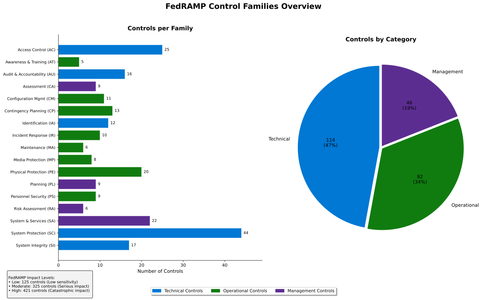

# FedRAMP Compliance & Authorization

## Overview

FedRAMP (Federal Risk and Authorization Management Program) is the U.S. government's program for authorizing cloud services. This page covers FedRAMP compliance requirements, the authorization process, control families, and continuous monitoring, with focus on how Microsoft Sovereign Cloud supports FedRAMP compliance for government and critical infrastructure workloads.

---

## FedRAMP Fundamentals

### What is FedRAMP?

<details class="diagram-container">
<summary>View Diagram: FedRAMP Control Families Overview</summary>
<div class="diagram-content">


_Figure 1: FedRAMP control families based on NIST SP 800-53, organized by technical, operational, and management categories_

</div>
</details>

```text
FedRAMP: Federal Risk and Authorization Management Program
═════════════════════════════════════════════════════════════

PURPOSE:
├─ Create standardized security assessment process
├─ Reduce redundant authorizations across agencies
├─ Accelerate secure cloud adoption in government
└─ Protect federal data and systems

REQUIREMENT:
Any cloud service handling U.S. government data must be
FedRAMP authorized (no exceptions).

GOVERNANCE:
├─ GSA (General Services Administration): Overall oversight
├─ NIST (National Institute of Standards & Technology): Standards
├─ ODNI (Office of Director National Intelligence): Intelligence agencies
├─ DoD (Department of Defense): Defense-specific requirements
└─ OMB (Office of Management & Budget): Policy direction

HISTORICAL CONTEXT:
2011: FedRAMP established (NIST SP 800-53 as baseline)
2013: First authorizations granted
2015: DoD-specific requirements (IL2, IL4, IL5)
2018: Intelligence Community requirements
2022: FedRAMP Modernization Initiative
2024: Enhanced continuous monitoring requirements
```

### Authorization Levels

```text
FedRAMP AUTHORIZATION LEVELS
═════════════════════════════════════════════════════════════

Three levels based on impact analysis:

LEVEL 1: LOW IMPACT (Provisional Authority to Operate - Low)
┌──────────────────────────────────────────┐
│ Scope: Unclassified public information   │
│ Impact: Low (limited harm if breached)   │
│ Controls: ~53 baseline controls          │
│ Risk: Minimal                            │
│                                          │
│ Example workloads:                       │
│ ├─ Public website hosting                │
│ ├─ Non-sensitive publishing              │
│ ├─ Customer-facing portal                │
│ └─ General administrative apps           │
│                                          │
│ Time to authorize: 3-6 months            │
│ Cost estimate: $150K-300K                │
│ Renewal: Every 3 years                   │
│ Continuous monitoring: Quarterly         │
└──────────────────────────────────────────┘

LEVEL 2: MODERATE IMPACT (PA-M or ATO Moderate)
┌──────────────────────────────────────────┐
│ Scope: PII, financial, operational data  │
│ Impact: Medium (significant harm)        │
│ Controls: ~110 baseline controls         │
│ Risk: Manageable                         │
│                                          │
│ Example workloads:                       │
│ ├─ Citizens' tax records                 │
│ ├─ Benefit eligibility systems           │
│ ├─ Federal employee HR systems           │
│ ├─ Medical insurance data                │
│ └─ Financial transaction systems         │
│                                          │
│ Time to authorize: 6-12 months           │
│ Cost estimate: $300K-750K                │
│ Renewal: Every 3 years                   │
│ Continuous monitoring: Monthly           │
└──────────────────────────────────────────┘

LEVEL 3: HIGH IMPACT (PA-H or ATO High)
┌──────────────────────────────────────────┐
│ Scope: Classified/sensitive data         │
│ Impact: High (critical harm)             │
│ Controls: ~170+ baseline controls        │
│ Risk: Highly controlled                  │
│                                          │
│ Example workloads:                       │
│ ├─ Secret/Top Secret (DoD)               │
│ ├─ Intelligence systems                  │
│ ├─ Nuclear command & control             │
│ ├─ Missile defense systems               │
│ └─ Critical infrastructure (power, water)│
│                                          │
│ Time to authorize: 12-24 months          │
│ Cost estimate: $1M-3M+                   │
│ Renewal: Every 3 years                   │
│ Continuous monitoring: Real-time         │
│ Additional requirement: FedRAMP-specific │
│ assessment team (3A)                     │
│                                          │
│ DoD-specific variants:                   │
│ ├─ DoD IL2: Moderate impact              │
│ ├─ DoD IL4: High impact                  │
│ ├─ DoD IL5: Top Secret equivalent        │
│ └─ More restrictive than commercial      │
└──────────────────────────────────────────┘

CHOOSING YOUR LEVEL:
────────────────────
Questions to ask:
1. What type of data? (Public / PII / Classified)
2. What's the potential harm? (Low / Medium / High)
3. Who's your primary customer? (GSA / DoD / IC / Commerce)
4. What's your budget? (Lower budget = Level 1)

Decision Tree:
├─ Public data only? → Level 1 (Low)
├─ Citizen PII or financial? → Level 2 (Moderate)
├─ Classified or critical infrastructure? → Level 3 (High)
└─ Unsure? → Start with Level 2 (most common)
```

---

## NIST Control Framework

### Control Families (SP 800-53)

```text
NIST SP 800-53: Security and Privacy Controls
═════════════════════════════════════════════════════════════

FedRAMP baseline controls organized in 23 families:

1. ACCESS CONTROL (AC) - 22 controls
   ├─ Policy and procedures
   ├─ Account management
   ├─ Access enforcement
   ├─ Information flow enforcement
   ├─ Separation of duties
   ├─ Least privilege
   └─ Concurrent session control

2. AWARENESS AND TRAINING (AT) - 4 controls
   ├─ Security awareness training
   ├─ Security training records
   ├─ Role-based training
   └─ Insider threat awareness

3. AUDIT AND ACCOUNTABILITY (AU) - 12 controls
   ├─ Audit logging
   ├─ Audit review and analysis
   ├─ Audit retention
   ├─ Cryptographic protection of logs
   └─ Non-repudiation

4. SECURITY ASSESSMENT AND AUTHORIZATION (CA) - 9 controls
   ├─ Security assessment procedures
   ├─ Assessment documentation
   ├─ System authorization
   ├─ Periodic assessment
   └─ Security review

5. CONFIGURATION MANAGEMENT (CM) - 9 controls
   ├─ Configuration management plan
   ├─ Baseline configuration
   ├─ Configuration change control
   ├─ Monitoring configuration changes
   └─ Access restrictions for configuration

6. IDENTIFICATION AND AUTHENTICATION (IA) - 8 controls
   ├─ User identification and authentication
   ├─ Multi-factor authentication
   ├─ Password policy
   ├─ Device identification and authentication
   └─ Cryptographic key management

7. INCIDENT RESPONSE (IR) - 8 controls
   ├─ Incident response capability
   ├─ Incident handling
   ├─ Incident monitoring
   ├─ Incident response testing
   └─ Coordination with external agencies

8. MAINTENANCE (MA) - 7 controls
   ├─ Maintenance and repairs
   ├─ Maintenance records
   ├─ Controlled maintenance
   ├─ Remote maintenance restrictions
   └─ Maintenance tools and techniques

9. MEDIA PROTECTION (MP) - 8 controls
   ├─ Media storage
   ├─ Media sanitization
   ├─ Media transport
   ├─ Sensitive information handling
   └─ Spillage response

10. PHYSICAL AND ENVIRONMENTAL PROTECTION (PE) - 16 controls
    ├─ Facility access controls
    ├─ Security gates and perimeter
    ├─ Surveillance and monitoring
    ├─ Physical security personnel
    ├─ Access logging and monitoring
    ├─ Delivery and removal
    ├─ Environmental controls
    ├─ Fire protection
    ├─ Emergency procedures
    └─ Telecommunications protection

11. PLANNING (PL) - 8 controls
    ├─ Information security plan
    ├─ System security plan
    ├─ Rules of behavior
    ├─ Information security program plan
    └─ Plan dissemination and updates

12. PERSONNEL SECURITY (PS) - 8 controls
    ├─ Position categorization
    ├─ Personnel screening
    ├─ Personnel termination
    ├─ Personnel transfers
    ├─ Access agreements
    ├─ Sanctions process
    └─ Insider threat program

13. RISK ASSESSMENT (RA) - 5 controls
    ├─ Risk assessment
    ├─ Vulnerability scanning
    ├─ Penetration testing
    ├─ Risk monitoring
    └─ Threat analysis

14. SYSTEM AND SERVICES ACQUISITION (SA) - 17 controls
    ├─ Acquisition strategy
    ├─ Allocation of security requirements
    ├─ Information system documentation
    ├─ Acquired information systems
    ├─ Information system development tools
    ├─ Configuration management
    ├─ Risk-based information system reviews
    ├─ Software usage
    ├─ Acquisition process
    ├─ Developer security testing
    ├─ Supply chain risk
    └─ Third-party contracts

15. SYSTEM AND COMMUNICATIONS PROTECTION (SC) - 42 controls
    ├─ Security categorization
    ├─ System boundaries
    ├─ Access points
    ├─ External system connections
    ├─ Denial of service protection
    ├─ Resource priority
    ├─ Boundary protection
    ├─ Transmission confidentiality/integrity
    ├─ Cryptographic protection
    ├─ Secure name resolution
    ├─ Protocol use restrictions
    ├─ Monitoring communications at boundaries
    └─ System information integrity

16. SYSTEM AND INFORMATION INTEGRITY (SI) - 18 controls
    ├─ Flaw identification and remediation
    ├─ Malicious code protection
    ├─ Information system monitoring
    ├─ Security testing and evaluation
    ├─ Information input validation
    ├─ Error handling
    ├─ Information output handling
    ├─ Defective information detection
    └─ Artifact handling and retention

Plus 7 additional families (17-23) for specialized requirements

MAPPING TO AZURE SERVICES:
──────────────────────────
AC (Access Control) → Azure RBAC, Azure AD, conditional access
AU (Audit/Logging) → Azure Monitor, Log Analytics, Application Insights
CM (Configuration) → Azure Policy, Guest Configuration, Change Tracking
IA (Identity) → Azure AD, MFA, certificate management
IR (Incident Response) → Azure Sentinel, Security Center
SC (Communication Protection) → TLS, Private Endpoints, Network Security
SI (System Integrity) → Defender for Cloud, patching, monitoring
```

### Control Implementation Examples

```text
EXAMPLE 1: AC-2 Account Management
═════════════════════════════════════════════════════════════

Control: "Manage information system accounts"

WHAT IT MEANS:
├─ Create formal procedures for account management
├─ Implement automated mechanisms for account creation
├─ Control privileged access accounts separately
├─ Monitor account creation, activation, modification
└─ Remove/disable unused accounts within 90 days

AZURE IMPLEMENTATION:

Step 1: Azure AD Setup
├─ Enable Microsoft Entra ID (formerly Azure AD)
├─ Configure user provisioning automation
├─ Set password policies (complexity, expiration)
└─ Enable MFA requirement for all users

Step 2: Define Privileged Accounts
├─ Azure AD Privileged Identity Management (PIM)
├─ Define eligible roles (VM Admin, Storage Account Owner)
├─ Require approval for elevation
├─ Time-limited access (max 1 hour default)
└─ Audit all privileged access

Step 3: Access Reviews
├─ Quarterly access reviews
│  └─ Managers confirm: "Is this person still authorized?"
├─ Remove: Accounts with no positive confirmation
├─ Update: Modify permissions based on new role
└─ Document: Evidence for FedRAMP auditor

Step 4: Deprovisioning Process
├─ Employee termination notification
├─ Automatic: Disable all accounts within 24 hours
├─ Remove: From all groups and subscriptions
├─ Archive: User's files/email (legal hold if needed)
└─ Document: Evidence of removal and timestamp

EVIDENCE FOR AUDITOR:
├─ Account creation log: Dates, requestor, approver
├─ Quarterly access reviews: Names, dates, approvals
├─ Disabled accounts: Termination date, deprovisioning date
├─ Policy documentation: Published procedures
└─ Exception log: Approved exceptions with business justification

LEVEL 1 vs LEVEL 3 DIFFERENCE:
┌────────────────┬──────────┬──────────┐
│ Requirement    │ Level 1  │ Level 3  │
├────────────────┼──────────┼──────────┤
│ Review Freq    │ Annual   │ Quarterly│
│ MFA Required   │ Yes      │ Yes*     │
│ Privileged Sep │ Partial  │ Complete │
│ Timeout        │ 8 hours  │ 1 hour   │
│ Audit Trail    │ 1 year   │ 3 years  │
│ Exception Log  │ Manual   │ Automated│
└────────────────┴──────────┴──────────┘

* Level 3: MFA mandatory, exception requires CIO approval
```

---

## FedRAMP Authorization Process

### Path to Authorization

```text
FEDRAMP AUTHORIZATION JOURNEY (12-18 months typical)
═════════════════════════════════════════════════════════════

PHASE 1: PREPARATION (Months 1-2, Internal)
═════════════════════════════════════════════

Week 1: Assessment Scope Definition
├─ Define system boundaries
├─ Identify data flows
├─ Map to NIST controls
├─ Determine authorization level
└─ Assign team members

Week 2-3: Documentation Sprint
├─ Write security plan (System Security Plan - SSP)
├─ Document policies and procedures
├─ Create configuration baselines
├─ Identify control implementations
└─ Develop evidence collection process

Week 4: 3A Selection
├─ Choose Third-Party Assessment Organization (3A)
├─ 3A vendor list published by GSA
├─ Get quotes (typically $200K-500K for assessment)
├─ Negotiate terms and timeline
├─ Establish contract

Deliverables:
├─ System Security Plan (250+ pages typical)
├─ Complete control mappings
├─ Risk assessment report
├─ Incident response plan
└─ Contingency and business continuity plan

PHASE 2: ASSESSMENT (Months 3-6, with 3A)
═════════════════════════════════════════════

Week 1: Kick-off
├─ 3A receives all documentation
├─ Schedule assessment activities
├─ Plan on-site visits
├─ Define evidence requirements
└─ Establish communication protocols

Weeks 2-8: On-site Assessment Activities

Activity 1: Configuration Review (2 weeks)
├─ Verify actual infrastructure matches SSP
├─ Check: OS versions, patch levels, settings
├─ Review: Network architecture, access controls
├─ Validate: Encryption settings, key management
└─ Evidence: Screenshots, configuration dumps

Activity 2: Policy Review (1 week)
├─ Validate: Incident response procedures exist
├─ Check: Personnel security training documented
├─ Review: Change management process
├─ Verify: Audit logging procedures
└─ Evidence: Policies, training records, logs

Activity 3: Testing (2 weeks)
├─ Vulnerability scanning: Automated tools
├─ Penetration testing: Simulated attacks
├─ Access control testing: Authentication/authorization
├─ Encryption validation: Algorithm strength verification
└─ Evidence: Test reports, remediation logs

Activity 4: Interview (1 week)
├─ Key personnel interviews: Staff responsible for controls
├─ Scenario-based questions: "What happens if X occurs?"
├─ Evidence: Interview notes, policies, response procedures
└─ Clarify: Any gaps or inconsistencies

Weeks 9-12: Remediation
├─ Identify deficiencies (if any)
├─ Develop remediation plan
├─ Implement fixes
├─ Retest controls
└─ Document evidence of remediation

Deliverables:
├─ System Security Assessment Report (100+ pages)
├─ Control assessment results: Satisfied / Not Satisfied / Compliant
├─ Findings and recommendations
├─ Risk summary
└─ 3A recommendation: "Ready for Authorization" or "Needs more work"

PHASE 3: AUTHORIZATION DECISION (Months 7-10)
═════════════════════════════════════════════════

Week 1-2: Agency Review
├─ Receiving agency (customer) reviews 3A report
├─ Agency's Chief Information Security Officer (CISO) reviews
├─ Risk review: Determine acceptable risk level
├─ Business decision: "Are we willing to accept this risk?"
└─ Escalate if needed: Executive approval

Week 3-4: GSA/FedRAMP PMO Review
├─ GSA reviews documentation
├─ Verify: All required controls are addressed
├─ Check: Documentation quality and completeness
├─ Approve: or request additional information
└─ Coordinate: With other federal agencies

Week 5: ATO (Authority to Operate) Issued
├─ Formal authorization letter signed
├─ Specific conditions/requirements documented
├─ System can now process federal data
├─ Authorization valid for 3 years
└─ Continuous monitoring requirements begin

Deliverables:
├─ Authority to Operate (ATO) letter (official)
├─ Conditions of authorization
├─ Continuous monitoring requirements
├─ Audit schedule
└─ Compliance remediation roadmap

PHASE 4: CONTINUOUS MONITORING (Years 1-3+, Ongoing)
═════════════════════════════════════════════════════════════

Monthly Activities:
├─ Security log review (Azure Monitor, Sentinel)
├─ Configuration drift detection (Azure Policy)
├─ Patch status verification
├─ Access review (privileged access)
└─ Incident tracking (any security events)

Quarterly Review (Every 3 months):
├─ Compliance dashboard update
├─ Risk assessment update
├─ Control status review
├─ Remediation tracking
└─ Report to agency CISO

Annual Review (Every 12 months):
├─ Comprehensive control reassessment
├─ Vulnerability assessment (external scan)
├─ Penetration test (if Level 2+)
├─ Policy updates (if any)
└─ Update System Security Plan

Renewal (Every 3 years):
├─ Complete reassessment (mini FedRAMP)
├─ Updated 3A assessment
├─ Revalidate: All controls still effective
├─ Update: Documentation and evidence
└─ New ATO issued

TIMELINE SUMMARY:
───────────────
Phase 1 (Preparation):        2 months
Phase 2 (Assessment):         3-4 months
Phase 3 (Authorization):      1-2 months
Total to First ATO:           6-8 months

Common reasons for delays:
├─ Finding during assessment (requires fix + retest)
├─ Incomplete documentation (must be perfected)
├─ Business approval delays (executive sign-off)
├─ 3A capacity (high demand, long waits)
└─ Agency review processes (bureaucratic delays)

Recommended timeline planning:
├─ Plan for 12-18 months (realistic)
├─ Budget: $300K-750K for Level 2
├─ Team: 3-5 people for 12+ months
└─ Executive commitment: Required throughout
```

### Continuous Monitoring Requirements

```text
FEDRAMP CONTINUOUS MONITORING (After Authorization)
═════════════════════════════════════════════════════════════

MONTHLY REQUIREMENTS:
─────────────────────

Log Review
├─ Azure Monitor queries for security events
├─ Authentication failures (investigate >10 per day)
├─ Privileged access (every elevation logged and reviewed)
├─ Configuration changes (approval tracking)
├─ System errors (especially security-related)
└─ Evidence: Signed log summary for monthly report

Patch Status
├─ All servers: Patch status (current, pending, failed)
├─ Critical patches: Applied within 30 days
├─ Security patches: Applied within 60 days
├─ Database patches: Applied within 90 days
├─ Exception process: Documented for non-compliant systems
└─ Evidence: Patch inventory report with apply dates

Access Review
├─ Privileged access audit (who accessed what, when, why)
├─ Verify: All privileged access was authorized
├─ Duration: Check session times are appropriate
├─ Deactivate: Unused privileged accounts (>60 days unused)
└─ Evidence: Signed monthly access report

Incident Tracking
├─ Security events: Logged in incident management system
├─ Investigation: Root cause and remediation documented
├─ Trend analysis: Any patterns or repeated issues
├─ Remediation: Evidence of fix implementation
└─ Evidence: Incident summary with outcomes

Compliance Dashboard
├─ System health score
├─ Control status: Satisfied / Not Satisfied / Monitored
├─ Risk trends: Increasing / Stable / Decreasing
├─ Upcoming items: Expiring certificates, reviews due
└─ Distribution: To agency CISO by 5th business day

QUARTERLY REQUIREMENTS:
──────────────────────

Deep Dive Assessment (Every 90 days):
├─ Review: Last 90 days of logs (5+ GB typical)
├─ Analyze: Patterns, anomalies, trend analysis
├─ Re-test: 3-5 randomly selected controls
├─ Verification: Controls still functioning as designed
├─ Interview: Technical staff (quarterly check-in)
└─ Evidence: 20-30 page quarterly assessment report

Risk Assessment Update
├─ New vulnerabilities: Check against system
├─ New threats: Update threat model
├─ Technology changes: New Azure services introduced?
├─ Business changes: New data types? New users? New locations?
├─ Re-calculate: Overall risk score
└─ Evidence: Updated risk assessment document

ANNUAL REQUIREMENTS:
────────────────────

Comprehensive Assessment (Once per year):
├─ Vulnerability scan: Full external network scan
├─ Configuration audit: Comprehensive compliance check
├─ Policy review: Policies still current? Updated?
├─ Penetration test: Simulated attack (Level 2+)
├─ Personnel interviews: 5-10 staff knowledge check
└─ Evidence: Annual assessment report (50+ pages typical)

FEDRAMP MONTHLY REPORTING FORMAT:
─────────────────────────────────
System Security Plan version: [version number]
Reporting month: October 2025
System: Healthcare Data Portal
Authorization date: June 2024
ATO expiration: June 2027

CONTROL STATUS SUMMARY:
┌────────────────┬──────┬──────┬──────┐
│ Family         │  Met │  NM* │ NA   │
├────────────────┼──────┼──────┼──────┤
│ Access Control │  22  │  0   │  0   │
│ Audit & Acct   │  12  │  0   │  0   │
│ Security Assess│   9  │  0   │  0   │
│ System & Comm  │  42  │  0   │  0   │
├────────────────┼──────┼──────┼──────┤
│ TOTAL          │ 180  │  0   │  0   │
│ % COMPLIANT    │100%  │  -   │  -   │
└────────────────┴──────┴──────┴──────┘
* NM = Not Met (needs remediation)

INCIDENT SUMMARY:
Security incidents this month: 1
├─ Incident: Failed login attempts (28 total)
├─ Root cause: User password reset, test attempts
├─ Resolution: User trained, no access granted
├─ Risk: Low (all attempts blocked)
└─ Status: Closed, trend normal

UPCOMING ITEMS:
├─ Certificate expiration: Oct 28 (8 days)
├─ Patch Tuesday: Monthly patches pending review
├─ Annual assessment: January 2026 (3 months away)
└─ ATO renewal: June 2027 (20 months away)
```

---

## Azure FedRAMP Authorization Status

### Current Azure Authorizations

```text
MICROSOFT AZURE FEDRAMP STATUS (November 2025)
═════════════════════════════════════════════════════════════

AZURE PUBLIC CLOUD - LEVEL 3 (HIGH) AUTHORIZATION
─────────────────────────────────────────────────

Status: ✓ AUTHORIZED

Authorization Details:
├─ ATO Date: January 6, 2014 (first authorization)
├─ Current ATO: June 2023 - June 2026
├─ Level: PA-H (High Impact)
├─ Services: 250+ Azure services in scope
├─ Assessor: Deloitte (3A)
├─ Authorizing agency: GSA
└─ Compliance: Continuous monitoring (monthly)

Services in FedRAMP Scope:
├─ Compute: Virtual Machines, App Service, Container Instances
├─ Storage: Azure Storage, Azure Data Lake
├─ Database: SQL Database, Cosmos DB, PostgreSQL
├─ Analytics: Synapse Analytics, Data Factory
├─ AI/ML: Cognitive Services, Machine Learning
├─ Management: Policy, Blueprints, Cost Management
├─ Security: Defender for Cloud, Key Vault, Sentinel
└─ Networking: Virtual Network, Application Gateway, ExpressRoute

GOVERNMENT CLOUD (GCC) - LEVEL 3 (HIGH) AUTHORIZATION
────────────────────────────────────────────────────

Status: ✓ AUTHORIZED

Authorization Details:
├─ ATO Date: February 14, 2014
├─ Current ATO: January 2023 - January 2026
├─ Level: PA-H (High Impact)
├─ Scope: Government agencies only (FedRAMP required)
├─ Assessor: Verizon (3A)
├─ Hosting: Azure Government Cloud (separate infrastructure)
└─ Data residency: Virginia data centers only

Government-Specific Features:
├─ Additional screening: DoD personnel with clearances manage
├─ Network: Isolated from commercial internet
├─ Compliance: More stringent monitoring than commercial
├─ Support: 24/7 US-based support with security clearance
└─ Certifications: FedRAMP, DoD SRG (Impact Levels 2-5)

GOVERNMENT SECRET CLOUD (GCC-High) - LEVEL 3+ (Top Secret)
───────────────────────────────────────────────────────────

Status: ✓ AUTHORIZED for Level 3

Authorization Details:
├─ ATO Date: February 2, 2017
├─ Current ATO: June 2022 - June 2025
├─ Level: PA-H + DoD IL5 (Top Secret equivalent)
├─ Scope: Intelligence agencies, Top Secret data
├─ Hosting: Isolated government data centers
├─ Personnel: Secret clearance minimum, TS preferred
└─ Compliance: Daily monitoring, encrypted audit logs

Top Secret-Specific:
├─ Encryption: FIPS 140-2 Level 3 hardware security modules
├─ Physical security: Armed guards, multiple checkpoints
├─ Personnel: Full background investigation
├─ Audit trails: Encrypted, tamper-proof logging
├─ Incident response: NSA-certified team (24/7 on-call)
└─ Compliance: Real-time monitoring, zero tolerance

GOVERNMENT SECRET CLOUD (GCC-SLG) - DoD IL4
─────────────────────────────────────────────

Status: ✓ AUTHORIZED

Authorization Details:
├─ ATO Date: January 2021
├─ Current ATO: March 2023 - March 2026
├─ Level: DoD Impact Level 4 (Secret equivalent)
├─ Scope: Secret-level DoD and other agencies
├─ Hosting: DoD-managed Azure data centers
└─ Personnel: Secret clearance or higher required

DOD-SPECIFIC AUTHORIZATIONS
─────────────────────────────

DoD Impact Level 2 (Unclassified info):
├─ Status: ✓ Authorized
├─ ATO: January 2017 - January 2026
└─ Services: All Azure services

DoD Impact Level 4 (Secret):
├─ Status: ✓ Authorized
├─ ATO: January 2021 - January 2026
└─ Services: Core Azure services (limited scope)

DoD Impact Level 5 (Top Secret):
├─ Status: Planned/In assessment
├─ Target: 2026
└─ Note: Highest classification level

CHOOSING YOUR CLOUD ENVIRONMENT
─────────────────────────────────

Decision Tree:

Question 1: Data Classification?
├─ Unclassified (public) → Azure Public Cloud
├─ Controlled unclassified (CUI) → Azure Public Cloud or GCC
├─ Secret → GCC-SLG or GCC-High
├─ Top Secret → GCC-High only
└─ Top Secret/SCI → GCC-High with additional authorities

Question 2: Agency Requirement?
├─ Civilian federal agency → GCC or Public Cloud
├─ DoD → GCC-SLG (IL4) or GCC-High (IL5)
├─ Intelligence community → GCC-High or classified networks
└─ Critical infrastructure → Public Cloud or GCC

Question 3: Cost Considerations?
├─ Lowest cost → Azure Public Cloud
├─ Moderate → Azure Public Cloud (FedRAMP-in-scope services)
├─ Higher cost → GCC (government-managed)
├─ Highest cost → GCC-High (intelligence-level)

RECOMMENDATION MATRIX:
───────────────────
┌──────────────┬──────────────┬──────────────┐
│ Data Level   │ Budget Low   │ Budget High  │
├──────────────┼──────────────┼──────────────┤
│ Public       │ Azure Public │ Azure Public │
│ CUI/Moderate │ Azure Public │ GCC          │
│ Secret       │ GCC-SLG      │ GCC          │
│ Top Secret   │ GCC-High     │ GCC-High     │
└──────────────┴──────────────┴──────────────┘
```

---

## Related Topics

- **Main Page:** [Compliance & Security Patterns](./compliance-security-patterns.md)
- **GDPR:** [GDPR Implementation & Data Residency](./gdpr-implementation.md)
- **Encryption:** [Encryption & Key Management](./encryption-key-management.md)
- **Security:** [Security Hardening Patterns](./security-hardening.md)
- **Assessment:** [Compliance & Security Knowledge Check](./compliance-knowledge-check.md)

---

_Last Updated: October 21, 2025_
