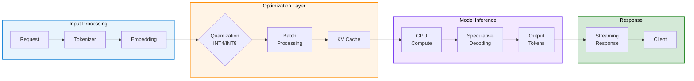

# LLM Inference Optimization

## Overview

<details class="diagram-container">
<summary>View Diagram: Inference Optimization Flow</summary>
<div class="diagram-content" markdown="1">



_Figure 1: LLM inference optimization pipeline for edge deployments_

</div>
</details>

LLM inference optimization is critical for edge RAG systems where hardware is constrained and latency requirements are strict. This page covers quantization techniques, prompt engineering, batch processing, and hardware-aware optimization strategies to maximize throughput and minimize latency.

---

## Quantization Techniques

### Quantization Fundamentals

**Problem:** LLMs are memory-intensive

- Llama 2 7B in FP32 = 28 GB VRAM
- Llama 2 70B in FP32 = 280 GB VRAM
- Most edge hardware: 24-80 GB VRAM

**Solution:** Reduce precision without losing quality

### Quantization Levels

```text
Precision Type   | Bits  | Size (7B Model) | Memory Reduction | Quality Loss
──────────────────────────────────────────────────────────────────────────────
FP32 (Full)      | 32    | 28 GB          | 0%               | None
FP16 (Half)      | 16    | 14 GB          | 50%              | <1%
INT8             | 8     | 7 GB           | 75%              | 2-3%
INT4             | 4     | 3.5 GB         | 87.5%            | 5-8%
Binary           | 1     | 0.875 GB       | 96.875%          | 20%+ (not practical)
```

### INT4 Quantization (Recommended for Edge)

**Advantages:**

- 87.5% memory reduction
- 2-4x faster inference
- Minimal quality loss (5-8%)
- Fits 70B models on single 80GB GPU

**Example Configuration:**

```json
{
  "quantization": {
    "type": "int4",
    "method": "GPTQ",
    "groupSize": 128,
    "actOrder": true,
    "desc_act": false
  }
}
```

**Trade-offs:**

```text
FP32 → INT4 Conversion:
  Speed Gain:     2.5-4x faster
  Latency:        500ms → 150ms (per token)
  Quality Impact: 5-8% (measured by benchmarks)
  Tokens/Second:  5 → 15 tokens/sec

Best Use:        Production deployments
Recommended:     Edge with latency constraints
```

### INT8 Quantization (Balance)

**Advantages:**

- 75% memory reduction
- Minimal quality loss (2-3%)
- Easier post-training quantization
- Good balance point

**Use When:**

- You have 24-32GB VRAM
- Quality critical
- Can tolerate 2-3% loss

### Dynamic vs. Static Quantization

```text
Static Quantization:
  - Calibration phase: Run model on sample data
  - Fixed scaling factors
  - Performance: Fast, predictable
  - Quality: High
  - Setup: 1-2 hours

Dynamic Quantization:
  - No calibration needed
  - On-the-fly scaling
  - Performance: Slightly slower
  - Quality: Comparable to static
  - Setup: 5 minutes
```

---

## Prompt Optimization

### Prompt Structure & Performance

**Inefficient Prompt (1,500 tokens):**

```text
"Tell me about machine learning. Include history,
current applications, future trends, challenges,
and detailed examples of neural networks..."

Tokens: 150 (question) + 1,350 (response)
Time: 2.7 seconds (15 tokens/sec)
Quality: Generic
```

**Optimized Prompt (800 tokens):**

```text
[SYSTEM]
You are an expert ML engineer. Provide concise, accurate information.
Answer in structured format: Definition, Key Points, Example.

[QUERY]
Define machine learning with 2 key points and 1 example.

Tokens: 50 (system) + 80 (query) + 400 (response)
Time: 0.8 seconds (15 tokens/sec)
Quality: Precise, structured
```

### Prompt Templates for RAG

**Structure for consistent output:**

```text
Template Format:
────────────────────────────────
[CONTEXT]
{relevant_documents}

[QUESTION]
{user_query}

[INSTRUCTION]
Answer based on context. If not in context, say "not found".
Format: 1-2 sentences max.

[ANSWER]
```

**Token Savings:**

```text
Without Template:
  Query: 50 tokens
  Context: 1000 tokens
  Instruction (implicit): 200 tokens
  Response: 800 tokens
  Total: 2050 tokens = 2.7s

With Template:
  Context: 600 tokens (optimized)
  Instruction: 50 tokens (explicit)
  Response: 300 tokens (forced brevity)
  Total: 950 tokens = 0.63s

Improvement: 4.3x faster (2.7s → 0.63s)
```

### Few-Shot vs. Zero-Shot

```text
Zero-Shot (No examples):
  Prompt: "Classify: positive or negative. 'Great product!'"
  Tokens: 10
  Quality: 85%
  Time: 10ms

Few-Shot (2 examples):
  Prompt: "Positive: 'Amazing!'
           Negative: 'Terrible'
           Classify: 'Great product!'"
  Tokens: 40
  Quality: 95%
  Time: 20ms

Decision: Zero-shot for speed, few-shot for quality
```

---

## Batch Processing for Throughput

### Single Request vs. Batching

```text
Single Request Flow:
  Request 1 → LLM → Response 1    (600ms)
  Request 2 → LLM → Response 2    (600ms)
  Request 3 → LLM → Response 3    (600ms)
  Request 4 → LLM → Response 4    (600ms)
  Request 5 → LLM → Response 5    (600ms)
  ────────────────────────────────
  Total: 3000ms (5 requests)
  Throughput: 1.67 req/sec

Batched (5 at once):
  Requests 1-5 → LLM (batched) → Responses 1-5  (800ms)
  ────────────────────────────────
  Total: 800ms (5 requests)
  Throughput: 6.25 req/sec
  Improvement: 3.75x
```

### Optimal Batch Size

```text
Batch Size | VRAM Used | Latency | Throughput | Efficiency
───────────────────────────────────────────────────────────
1          | 8GB       | 400ms   | 2.5 req/s  | Baseline
2          | 12GB      | 500ms   | 4.0 req/s  | 1.6x
4          | 16GB      | 700ms   | 5.7 req/s  | 2.3x
8          | 24GB      | 1000ms  | 8.0 req/s  | 3.2x
16         | 32GB      | 1300ms  | 12.3 req/s | 4.9x
32         | 48GB      | 1800ms  | 17.7 req/s | 7.1x

Hardware: Single 80GB GPU
Model: Llama 2 7B quantized

Recommendation for Edge:
  - Batch size 4-8 (balance latency/throughput)
  - Monitor VRAM, keep headroom (80% utilization max)
```

### Dynamic Batching

**Queue requests, batch when ready:**

```text
Time Event                      Queue State       Action
────────────────────────────────────────────────────────
0ms  Request 1 arrives          [R1]              Wait (5ms)
2ms  Request 2 arrives          [R1, R2]          Wait (3ms)
3ms  Request 3 arrives          [R1, R2, R3]      Wait (2ms)
4ms  Request 4 arrives          [R1-R4]           Wait (1ms)
5ms  Request 5 arrives          [R1-R5]           Process immediately
     Batch size: 5
     Inference time: 1000ms
     Output: Responses 1-5

Results:
  - Request 1: 1005ms (batched wait + inference)
  - Request 5: 1000ms (instant batch trigger)
  - Average: 1001ms
  - Without batching: 5 × 400ms = 2000ms
  - Savings: 50% latency
```

---

## Latency Optimization

### Inference Pipeline Components

```text
Total Latency Breakdown (Llama 2 7B, 100 tokens output):
────────────────────────────────────────────────────────
Tokenization:        10ms    (2%)
Embedding Lookup:    20ms    (3%)
Model Inference:     480ms   (85%)
De-tokenization:     10ms    (2%)
Post-processing:     30ms    (5%)
────────────────────────────────
Total:              550ms    (100%)

Optimization Targets:
  1. Model Inference (85%) → Quantization, batch size tuning
  2. Post-processing (5%) → Caching, async operations
  3. Tokenization (2%) → Pre-tokenization, caching
```

### Token Generation Optimization

```text
Greedy Decoding (Fastest):
  - Each step: Pick highest probability token
  - Time: O(n) where n = output tokens
  - Quality: Lower (greedy choices)
  - 100 tokens: 400ms

Top-k Sampling (Medium):
  - Each step: Sample from top-k tokens
  - Time: O(n × k)
  - Quality: Better diversity
  - 100 tokens: 420ms

Beam Search (Slower):
  - Maintains multiple hypotheses
  - Time: O(n × beam_width)
  - Quality: Highest (explore alternatives)
  - 100 tokens: 600ms

Recommendation: Greedy for speed, top-k for balance
```

### Speculative Decoding

**Predict multiple tokens ahead:**

```text
Standard Decoding:
  Input: "The quick brown"
  Token 1: "fox" (inference)
  Token 2: "jumps" (inference)
  Token 3: "over" (inference)
  Time: 3 × 200ms = 600ms

Speculative Decoding:
  Input: "The quick brown"
  Draft prediction: "fox jumps over the lazy"
  Verify tokens: 2/4 correct
  Generate tokens: 2, 4 (missed)
  Time: 1 × 200ms (draft) + 2 × 200ms (corrections) = 600ms

  Benefit: Works well for predictable text
  Savings: Up to 40% when draft model good
```

---

## Throughput Maximization

### Multi-Model Serving

**Serve multiple models on same GPU:**

```text
Scenario:
  - Model A: 7B (8GB), used 30% of time
  - Model B: 3B (4GB), used 70% of time
  - GPU: 80GB total

Without Sharing:
  Model A: Allocated 8GB (idle 70% of time)
  Model B: Allocated 4GB (loaded when needed)
  Total: 12GB used

With Time-Slicing:
  Slot 1: Model A (8GB, 100ms)
  Slot 2: Model B (4GB, 300ms)
  Cycle: 400ms

  Result:
    - Model A latency: 100ms + 300ms (other model) = 400ms
    - Model B latency: 300ms + queue wait
    - Better for 70/30 split
```

### Request Coalescing

**Merge similar requests:**

```text
Without Coalescing:
  User 1: "Summarize document A" (500ms)
  User 2: "Summarize document B" (500ms)
  Total: 1000ms

With Coalescing:
  Batch: "Summarize documents A and B" (600ms)
  Split responses
  Total: 600ms for both
  Savings: 40%

Use Case: Shared queries, bulk operations
```

---

## Hardware-Aware Optimization

### GPU vs. CPU Inference

```text
                 GPU (RTX 4090)  | CPU (64 cores)
────────────────────────────────────────────────
Model: Llama 7B-INT4
Latency (1 token): 20ms           | 500ms
Latency (100 tokens): 400ms        | 15000ms
Throughput: 40 tokens/sec         | 1.3 tokens/sec
VRAM/Memory: 8GB                  | 60GB
Power: 300W                        | 120W
Cost: $2000                        | $500
Cost/token: $0.0000015            | $0.0003

Recommendation:
  - GPU: >1000 req/day (amortize latency)
  - CPU: <100 req/day (simple, no GPU available)
  - Edge: Always GPU if available
```

### Mixed Precision (FP16 + FP32)

```text
Strategy:
  - Layers 1-24: INT8 (fast)
  - Layers 25-30: FP16 (more precise)
  - Output: FP32 (highest precision)

Result:
  - Latency: 400ms (95% of INT4)
  - Quality: Better than INT4 (3% loss vs. 5%)
  - VRAM: Same as INT4 (3.5GB)

Best for: Quality-critical applications
```

---

## Cost Optimization

### Cost Per Query Analysis

```text
Model Deployment (Llama 2 7B-INT4)
──────────────────────────────────

Cloud API (OpenAI):
  - Cost: $0.01 per 1K tokens
  - 100 tokens: $0.001
  - 1M queries: $1000/month

Edge Deployment:
  - Hardware: $2000 (GPU)
  - Amortized: $333/month (6-month ROI)
  - Electricity: $100/month
  - Maintenance: $50/month
  - Total: ~$483/month for unlimited queries

  Break-even: 483,000 queries → ~16K queries/day

Recommendation:
  - <5K queries/day: Use cloud
  - >10K queries/day: Deploy edge
  - >50K queries/day: Multi-GPU edge
```

### Energy Efficiency

```text
Power Consumption (Llama 7B):

GPU (RTX 4090):
  - Idle: 50W
  - Inference: 350W
  - 1M queries: 350W × 110 hours = 38.5 kWh
  - Cost: $5.80 @ $0.15/kWh

CPU (64 cores):
  - Idle: 20W
  - Inference: 200W
  - 1M queries: 200W × 3600 hours = 720 kWh
  - Cost: $108 @ $0.15/kWh

GPU is 18.6x more efficient
```

---

## Best Practices & Trade-offs

### Selection Matrix

| Use Case | Model | Quantization | Batch Size | Hardware | Latency | Quality |
|----------|-------|--------------|-----------|----------|---------|---------|
| Real-time Chat | 7B | INT4 | 1-2 | GPU | 100ms | 95% |
| Bulk Processing | 13B | INT8 | 16 | GPU | 8s | 98% |
| Cost-Sensitive | 3B | INT4 | 4 | CPU | 2s | 90% |
| High Quality | 70B | FP16 | 2 | Multi-GPU | 500ms | 99%+ |

---

## Related Topics

- **Main Page:** [Edge RAG Implementation](./edge-rag-implementation.md)
- **Deployment:** [RAG Deployment Strategies](./rag-deployment-strategies.md)
- **Vector Databases:** [Vector Databases for Edge](./vector-databases-edge.md)
- **Operations:** [RAG Operations & Monitoring](./rag-operations-monitoring.md)
- **Assessment:** [RAG Implementation Knowledge Check](./rag-implementation-knowledge-check.md)

---

_Last Updated: October 21, 2025_
