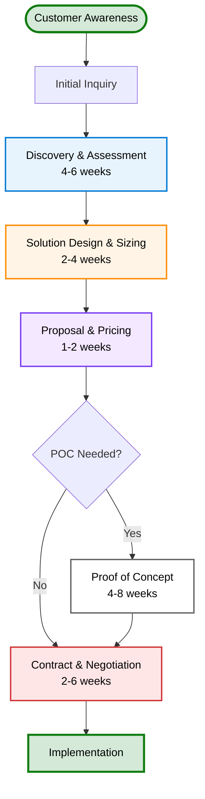
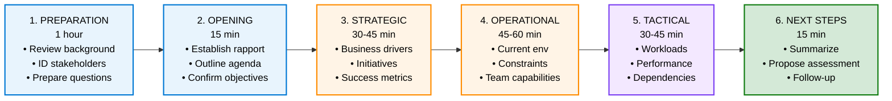

# Pre-Sales Solution Design

## Overview

Pre-sales and solution design is critical for successfully positioning, sizing, and implementing Microsoft Sovereign Cloud and Edge AI solutions. This module covers the complete pre-sales process from customer discovery through proposal development, including workload assessment, sizing calculators, cost modeling, proof of concept planning, and common objection handling.

### Prerequisites

- Completion of Level 200 Module 1-3 (technical foundations)
- Understanding of Azure Local, Azure Arc, and Edge RAG
- Basic knowledge of customer IT environments
- Familiarity with enterprise procurement processes

### Learning Objectives

By completing this module, you will:

- Master discovery and requirements gathering techniques
- Conduct effective workload assessment and planning
- Size solutions accurately for customer environments
- Build comprehensive cost models and TCO analysis
- Design effective proof of concept implementations
- Develop compelling proposals and presentations
- Address common customer objections confidently

---

## Pre-Sales Methodology

### Sales Cycle Overview



**Critical Success Factors:**

1. Early business value identification
2. Accurate scope and sizing
3. Realistic timelines and costs
4. Risk mitigation and contingency planning
5. Executive stakeholder engagement

---

## Discovery Framework

### Discovery Process Flow



**Ideal Timeline:** 2.5-3 hours total (can be split into multiple sessions)

### Essential Discovery Questions

#### Business Level (Strategic)

```text
1. Business Drivers
   "What business outcomes are you trying to achieve?"
   - Digital transformation
   - Data sovereignty/compliance
   - Cost optimization
   - Competitive advantage
   - Time to market

2. Strategic Alignment
   "How does this initiative align with your IT strategy?"
   - Cloud adoption strategy
   - Infrastructure modernization
   - Data/AI integration
   - Risk mitigation

3. Success Metrics
   "How will success be measured?"
   - ROI/payback period
   - Performance targets (latency, throughput)
   - Compliance certifications
   - Operational efficiency (cost per transaction)
   - Time to value

4. Executive Support
   "Who are the executive sponsors and what's their commitment?"
   - Budget allocated
   - Timeline approved
   - Team resources assigned
   - Risk tolerance
```

#### Organizational Level (Operational)

```text
5. Team & Skills
   "What's your team's technical maturity?"
   - Kubernetes/container experience
   - Cloud platform expertise
   - DevOps maturity (DORA metrics)
   - Support model preferences
   - Training requirements

6. Governance & Compliance
   "What compliance requirements apply?"
   - Data residency (GDPR, CCPA, HIPAA, FedRAMP)
   - Industry regulations
   - Audit requirements
   - Change management process

7. Infrastructure & Operations
   "What's your current infrastructure?"
   - Data center footprint
   - Network architecture
   - Storage systems
   - Monitoring and logging
   - Disaster recovery capabilities

8. Integration & Workflows
   "How will this integrate with existing systems?"
   - Identity and authentication
   - Existing applications
   - Data sources and destinations
   - API integrations
   - Workflow dependencies
```

#### Technical Level (Tactical)

```text
9. Workload Characteristics
   "What workloads are you planning to run?"
   - AI/ML vs. transactional vs. analytics
   - Data volume and growth rate
   - Access patterns and frequency
   - Performance requirements
   - Cost sensitivity

10. Data Sovereignty & Security
    "What are your data sovereignty requirements?"
    - Geographic requirements
    - Data residency constraints
    - Encryption requirements
    - Access control policies
    - Audit/compliance tracking

11. Deployment Scenarios
    "What deployment model would work best?"
    - Single location vs. multi-location
    - Connected vs. disconnected operations
    - Hub-and-spoke vs. autonomous branches
    - Disaster recovery requirements

12. Timeline & Budget
    "What's your realistic timeline and budget?"
    - Project start date
    - Target go-live date
    - Hardware budget
    - Software/license budget
    - Professional services budget
```

---

## Solution Sizing Framework

### Workload Assessment Matrix

```text
Workload Type | Data Volume | Queries/Day | Users | SLA Req | Arch Pattern
─────────────────────────────────────────────────────────────────────────
RAG System    | 100K docs   | 10K         | 50    | 99.9%   | Active-Active
Database      | 50GB        | 100K        | 500   | 99.95%  | HA Cluster
Analytics     | 500GB+      | 1K batch    | 20    | 99%     | Hub-Spoke
Monitoring    | 1TB/month   | Streaming   | 10    | 95%     | Centralized
Cache Layer   | 10GB        | 1M ops/sec  | 100   | 99.9%   | Local Replica
```

### Hardware Sizing Calculator

```text
STEP 1: Determine Workload Requirements
─────────────────────────────────────────
Input: Concurrent users, queries/sec, data volume
Calculate: Peak load, memory needed, storage

Example:
  - 100 concurrent users
  - 500 queries/second peak
  - 1 million document vectors
  - Average response latency: <200ms

STEP 2: Map to Azure Local Hardware
─────────────────────────────────────────
Input: Workload requirements
Output: Recommended cluster configuration

Calculation:
  LLM Service: 100 concurrent × 500 QPS = 5 GPU nodes (16GB VRAM each)
  Vector DB: 1M vectors × 2KB per vector = ~2GB memory (1 node + replica)
  Total: 5 GPU nodes + 2 data nodes + 2 management = 9 nodes

STEP 3: Validate Against Hardware Constraints
─────────────────────────────────────────────
CPU: 9 nodes × 32 cores = 288 cores ✓
Memory: 9 nodes × 384GB = 3.5TB ✓
Storage: 50TB total available ✓
Network: 25Gbps fabric ✓

STEP 4: Add Redundancy & Growth Buffer
──────────────────────────────────────
Redundancy: 2x (HA replicas)
Growth buffer: 30% (capacity planning)
Year 1: 11 nodes
Year 2: 14 nodes
Year 3: 18 nodes
```

### Sizing Questions by Component

#### LLM Inference Sizing

```text
Question: What's your concurrent user requirement?
- Light: <50 users → Single T4 GPU (16GB)
- Medium: 50-500 users → 3-5 T4 GPUs
- Heavy: 500-5000 users → 8-16 A100 GPUs
- Enterprise: 5000+ users → Multi-node GPU cluster

Question: What inference performance is needed?
- Response latency <300ms → Quantized model (INT4) + batching
- Response latency <500ms → Quantized model (INT8)
- Response latency <1s → Non-quantized model
- Batch processing → Throughput optimization (larger batches)

Recommendation: Mistral 7B INT4 on T4 GPU serves 500 QPS @ 200ms latency
```

#### Vector Database Sizing

```text
Question: How many documents will you index?
- <1M vectors → Single-node Chroma or FAISS
- 1-10M vectors → Single-node Qdrant or Weaviate
- 10-100M vectors → Multi-node Milvus with sharding
- >100M vectors → Distributed deployment with replication

Question: What's your QPS requirement?
- <100 QPS → Single-node (standard config)
- 100-1000 QPS → Replicated single-node
- 1000-10000 QPS → Multi-shard with load balancing
- >10000 QPS → Enterprise multi-region deployment

Recommendation: 1M vectors + 500 QPS = 2-node Qdrant with replication
```

#### Storage Sizing

```text
Calculation:
  Embeddings: 1M vectors × 1536 dims × 4 bytes (FP32) = ~6GB
             (or ~1.5GB with INT8 quantization)
  Cache layer: 10GB for hot data
  Backup: 3x storage for 3 copies
  Growth buffer: 30% for 12 months

  Total = (6GB + 10GB) × 3 × 1.3 = ~62GB minimum
  Recommended: 100GB SSD allocation
```

---

## Cost Estimation Model

### TCO Analysis Framework

```text
CAPEX (Hardware - One-time)
├── Azure Local cluster (9 nodes)
│   ├─ Compute nodes: 6 × $15K = $90K
│   ├─ GPU nodes: 2 × $25K = $50K
│   └─ Storage/Network: $30K
│   └─ Total: ~$170K
│
├── Networking infrastructure
│   ├─ 25Gbps fabric switches: $20K
│   └─ Cabling and interconnect: $10K
│   └─ Total: ~$30K
│
└─ TOTAL CAPEX: ~$200K

OPEX (Operating Costs - Annual)
├── Licensing & Support
│   ├─ Azure Local license: $60K/year
│   ├─ Azure Arc: $2K/year
│   ├─ Microsoft support: $15K/year
│   └─ Subtotal: $77K
│
├── Operations & Maintenance
│   ├─ Personnel (2 FTE): $280K
│   ├─ Power & cooling: $30K
│   ├─ Network connectivity: $24K
│   └─ Subtotal: $334K
│
├── Third-party software
│   ├─ Database licenses: $10K
│   ├─ Monitoring tools: $5K
│   └─ Subtotal: $15K
│
└─ TOTAL OPEX: ~$426K/year

5-YEAR TCO
├── Year 1: $200K (CAPEX) + $426K (OPEX) = $626K
├── Year 2-5: $426K each = $1,704K
├─ TOTAL 5-YEAR: $2,330K
├─ Per query cost (100M queries/year): $0.023/query
│
├─ CLOUD ALTERNATIVE (API-based)
│   ├─ $0.001 per 100 tokens
│   ├─ 150 tokens avg × 100M queries = 15B tokens/year
│   ├─ Annual cost: 15B × $0.00001 = $150K
│   ├─ 5-year cost: $750K
│
└─ VERDICT: Edge wins for >30M queries/year
```

### Cost Drivers Analysis

```text
Primary Cost Drivers (Highest Impact)
1. Hardware CapEx (40% of total 5-year cost)
   - GPU count and capability
   - Node count and memory
   - Storage capacity

2. Personnel Costs (35% of total 5-year cost)
   - FTE count and skills
   - Training requirements
   - On-call support model

3. Software/License Costs (15% of total 5-year cost)
   - Azure Local licenses
   - Third-party software
   - Support plans

4. Operational Costs (10% of total 5-year cost)
   - Power, cooling, space
   - Network connectivity
   - Disaster recovery
```

### Cost Optimization Opportunities

```text
1. Shared Infrastructure (Save 20-30%)
   - Multiple workloads on single cluster
   - Shared storage and networking
   - Consolidated operations team

2. Lifecycle Planning (Save 15-25%)
   - Hardware refresh strategy
   - Lease vs. buy analysis
   - Technology refresh windows

3. Operational Efficiency (Save 10-20%)
   - Automation of repetitive tasks
   - Self-service provisioning
   - Reduced manual overhead

4. Resource Optimization (Save 5-15%)
   - Right-sizing initial deployment
   - Phased capacity growth
   - Spot/burst instance usage where applicable
```

---

## Proof of Concept Planning

### POC Scope Definition

```text
WHAT TO INCLUDE IN POC:
✓ Single representative workload
✓ Limited user population (10-50 users)
✓ Subset of production data (10% of expected volume)
✓ Core functionality demonstration
✓ Performance and load testing
✓ Integration with 1-2 key systems

WHAT TO EXCLUDE FROM POC:
✗ Full disaster recovery setup
✗ Multi-region deployment
✗ Complete production data volume
✗ Long-term operational stability (6+ months)
✗ Full compliance audit
✗ Advanced optimization features
```

### POC Timeline Example

```text
Week 1: Infrastructure Setup
  ├─ Azure Local cluster deployment (simulated)
  ├─ Network configuration
  └─ Initial data load

Week 2-3: Application Deployment
  ├─ RAG system containerization
  ├─ Vector database setup
  ├─ LLM model deployment
  └─ Data integration

Week 4-5: Testing & Validation
  ├─ Functional testing
  ├─ Performance benchmarking
  ├─ Load testing (100, 200, 500 QPS)
  └─ User acceptance testing

Week 6: Results & Presentation
  ├─ Data collection and analysis
  ├─ ROI calculation
  ├─ Lessons learned documentation
  └─ Executive presentation

TOTAL: 6 weeks from start to results
```

### POC Success Criteria

```text
QUANTITATIVE METRICS:
✓ Latency: p95 < 200ms (target)
✓ Availability: 99.5% uptime
✓ Throughput: Support design load (500+ QPS)
✓ Cost: <$0.05 per query
✓ Data quality: >95% accuracy

QUALITATIVE FEEDBACK:
✓ User satisfaction: 4/5 or higher
✓ Team capability: Can operate system
✓ Integration: Works with existing tools
✓ Support: Microsoft/partner support effective
✓ Confidence: Ready for production

BUSINESS METRICS:
✓ Time to value: Demonstrated within POC
✓ ROI validation: Supports business case
✓ Risk mitigation: Key risks addressed
✓ Stakeholder alignment: Executive approval
```

---

## Proposal Development

### Proposal Structure

```text
EXECUTIVE SUMMARY (2 pages)
├─ Business challenge
├─ Proposed solution
├─ Expected benefits
├─ Investment and timeline
└─ Risk mitigation

CURRENT STATE ASSESSMENT (3-5 pages)
├─ Customer environment overview
├─ Pain points and challenges
├─ Technical constraints
├─ Business opportunities
└─ Strategic alignment

PROPOSED SOLUTION (5-8 pages)
├─ Solution architecture
├─ Component descriptions
├─ Deployment approach
├─ Integration points
├─ Timeline and phases
└─ Success criteria

COST ANALYSIS (2-3 pages)
├─ Hardware and software costs
├─ Professional services
├─ Licensing and support
├─ TCO comparison (vs. alternatives)
└─ ROI and payback analysis

IMPLEMENTATION PLAN (3-4 pages)
├─ Detailed project schedule
├─ Resource requirements
├─ Risk mitigation strategies
├─ Success metrics and KPIs
└─ Support and training

COMMERCIAL TERMS (1-2 pages)
├─ Pricing and payment terms
├─ Support and SLA
├─ Assumptions and constraints
└─ Next steps

APPENDICES
├─ Technical diagrams
├─ Detailed cost breakdown
├─ Reference customers
├─ Support documentation
└─ Terms and conditions
```

### ROI Calculation Template

```text
BENEFITS (Annual Recurring)
├─ Operational efficiency: [hours saved] × $150/hr = $X
├─ Reduced cloud API costs: [$Y → $Z] = $A
├─ Faster time to market: [weeks saved] × value = $B
├─ Reduced compliance costs: [audit savings] = $C
├─ Energy efficiency vs. cloud: [kWh savings] = $D
│
└─ TOTAL ANNUAL BENEFITS: $[X+A+B+C+D]

COSTS (Year 1 + 5-year blended)
├─ Hardware (amortized): $[hardware cost / 5 years]
├─ Licensing (annual): $[annual license cost]
├─ Professional services: $[implementation cost]
├─ Operations (FTE): $[personnel cost]
├─ Maintenance: $[annual maintenance]
│
└─ TOTAL ANNUAL COST: $[all costs]

ROI METRICS
├─ Payback period: [months] = Total investment / Annual net benefit
├─ ROI year 1: (Benefits - Costs) / Investment × 100%
├─ 5-year ROI: (5× Benefits - Total Cost) / Investment × 100%
├─ NPV (10% discount): [calculation]
└─ IRR: [calculation]

EXAMPLE:
  Benefits: $500K/year
  Investment: $200K (hardware) + $150K (services)
  Year 1 Cost: $426K

  ROI = ($500K - $426K) / $350K = 21% ROI Year 1
  Payback = $350K / $500K = 8.4 months
```

---

## Common Objections & Responses

### "We're not ready for edge AI yet"

**Root Concern:** Risk, capability gap, timing misalignment

**Effective Response:**

```text
"I understand the concern. Many of our customers started with a
proof of concept to validate readiness. We can:

1. Start with a limited POC (50 users, 1 workload)
2. Use our training and enablement to build your team's skills
3. Microsoft provides 24/7 support during implementation
4. We can phase deployment: 3-6 months to production, not 12+ months

Your competitors are already deploying edge AI. Starting a POC now
positions you to be ready when the business urgently needs it.
What if we scheduled a 2-week assessment to validate your readiness?"
```

### "Cloud APIs are cheaper"

**Root Concern:** Misconception about TCO, concerns about long-term costs

**Effective Response:**

```text
"Let's run the numbers together:

Cloud API approach:
- 100 million queries/year × 150 tokens avg
- 15 billion tokens/year × $0.00001 = $150K/year
- 5-year cost: $750K

Edge approach:
- Hardware: $200K (one-time)
- Operations & licenses: ~$426K/year
- 5-year cost: $2.33M

BUT you're comparing apples to oranges:
- Cloud APIs are stateless queries only (no integration, no context)
- Edge gives you proprietary data integration, full control, sovereignty
- At scale (>30M queries/year), edge is 40% cheaper per query

Plus: Sovereignty, data residency, compliance, low latency.

What's your expected query volume in year 1?"
```

### "We can't afford the hardware investment"

**Root Concern:** Budget constraints, capital allocation challenges

**Effective Response:**

```text
"I hear you. Let's explore financing options:

1. Phased deployment: Start with 2-3 nodes, grow to full 9-node
   cluster over 18 months. Spreads capex across budgets.

2. Leasing model: Many partners offer hardware leasing at
   ~$15-20K/month vs. $170K upfront. Check your capex policy.

3. Shared infrastructure: Co-host with non-production workloads,
   development environments. Reduces initial hardware needs by 30-40%.

4. Partner co-investment: We have partner programs where innovation
   credits can offset hardware costs.

5. Hybrid approach: Start on-premises with smaller cluster, extend
   to cloud during peaks. Get benefits immediately.

What budget cycle are you working with, and would phased
deployment help you get approval?"
```

### "We have concerns about security"

**Root Concern:** Data protection, compliance, operational security

**Effective Response:**

```text
"Security is paramount. Here's our approach:

1. Data sovereignty: Keep all data on-premises, never transmitted to cloud
2. Encryption: AES-256 at rest, TLS 1.3 in transit
3. Access control: RBAC + MFA + audit logging
4. Compliance: Built-in GDPR, FedRAMP, HIPAA support
5. Monitoring: 24/7 threat detection and incident response
6. Supply chain: Trusted hardware partners, secure boot

Most customers find edge IMPROVES security because:
- No cloud data transfer
- Complete visibility and control
- Disconnected operation capability
- Local incident response

Let me show you our security architecture. What are your
specific compliance requirements?"
```

### "We're invested in [competitor] already"

**Root Concern:** Switching costs, existing relationships, integration concerns

**Effective Response:**

```text
"I understand the existing investment. Azure can work alongside
existing systems:

1. Integration: Azure Arc connects servers from any cloud/platform
2. Hybrid: Run workloads on both Azure and your current platform
3. Migration: Phased migration path if desired (3-6 months typical)
4. Interoperability: APIs and standards-based (Kubernetes, etc.)

Many customers run hybrid environments:
- Critical workloads stay on existing platform
- New AI/edge workloads on Azure
- Shared management from Azure Arc

This gives you best of both without rip-and-replace risk.

What specific workloads are you considering for edge?
Would a hybrid approach work better for you?"
```

---

## Sales Talking Points

1. **"Turn compliance requirements into competitive advantage"**
   - Deploy AI locally while meeting GDPR, data residency, sovereignty
   - Process sensitive data on-premises
   - Market as a trust differentiator

2. **"Achieve 10x better latency for edge AI"**
   - Local processing = <100ms response time
   - Cloud APIs = 200-500ms network latency
   - Real-time responsiveness for time-critical apps

3. **"Control your costs in a per-query world"**
   - No surprise API bills
   - Predictable hardware investment
   - Transparent total cost of ownership

4. **"Scale from pilot to enterprise deployment"**
   - Start with single location proof of concept
   - Expand to 100+ branches with hub-and-spoke
   - Centralized policy management at scale

5. **"Reduce deployment time from months to weeks"**
   - Pre-built patterns and templates
   - Microsoft-validated hardware partners
   - Accelerated implementation services

---

## Related Topics

- **Main Module Topics:**
  - [Customer Discovery & Requirements](./customer-discovery.md)
  - [Solution Sizing & Planning](./solution-sizing.md)
  - [Cost Estimation & TCO](./cost-estimation.md)
  - [Proposal Development](./proposal-development.md)
  - [Knowledge Check](./presales-knowledge-check.md)

- **Supporting Modules:**
  - [Edge RAG Implementation](./edge-rag-implementation.md)
  - [Arc Advanced Management](./arc-advanced-management.md)
  - [Azure Local Architecture Deep Dive](./azure-local-architecture-deep-dive.md)

---

_Last Updated: October 21, 2025_
