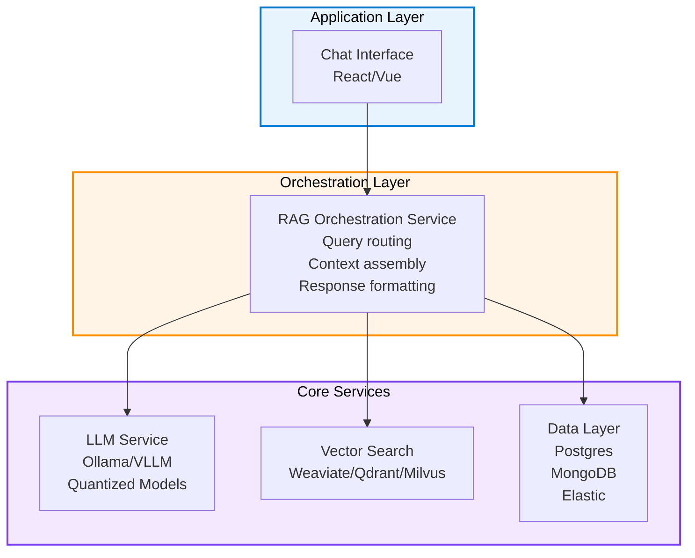
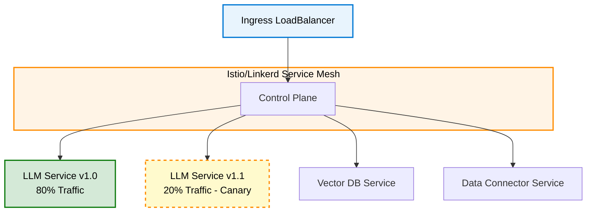

# RAG Deployment Strategies

## Overview

Deploying RAG systems at scale requires careful consideration of containerization strategies, orchestration patterns, versioning approaches, and CI/CD integration. This page explores production-ready deployment patterns for enterprise RAG implementations on Azure Arc.

---

## Container-Based RAG Deployment

### RAG Component Architecture

A production RAG system consists of multiple containerized services:



### Kubernetes Deployment Manifest

**Structure for RAG on AKS Arc:**

```yaml
apiVersion: v1
kind: Namespace
metadata:
  name: rag-system
---
# LLM Service Deployment
apiVersion: apps/v1
kind: Deployment
metadata:
  name: llm-service
  namespace: rag-system
spec:
  replicas: 3
  selector:
    matchLabels:
      app: llm-service
  template:
    metadata:
      labels:
        app: llm-service
    spec:
      containers:
      - name: ollama
        image: ollama:latest
        resources:
          requests:
            memory: "24Gi"
            nvidia.com/gpu: "1"
          limits:
            memory: "32Gi"
            nvidia.com/gpu: "1"
        volumeMounts:
        - name: model-cache
          mountPath: /root/.ollama
      volumes:
      - name: model-cache
        persistentVolumeClaim:
          claimName: llm-models-pvc
---
# Vector Database Deployment
apiVersion: apps/v1
kind: Deployment
metadata:
  name: vector-db
  namespace: rag-system
spec:
  replicas: 3
  selector:
    matchLabels:
      app: vector-db
  template:
    metadata:
      labels:
        app: vector-db
    spec:
      containers:
      - name: weaviate
        image: weaviate:latest
        resources:
          requests:
            memory: "16Gi"
          limits:
            memory: "24Gi"
        volumeMounts:
        - name: vector-data
          mountPath: /var/lib/weaviate
      volumes:
      - name: vector-data
        persistentVolumeClaim:
          claimName: vector-db-pvc
```

### Multi-Container Service Mesh

For large deployments, use service mesh for advanced traffic management:



**Benefits:**

- Canary deployments (new models with 20% traffic)
- Circuit breaking (fail-safe degradation)
- Distributed tracing (latency visibility)
- Automatic retry policies

---

## Kubernetes Orchestration Patterns

### Pattern 1: Stateless LLM Service

**Use Case:** Horizontally scaled inference servers

```text
Configuration:
  - Replicas: 3-10 depending on load
  - Each pod: 1-2 GPUs, 24-32GB VRAM
  - Shared model cache (volume)
  - Load balancing: Round-robin or least-connection

Scaling Trigger:
  - CPU > 80% → Add replica
  - GPU memory > 90% → Add replica
  - Latency p95 > 1s → Add replica
  - Response queue > 50 → Add replica
```

### Pattern 2: Stateful Vector Database

**Use Case:** Persistent vector storage with replication

```text
Configuration:
  - StatefulSet (not Deployment)
  - Persistent volumes per pod
  - Multi-replica for HA
  - Backup strategy: Nightly snapshots

Topology:
  - Pod 0: Primary (read/write)
  - Pod 1: Replica 1 (read-only)
  - Pod 2: Replica 2 (read-only)

  Write operations → Pod 0
  Read operations → Round-robin (Pod 0, 1, 2)
```

### Pattern 3: Data Connector Service

**Use Case:** Real-time data synchronization

```text
Configuration:
  - CronJob for scheduled imports
  - Service for real-time connectors
  - Init containers for schema setup

Workflow:
  1. Fetch from source (DB, API, file)
  2. Process/tokenize
  3. Generate embeddings
  4. Index in vector DB
  5. Update metadata
```

---

## Versioning & Model Management

### Model Versioning Strategy

**File Structure:**

```text
/models
├── llm
│   ├── phi-3-4b
│   │   ├── v1.0 (current production)
│   │   │   ├── model.gguf (quantized 4-bit)
│   │   │   ├── tokenizer.model
│   │   │   └── config.json
│   │   ├── v1.1 (canary testing)
│   │   └── v0.9 (previous stable)
│   └── mistral-7b
│       ├── v1.0
│       └── v1.1
│
├── embeddings
│   ├── bge-base-en
│   │   ├── v1.0 (current)
│   │   └── v1.1 (canary)
│   └── all-minilm-l6-v2
│       └── v1.0
│
└── indices
    ├── vector-index-v1
    ├── vector-index-v2
    └── vector-index-v3
```

### Blue-Green Deployment

**Minimize downtime during model updates:**

```text
Current State (Blue):
  ┌──────────────────┐
  │ LLM v1.0 (Prod)  │
  │ Vector DB v1     │
  │ Embeddings v1    │
  └──────────────────┘
         ↑
      Traffic

New State (Green - Staging):
  ┌──────────────────┐
  │ LLM v1.1 (Test)  │
  │ Vector DB v2     │
  │ Embeddings v2    │
  └──────────────────┘
        (offline)

Switchover:
  1. Test Green fully
  2. Redirect traffic to Green
  3. Keep Blue as instant rollback
  4. Blue becomes staging for next version
```

### Canary Deployment

**Reduce risk with gradual rollout:**

```text
Timeline:
  Hour 0: Deploy v1.1 (10% traffic)
  Hour 1: If metrics good, 25% traffic
  Hour 2: If metrics good, 50% traffic
  Hour 4: If metrics good, 100% traffic

Metrics to Monitor:
  - Error rate < 1%
  - Latency p95 < 1s
  - Model confidence > 0.7
  - User satisfaction > 4.5/5

Rollback Trigger:
  - Error rate > 2%
  - Latency p95 > 2s
  - Hallucination rate > 10%
```

---

## CI/CD for RAG Systems

### Build Pipeline

```text
Source Code (Git)
    │
    ▼
1. Lint & Test
   - Code quality checks
   - Unit tests for prompt templates
   - Embedding validation
    │
    ▼
2. Build Containers
   - LLM service image
   - Vector DB image
   - Data connector image
    │
    ▼
3. Security Scanning
   - Vulnerability scan (Trivy)
   - Secret detection
   - Image signing
    │
    ▼
4. Push to Registry
   - Container registry (ACR)
   - Tag: :v1.2.3, :latest
    │
    ▼
5. Deploy to Dev
   - Automated deployment
   - Smoke tests
   - E2E tests
    │
    ▼
6. Deploy to Staging
   - Full test suite
   - Performance testing
   - User acceptance testing
    │
    ▼
7. Deploy to Production
   - Canary rollout (10% → 50% → 100%)
   - Continuous monitoring
   - Instant rollback capability
```

### GitOps Workflow

**Infrastructure as Code approach:**

```text
1. Developer commits model update
   git commit -m "Update phi-3 to v1.1"

2. PR triggers CI pipeline
   - Build new container
   - Run tests
   - Generate deployment manifests

3. Merge PR to main branch
   - ArgoCD detects change
   - Applies manifests to cluster
   - Monitors deployment health

4. Continuous Compliance
   - Policy checks (no unapproved images)
   - Quota validation (GPU, memory)
   - Audit logging
```

---

## Edge-Specific Deployment Considerations

### Offline-First Deployment

**For disconnected/air-gapped environments:**

1. **Prepare on-premises:**
   - Download model artifacts
   - Pre-build container images
   - Create deployment manifests
   - Generate offline documentation

2. **Deploy to edge:**
   - Load container images locally
   - Mount model files from NAS/storage
   - Configure with local DNS
   - Validate in air-gapped environment

3. **Updates:**
   - Prepare update package offline
   - Validate on staging cluster first
   - Deploy with manual approval

### Resource Constraints

**Optimize for edge hardware (vs. cloud):**

```text
Cloud Deployment:     Edge Deployment:
─────────────────     ────────────────
- 8+ GPUs available   - 1-2 GPUs per node
- 128GB+ VRAM         - 24-32GB VRAM
- Unlimited scaling   - Fixed hardware
- High availability   - Local resilience

Strategies:
  1. Model quantization (4-bit → 75% size reduction)
  2. Smaller base models (7B vs. 70B)
  3. Local caching (reduce network calls)
  4. Batch processing (amortize overhead)
  5. GPU sharing (time-slicing for multiple models)
```

### Low-Bandwidth Considerations

**When network bandwidth is limited:**

1. **Model Delivery:**
   - Pre-download models to edge
   - Use compression (20-50% reduction)
   - Incremental updates (delta sync)

2. **Data Ingestion:**
   - Batch imports (daily/weekly vs. real-time)
   - Lossy compression for non-critical data
   - Local processing before cloud sync

3. **Monitoring:**
   - Local metrics collection
   - Batch telemetry upload (hourly)
   - Low-bandwidth observability (sampling)

---

## Troubleshooting Deployment Issues

### Common Issues & Solutions

| Issue | Cause | Solution |
|-------|-------|----------|
| High latency (>2s) | Model too large | Reduce quantization, use smaller model |
| OOM errors | Insufficient VRAM | Enable disk offloading, batch smaller |
| Vector search slow | Poor index | Rebuild with HNSW, reduce vectors |
| Models not loaded | Network timeout | Pre-download, check storage |
| High error rate | Hallucination | Increase retrieval context, improve prompt |

### Health Checks

**Kubernetes liveness & readiness probes:**

```yaml
livenessProbe:
  httpGet:
    path: /health
    port: 8000
  initialDelaySeconds: 60
  periodSeconds: 10
  timeoutSeconds: 5

readinessProbe:
  httpGet:
    path: /ready
    port: 8000
  initialDelaySeconds: 30
  periodSeconds: 5
  successThreshold: 1
```

**Health Endpoints:**

```text
GET /health
  Response: {"status": "healthy", "uptime": 3600}

GET /ready
  Response: {"ready": true, "models": 3, "vectors": 1000000}

GET /metrics
  Response: Prometheus metrics (latency, throughput, errors)
```

---

## Related Topics

- **Main Page:** [Edge RAG Implementation](./edge-rag-implementation.md)
- **Vector Databases:** [Vector Databases & Indexing](./vector-databases-edge.md)
- **LLM Optimization:** [LLM Inference Optimization](./llm-inference-optimization.md)
- **Operations:** [RAG Operations & Monitoring](./rag-operations-monitoring.md)
- **Assessment:** [RAG Implementation Knowledge Check](./rag-implementation-knowledge-check.md)

---

_Last Updated: October 21, 2025_
