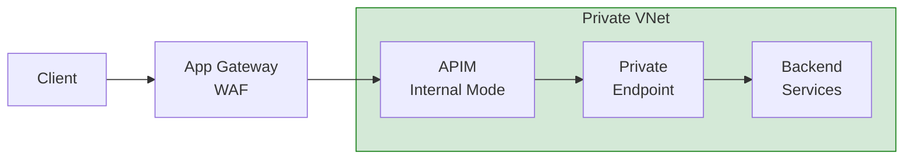

# API Gateway Patterns for Sovereignty


{: .no_toc }

Secure API management patterns with data sovereignty and zero-trust controls.


## Table of Contents

{: .no_toc .text-delta }

1. TOC
{:toc}

---

## Overview

APIs are the primary interface for modern applications, making them a critical control point for data sovereignty. This module covers API gateway patterns that enforce data residency, access control, and compliance at the API layer.

## Learning Objectives

After completing this section, you will be able to:

- ✅ Design sovereign API gateway architectures
- ✅ Implement API-level data residency controls
- ✅ Configure mTLS and OAuth 2.0 for APIs
- ✅ Apply rate limiting and DDoS protection

---


## API Gateway Architecture


| Component | Purpose | Configuration |
|-----------|---------|---------------|
| Azure Front Door | Global entry, DDoS protection | Premium SKU with WAF |
| Application Gateway | Regional WAF | WAF v2 with OWASP rules |
| Azure Firewall | Egress filtering | Premium with TLS inspection |
| API Management | Policy enforcement | Internal mode (VNET) |

---

## Internal Mode APIM

### Deployment Pattern



### APIM Configuration

```xml
<!-- API Policy for Data Residency -->
<policies>
    <inbound>
        <!-- Validate caller location -->
        <set-variable name="callerRegion" value="@(context.Request.Headers.GetValueOrDefault("X-Azure-Region", "unknown"))" />
        <choose>
            <when condition="@(!new[] {"westeurope", "northeurope"}.Contains(context.Variables.GetValueOrDefault<string>("callerRegion")))">
                <return-response>
                    <set-status code="403" reason="Data Residency Violation" />
                    <set-body>Access denied: Request must originate from EU region</set-body>
                </return-response>
            </when>
        </choose>

        <!-- Enforce mTLS -->
        <validate-client-certificate
            validate-revocation="true"
            validate-trust="true"
            validate-not-before="true"
            validate-not-after="true" />

        <base />
    </inbound>

    <outbound>
        <!-- Remove sensitive headers -->
        <set-header name="X-Powered-By" exists-action="delete" />
        <set-header name="Server" exists-action="delete" />
        <base />
    </outbound>
</policies>
```

---

## OAuth 2.0 Integration

### Entra ID Configuration

```yaml
# OAuth 2.0 configuration for sovereign APIs
apiSecurity:
  authorizationServer: "https://login.microsoftonline.com/{tenant-id}/oauth2/v2.0"

  requiredScopes:
    - "api://{api-app-id}/Read.All"
    - "api://{api-app-id}/Write.All"

  tokenValidation:
    validateIssuer: true
    validIssuers:
      - "https://sts.windows.net/{tenant-id}/"
    validateAudience: true
    validAudiences:
      - "api://{api-app-id}"
    clockSkew: 300 # seconds
```

### Token Validation Policy

```xml
<validate-jwt header-name="Authorization" require-scheme="Bearer">
    <openid-config url="https://login.microsoftonline.com/{tenant-id}/.well-known/openid-configuration" />
    <audiences>
        <audience>api://{api-app-id}</audience>
    </audiences>
    <required-claims>
        <claim name="roles" match="any">
            <value>API.ReadWrite</value>
        </claim>
    </required-claims>
</validate-jwt>
```

---

## Rate Limiting & Throttling

### Sovereignty-Aware Rate Limits

```xml
<!-- Rate limit by subscription and region -->
<rate-limit-by-key
    calls="1000"
    renewal-period="60"
    counter-key="@(context.Subscription.Id + "-" + context.Request.Headers.GetValueOrDefault("X-Azure-Region", "default"))" />

<!-- Quota by subscription -->
<quota-by-key
    calls="100000"
    renewal-period="86400"
    counter-key="@(context.Subscription.Id)" />
```

### DDoS Protection

| Layer | Protection | Configuration |
|-------|------------|---------------|
| L3/L4 | Azure DDoS Protection | Standard SKU |
| L7 | WAF with rate limiting | Custom rules |
| API | APIM throttling | Per-subscription |

---

## Backend Security

### Private Endpoint Connectivity

```powershell
# Create private endpoint for backend service
New-AzPrivateEndpoint `
    -Name "backend-api-pe" `
    -ResourceGroupName "api-rg" `
    -Location "westeurope" `
    -Subnet (Get-AzVirtualNetworkSubnetConfig -Name "pe-subnet" -VirtualNetwork (Get-AzVirtualNetwork -Name "api-vnet" -ResourceGroupName "network-rg")) `
    -PrivateLinkServiceConnection @(
        New-AzPrivateLinkServiceConnection `
            -Name "backend-connection" `
            -PrivateLinkServiceId "/subscriptions/{sub}/resourceGroups/backend-rg/providers/Microsoft.Web/sites/backend-api" `
            -GroupId "sites"
    )
```

### mTLS Configuration

```yaml
# Backend mTLS requirements
backendSecurity:
  protocol: "TLS 1.3"
  clientCertificate:
    source: "KeyVault"
    vaultUri: "https://api-keyvault.vault.azure.net"
    certificateName: "apim-backend-cert"

  serverCertificateValidation:
    enabled: true
    trustedCAs:
      - "DigiCert Global Root G2"
      - "Internal-CA"
```

---

## API Versioning Strategy

### Version Headers

```xml
<!-- Extract and validate API version -->
<set-variable name="apiVersion" value="@(context.Request.Headers.GetValueOrDefault("api-version", "2024-01-01"))" />
<choose>
    <when condition="@(!new[] {"2024-01-01", "2023-06-01"}.Contains(context.Variables.GetValueOrDefault<string>("apiVersion")))">
        <return-response>
            <set-status code="400" reason="Unsupported API Version" />
        </return-response>
    </when>
</choose>
```

---

## Implementation Checklist

- [ ] Deploy APIM in internal mode
- [ ] Configure Application Gateway WAF
- [ ] Set up OAuth 2.0 with Entra ID
- [ ] Implement mTLS for backends
- [ ] Create private endpoints
- [ ] Configure rate limiting policies
- [ ] Enable DDoS Protection Standard
- [ ] Set up API versioning
- [ ] Configure monitoring and alerts

---

## Next Steps

- **[Event-Driven Architecture →](event-driven-architecture.md)** — Async patterns
- **[Data Mesh →](data-mesh-sovereignty.md)** — Domain data ownership

---

**Reference:** [Azure API Management](https://learn.microsoft.com/en-us/azure/api-management/) — Microsoft Learn
