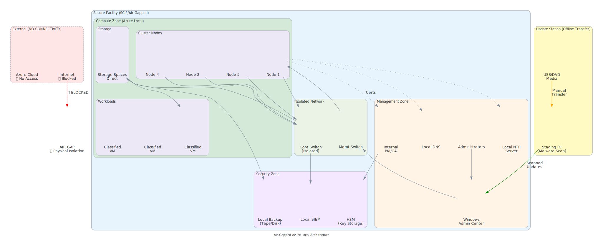

# Air-Gapped Architecture Design

## Overview

View Diagram: Air-Gapped Architecture

_Figure 1: Air-gapped Azure Local architecture with secure transfer mechanisms_

Design and implement completely isolated Azure Local deployments with zero cloud connectivity, manual processes, and complete operational autonomy.

---

## Air-Gap Boundaries

### Network Segmentation

- Physical isolation from cloud
- No internet connectivity
- Internal networks only
- One-way transfer gates

### Security Domains

- Management domain (admin access)
- Application domain (user workloads)
- Data domain (sensitive information)
- Update staging domain

---

## Air-Gapped Architecture Pattern

---

## Secure Transfer Mechanisms

### Physical Transfer

- USB storage devices
- Removable media
- Secure drives

### Logical Transfer

- Manual export/import processes
- Integrity verification
- Cryptographic signatures
- Audit trails

### Transfer Staging

- Quarantine zone
- Virus scanning
- Content inspection
- Change tracking

---

## Component Considerations

### Management Layer

- Local control plane
- No cloud backup
- Complete self-sufficiency
- Manual administration

### Compute & Storage

- All data local
- No external replication
- Complete isolation
- Local DR capability

### Monitoring & Logging

- Local telemetry
- On-premises analytics
- Local log storage
- No cloud ingestion

---

## Operational Procedures

- Manual health checks
- Local troubleshooting only
- Offline documentation
- No telemetry support

---

**See also:** [Certificate Management](azure-local-certificate-management) | [Disconnected Lab](azure-local-disconnected-lab)
