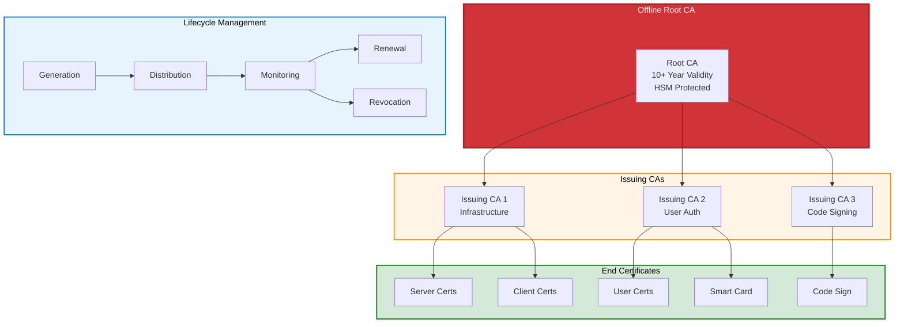

# Certificate Management in Disconnected Environments

## Overview

View Diagram: PKI Hierarchy for Air-Gapped Environments

_Figure 1: PKI hierarchy for air-gapped Azure Local environments_

Manage certificates manually in air-gapped environments without cloud certificate services or automated renewal capabilities.

---

## Manual Certificate Lifecycle

---

## Key Management

- Certificate generation offline
- Key storage in HSM or secure vaults
- Backup and recovery procedures
- Expiration tracking
- Renewal planning

---

## Renewal Procedures

- Pre-renewal validation
- Certificate generation
- Testing on staging system
- Manual deployment
- Verification procedures

---

## Emergency Procedures

- Certificate revocation
- Emergency renewal
- Disaster recovery
- Recertification after incidents

---

**See also:** [Air-Gapped Architecture](azure-local-air-gapped) | [Disconnected Lab](azure-local-disconnected-lab)
