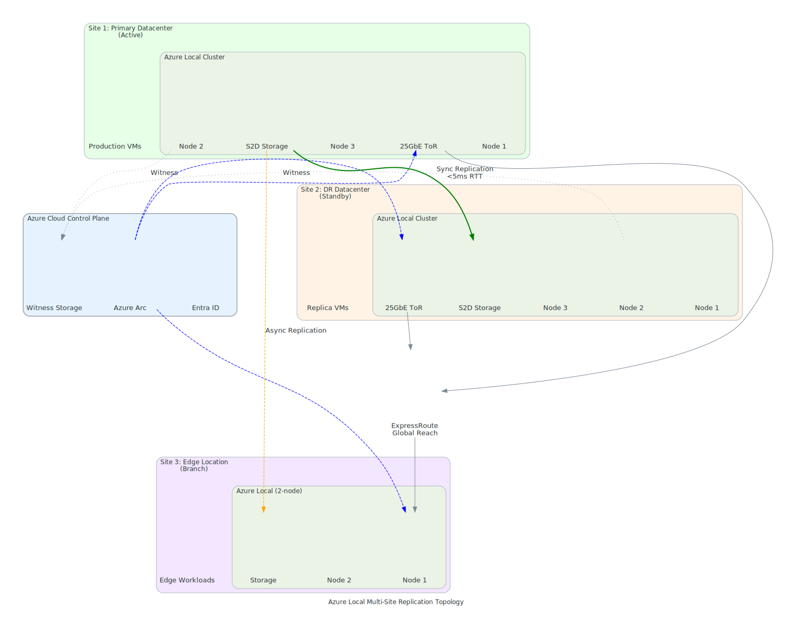
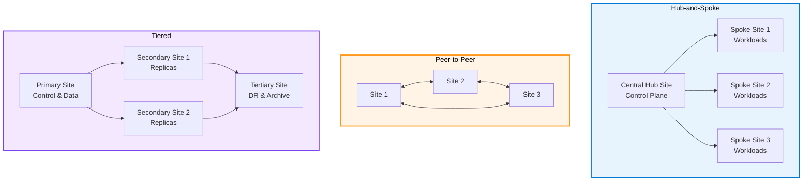

# Multi-Site Azure Local Architectures

{: .no_toc }

## Table of Contents

{: .no_toc .text-delta }

1. TOC
{:toc}

---

## Overview

Deploy Azure Local clusters across multiple physical sites with synchronized operations, failover capabilities, and coordinated governance.

{: .important }
> **📝 Key Distinction:** Azure Local does NOT support stretch clusters (single cluster spanning multiple sites). This page covers **multi-cluster** architectures where each site has its own Azure Local cluster, connected through replication and Arc management.
>
> For **rack-level** high availability within a single cluster, see [Rack-Aware Clustering](../level-200/azure-local-ha-patterns.md#rack-aware-clustering-preview).

View Diagram: Multi-Site Replication Topology

_Figure 1: Azure Local multi-site deployment with synchronous and asynchronous replication across datacenters_

---

## Multi-Site vs. Rack-Aware Clustering

| Feature | Rack-Aware Clustering | Multi-Site Architecture |
|---------|----------------------|------------------------|
| **Cluster Count** | Single cluster | Multiple clusters |
| **Physical Scope** | 2 racks (same campus, ≤1ms latency) | Multiple sites (any distance) |
| **Storage** | Single pool, synchronous | Separate pools, replicated |
| **Replication** | Built-in (Storage Spaces Direct) | Azure Site Recovery or Storage Replica |
| **Failover** | Automatic (zone-aware) | Manual or ASR-automated |
| **Use Case** | Room/building-level HA | Geographic DR |
| **Status** | Preview | GA |

---

## Multi-Site Topology Patterns

### Distributed Hub-and-Spoke

- Central hub site (primary control plane)
- Spoke sites (application workloads)
- Replicated management
- Site-specific data residency

### Peer-to-Peer Federation

- No central hub
- Direct site-to-site communication
- Distributed quorum
- Equal governance rights

### Tiered Architecture

- Primary site (control plane & data)
- Secondary sites (read replicas, compute)
- Tertiary sites (DR & archival)
- Cascading replication

---

## Multi-Site Architecture Comparison

---

## Synchronization Mechanisms

### Management Synchronization

- Cluster configuration sync
- Policy and governance distribution
- Certificate management coordination
- Update and patch orchestration

### Data Replication

- Application data sync
- Database replication
- Storage synchronization
- Consistency requirements

### Workload Distribution

- VM placement policies
- Traffic routing across sites
- Load balancing strategies
- Site affinity rules

---

## Failover and Recovery

- **Site failure scenarios**
  - Single site outage
  - Network partition
  - Complete data center failure

- **Recovery procedures**
  - Failover automation
  - Manual intervention points
  - Data consistency verification
  - Service restoration order

---

## Operational Considerations

- Monitoring across sites
- Log aggregation and correlation
- Remote support coordination
- Maintenance scheduling
- Update deployment sequence

---

**See also:** [Connected Mode Architecture](azure-local-advanced-connected) | [Networking Deep Dive](azure-local-networking-advanced) | [Lab Exercise](azure-local-connected-lab)
