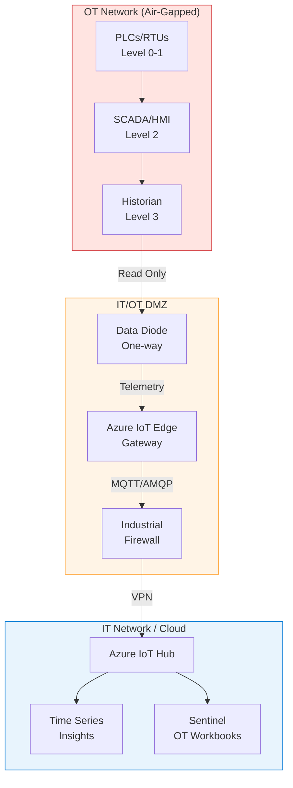

# Critical Infrastructure Architecture


{: .no_toc }

OT/IT convergence architecture for critical infrastructure protection with sovereign cloud integration.


## Table of Contents

{: .no_toc .text-delta }

1. TOC
{:toc}

---

## Overview

Critical infrastructure (energy, utilities, manufacturing) requires secure integration between Operational Technology (OT) environments and cloud analytics while maintaining safety and availability. This architecture follows the Purdue Model for industrial security with sovereign cloud controls.

## Learning Objectives

After completing this section, you will be able to:

- ✅ Design OT/IT convergence architectures
- ✅ Implement industrial DMZ patterns
- ✅ Configure Azure IoT for OT environments
- ✅ Enable threat detection for industrial systems

---


## Critical Infrastructure Architecture


| Level | Name | Components | Azure Integration |
|-------|------|------------|-------------------|
| 0-1 | Process | PLCs, RTUs, Sensors | IoT Edge (gateway) |
| 2 | Control | SCADA, HMI, Historian | Local processing |
| 3 | Site Operations | OT DMZ, Edge Gateway | IoT Edge + Azure Arc |
| 3.5 | IT/OT DMZ | Industrial Firewall | Azure Firewall |
| 4-5 | Enterprise | Cloud Analytics | Azure Sovereign Cloud |

---

## Industrial DMZ Configuration

### Network Segmentation



### Data Diode Configuration

For maximum OT isolation, deploy a hardware data diode:

| Direction | Allowed | Purpose |
|-----------|---------|---------|
| OT → IT | ✅ Yes | Telemetry, alarms |
| IT → OT | ❌ No | Prevents attack vectors |

---

## Azure IoT Edge Deployment

### Edge Module Configuration

```json
{
  "$schema-version": "1.1",
  "modulesContent": {
    "$edgeAgent": {
      "properties.desired": {
        "modules": {
          "OpcPublisher": {
            "type": "docker",
            "settings": {
              "image": "mcr.microsoft.com/iotedge/opc-publisher:latest"
            },
            "env": {
              "Security": { "value": "OpcUA-SignAndEncrypt" }
            }
          },
          "StreamAnalytics": {
            "type": "docker",
            "settings": {
              "image": "mcr.microsoft.com/azure-stream-analytics/azureiotedge:latest"
            }
          }
        }
      }
    }
  }
}
```

### OPC UA Security

```yaml
# OPC UA publisher configuration
opcuaConfiguration:
  endpointUrl: "opc.tcp://plc-server:4840"
  useSecurity: true
  securityMode: "SignAndEncrypt"
  securityPolicy: "Basic256Sha256"

  publishedNodes:
    - nodeId: "ns=2;s=Temperature"
      samplingInterval: 1000
      publishingInterval: 5000
    - nodeId: "ns=2;s=Pressure"
      samplingInterval: 1000
      publishingInterval: 5000
```

---

## OT Threat Detection

### Microsoft Defender for IoT

```powershell
# Deploy Defender for IoT sensor
New-AzIoTSecuritySolution `
    -Name "critical-infra-defender" `
    -ResourceGroupName "ot-security-rg" `
    -Location "westeurope" `
    -IotHub @("/subscriptions/{sub}/resourceGroups/iot-rg/providers/Microsoft.Devices/IotHubs/industrial-hub") `
    -RecommendationsConfiguration @(
        @{ RecommendationType = "IoT_OpenPorts"; Status = "Enabled" }
        @{ RecommendationType = "IoT_PermissiveFirewallPolicy"; Status = "Enabled" }
    )
```

### Sentinel OT Workbook

```kusto
// Industrial protocol anomaly detection
SecurityIoTRawEvent
| where TimeGenerated > ago(1h)
| where DeviceType == "PLC" or DeviceType == "HMI"
| where EventType in ("ProtocolAnomaly", "UnauthorizedAccess", "FirmwareChange")
| project TimeGenerated, DeviceId, DeviceType, EventType, Message
| summarize EventCount = count() by DeviceId, EventType, bin(TimeGenerated, 5m)
| where EventCount > 5
```

### Alert Categories

| Alert Type | Severity | Response |
|------------|----------|----------|
| Unauthorized firmware change | Critical | Isolate device, investigate |
| Protocol violation | High | Log, alert operations |
| New device on network | Medium | Verify with operations |
| Unusual traffic pattern | Low | Monitor, investigate |

---

## Regulatory Compliance

### ICS-Specific Frameworks

| Framework | Applicability | Implementation |
|-----------|---------------|----------------|
| **NERC CIP** | Electric utilities | Azure Policy + Sentinel |
| **IEC 62443** | Industrial automation | Network segmentation |
| **NIST SP 800-82** | ICS security guide | Full architecture |
| **NIS2** | EU critical infrastructure | Incident reporting |

### NERC CIP Mapping

| CIP Requirement | Azure Implementation |
|----------------|---------------------|
| CIP-002 | Asset inventory via Defender for IoT |
| CIP-003 | Azure Policy for governance |
| CIP-005 | Network segmentation, firewall |
| CIP-007 | Patch management via Azure Arc |
| CIP-010 | Configuration monitoring |

---

## Safety Considerations

{: .warning }
>
> **⚠️ Safety First**
> OT systems often control physical processes that can cause injury or environmental damage. Any cloud integration must:
>
> - Never allow remote control of safety-critical systems
> - Maintain air-gap for safety-instrumented systems (SIS)
> - Include manual override capabilities
> - Be reviewed by OT safety engineers

### Safety Instrumented Systems

| System Type | Cloud Integration | Safety Impact |
|-------------|-------------------|---------------|
| SIS/ESD | ❌ Never | Life safety |
| Process Control | ⚠️ Monitor only | Process safety |
| SCADA | ✅ Bi-directional (secured) | Operational |
| Historian | ✅ Full integration | None |

---

## Implementation Checklist

- [ ] Complete OT asset inventory
- [ ] Define Purdue Model boundaries
- [ ] Deploy industrial firewall/DMZ
- [ ] Install Azure IoT Edge gateway
- [ ] Configure OPC UA publishers
- [ ] Enable Defender for IoT
- [ ] Deploy Sentinel OT workbooks
- [ ] Conduct safety review
- [ ] Train OT personnel
- [ ] Establish incident response

---

## Next Steps

- **[API Gateway Patterns →](api-gateway-patterns.md)** — Secure API integration
- **[Observability Stack →](observability-stack.md)** — Monitoring and alerting

---

**Reference:** [Microsoft Defender for IoT](https://learn.microsoft.com/en-us/azure/defender-for-iot/) — Microsoft Learn
