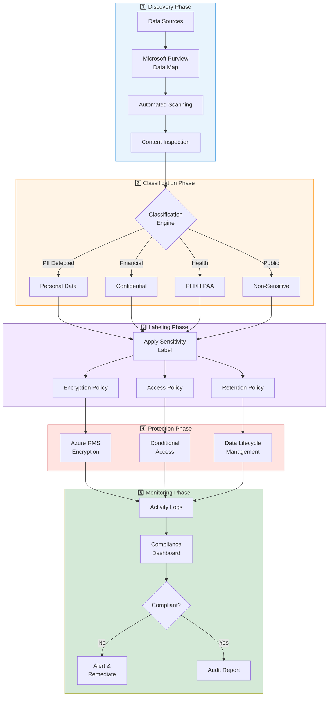

# Data Classification and Protection


{: .no_toc }

Implementing data classification workflows to identify, categorize, and protect sensitive information in sovereign cloud environments.


## Table of Contents

{: .no_toc .text-delta }

1. TOC
{:toc}

---

## Overview

Data classification is the foundation of data sovereignty. Before you can protect sensitive data, you must first understand what data you have, where it resides, and its sensitivity level. This module covers automated and manual classification approaches.

## Learning Objectives

After completing this section, you will be able to:

- ✅ Design a data classification taxonomy
- ✅ Implement automated classification with Microsoft Purview
- ✅ Apply protection policies based on classification
- ✅ Monitor classification compliance across the organization

---

## Data Classification Flow

The following diagram illustrates the complete data classification workflow from discovery to protection:



*Figure 1: Data classification workflow from discovery to continuous monitoring_

---

## Classification Taxonomy

### Sensitivity Levels

| Level | Description | Examples | Protection |
|-------|-------------|----------|------------|
| **Public** | No confidentiality requirements | Marketing materials, public docs | None required |
| **Internal** | Business-only information | Policies, procedures | Basic access control |
| **Confidential** | Business-sensitive data | Financial data, contracts | Encryption + access control |
| **Highly Confidential** | Restricted access | Trade secrets, M&A data | CMK encryption + MFA |
| **Regulated** | Legal/compliance requirements | PII, PHI, PCI data | Full DLP + audit |

### Regulatory Classifications

For sovereignty compliance, additional regulatory labels may apply:

- **GDPR Personal Data** — EU data subject information
- **HIPAA PHI** — Protected health information
- **PCI DSS** — Payment card data
- **ITAR/EAR** — Export controlled data
- **Classified** — Government security classifications

---

## Microsoft Purview Integration

### Data Map Configuration

```powershell
# Register data sources with Microsoft Purview
Register-AzPurviewDataSource `
    -AccountName "contoso-purview" `
    -DataSourceType "AzureBlob" `
    -ResourceId "/subscriptions/{sub-id}/resourceGroups/data-rg/providers/Microsoft.Storage/storageAccounts/sensitivedata"

# Configure scanning rule set for PII detection
New-AzPurviewScanRuleSet `
    -AccountName "contoso-purview" `
    -Name "EU-PII-Ruleset" `
    -Kind "AzureBlob" `
    -SystemClassificationRuleName @("GDPR", "EU.SSN", "EU.Passport")
```

### Automated Classification Rules

| Rule Type | Detection Method | Examples |
|-----------|-----------------|----------|
| Built-in | Regex + ML | Credit cards, SSN, email |
| Custom | Regex patterns | Employee IDs, custom codes |
| Trainable | Machine learning | Document types, contracts |
| Dictionary | Word lists | Project names, locations |

---

## Protection Policies

### Label-Based Protection

When a sensitivity label is applied, automatic protection policies activate:

```yaml
# Example: Confidential Label Policy
label:
  name: "Confidential"
  tooltip: "Business-sensitive information"
protection:
  encryption:
    enabled: true
    keySource: "customer-managed"
    keyVault: "/subscriptions/{sub}/resourceGroups/keys-rg/..."
  access:
    requireMFA: true
    allowedLocations: ["EU West", "EU North"]
  watermark:
    enabled: true
    text: "CONFIDENTIAL - ${user.name}"
  dlp:
    blockExternalSharing: true
    preventCopy: true
```

---

## Implementation Checklist

- [ ] Define classification taxonomy
- [ ] Deploy Microsoft Purview account
- [ ] Register all data sources
- [ ] Configure scanning schedules
- [ ] Create custom classification rules
- [ ] Define sensitivity labels
- [ ] Assign protection policies
- [ ] Enable continuous monitoring
- [ ] Train users on classification

---

## Next Steps

- **[Incident Response Workflow →](incident-response.md)** — Handle security incidents
- **[Encryption & Key Management →](../level-200/encryption-key-management.md)** — Protect classified data

---

**Reference:** [Microsoft Purview Data Classification](https://learn.microsoft.com/en-us/microsoft-365/compliance/data-classification-overview) — Microsoft Learn
