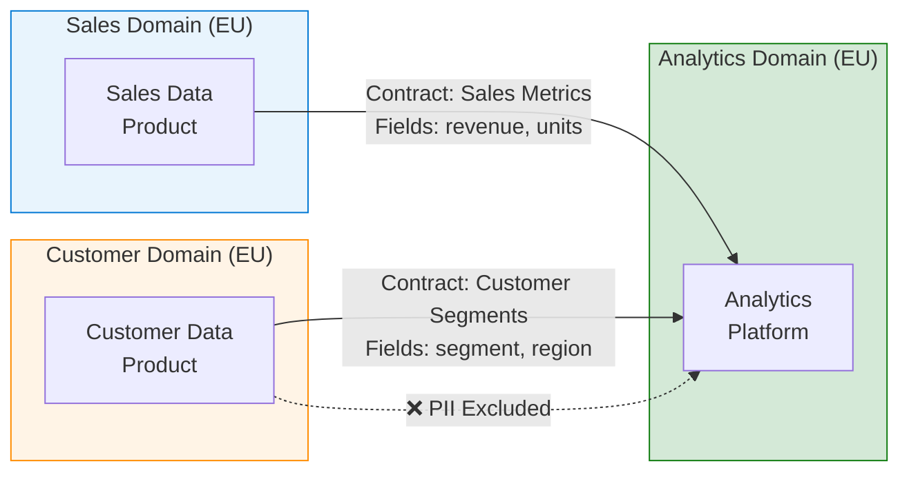

# Data Mesh for Sovereignty


{: .no_toc }

Domain-oriented data ownership with federated governance and sovereignty controls.


## Table of Contents

{: .no_toc .text-delta }

1. TOC
{:toc}

---

## Overview

Data Mesh is an architectural paradigm that treats data as a product owned by domain teams. For sovereign cloud environments, this approach aligns well with data residency requirements as each domain can manage its data within approved boundaries while sharing through governed APIs.

## Learning Objectives

After completing this section, you will be able to:

- ✅ Design data mesh architectures with sovereignty controls
- ✅ Implement federated governance with Microsoft Purview
- ✅ Configure domain data products with regional boundaries
- ✅ Enable secure cross-domain data sharing

---


## Data Mesh Architecture


| Principle | Sovereignty Implementation |
|-----------|---------------------------|
| **Domain Ownership** | Each domain owns data residency decisions |
| **Data as Product** | APIs with regional routing |
| **Self-serve Platform** | Pre-approved regional infrastructure |
| **Federated Governance** | Purview + Azure Policy |

---

## Federated Governance

### Microsoft Purview Configuration

```powershell
# Create Purview account for data governance
New-AzPurviewAccount `
    -Name "sovereign-purview" `
    -ResourceGroupName "governance-rg" `
    -Location "westeurope" `
    -ManagedResourceGroupName "purview-managed-rg"

# Register domain data sources
Register-AzPurviewDataSource `
    -AccountName "sovereign-purview" `
    -DataSourceName "sales-domain" `
    -DataSourceType "AzureSqlDatabase" `
    -ResourceId "/subscriptions/{sub}/resourceGroups/sales-rg/providers/Microsoft.Sql/servers/sales-sql/databases/salesdb"
```

### Governance Policies

```yaml
# Data governance policy structure
governancePolicies:
  dataResidency:
    enforced: true
    allowedRegions:
      - "westeurope"
      - "northeurope"

  dataClassification:
    autoClassify: true
    rules:
      - pattern: "SSN|Social Security"
        classification: "PII.HighRisk"
      - pattern: "email|phone"
        classification: "PII.Contact"

  dataCatalog:
    requireDescription: true
    requireOwner: true
    requireSensitivityLabel: true

  accessControl:
    requireApproval: true
    approvers: ["data-steward@domain"]
```

---

## Domain Data Products

### Sales Domain (EU)

```yaml
# Sales domain data product definition
dataProduct:
  name: "Sales Analytics"
  domain: "Sales"
  owner: "sales-data-team@contoso.com"

  dataResidency:
    region: "EU"
    storageLocations:
      - "westeurope"

  interfaces:
    - type: "API"
      endpoint: "https://sales-api.contoso.eu/v1"
      authentication: "OAuth2"
      scopes:
        - "sales.read"
        - "sales.aggregate"

    - type: "SQL"
      endpoint: "sales-sql.database.windows.net"
      authentication: "AzureAD"
      accessLevel: "Read-Only"

  sla:
    availability: 99.9
    latency: "< 100ms"
    freshness: "< 1 hour"

  qualityMetrics:
    completeness: 98
    accuracy: 99
    timeliness: 95
```

### Customer Domain (EU)

```yaml
dataProduct:
  name: "Customer 360"
  domain: "Customer"
  owner: "customer-data-team@contoso.com"

  dataResidency:
    region: "EU"
    piiHandling: "Encrypted-CMK"

  interfaces:
    - type: "API"
      endpoint: "https://customer-api.contoso.eu/v1"
      rateLimit: 1000

  dataContracts:
    - consumer: "Sales Domain"
      purpose: "Customer enrichment"
      fields: ["customerId", "segment", "region"]
      excludedFields: ["email", "phone", "address"]
```

---

## Data Products API

### API Design Pattern

```csharp
// Data Product API with sovereignty controls
[ApiController]
[Route("api/v1/sales")]
public class SalesDataProductController : ControllerBase
{
    [HttpGet("aggregates")]
    [Authorize(Policy = "SalesRead")]
    public async Task<IActionResult> GetAggregates(
        [FromQuery] string region,
        [FromQuery] DateTime from,
        [FromQuery] DateTime to)
    {
        // Validate requester's region access
        var callerRegion = HttpContext.User.FindFirst("region")?.Value;
        if (!_sovereigntyService.CanAccessRegion(callerRegion, region))
        {
            return Forbid("Cross-region access not permitted");
        }

        // Return aggregated, non-PII data
        var aggregates = await _salesService.GetAggregatesAsync(region, from, to);

        return Ok(new DataProductResponse
        {
            Data = aggregates,
            Metadata = new DataProductMetadata
            {
                Freshness = DateTime.UtcNow,
                Region = region,
                Quality = await _qualityService.GetMetricsAsync()
            }
        });
    }
}
```

---

## Cross-Domain Data Sharing

### Data Contract Pattern



### Contract Enforcement

```python
# Data contract validator
class DataContractValidator:
    def validate_output(self, data: pd.DataFrame, contract: DataContract) -> bool:
        # Check allowed fields only
        allowed_fields = set(contract.allowed_fields)
        actual_fields = set(data.columns)

        if not actual_fields.issubset(allowed_fields):
            raise DataContractViolation(
                f"Unauthorized fields: {actual_fields - allowed_fields}"
            )

        # Check excluded fields (PII)
        excluded = set(contract.excluded_fields)
        if actual_fields.intersection(excluded):
            raise DataContractViolation(
                f"PII fields included: {actual_fields.intersection(excluded)}"
            )

        # Validate data quality
        quality_metrics = self.calculate_quality(data)
        if quality_metrics.completeness < contract.min_completeness:
            raise DataQualityViolation("Completeness below threshold")

        return True
```

---

## Self-Serve Platform

### Domain Provisioning Template

```bicep
// Self-serve domain infrastructure
module domainInfra 'domain-template.bicep' = {
  name: '${domainName}-infrastructure'
  params: {
    domainName: domainName
    region: 'westeurope'  // Fixed for EU sovereignty

    // Pre-approved resources
    sqlServerSku: 'GP_Gen5_2'
    storageAccountSku: 'Standard_GRS'

    // Security baseline
    enablePrivateEndpoints: true
    enableCMK: true
    enablePurviewIntegration: true

    // Tagging for governance
    tags: {
      Domain: domainName
      DataOwner: dataOwnerEmail
      Classification: 'Confidential'
      Region: 'EU'
    }
  }
}
```

---

## Implementation Checklist

- [ ] Deploy Microsoft Purview
- [ ] Define domain boundaries
- [ ] Create data product templates
- [ ] Configure federated governance
- [ ] Implement data contracts
- [ ] Set up self-serve provisioning
- [ ] Enable data quality monitoring
- [ ] Configure cross-domain APIs
- [ ] Train domain teams

---

## Next Steps

- **[Observability Stack →](observability-stack.md)** — Monitor data products
- **[DevSecOps Pipeline →](devsecops-pipeline.md)** — Automate data platform deployment

---

**Reference:** [Microsoft Purview](https://learn.microsoft.com/en-us/purview/) — Microsoft Learn
