# DevSecOps Pipeline for Sovereign Cloud


{: .no_toc }

Security-integrated development pipelines with sovereignty compliance gates and automated enforcement.


## Table of Contents

{: .no_toc .text-delta }

1. TOC
{:toc}

---

## Overview

DevSecOps integrates security into every stage of the software development lifecycle. For sovereign cloud environments, this includes automated compliance checks, data residency validation, and sovereignty-aware deployment gates.

## Learning Objectives

After completing this section, you will be able to:

- ✅ Design DevSecOps pipelines with sovereignty gates
- ✅ Implement infrastructure-as-code compliance scanning
- ✅ Configure automated security testing
- ✅ Deploy with regional targeting controls

---

## DevSecOps Pipeline

```mermaid
flowchart LR
    subgraph Plan ["📋 Plan"]
        A[Threat<br/>Modeling]
        B[Security<br/>Requirements]
    end

    subgraph Code ["💻 Code"]
        C[IDE Security<br/>Plugins]
        D[Pre-commit<br/>Hooks]
    end

    subgraph Build ["🔨 Build"]
        E[SAST<br/>Scanning]
        F[Dependency<br/>Check]
        G[Container<br/>Scan]
    end

    subgraph Test ["🧪 Test"]
        H[DAST<br/>Testing]
        I[Penetration<br/>Test]
        J[Compliance<br/>Validation]
    end

    subgraph Release ["📦 Release"]
        K[Artifact<br/>Signing]
        L[SBOM<br/>Generation]
    end

    subgraph Deploy ["🚀 Deploy"]
        M{Sovereignty<br/>Gate}
        N[EU Region]
        O[US Region]
        P[Blocked]
    end

    subgraph Operate ["⚙️ Operate"]
        Q[Runtime<br/>Protection]
        R[Monitoring]
    end

    A --> B --> C --> D --> E --> F --> G --> H --> I --> J --> K --> L --> M
    M -->|"✅ EU Data"| N
    M -->|"✅ US Data"| O
    M -->|"❌ Violation"| P
    N --> Q
    O --> Q
    Q --> R

    style Plan fill:#E8F4FD,stroke:#0078D4
    style Code fill:#FFF4E6,stroke:#FF8C00
    style Build fill:#F3E8FF,stroke:#5C2D91
    style Test fill:#D4E9D7,stroke:#107C10
    style Release fill:#FFE4E1,stroke:#D13438
    style Deploy fill:#E8F4FD,stroke:#0078D4

    style Operate fill:#F0F0F0,stroke:#333_
```



*Figure 1: Complete DevSecOps pipeline with sovereignty gates_

---

## Pipeline Stages

### 1. Plan Phase

#### Threat Modeling

```yaml
# Threat model as code (OWASP Threat Dragon)
threatModel:
  title: "Sovereign Application"
  description: "Customer-facing application with EU data"

  dataFlows:
    - name: "User Authentication"
      source: "User"
      destination: "Entra ID"
      protocol: "HTTPS"
      dataClassification: "Credentials"

    - name: "Data Processing"
      source: "Application"
      destination: "SQL Database"
      protocol: "TDS"
      dataClassification: "PII"
      dataResidency: "EU-Only"

  threats:
    - id: "T001"
      title: "Cross-Region Data Leakage"
      category: "Information Disclosure"
      mitigation: "Azure Policy + Private Endpoints"
```

### 2. Code Phase

#### Pre-commit Hooks

```yaml
# .pre-commit-config.yaml
repos:
  - repo: https://github.com/antonbabenko/pre-commit-terraform
    hooks:
      - id: terraform_validate
      - id: terraform_tflint
      - id: terraform_docs

  - repo: https://github.com/bridgecrewio/checkov
    hooks:
      - id: checkov
        args: ['--framework', 'terraform', '--check', 'CKV_AZURE_*']

  - repo: local
    hooks:
      - id: sovereignty-check
        name: Check data residency
        entry: scripts/check-sovereignty.sh
        language: script
        files: \.(tf|bicep|json)$
```

### 3. Build Phase

#### Static Analysis (SAST)

```yaml
# Azure DevOps Pipeline - SAST stage
stages:
  - stage: SecurityScan
    jobs:
      - job: SAST
        steps:
          - task: CredScan@3
            inputs:
              toolVersion: 'Latest'

          - task: RoslynAnalyzers@3
            inputs:
              userProvidedRuleset: 'security-rules.ruleset'

          - task: SdtReport@2
            inputs:
              GdnExportAllTools: true
```

#### Infrastructure Compliance Scan

```python
# Bicep/Terraform sovereignty validator
import json
from pathlib import Path

APPROVED_REGIONS = ["westeurope", "northeurope"]

def validate_bicep(file_path: Path) -> list:
    violations = []
    content = file_path.read_text()

    # Check for hardcoded non-EU regions
    for region in ["eastus", "westus", "southeastasia", "centralus"]:
        if region.lower() in content.lower():
            violations.append({
                "file": str(file_path),
                "rule": "SOVEREIGNTY-001",
                "message": f"Non-approved region detected: {region}"
            })

    # Check for public endpoints
    if "publicNetworkAccess: 'Enabled'" in content:
        violations.append({
            "file": str(file_path),
            "rule": "SOVEREIGNTY-002",
            "message": "Public network access should be disabled"
        })

    return violations
```

### 4. Test Phase

#### Compliance Validation

```yaml
# Compliance test configuration
complianceTests:
  - name: "Data Residency Validation"
    type: "infrastructure"
    checks:
      - resource: "Microsoft.Storage/*"
        property: "location"
        operator: "in"
        values: ["westeurope", "northeurope"]

      - resource: "Microsoft.Sql/*"
        property: "properties.publicNetworkAccess"
        operator: "equals"
        value: "Disabled"

  - name: "Encryption Validation"
    type: "infrastructure"
    checks:
      - resource: "Microsoft.Storage/*"
        property: "properties.encryption.keySource"
        operator: "equals"
        value: "Microsoft.Keyvault"
```

### 5. Deploy Phase

#### Sovereignty Gate

```yaml
# Azure DevOps sovereignty gate
stages:
  - stage: SovereigntyGate
    jobs:
      - job: ValidateSovereignty
        steps:
          - script: |
              # Extract deployment target region
              REGION=$(az deployment group show --name $DEPLOYMENT_NAME --query 'properties.outputs.region.value' -o tsv)

              # Validate against approved regions
              if [[ ! " ${APPROVED_REGIONS[@]} " =~ " ${REGION} " ]]; then
                echo "##vso[task.logissue type=error]Sovereignty violation: Cannot deploy to $REGION"
                exit 1
              fi

              # Validate data classification
              DATA_CLASS=$(az deployment group show --name $DEPLOYMENT_NAME --query 'properties.parameters.dataClassification.value' -o tsv)
              if [[ "$DATA_CLASS" == "Confidential" && "$REGION" != "westeurope" ]]; then
                echo "##vso[task.logissue type=error]Confidential data must be in EU West"
                exit 1
              fi
            displayName: 'Sovereignty Validation'
            env:
              APPROVED_REGIONS: "westeurope northeurope"
```

---

## GitHub Advanced Security

### Code Scanning Configuration

```yaml
# .github/workflows/codeql-analysis.yml
name: "CodeQL"

on:
  push:
    branches: [main]
  pull_request:
    branches: [main]

jobs:
  analyze:
    runs-on: ubuntu-latest
    steps:
      - uses: actions/checkout@v4

      - uses: github/codeql-action/init@v3
        with:
          languages: 'csharp,javascript'
          queries: +security-extended

      - uses: github/codeql-action/autobuild@v3

      - uses: github/codeql-action/analyze@v3
        with:
          category: "/language:csharp"
```

### Secret Scanning

```yaml
# GitHub secret scanning configuration
secretScanning:
  enabled: true
  pushProtection: true

  customPatterns:
    - name: "Azure Subscription ID"
      pattern: "[a-f0-9]{8}-[a-f0-9]{4}-[a-f0-9]{4}-[a-f0-9]{4}-[a-f0-9]{12}"

    - name: "Internal API Key"
      pattern: "CONTOSO-[A-Z0-9]{32}"
```

---

## Container Security

### Container Scanning

```yaml
# Trivy container scanning
containerScan:
  scanner: "trivy"

  configuration:
    severity: "CRITICAL,HIGH"
    ignoreUnfixed: true

  complianceChecks:
    - id: "CIS-DI-0001"
      title: "Container user should be non-root"
    - id: "CIS-DI-0006"
      title: "Container should not use privileged mode"

  sovereigntyChecks:
    - id: "SOV-001"
      title: "Base image must be from approved registry"
      registry: "mcr.microsoft.com"
```

### SBOM Generation

```yaml
# Software Bill of Materials
sbomGeneration:
  format: "SPDX"
  outputFile: "sbom.spdx.json"

  includeComponents:
    - type: "npm"
    - type: "nuget"
    - type: "container"

  attestation:
    sign: true
    keyVault: "https://signing-kv.vault.azure.net"
    certificateName: "sbom-signing-cert"
```

---

## Runtime Security

### Defender for DevOps

```powershell
# Enable Defender for DevOps
Set-AzSecurityConnector `
    -Name "github-connector" `
    -ResourceGroupName "devsecops-rg" `
    -EnvironmentType "GitHub" `
    -GitHubConfiguration @{
        Authorization = @{
            Code = $gitHubPAT
        }
    }
```

---

## Implementation Checklist

- [ ] Configure pre-commit hooks
- [ ] Set up SAST scanning
- [ ] Enable dependency checking
- [ ] Implement container scanning
- [ ] Configure compliance gates
- [ ] Set up sovereignty validation
- [ ] Enable GitHub Advanced Security
- [ ] Configure SBOM generation
- [ ] Implement runtime protection
- [ ] Set up security monitoring

---

## Next Steps

- **[Disaster Recovery →](disaster-recovery.md)** — Business continuity planning
- **[Incident Response →](incident-response.md)** — Security incident handling

---

**Reference:** [Microsoft Security DevOps](https://learn.microsoft.com/en-us/azure/defender-for-cloud/defender-for-devops-introduction) — Microsoft Learn
