# MLOps for Edge RAG Systems

## Overview

Implement machine learning operations for managing model lifecycle in production edge RAG deployments.

---

## MLOps Pipeline

```mermaid
graph LR
    subgraph Dev[Development]
        Data[Data Collection] --> Train[Model Training]
        Train --> Validate[Validation]
        Validate --> Test[Testing]
    end

    subgraph Deploy[Deployment]
        Test --> Package[Edge Packaging]
        Package --> Version[Version Control]
        Version --> Rollout[Staged Rollout]
    end

    subgraph Monitor[Monitoring]
        Rollout --> Perf[Performance Tracking]
        Perf --> Drift[Data Drift Detection]
        Drift --> Quality[Quality Metrics]
    end

    subgraph Retrain[Retraining]
        Quality --> Trigger{Retrain?}
        Trigger -->|Yes| Auto[Auto Retrain]
        Trigger -->|No| Monitor
        Auto --> Gates[Validation Gates]
        Gates --> Approve[Approval]
        Approve --> Data
    end

    style Dev fill:#E8F4FD,stroke:#0078D4,stroke-width:2px,color:#000
    style Deploy fill:#FFF4E6,stroke:#FF8C00,stroke-width:2px,color:#000
    style Monitor fill:#F3E8FF,stroke:#7B3FF2,stroke-width:2px,color:#000
    style Retrain fill:#D4E9D7,stroke:#107C10,stroke-width:2px,color:#000
```

---

## Model Management

### Training

- Data collection
- Model training
- Validation
- Testing

### Deployment

- Edge packaging
- Version control
- Staged rollout
- Monitoring

### Monitoring

- Performance tracking
- Data drift detection
- Model quality metrics
- User analytics

### Retraining

- Trigger conditions
- Automatic retraining
- Validation gates
- Deployment approval

---

## Operational Excellence

- Automated pipelines
- Governance controls
- Audit trails
- Disaster recovery

---

**See also:** [Architecture](edge-rag-architecture-production) | [Lab](edge-rag-production-lab)
