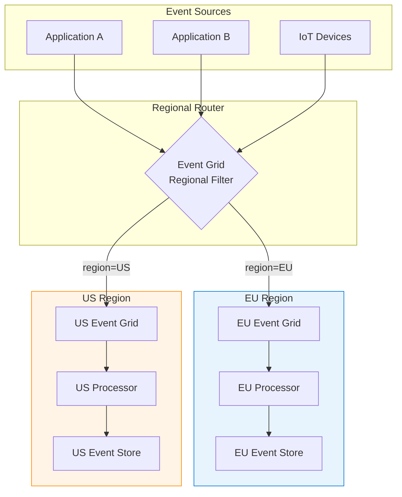
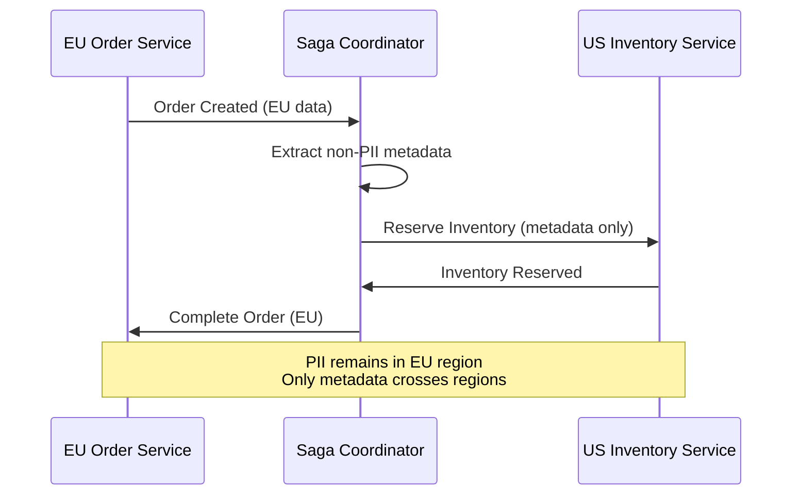

# Event-Driven Architecture for Sovereignty


{: .no_toc }

Asynchronous event processing patterns with data residency compliance and regional event routing.


## Table of Contents

{: .no_toc .text-delta }

1. TOC
{:toc}

---

## Overview

Event-driven architectures enable loose coupling and scalability but introduce complexity for data sovereignty. Events may contain regulated data and must be processed within approved boundaries. This module covers sovereign-aware event patterns.

## Learning Objectives

After completing this section, you will be able to:

- ✅ Design event-driven architectures with sovereignty controls
- ✅ Implement regional event routing
- ✅ Configure event stores with data residency
- ✅ Handle cross-region event choreography

---


## Event-Driven Architecture


### Component Overview

| Component | Purpose | Sovereignty Role |
|-----------|---------|-----------------|
| Event Grid | Event routing | Regional deployment |
| Service Bus | Ordered messaging | Topic-based routing |
| Event Hubs | Streaming ingestion | Regional capture |
| Cosmos DB | Event store | Multi-region writes disabled |
| Azure Functions | Serverless processing | Regional execution |

---

## Regional Event Routing

### Event Grid Configuration

```powershell
# Create regional Event Grid topic
New-AzEventGridTopic `
    -Name "eu-events" `
    -ResourceGroupName "events-rg" `
    -Location "westeurope" `
    -InputSchema "CloudEventSchemaV1_0"

# Create subscription with regional filter
New-AzEventGridSubscription `
    -TopicName "eu-events" `
    -ResourceGroupName "events-rg" `
    -EventSubscriptionName "eu-processor" `
    -Endpoint "/subscriptions/{sub}/resourceGroups/functions-rg/providers/Microsoft.Web/sites/eu-processor/functions/ProcessEvent" `
    -EndpointType "AzureFunction" `
    -AdvancedFilter @(
        @{
            Key = "data.region"
            OperatorType = "StringIn"
            Values = @("EU", "westeurope", "northeurope")
        }
    )
```

### Event Routing Pattern



---

## Service Bus Patterns

### Ordered Message Processing

```csharp
// Session-based ordering for sovereignty compliance
await using var processor = serviceBusClient.CreateSessionProcessor(
    queueName: "sovereign-events",
    new ServiceBusSessionProcessorOptions
    {
        MaxConcurrentSessions = 10,
        MaxConcurrentCallsPerSession = 1, // Strict ordering
        SessionIdleTimeout = TimeSpan.FromMinutes(5)
    });

processor.ProcessMessageAsync += async args =>
{
    var message = args.Message;
    var region = message.ApplicationProperties["DataRegion"].ToString();

    // Validate regional processing
    if (!IsApprovedRegion(region, Environment.GetEnvironmentVariable("DEPLOYMENT_REGION")))
    {
        throw new InvalidOperationException($"Cannot process {region} data in this region");
    }

    await ProcessEventAsync(message);
    await args.CompleteMessageAsync(message);
};
```

### Dead Letter Handling

```yaml
# Dead letter configuration for compliance
deadLetterConfiguration:
  maxDeliveryCount: 3
  deadLetterQueue: "sovereignty-violations-dlq"

  alerting:
    enabled: true
    threshold: 1  # Alert on first violation
    notification: "security-team@contoso.com"

  retention:
    days: 90  # Regulatory retention
    archiveToStorage: true
```

---

## Event Store Design

### Cosmos DB Configuration

```powershell
# Create sovereign event store
New-AzCosmosDBAccount `
    -ResourceGroupName "events-rg" `
    -Name "eu-event-store" `
    -Location "West Europe" `
    -DefaultConsistencyLevel "Strong" `
    -EnableMultipleWriteLocations $false `  # Prevent cross-region writes
    -PublicNetworkAccess "Disabled"

# Create event container with TTL
New-AzCosmosDBSqlContainer `
    -AccountName "eu-event-store" `
    -ResourceGroupName "events-rg" `
    -DatabaseName "events" `
    -Name "event-store" `
    -PartitionKeyPath "/aggregateId" `
    -DefaultTtl 2592000  # 30 days
```

### Event Schema

```json
{
  "id": "evt-12345",
  "aggregateId": "order-67890",
  "aggregateType": "Order",
  "eventType": "OrderPlaced",
  "eventVersion": 1,
  "timestamp": "2024-01-15T10:30:00Z",
  "dataRegion": "EU",
  "dataClassification": "Confidential",
  "causationId": "cmd-11111",
  "correlationId": "session-22222",
  "metadata": {
    "userId": "user-33333",
    "clientIp": "10.0.0.1"
  },
  "payload": {
    "orderId": "order-67890",
    "customerId": "cust-44444",
    "total": 150.00
  }
}
```

---

## Cross-Region Choreography

### Saga Pattern with Sovereignty



### Compensating Transactions

```csharp
// Saga with regional compensation
public class SovereignOrderSaga
{
    public async Task ExecuteAsync(OrderCommand command)
    {
        try
        {
            // Step 1: Create order in origin region
            var order = await _euOrderService.CreateOrderAsync(command);

            // Step 2: Reserve inventory (metadata only)
            var reservation = await _inventoryService.ReserveAsync(
                new ReservationRequest
                {
                    OrderReference = order.Id, // Reference, not data
                    Items = command.Items.Select(i => i.Sku).ToList()
                });

            // Step 3: Complete in origin region
            await _euOrderService.ConfirmOrderAsync(order.Id, reservation.Id);
        }
        catch (Exception ex)
        {
            // Compensate in reverse order
            await _euOrderService.CancelOrderAsync(order.Id);
            throw;
        }
    }
}
```

---

## Implementation Checklist

- [ ] Deploy regional Event Grid topics
- [ ] Configure Service Bus with sessions
- [ ] Create Cosmos DB event store
- [ ] Implement regional filters
- [ ] Set up dead letter handling
- [ ] Configure event archival
- [ ] Implement saga coordinators
- [ ] Set up cross-region monitoring
- [ ] Define retry policies

---

## Next Steps

- **[Data Mesh →](data-mesh-sovereignty.md)** — Domain data ownership
- **[Observability Stack →](observability-stack.md)** — Event monitoring

---

**Reference:** [Azure Event Grid](https://learn.microsoft.com/en-us/azure/event-grid/) — Microsoft Learn
