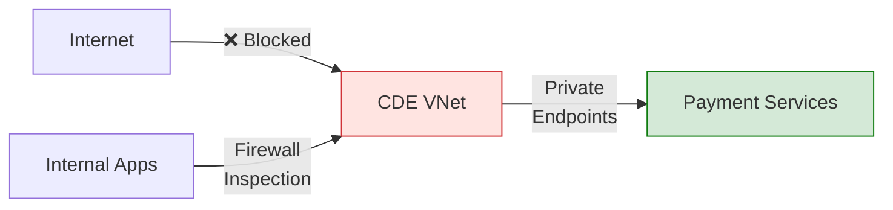

# Financial Services Sovereign Architecture


{: .no_toc }

PCI-DSS and regulatory compliant architecture for financial services with cardholder data protection.


## Table of Contents

{: .no_toc .text-delta }

1. TOC
{:toc}

---

## Overview

Financial services organizations face stringent regulatory requirements including PCI-DSS for payment card data, SOX for financial reporting, and increasingly DORA (EU) for digital operational resilience. This architecture addresses these requirements while maintaining data sovereignty.

## Learning Objectives

After completing this section, you will be able to:

- ✅ Design PCI-DSS compliant Azure architectures
- ✅ Implement cardholder data environment (CDE) isolation
- ✅ Configure fraud detection with AI/ML
- ✅ Meet financial regulatory requirements

---


## Financial Services Architecture


### Architecture Zones

#### PCI Zone (Cardholder Data Environment)

The CDE is completely isolated from general workloads:

| Component | Purpose | PCI Requirement |
|-----------|---------|-----------------|
| Isolated VNet | Network segmentation | 1.3 |
| Azure Firewall with IDS/IPS | Traffic filtering | 1.4 |
| WAF with OWASP rules | Application protection | 6.6 |
| Payment AKS | Hardened containers | 2.2 |
| SQL with Always Encrypted | Column-level encryption | 3.4 |
| Tokenized Storage | PAN tokenization | 3.5 |

#### General Workload Zone

Non-PCI workloads with controlled access to the CDE:

- Analytics workloads (fraud detection)
- Customer-facing applications
- Back-office systems

---

## PCI-DSS Requirements Mapping

### Requirement 1: Network Security



### Requirement 3: Protect Stored Data

| Data Type | Protection Method | Azure Service |
|-----------|------------------|---------------|
| Primary Account Number (PAN) | Tokenization | Custom tokenization service |
| CVV | Never stored | N/A |
| Cardholder Name | Encryption | Always Encrypted |
| Expiration Date | Encryption | TDE + CMK |

### Requirement 7: Access Control

```powershell
# PIM configuration for CDE access
New-AzureADMSPrivilegedAccessRole `
    -RoleName "CDE-Administrator" `
    -ResourceId "/subscriptions/{sub}/resourceGroups/pci-rg" `
    -MaxDuration "PT4H" `
    -RequireApproval $true `
    -RequireJustification $true `
    -RequireMFA $true
```

---

## Fraud Detection Architecture

### Real-time Transaction Scoring

```yaml
# Event Hub -> Stream Analytics -> ML Scoring
fraudDetectionPipeline:
  input:
    eventHub:
      name: "payment-transactions"
      consumerGroup: "fraud-detection"

  processing:
    streamAnalytics:
      query: |
        SELECT
          TransactionId,
          Amount,
          Location,
          CardToken,
          UDF.ScoreFraudRisk(Transaction) as RiskScore
        FROM TransactionStream
        WHERE Amount > 1000 OR Location != LastKnownLocation

  output:
    - highRiskQueue: "fraud-review"
    - dataLake: "transaction-archive"
```

### Machine Learning Model

The fraud detection model runs in a separate non-CDE zone:

- **Input:** Tokenized transaction metadata (no PAN)
- **Processing:** Azure Databricks with ML model
- **Output:** Risk score (0-100)
- **Action:** High-risk transactions flagged for review

---

## HSM Key Management

### Managed HSM Configuration

```powershell
# Create Managed HSM for payment processing
New-AzKeyVaultManagedHsm `
    -Name "payment-hsm" `
    -ResourceGroupName "pci-keys-rg" `
    -Location "westeurope" `
    -Sku "Standard_B1" `
    -Administrator @("{security-team-object-id}")

# Create payment encryption key
Add-AzKeyVaultKey `
    -VaultName "payment-hsm" `
    -Name "card-encryption-key" `
    -KeyType "RSA-HSM" `
    -Size 4096 `
    -KeyOps @("encrypt", "decrypt", "wrapKey", "unwrapKey")
```

### Key Rotation Policy

| Key Type | Rotation Frequency | Method |
|----------|-------------------|--------|
| Data Encryption Key (DEK) | 90 days | Automatic |
| Key Encryption Key (KEK) | Annual | Manual with approval |
| TLS Certificates | 1 year | Automatic via Key Vault |

---

## DORA Compliance (EU)

For EU financial services, the Digital Operational Resilience Act (DORA) requires:

| Requirement | Implementation |
|-------------|---------------|
| ICT Risk Management | Microsoft Defender for Cloud |
| Incident Reporting | Sentinel with custom playbooks |
| Resilience Testing | Azure Chaos Studio |
| Third-party Risk | Vendor assessment via Purview |
| Information Sharing | Threat intelligence integration |

---

## Implementation Checklist

- [ ] Complete PCI-DSS SAQ or ROC
- [ ] Deploy isolated CDE VNet
- [ ] Configure Azure Firewall with IDS/IPS
- [ ] Implement tokenization service
- [ ] Deploy Managed HSM
- [ ] Configure Always Encrypted for SQL
- [ ] Enable fraud detection pipeline
- [ ] Set up PIM for privileged access
- [ ] Configure file integrity monitoring
- [ ] Schedule quarterly vulnerability scans

---

## Next Steps

- **[Government Cloud Pattern →](government-cloud.md)** — FedRAMP implementation
- **[Critical Infrastructure →](critical-infrastructure.md)** — OT/IT convergence

---

**Reference:** [Azure PCI-DSS Blueprint](https://learn.microsoft.com/en-us/azure/governance/blueprints/samples/pci-dss-3.2.1/) — Microsoft Learn
