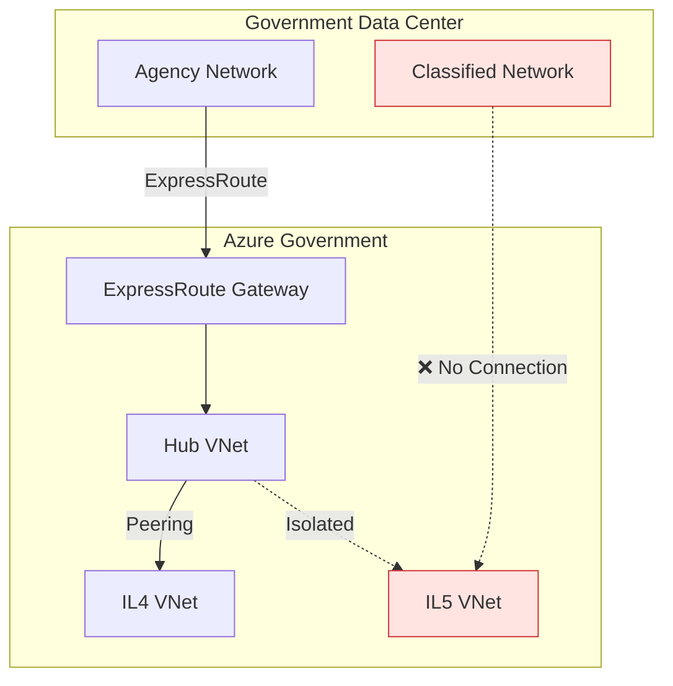

# Government Cloud Architecture


{: .no_toc }

FedRAMP High and Impact Level 4-5 compliant architecture for government workloads.


## Table of Contents

{: .no_toc .text-delta }

1. TOC
{:toc}

---

## Overview

Government organizations require the highest levels of security and compliance. This architecture covers deployments in Azure Government regions with FedRAMP High authorization and support for Impact Level 4 (IL4) and IL5 workloads, including Controlled Unclassified Information (CUI) and National Security Systems.

## Learning Objectives

After completing this section, you will be able to:

- ✅ Design FedRAMP High compliant architectures
- ✅ Implement IL4/IL5 workload isolation
- ✅ Configure compliant connectivity patterns
- ✅ Meet NIST 800-53 control requirements

---


## Government Cloud Architecture


| Region | Location | IL Support | Services |
|--------|----------|------------|----------|
| US Gov Virginia | Virginia, USA | IL2, IL4, IL5 | Full |
| US Gov Texas | Texas, USA | IL2, IL4, IL5 | Full |
| US Gov Arizona | Arizona, USA | IL2, IL4, IL5 | Full |
| US DoD Central | Iowa, USA | IL5, IL6 | DoD only |
| US DoD East | Virginia, USA | IL5, IL6 | DoD only |

---

## FedRAMP Control Families

### NIST 800-53 Implementation

| Control Family | Azure Implementation |
|---------------|---------------------|
| **AC** - Access Control | Entra ID, RBAC, PIM |
| **AU** - Audit | Log Analytics, Sentinel |
| **CA** - Assessment | Defender for Cloud |
| **CM** - Configuration | Azure Policy, Blueprints |
| **CP** - Contingency | Backup, Site Recovery |
| **IA** - Identification | Entra ID, MFA, CAC/PIV |
| **IR** - Incident Response | Sentinel, Playbooks |
| **SC** - System Protection | NSG, Firewall, Encryption |
| **SI** - System Integrity | Defender, Update Management |

### FedRAMP High Baseline

```yaml
# Azure Policy initiative for FedRAMP High
policyAssignment:
  name: "FedRAMP-High-Baseline"
  scope: "/subscriptions/{gov-subscription}"
  policyDefinitionId: "/providers/Microsoft.Authorization/policySetDefinitions/d5264498-16f4-418a-b659-fa7ef418175f"
  parameters:
    logAnalyticsWorkspaceId: "/subscriptions/{sub}/resourceGroups/mgmt-rg/providers/Microsoft.OperationalInsights/workspaces/gov-logs"
```

---

## Impact Level Segmentation

### IL4 Workload Zone

For Controlled Unclassified Information (CUI):

| Requirement | Implementation |
|-------------|---------------|
| Data Encryption | TDE + CMK (FIPS 140-2) |
| Access Control | CAC/PIV + MFA |
| Network | Dedicated VNet, ExpressRoute |
| Monitoring | FedRAMP audit logging |

### IL5 Workload Zone

For National Security Systems and higher-sensitivity CUI:

| Requirement | Implementation |
|-------------|---------------|
| Complete Isolation | Dedicated VNet, no peering |
| HSM Keys | Dedicated HSM (FIPS 140-2 L3) |
| Access Control | CAC/PIV + location-based |
| Internet | Blocked (air-gap capable) |
| Personnel | US Persons only |

---

## Connectivity Patterns

### ExpressRoute Government

```powershell
# Configure ExpressRoute for Government
New-AzExpressRouteCircuit `
    -Name "gov-expressroute" `
    -ResourceGroupName "connectivity-rg" `
    -Location "usgovvirginia" `
    -SkuTier "Premium" `
    -SkuFamily "MeteredData" `
    -ServiceProviderName "AT&T Netbond" `
    -PeeringLocation "Washington DC" `
    -BandwidthInMbps 1000
```

### Network Segmentation



---

## CAC/PIV Authentication

### Entra ID Configuration

```powershell
# Configure certificate-based authentication
New-MgOrganizationCertificateBasedAuthConfiguration `
    -OrganizationId "{tenant-id}" `
    -CertificateAuthorities @(
        @{
            IsRootAuthority = $true
            Certificate = [Convert]::ToBase64String((Get-Content "dod-root-ca.cer" -Encoding Byte))
        }
    )
```

### Conditional Access Policy

```json
{
  "displayName": "Require CAC/PIV for Government Apps",
  "conditions": {
    "applications": {
      "includeApplications": ["All"]
    },
    "users": {
      "includeGroups": ["{gov-users-group}"]
    }
  },
  "grantControls": {
    "builtInControls": [
      "mfa",
      "compliantDevice"
    ],
    "authenticationStrength": {
      "@odata.type": "#microsoft.graph.authenticationStrengthPolicy",
      "requirementsSatisfied": "mfa",
      "allowedCombinations": [
        "x509CertificateSingleFactor"
      ]
    }
  }
}
```

---

## Continuous Monitoring

### FISMA Reporting

```kusto
// FISMA compliance dashboard query
SecurityBaseline
| where TimeGenerated > ago(30d)
| summarize
    Compliant = countif(ComplianceState == "Compliant"),
    NonCompliant = countif(ComplianceState == "NonCompliant")
    by ControlFamily
| extend ComplianceRate = round(100.0 * Compliant / (Compliant + NonCompliant), 2)
| order by ComplianceRate asc
```

### Automated POA&M Generation

Plan of Action and Milestones (POA&M) for non-compliant controls:

```powershell
# Generate POA&M from Defender findings
$findings = Get-AzSecurityAssessment | Where-Object { $_.Properties.Status.Code -eq "Unhealthy" }

$poam = $findings | ForEach-Object {
    [PSCustomObject]@{
        ControlId = $_.Properties.Metadata.AssessmentType
        Finding = $_.Properties.DisplayName
        Resource = $_.Properties.ResourceDetails.Id
        Remediation = $_.Properties.Metadata.RemediationDescription
        DueDate = (Get-Date).AddDays(30)
    }
}

$poam | Export-Csv "POAM-$(Get-Date -Format 'yyyyMMdd').csv"
```

---

## Implementation Checklist

- [ ] Obtain Azure Government subscription
- [ ] Complete FedRAMP authorization package
- [ ] Deploy Hub-Spoke network topology
- [ ] Configure ExpressRoute to agency network
- [ ] Implement CAC/PIV authentication
- [ ] Deploy Azure Policy FedRAMP initiative
- [ ] Configure Log Analytics for FISMA
- [ ] Enable Defender for Cloud Government
- [ ] Create IL4/IL5 workload subscriptions
- [ ] Implement continuous monitoring

---

## Next Steps

- **[Critical Infrastructure →](critical-infrastructure.md)** — OT/IT convergence
- **[Disaster Recovery →](disaster-recovery.md)** — Multi-region resilience

---

**Reference:** [Azure Government Documentation](https://learn.microsoft.com/en-us/azure/azure-government/) — Microsoft Learn
