# Incident Response Workflow


{: .no_toc }

Security incident response procedures for sovereign cloud environments with compliance-aware escalation and remediation processes.


## Table of Contents

{: .no_toc .text-delta }

1. TOC
{:toc}

---

## Overview

Incident response in sovereign cloud environments requires additional considerations for data handling, regulatory notification, and cross-border communications. This module outlines a structured approach aligned with NIST and ISO 27001 frameworks.

## Learning Objectives

After completing this section, you will be able to:

- ✅ Implement a sovereign-aware incident response process
- ✅ Configure automated detection and alerting
- ✅ Execute containment without violating data residency
- ✅ Meet regulatory notification requirements

---

## Incident Response Workflow

```mermaid
flowchart TB
    subgraph Detection ["1️⃣ Detection"]
        A[Microsoft Sentinel] --> B{Alert<br/>Triggered}
        C[Defender for Cloud] --> B
        D[User Report] --> B
    end

    subgraph Triage ["2️⃣ Triage"]
        B --> E[Security<br/>Analyst]
        E --> F{Severity<br/>Assessment}
        F -->|Critical| G[🔴 P1: Immediate]
        F -->|High| H[🟠 P2: 1 Hour]
        F -->|Medium| I[🟡 P3: 4 Hours]
        F -->|Low| J[🟢 P4: 24 Hours]
    end

    subgraph Containment ["3️⃣ Containment"]
        G --> K[Incident<br/>Commander]
        H --> K
        I --> L[Security Team]
        J --> L
        K --> M[Isolate<br/>Affected Resources]
        L --> M
        M --> N{Data<br/>Sovereignty<br/>Impact?}
        N -->|Yes| O[Legal/Compliance<br/>Notification]
        N -->|No| P[Continue<br/>Containment]
        O --> P
    end

    subgraph Investigation ["4️⃣ Investigation"]
        P --> Q[Collect Evidence<br/>⚠️ Keep in Region]
        Q --> R[Root Cause<br/>Analysis]
        R --> S[Document<br/>Findings]
    end

    subgraph Remediation ["5️⃣ Remediation"]
        S --> T[Apply Fixes]
        T --> U[Verify<br/>Resolution]
        U --> V{Resolved?}
        V -->|No| T
        V -->|Yes| W[Restore<br/>Services]
    end

    subgraph PostIncident ["6️⃣ Post-Incident"]
        W --> X[Lessons Learned]
        X --> Y[Update Playbooks]
        Y --> Z[Regulatory<br/>Reporting]
        Z --> AA[Close Incident]
    end

    style Detection fill:#E8F4FD,stroke:#0078D4
    style Triage fill:#FFF4E6,stroke:#FF8C00
    style Containment fill:#FFE4E1,stroke:#D13438
    style Investigation fill:#F3E8FF,stroke:#5C2D91
    style Remediation fill:#D4E9D7,stroke:#107C10

    style PostIncident fill:#F0F0F0,stroke:#333333_
```



*Figure 1: Complete incident response workflow with sovereignty checkpoints_

---

## Severity Classification

### Priority Levels

| Priority | SLA | Examples | Escalation |
|----------|-----|----------|------------|
| **P1 - Critical** | 15 min | Data breach, ransomware, sovereignty violation | CISO, Legal, Executive |
| **P2 - High** | 1 hour | Compromised credentials, data exfiltration attempt | Security Manager |
| **P3 - Medium** | 4 hours | Malware detection, policy violation | Security Analyst |
| **P4 - Low** | 24 hours | Phishing attempt, suspicious activity | SOC Tier 1 |

### Sovereignty-Specific Incidents

{: .warning }
> **⚠️ Data Sovereignty Incidents**
> Any incident involving potential cross-border data transfer or access by unauthorized parties (including foreign entities) requires immediate escalation to Legal and Compliance teams.

| Incident Type | Immediate Actions |
|--------------|-------------------|
| Cross-border data access | Block access, notify DPO, preserve logs |
| Foreign government request | Legal hold, do not comply without counsel |
| Encryption key compromise | Rotate keys, re-encrypt data in region |
| Third-party breach | Assess data impact, contractual obligations |

---

## Detection & Alerting

### Microsoft Sentinel Configuration

```kusto
// Sovereignty-aware alert rule: Cross-region data access
AzureActivity
| where OperationNameValue contains "Microsoft.Storage/storageAccounts/blobServices"
| where CallerIpAddress !startswith "10." // External access
| extend AccessRegion = extract("location=([^,]+)", 1, Properties)
| where AccessRegion !in ("westeurope", "northeurope") // Non-EU access
| project TimeGenerated, Caller, Resource, AccessRegion, CallerIpAddress
| summarize AccessCount = count() by Caller, Resource, bin(TimeGenerated, 1h)
| where AccessCount > 10
```

### Alert Categories

| Category | Detection Source | Response |
|----------|-----------------|----------|
| Identity | Entra ID Protection | Block sign-in, require MFA |
| Network | Azure Firewall, NSG | Isolate subnet, block IP |
| Data | Purview, DLP | Revoke access, quarantine |
| Compute | Defender for Servers | Isolate VM, snapshot disk |

---

## Containment Procedures

### Isolation Playbook

```powershell
# Isolate compromised VM without data transfer
$vm = Get-AzVM -Name "compromised-vm" -ResourceGroupName "prod-rg"

# 1. Disconnect from network (keep in region)
$nic = Get-AzNetworkInterface -ResourceId $vm.NetworkProfile.NetworkInterfaces[0].Id
$nic.NetworkSecurityGroup = Get-AzNetworkSecurityGroup -Name "isolate-nsg" -ResourceGroupName "security-rg"
$nic | Set-AzNetworkInterface

# 2. Create snapshot for forensics (same region)
$snapshotConfig = New-AzSnapshotConfig `
    -Location $vm.Location `
    -SourceUri $vm.StorageProfile.OsDisk.ManagedDisk.Id `
    -CreateOption Copy

New-AzSnapshot `
    -Snapshot $snapshotConfig `
    -SnapshotName "forensic-snapshot-$(Get-Date -Format 'yyyyMMddHHmm')" `
    -ResourceGroupName "security-rg"

# 3. Log containment action
Write-AzActivityLog -Message "VM isolated for incident response" -ResourceId $vm.Id
```

---

## Regulatory Notification Requirements

| Regulation | Notification Window | Authority |
|------------|-------------------|-----------|
| **GDPR** | 72 hours | Supervisory Authority + Data Subjects |
| **HIPAA** | 60 days | HHS OCR + Affected Individuals |
| **PCI DSS** | Immediate | Card Brands + Acquiring Bank |
| **FedRAMP** | 1 hour (US-CERT) | CISA |
| **NIS2 (EU)** | 24 hours | National CSIRT |

---

## Post-Incident Review

### Lessons Learned Template

```markdown
## Incident Post-Mortem: [INC-YYYY-NNNN]

### Summary
- **Date/Time:**
- **Duration:**
- **Severity:**
- **Data Impact:**

### Timeline
| Time | Event |
|------|-------|
| T+0 | Initial detection |
| T+X | Containment complete |
| T+X | Root cause identified |
| T+X | Remediation complete |

### Root Cause
[Description of what caused the incident]

### What Went Well
- [List of effective responses]

### What Needs Improvement
- [List of gaps identified]

### Action Items
| Item | Owner | Due Date |
|------|-------|----------|
| [Action] | [Name] | [Date] |
```

---

## Next Steps

- **[DevSecOps Pipeline →](devsecops-pipeline.md)** — Prevent security issues in development
- **[Zero Trust Monitoring →](zero-trust-monitoring.md)** — Continuous security monitoring

---

**Reference:** [NIST Incident Response](https://csrc.nist.gov/publications/detail/sp/800-61/rev-2/final) — NIST SP 800-61
