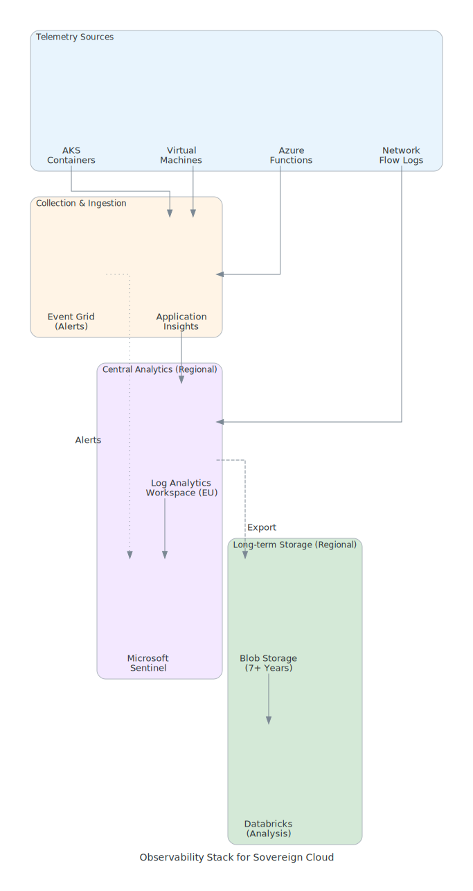

# Observability Stack for Sovereignty

{: .no_toc }

Complete monitoring and observability with data residency compliance for logs, metrics, and traces.

## Table of Contents

{: .no_toc .text-delta }

1. TOC
{:toc}

---

## Overview

Observability is critical for operating sovereign cloud environments, but telemetry data often contains sensitive information. This module covers designing observability stacks that maintain data residency while providing comprehensive monitoring capabilities.

## Learning Objectives

After completing this section, you will be able to:

- ✅ Design regional observability architectures
- ✅ Configure Log Analytics with data residency
- ✅ Implement distributed tracing with sovereignty controls
- ✅ Set up alerting and dashboards

---

## Observability Architecture

<details class="diagram-container" open>
_summary>View Diagram: Observability Stack</summary>_
<div class="diagram-content">
_

_Figure 1: Complete observability stack with regional data collection and storage_

</div>
</details>

### Component Overview

| Component | Purpose | Data Residency |
|-----------|---------|----------------|
| Application Insights | APM, traces | Regional workspace |
| Log Analytics | Central logging | Regional retention |
| Microsoft Sentinel | Security monitoring | Regional |
| Databricks | Log analysis | Regional compute |
| Blob Storage | Long-term archive | Regional GRS |

---

## Regional Log Analytics

### Workspace Configuration

```powershell
# Create regional Log Analytics workspace
New-AzOperationalInsightsWorkspace `
    -ResourceGroupName "monitoring-rg" `
    -Name "eu-logs-workspace" `
    -Location "westeurope" `
    -Sku "PerGB2018" `
    -RetentionInDays 90

# Configure diagnostic settings for resources
Set-AzDiagnosticSetting `
    -ResourceId "/subscriptions/{sub}/resourceGroups/app-rg/providers/Microsoft.Web/sites/myapp" `
    -WorkspaceId "/subscriptions/{sub}/resourceGroups/monitoring-rg/providers/Microsoft.OperationalInsights/workspaces/eu-logs-workspace" `
    -Enabled $true `
    -Category @("AppServiceHTTPLogs", "AppServiceConsoleLogs", "AppServiceAuditLogs")
```

### Data Residency Configuration

```yaml
# Log Analytics workspace configuration
logAnalytics:
  name: "eu-logs-workspace"
  location: "westeurope"

  dataResidency:
    region: "EU"
    dataExportBlocked: true
    crossRegionQueryBlocked: true

  retention:
    interactive: 90  # days
    archive: 730     # 2 years for compliance

  accessControl:
    rbac: true
    tableLevel: true
    resourceCentric: true

  ingestion:
    dailyCap: 100  # GB
    warningThreshold: 80
```

---

## Application Insights

### Regional APM Configuration

```csharp
// Configure Application Insights with regional workspace
public void ConfigureServices(IServiceCollection services)
{
    services.AddApplicationInsightsTelemetry(options =>
    {
        options.ConnectionString = Configuration["ApplicationInsights:ConnectionString"];
        options.EnableAdaptiveSampling = true;
    });

    // Add telemetry processor for PII filtering
    services.AddApplicationInsightsTelemetryProcessor<SovereignTelemetryProcessor>();
}

// PII filtering processor
public class SovereignTelemetryProcessor : ITelemetryProcessor
{
    public void Process(ITelemetry item)
    {
        if (item is RequestTelemetry request)
        {
            // Mask PII in URLs
            request.Url = MaskPiiInUrl(request.Url);
            request.Name = MaskPiiInUrl(request.Name);
        }

        if (item is TraceTelemetry trace)
        {
            // Filter sensitive log messages
            trace.Message = FilterSensitiveData(trace.Message);
        }

        _next.Process(item);
    }
}
```

### Distributed Tracing

```yaml
# OpenTelemetry configuration
openTelemetry:
  serviceName: "sovereign-app"

  exporter:
    type: "AzureMonitor"
    connectionString: "${APPLICATIONINSIGHTS_CONNECTION_STRING}"

  sampling:
    type: "parentBased"
    rate: 0.1  # 10% sampling

  spanProcessors:
    - type: "batch"
      maxQueueSize: 2048
      maxExportBatchSize: 512

  resourceAttributes:
    service.region: "westeurope"
    deployment.environment: "production"
    data.classification: "internal"
```

---

## Metrics Collection

### Azure Monitor Metrics

```kusto
// Custom metrics query for sovereignty compliance
AzureMetrics
| where TimeGenerated > ago(1h)
| where ResourceProvider == "MICROSOFT.WEB"
| summarize
    AvgResponseTime = avg(Average),
    P95ResponseTime = percentile(Average, 95),
    RequestCount = sum(Count)
    by ResourceId, MetricName, bin(TimeGenerated, 5m)
| where MetricName in ("HttpResponseTime", "Requests", "Http5xx")
```

### Custom Metrics

```csharp
// Emit custom sovereignty metrics
public class SovereigntyMetrics
{
    private readonly TelemetryClient _telemetry;

    public void TrackCrossRegionRequest(string sourceRegion, string targetRegion, bool blocked)
    {
        _telemetry.TrackMetric(new MetricTelemetry
        {
            Name = "CrossRegionRequest",
            Sum = 1,
            Properties =
            {
                ["SourceRegion"] = sourceRegion,
                ["TargetRegion"] = targetRegion,
                ["Blocked"] = blocked.ToString()
            }
        });

        if (blocked)
        {
            _telemetry.TrackEvent("SovereigntyViolationBlocked", new Dictionary<string, string>
            {
                ["SourceRegion"] = sourceRegion,
                ["TargetRegion"] = targetRegion
            });
        }
    }
}
```

---

## Alerting Configuration

### Sovereignty Alerts

```powershell
# Create alert for cross-region data access attempts
New-AzScheduledQueryRule `
    -ResourceGroupName "monitoring-rg" `
    -Location "westeurope" `
    -Name "CrossRegionAccessAlert" `
    -Description "Alert on cross-region data access attempts" `
    -Scope "/subscriptions/{sub}/resourceGroups/monitoring-rg/providers/Microsoft.OperationalInsights/workspaces/eu-logs-workspace" `
    -WindowSize (New-TimeSpan -Minutes 5) `
    -Frequency (New-TimeSpan -Minutes 5) `
    -Severity 1 `
    -CriteriaAllOf @(
        New-AzScheduledQueryRuleDimensionedAlert `
            -Query 'AzureActivity | where OperationNameValue contains "write" | where CallerIpAddress !startswith "10." | where _ResourceId !contains "westeurope" and _ResourceId !contains "northeurope"' `
            -TimeAggregation "Count" `
            -Operator "GreaterThan" `
            -Threshold 0
    ) `
    -ActionGroupId "/subscriptions/{sub}/resourceGroups/monitoring-rg/providers/microsoft.insights/actionGroups/security-team"
```

### Alert Categories

| Category | Severity | Response SLA |
|----------|----------|--------------|
| Sovereignty Violation | 0 (Critical) | 15 minutes |
| Security Incident | 1 (Error) | 1 hour |
| Performance Degradation | 2 (Warning) | 4 hours |
| Operational | 3 (Info) | 24 hours |

---

## Long-term Archive

### Storage Export Configuration

```powershell
# Configure data export to regional storage
New-AzOperationalInsightsDataExport `
    -ResourceGroupName "monitoring-rg" `
    -WorkspaceName "eu-logs-workspace" `
    -DataExportName "compliance-archive" `
    -DestinationResourceId "/subscriptions/{sub}/resourceGroups/storage-rg/providers/Microsoft.Storage/storageAccounts/eulogarchive" `
    -TableName @("SecurityEvent", "AzureActivity", "SigninLogs") `
    -Enable $true
```

### Retention Policy

| Data Type | Interactive | Archive | Total |
|-----------|-------------|---------|-------|
| Security Logs | 90 days | 7 years | 7 years |
| Audit Logs | 90 days | 5 years | 5 years |
| Application Logs | 30 days | 1 year | 1 year |
| Metrics | 93 days | N/A | 93 days |

---

## Dashboard Design

### Sovereign Operations Dashboard

```kusto
// Dashboard query: Sovereignty health overview
let dataResidencyViolations = AzureActivity
| where TimeGenerated > ago(24h)
| where Properties contains "cross-region"
| count;

let securityIncidents = SecurityIncident
| where TimeGenerated > ago(24h)
| where Status != "Closed"
| count;

let complianceScore = AzurePolicyComplianceState
| where TimeGenerated > ago(1h)
| summarize Compliant = countif(ComplianceState == "Compliant"), Total = count()
| extend Score = round(100.0 * Compliant / Total, 1);

union
    (dataResidencyViolations | extend Metric = "DataResidencyViolations"),
    (securityIncidents | extend Metric = "OpenSecurityIncidents"),
    (complianceScore | extend Metric = "ComplianceScore", Count = Score)
```

---

## Implementation Checklist

- [ ] Deploy regional Log Analytics workspace
- [ ] Configure Application Insights
- [ ] Set up distributed tracing
- [ ] Implement PII filtering
- [ ] Configure alerting rules
- [ ] Set up data export to storage
- [ ] Create sovereignty dashboards
- [ ] Configure retention policies
- [ ] Enable Sentinel integration

---

## Next Steps

- **[Disaster Recovery →](disaster-recovery.md)** — Business continuity
- **[DevSecOps Pipeline →](devsecops-pipeline.md)** — Automated monitoring deployment

---

**Reference:** [Azure Monitor](https://learn.microsoft.com/en-us/azure/azure-monitor/) — Microsoft Learn
