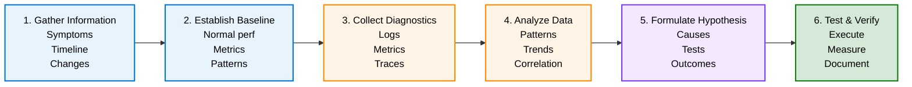

# Troubleshooting Tools & Procedures

## Overview

Master the tools and systematic approaches for diagnosing issues across sovereign cloud infrastructure.

---

## Diagnostic Tools Reference

---

## Tool Categories

### System Diagnostics

- Health checks
- Status monitors
- Event logs
- Performance counters

### Network Diagnostics

- Connectivity testing
- Packet capture
- Route analysis
- Flow monitoring

### Application Diagnostics

- Application logs
- Traces
- Profiling
- Code debugging

### Infrastructure Diagnostics

- Resource monitoring
- Capacity analysis
- Configuration audits
- Compliance checks

---

## Systematic Troubleshooting Process

---

**See also:** [Common Issues](troubleshooting-common-issues) | [Escalation Procedures](troubleshooting-escalation)
