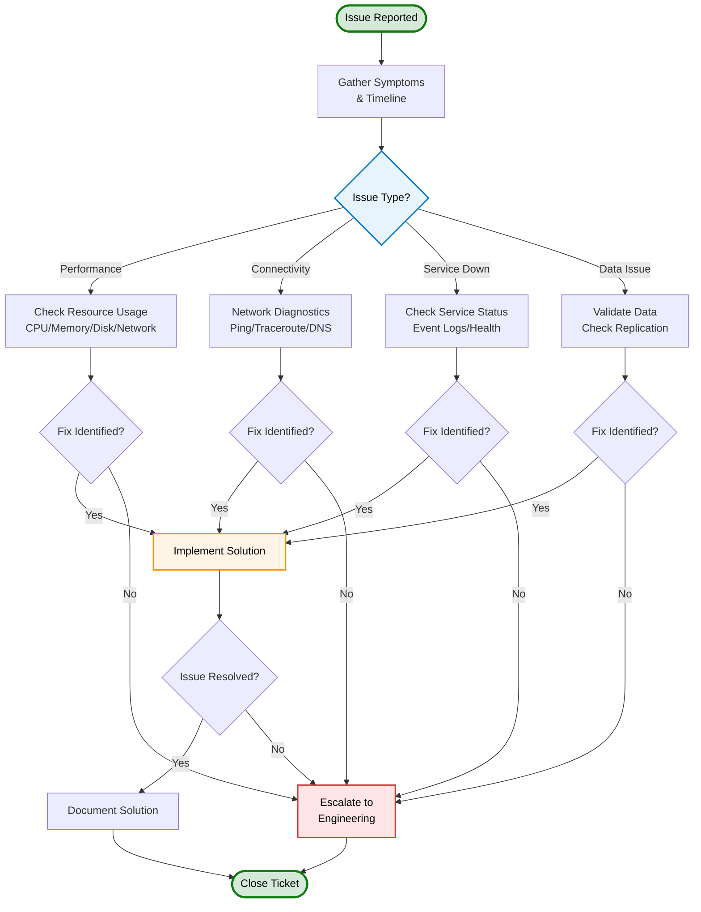

# Module 5: Advanced Troubleshooting & Optimization

{: .no_toc }

## Overview

Master advanced troubleshooting techniques, diagnostic tools, and system optimization for production sovereign cloud environments. Learn how to investigate complex issues, optimize performance, and escalate appropriately.

**Duration:** 6-8 hours  
**Learning Tracks:** Both Sales & Technical  
**Prerequisites:** Level 200 completion (all modules)

---

## Learning Objectives

### Sales Track

- ✅ Understand troubleshooting scope and escalation paths
- ✅ Set customer expectations for resolution times
- ✅ Position support and professional services
- ✅ Explain diagnostic capabilities

### Technical Track

- ✅ Use diagnostic tools effectively
- ✅ Interpret logs and telemetry
- ✅ Troubleshoot across component boundaries
- ✅ Optimize performance systematically
- ✅ Know when and how to escalate
- ✅ Implement preventive monitoring

---

## Core Topics

1. **Diagnostic Tools & Procedures** → [troubleshooting-tools.md](troubleshooting-tools)
2. **Common Issues & Resolution** → [troubleshooting-common-issues.md](troubleshooting-common-issues)
3. **Escalation & Advanced Support** → [troubleshooting-escalation.md](troubleshooting-escalation)

---

## Troubleshooting Decision Tree

---

## Diagnostic Tools

---

## Escalation Procedures

---

## Key Concepts

### Systematic Approach

- Gather symptoms
- Establish timeline
- Review recent changes
- Test hypotheses
- Implement solution
- Verify resolution
- Document findings

### Tool Categories

- **Diagnostic:** Health checks, status monitors
- **Analysis:** Log aggregation, metric visualization
- **Testing:** Connectivity, performance, functionality
- **Profiling:** Resource usage, bottleneck identification

### Escalation Criteria

- Issue persists after initial troubleshooting
- Multiple components involved
- Requires engineering expertise
- Needs vendor coordination
- Security implications

---

## Recommended Learning Path

1. Start: [Tools & Procedures](troubleshooting-tools)
2. Cases: [Common Issues](troubleshooting-common-issues)
3. Support: [Escalation Procedures](troubleshooting-escalation)
4. Reference: [Decision Tree](troubleshooting-tools#decision-tree)

---

**Module Duration:** 6-8 hours  
**Estimated Completion:** 1 week @ 6 hrs/week
