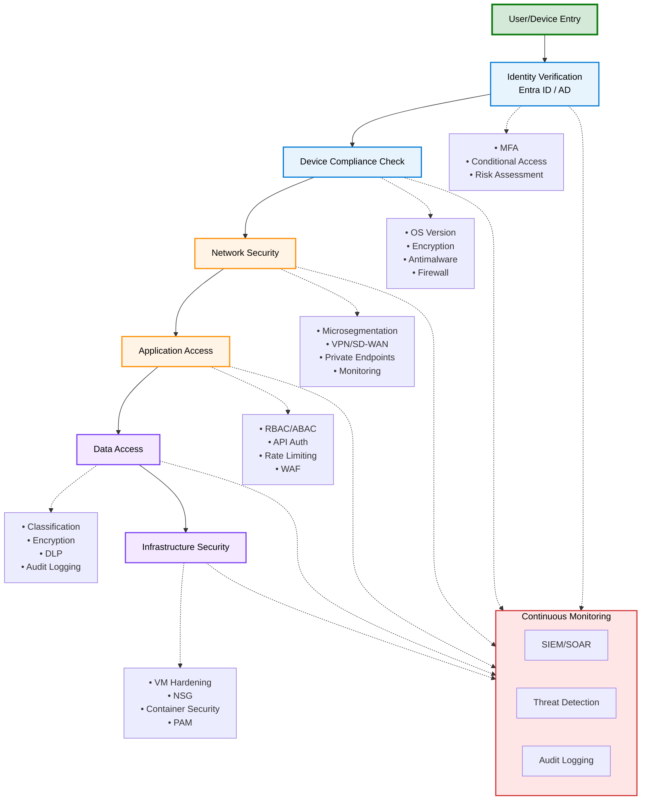

# Zero Trust Implementation Architecture

{: .no_toc }

## Overview

This page provides a detailed technical architecture for implementing Zero Trust in sovereign cloud environments. It covers the components, data flows, decision points, and how all six pillars work together end-to-end.

---

## Complete Zero Trust Architecture



---

## End-to-End Architecture Components

### 1. User/Device Entry Point

**Initial Request:**

- User initiates access request (application, resource, data)
- Device sends request with authentication credentials
- Connection establishes with identity provider

**Information Collected:**

- User identity (username, certificate, etc.)
- Device identifier and state
- Request context (time, location, network)
- Application being accessed
- Requested resource or action

### 2. Identity & Access Control Layer

**Identity Provider (Entra ID, on-premises AD):**

- Verifies user identity
- Checks credential validity
- Assesses user risk (impossible travel, anomalous behavior)
- Applies MFA if required

**Conditional Access Rules:**

- Location-based policies (geo-fencing)
- Device compliance requirements
- Risk-based policies (user/sign-in risk)
- Session-based policies (refresh requirements)
- Application-specific policies

**Decision Point 1: Identity Verified?**

- ✓ Yes → Proceed to Device Check
- ✗ No → Deny access, log attempt

### 3. Device Compliance Check

**Device Health Assessment:**

- Operating system version and patches
- Antimalware/antivirus status
- Disk encryption enabled (BitLocker)
- Firewall enabled and active
- MFA capability
- Device enrollment status

**Compliance Policies:**

- Corporate-owned devices vs. personal
- OS type (Windows, macOS, iOS, Android)
- Required security tools
- Encryption requirements

**Decision Point 2: Device Compliant?**

- ✓ Yes → Proceed to Network Assessment
- ✗ No → Remediation required or deny access

### 4. Network & Connectivity Control

**Microsegmentation:**

- Network divided into security zones
- Each zone has explicit policies
- Traffic between zones strictly controlled
- Least privilege network access

**Secure Access Methods:**

- VPN or SD-WAN requirement (zero-knowledge proof)
- Private endpoint connectivity
- Application proxy (no direct internet access)
- Encrypted tunnels for all traffic

**Network Monitoring:**

- Real-time traffic analysis
- Anomaly detection
- DDoS protection
- Intrusion detection/prevention

**Decision Point 3: Network Connection Valid?**

- ✓ Yes → Proceed to Application Access
- ✗ No → Block, alert, investigate

### 5. Application & API Security

**Application-Level Controls:**

- API authentication (API keys, OAuth tokens)
- Rate limiting per user/application
- Input validation and sanitization
- DDoS protection
- Web application firewall (WAF)

**Authorization:**

- Role-based access control (RBAC)
- Attribute-based access control (ABAC)
- Fine-grained permissions
- Time-based access windows

**Decision Point 4: Application Access Authorized?**

- ✓ Yes → Proceed to Data Access
- ✗ No → Deny, log, alert

### 6. Data Access & Protection

**Data Classification:**

- Public, Internal, Confidential, Restricted
- Tags applied at storage level
- Inheritance rules for derived data
- Classification drives protection level

**Access Controls:**

- Encryption key tied to identity
- Audit logging of all access
- Data loss prevention (DLP) scanning
- Tokenization for sensitive data

**Monitoring & Logging:**

- Who accessed what data
- When and from where
- What action (read, modify, delete)
- Audit trail retention (6-7 years for compliance)

### 7. Infrastructure & Container Security

**Infrastructure Controls:**

- Virtual machine hardening
- Network security groups (NSG)
- Managed identity for services
- Privilege access management (PAM)

**Container Security:**

- Container image scanning
- Runtime security monitoring
- Pod security policies
- Network policies in Kubernetes

**Decision Point 5: Infrastructure Access Valid?**

- ✓ Yes → Grant access, establish session
- ✗ No → Deny, alert, investigate

### 8. Continuous Monitoring & Response

**Monitoring Systems:**

- Session monitoring
- Activity baseline establishment
- Anomaly detection (ML-based)
- Compliance audit logging

**Real-Time Analysis:**

- User behavior analytics (UBA)
- Entity behavior analytics (EBA)
- Impossible travel detection
- Suspicious activity alerts

**Automated Response:**

- Risk-based access adjustments
- Session termination on high risk
- Additional MFA challenges
- Escalation to security team

**Feedback Loop:**

- Monitoring data feeds back to conditional access
- Risk assessments updated in real-time
- Policies adjusted based on patterns
- False positive reduction

---

## Decision Flow Summary

```text
1. User initiates request
   ↓
2. Identity verification
   ├─ ✗ → DENY
   └─ ✓ → Continue
   ↓
3. Device compliance check
   ├─ ✗ → REMEDIATE or DENY
   └─ ✓ → Continue
   ↓
4. Network access validation
   ├─ ✗ → DENY
   └─ ✓ → Continue
   ↓
5. Application authorization
   ├─ ✗ → DENY
   └─ ✓ → Continue
   ↓
6. Data access control
   ├─ ✗ → DENY
   └─ ✓ → Continue
   ↓
7. Infrastructure access
   ├─ ✗ → DENY
   └─ ✓ → GRANT (limited session)
   ↓
8. Continuous monitoring
   ├─ Anomaly detected → CHALLENGE or REVOKE
   └─ Normal activity → Allow, Log
```

---

## Defense-in-Depth Layering


**Layered Defense Example:**

**Layer 1 - Perimeter:** Network firewalls, DDoS protection, intrusion detection

**Layer 2 - Access:** MFA, Conditional Access, device compliance

**Layer 3 - Application:** API security, rate limiting, WAF

**Layer 4 - Data:** Encryption, classification, audit logging

**Layer 5 - Infrastructure:** VM hardening, network policies, PAM

**Layer 6 - Core:** Protected resources, encryption keys, sensitive data

If any layer is breached, others still provide protection.

---

## Compliance Mapping


---

## Implementation Patterns

### Pattern 1: Centralized Identity (Standard)

**Topology:**

- Central identity provider (Entra ID, on-premises AD)
- All access decisions routed through central system
- Works for connected environments
- Single point of management

**Pros:**

- Centralized policy management
- Consistent access decisions
- Easier compliance auditing

**Cons:**

- Dependent on central system availability
- Not suitable for air-gapped environments
- Network latency for remote sites

### Pattern 2: Distributed Identity (Sovereign/Edge)

**Topology:**

- Local identity caches at each site
- Local policy enforcement
- Periodic sync with central
- Works in disconnected mode

**Pros:**

- Works without cloud connectivity
- Faster local decisions
- Suitable for air-gapped environments
- Data residency compliance

**Cons:**

- Policy sync complexity
- Potential for policy drift
- More operational overhead

### Pattern 3: Hybrid (Recommended for Sovereign)

**Topology:**

- Central policy management
- Local enforcement engines
- Event log synchronization
- Periodic reconciliation

**Pros:**

- Best of both: central control + local enforcement
- Works connected or disconnected
- Suitable for sovereign requirements
- Flexibility and resilience

**Cons:**

- More complex implementation
- Requires local caching/replication
- More operational procedures

---

## Sovereign Cloud Considerations

### Data Residency

- All policy decisions made within sovereign boundary
- No policy data leaves jurisdiction
- Audit logs stored locally
- Encryption keys held locally

### Customer Control

- Customer defines all policies
- Customer reviews access logs
- No Microsoft infrastructure in policy path
- Explicit approval workflows possible

### Compliance Requirements

- FedRAMP: Continuous monitoring, explicit controls, audit logging
- GDPR: Data subject rights, DPA review, encryption
- HIPAA: Role-based access, audit controls, de-identification
- ITAR: U.S. person verification, controlled data access

### Air-Gap Capability

- Local identity verification
- Local policy enforcement
- Offline access (limited scenarios)
- Manual sync procedures

---

## Next Steps

1. Continue to [Monitoring & Compliance →](zero-trust-monitoring)
2. Ready for hands-on work? [Lab: Implement Zero Trust →](zero-trust-lab)

---

**Last Updated:** October 2025
