# Azure Global Infrastructure

## Overview

Azure's global infrastructure enables worldwide deployment with data residency compliance and high availability. This section provides key concepts with references to official documentation.

```mermaid
graph TB
    subgraph Global["🌍 Azure Global Infrastructure"]
        G1[Geography]
        G1 --> R1[Region 1]
        G1 --> R2[Region 2]

        R1 --> AZ1[Availability Zone 1]
        R1 --> AZ2[Availability Zone 2]
        R1 --> AZ3[Availability Zone 3]

        AZ1 --> DC1[Data Center]
        AZ2 --> DC2[Data Center]
        AZ3 --> DC3[Data Center]
    end

    style Global fill:#e3f2fd,stroke:#0078d4
    style G1 fill:#bbdefb,stroke:#1565c0
    style R1 fill:#90caf9,stroke:#1565c0
    style R2 fill:#90caf9,stroke:#1565c0
    style AZ1 fill:#a5d6a7,stroke:#2e7d32
    style AZ2 fill:#a5d6a7,stroke:#2e7d32
    style AZ3 fill:#a5d6a7,stroke:#2e7d32
```

View Diagram: Azure Infrastructure Hierarchy

## Key Concepts

### Regions

Geographic areas containing one or more data centers.

**Important Facts:**

- 60+ regions worldwide
- Data residency compliance
- Region-specific service availability
- Disaster recovery pairing

### Availability Zones

Physically separate locations within an Azure region.

**Key Benefits:**

- High availability (99.99% SLA)
- Fault tolerance
- Automatic failover
- Zone-redundant services

### Edge Locations

Points of presence for content delivery and edge computing.

**Use Cases:**

- Content delivery networks (CDN)
- Edge computing scenarios
- Reduced latency for users

## Sovereignty Considerations

### Data Residency

- Choose regions based on compliance requirements
- Understand data replication policies
- Consider cross-border data transfer restrictions

### Government Clouds

- Azure Government (US)
- Azure China
- Regional compliance variations

## Official Resources

### Documentation

- [Azure Global Infrastructure](https://azure.microsoft.com/en-us/explore/global-infrastructure/)
- [Azure Regions](https://learn.microsoft.com/en-us/azure/reliability/availability-zones-overview)
- [Azure Geographies](https://learn.microsoft.com/en-us/azure/reliability/availability-zones-overview#azure-regions-with-availability-zones)

### Interactive Tools

- [Azure Region Map](https://azure.microsoft.com/en-us/explore/global-infrastructure/geographies/)
- [Azure Speed Test](https://azurespeedtest.azurewebsites.net/)

## Next Steps

Review [Azure Management Tools](azure-management-tools.md) to understand how to manage Azure resources.

---

**Last Updated:** November 2025
