# Azure Service Categories

## Overview

Azure provides hundreds of services organized into key categories. Rather than duplicate extensive documentation, this section provides a high-level overview with links to official Microsoft documentation.

## Core Service Categories

### Compute Services

```mermaid
graph TB
    subgraph Compute["☁️ Azure Compute Options"]
        direction TB

        subgraph IaaS["Infrastructure (IaaS)"]
            VM[Virtual Machines<br/>Full OS Control]
            VMSS[VM Scale Sets<br/>Auto-scaling VMs]
        end

        subgraph PaaS["Platform (PaaS)"]
            APP[App Service<br/>Web Apps]
            ACI[Container Instances<br/>Simple Containers]
            AKS[Kubernetes Service<br/>Container Orchestration]
        end

        subgraph Serverless["Serverless"]
            FUNC[Azure Functions<br/>Event-driven]
            LOGIC[Logic Apps<br/>Workflows]
        end
    end

    IaaS -->|More Control| PaaS
    PaaS -->|Less Management| Serverless

    style IaaS fill:#E8F4FD,stroke:#0078D4,stroke-width:2px,color:#000
    style PaaS fill:#FFF4E6,stroke:#FF8C00,stroke-width:2px,color:#000
    style Serverless fill:#D4E9D7,stroke:#107C10,stroke-width:2px,color:#000
```

View Diagram: Azure Compute Options

_Figure 1: Azure compute options from full control (VMs) to fully managed (Serverless)_

Essential services for running applications and workloads.

**Key Services:**

- Virtual Machines (IaaS)
- App Service (PaaS)
- Azure Functions (Serverless)
- Container Instances

**📚 Official Documentation:**

- [Azure Compute Services Overview](https://learn.microsoft.com/en-us/azure/architecture/guide/technology-choices/compute-decision-tree)

### Storage Services

View Diagram: Azure Storage Tiers

_Figure 2: Azure Storage tiers - balance access needs with cost_

Scalable storage solutions for all data types.

**Key Services:**

- Blob Storage (Object storage)
- File Storage (Managed file shares)
- Disk Storage (VM disks)
- Queue Storage (Messaging)

**📚 Official Documentation:**

- [Azure Storage Documentation](https://learn.microsoft.com/en-us/azure/storage/)

### Networking Services

```mermaid
graph TB
    subgraph Azure["☁️ Azure Networking"]
        subgraph VNet["Virtual Network (VNet)"]
            SUB1[Subnet A<br/>10.0.1.0/24]
            SUB2[Subnet B<br/>10.0.2.0/24]
            NSG[Network Security<br/>Group]
        end

        LB[Load Balancer]
        AGW[Application<br/>Gateway]
        FW[Azure Firewall]
    end

    subgraph OnPrem["🏢 On-Premises"]
        DC[Data Center]
    end

    Internet[🌐 Internet]

    Internet --> AGW
    AGW --> LB
    LB --> SUB1
    LB --> SUB2
    NSG -.->|Rules| SUB1
    NSG -.->|Rules| SUB2
    DC <-->|VPN/ExpressRoute| VNet
    FW --> VNet

    style VNet fill:#E8F4FD,stroke:#0078D4,stroke-width:2px,color:#000
    style OnPrem fill:#FFF4E6,stroke:#FF8C00,stroke-width:2px,color:#000
```

View Diagram: Azure Networking Fundamentals

_Figure 3: Azure networking components - VNets, subnets, and connectivity_

Connect and secure your Azure resources.

**Key Services:**

- Virtual Network
- Load Balancer
- Application Gateway
- VPN Gateway

**📚 Official Documentation:**

- [Azure Networking Documentation](https://learn.microsoft.com/en-us/azure/networking/)

### Database Services

Managed database services for various data models.

**Key Services:**

- Azure SQL Database
- Cosmos DB
- Database for MySQL/PostgreSQL
- Redis Cache

**📚 Official Documentation:**

- [Azure Database Documentation](https://learn.microsoft.com/en-us/azure/?product=databases)

## Learning Resources

### Microsoft Learn Paths

- [Azure Fundamentals](https://learn.microsoft.com/en-us/training/paths/azure-fundamentals/)
- [Azure Administrator](https://learn.microsoft.com/en-us/training/paths/az-104-administrator-prerequisites/)

### Official Service Catalogs

- [Azure Products](https://azure.microsoft.com/en-us/products/)
- [Azure Architecture Center](https://learn.microsoft.com/en-us/azure/architecture/)

## Next Steps

Continue to [Azure Global Infrastructure](azure-global-infrastructure.md) to understand Azure's worldwide presence.

---

**Last Updated:** November 2025
