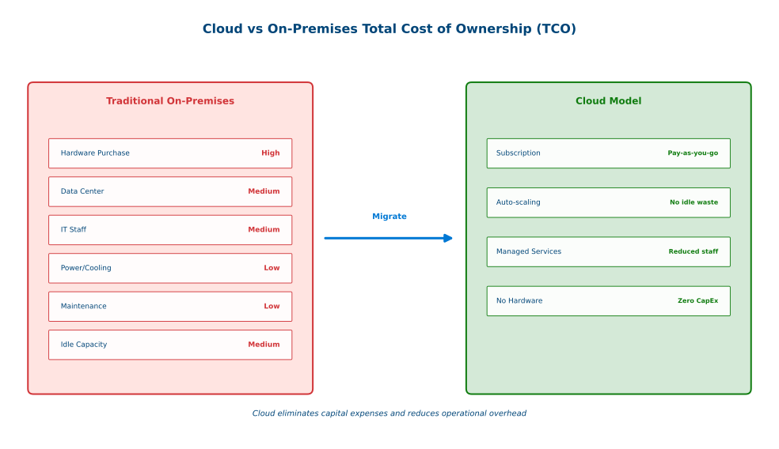
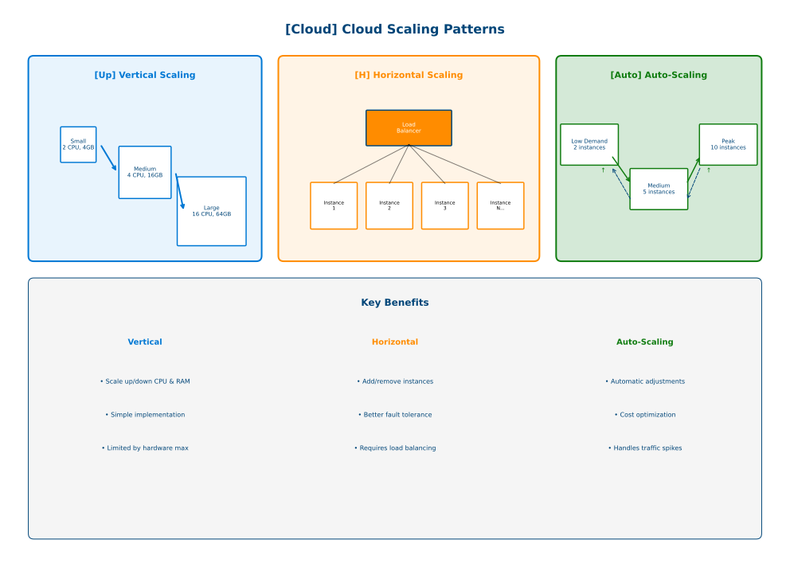

# Cloud Benefits and Considerations

## Table of contents

{: .no_toc .text-delta }

1. TOC
{:toc}

---

## Overview

Cloud computing offers significant business advantages while introducing new considerations. Understanding both benefits and challenges enables informed adoption decisions.

View Diagram: Cloud vs On-Premises TCO Comparison

_Figure 1: Cloud eliminates capital expenses and reduces operational overhead_

## Primary Business Benefits

### Cost Optimization

**Capital to Operating Expense Shift**

- Traditional IT requires large upfront capital investments
- Cloud converts to predictable operational expenses
- Typical savings: 20-40% over 3-5 years
- Pay only for resources actually consumed

**Reduced Overhead**

- Eliminate hardware maintenance costs
- Lower IT staffing requirements
- Decreased facility and utility costs
- No costs for idle infrastructure

### Agility and Speed

**Rapid Resource Provisioning**

- Deploy environments in minutes instead of weeks
- Self-service infrastructure provisioning
- Automated deployment processes
- Instant global availability

**Faster Time to Market**

- 50% reduction in development cycles typical
- Rapid prototyping and testing
- Low-risk experimentation
- Access to cutting-edge technologies

### Scalability and Performance

View Diagram: Cloud Scalability Patterns

_Figure 2: Cloud enables vertical, horizontal, and automatic scaling patterns_

**Elastic Scaling**

- Automatic resource adjustment based on demand
- Handle traffic spikes (e.g., e-commerce during peak seasons)
- Scale up or down as needed
- Pay only for resources used

**Performance Optimization**

- Content delivery networks for faster access
- Multiple availability zones for redundancy
- High-performance computing on demand
- Global load distribution

### Business Continuity and Reliability

**High Availability**

- 99.9% to 99.99% uptime SLAs
- Automatic failover capabilities
- Multiple data center redundancy
- Built-in disaster recovery

**Data Protection**

- Automated backup services
- Geographic data replication
- Point-in-time recovery options

### Security and Compliance

**Professional-Grade Security**

- Dedicated security teams and expertise
- Advanced threat detection and monitoring
- Regular security updates and patching
- Identity and access management

**Compliance Certifications**

- SOC 2, ISO 27001, FedRAMP
- Industry-specific compliance (HIPAA, PCI DSS)
- Regular third-party audits
- Automated compliance reporting

## Strategic Advantages

### Global Reach

- Deploy applications worldwide in minutes
- Serve customers from nearest geographic location
- Meet data residency requirements
- Enter new markets without physical infrastructure

### Focus on Core Business

- Shift from infrastructure management to innovation
- Leverage cloud provider expertise
- Allocate resources to value-creating activities
- Enable digital transformation initiatives

### Competitive Advantage

- Faster innovation and feature deployment
- Quick response to market changes
- Lower barriers to entry for new initiatives
- Variable cost model improves cash flow

## Key Considerations and Challenges

### Security and Privacy

**Concerns:**

- Data location and sovereignty requirements
- Shared responsibility model complexity
- Third-party infrastructure access

**Mitigation:**

- Choose certified providers
- Implement strong access controls
- Use encryption for sensitive data
- Regular security assessments

### Vendor Lock-in

**Concerns:**

- Proprietary services and APIs
- Migration complexity
- Skill set specialization

**Mitigation:**

- Design for portability where possible
- Use open standards
- Consider hybrid or multi-cloud strategies

### Connectivity and Performance

**Concerns:**

- Internet dependency for business continuity
- Bandwidth requirements and costs
- Latency for critical applications

**Mitigation:**

- Multiple connectivity paths
- Direct cloud connectivity options
- Edge computing for latency-sensitive workloads

### Cost Management

**Concerns:**

- Variable cost complexity
- Budget forecasting challenges
- Unexpected charges

**Mitigation:**

- Implement cost monitoring and alerts
- Use reserved instances for predictable workloads
- Regular cost optimization reviews
- Establish governance controls

### Skills and Change Management

**Concerns:**

- New skill requirements (DevOps, cloud architecture, automation)
- Organizational cultural shifts
- Process modifications

**Mitigation:**

- Invest in training and certification
- Gradual transition approach
- Change management programs

## Industry-Specific Considerations

Different industries have unique requirements:

**Healthcare:** HIPAA compliance, patient data privacy, legacy system integration
**Financial Services:** SOX/PCI DSS compliance, real-time processing, data sovereignty
**Manufacturing:** OT integration, IP protection, IoT capabilities
**Education:** FERPA compliance, budget constraints, accessibility requirements

## Cost-Benefit Analysis

### Total Cost of Ownership (TCO)

Compare traditional IT costs (hardware, facilities, staff, maintenance) against cloud costs (subscriptions, data transfer, support). Typical cloud savings: 20-40% over 3-5 years.

- Data transfer charges
- Additional security services
- Training and certification
- Integration and migration costs

### ROI and Payback

**Typical Payback Periods:**

- Small Business: 6-12 months
- Medium Business: 12-18 months
- Large Enterprise: 18-36 months

Benefits include cost savings, productivity gains, improved agility, and risk reduction.

## Decision-Making Guidelines

### When Cloud Makes Sense

- Variable or growing workloads
- Limited IT resources or budget
- Geographic expansion plans
- Aging infrastructure replacement
- Strong internet connectivity

### When to Proceed Cautiously

- Highly regulated industry with strict requirements
- Very predictable, stable workloads
- Poor internet connectivity
- Strict data sovereignty requirements

### Key Assessment Areas

**Technical:** Infrastructure condition, connectivity, performance requirements
**Business:** Growth projections, workload variability, risk tolerance, budget
**Organizational:** Skill levels, adaptability, leadership support

## Success Factors

### Technical

- Cloud-native application design
- Infrastructure as code and automation
- Zero-trust security model
- Continuous monitoring

### Organizational

- Executive sponsorship and clear vision
- Training and certification programs
- DevOps and agile practices
- Change management commitment

## Summary

Cloud computing offers significant benefits including cost optimization, improved agility, enhanced scalability, and better security. However, successful adoption requires careful consideration of:

- **Security and compliance requirements**
- **Vendor selection and lock-in risks**
- **Connectivity and performance needs**
- **Cost management and optimization**
- **Skills development and change management**

Organizations should conduct thorough assessments of their specific requirements, constraints, and objectives before making cloud adoption decisions.

## Next Steps

1. ✅ Review benefits and considerations relevant to your organization
2. ✅ Assess your organization's cloud readiness
3. ✅ Complete the [Module 1 Knowledge Check](cloud-computing-knowledge-check.md)
4. ✅ Proceed to Module 2: Security & Compliance Fundamentals

---

## Additional Resources

- [Cloud Adoption Framework](https://learn.microsoft.com/en-us/azure/cloud-adoption-framework/)
- [Cloud Economics and ROI](https://azure.microsoft.com/en-us/overview/cloud-economics/)
- [Cloud Security Best Practices](https://learn.microsoft.com/en-us/azure/security/)

---

**Last Updated:** November 2025
