# Cloud Computing Primer

{: .no_toc }

## Table of contents

{: .no_toc .text-delta }

1. TOC
{:toc}

---

## Overview

Cloud computing has revolutionized how organizations consume and manage technology resources. Understanding core cloud concepts is essential for anyone working with modern digital solutions, especially in contexts requiring sovereignty and security controls.

## What is Cloud Computing?

Cloud computing is the delivery of computing services—including servers, storage, databases, networking, software, analytics, and intelligence—over the internet ("the cloud") to offer faster innovation, flexible resources, and economies of scale.

<details class="diagram-container">
<summary>View Diagram: Five Essential Cloud Characteristics (NIST)</summary>
<div class="diagram-content" markdown="1">


</div>
</details>

### Key Characteristics

**On-Demand Self-Service**

- Users can provision computing capabilities automatically
- No human interaction with service providers required
- Instant access to resources when needed

**Broad Network Access**

- Services available over the network
- Accessible via standard mechanisms
- Supports heterogeneous platforms (mobile, tablets, laptops, workstations)

**Resource Pooling**

- Provider's resources are pooled to serve multiple consumers
- Multi-tenant model with different resources dynamically assigned
- Location independence with abstraction of physical resources

**Rapid Elasticity**

- Capabilities can be elastically provisioned and released
- Scales rapidly outward and inward commensurate with demand
- Resources appear unlimited to consumers

**Measured Service**

- Cloud systems automatically control and optimize resource use
- Monitoring, controlling, and reporting provide transparency
- Pay-per-use model based on actual consumption

## Traditional IT vs. Cloud Computing

```mermaid
graph TB
    subgraph Traditional["🏢 Traditional IT"]
        T1[Purchase Hardware]
        T2[Install & Configure]
        T3[Maintain & Patch]
        T4[Scale Manually]
        T5[Decommission]
        T1 --> T2 --> T3 --> T4 --> T5
    end

    subgraph Cloud["☁️ Cloud Computing"]
        C1[Request Resources]
        C2[Instant Provisioning]
        C3[Managed by Provider]
        C4[Auto-Scale]
        C5[Pay per Use]
        C1 --> C2 --> C3 --> C4 --> C5
    end

    T1 -.->|"Weeks/Months"| T2
    C1 -.->|"Minutes"| C2

    style Traditional fill:#ffebee,stroke:#c62828
    style Cloud fill:#e3f2fd,stroke:#1565c0
    style T1 fill:#ffcdd2,stroke:#b71c1c
    style T2 fill:#ffcdd2,stroke:#b71c1c
    style T3 fill:#ffcdd2,stroke:#b71c1c
    style T4 fill:#ffcdd2,stroke:#b71c1c
    style T5 fill:#ffcdd2,stroke:#b71c1c
    style C1 fill:#bbdefb,stroke:#0d47a1
    style C2 fill:#bbdefb,stroke:#0d47a1
    style C3 fill:#bbdefb,stroke:#0d47a1
    style C4 fill:#bbdefb,stroke:#0d47a1
    style C5 fill:#bbdefb,stroke:#0d47a1
```

<details class="diagram-container" open>
<summary>View Diagram: Traditional IT vs Cloud Computing</summary>
<div class="diagram-content" markdown="1">



</div>
</details>

### Traditional On-Premises Model

**Capital Expenditure (CapEx)**

- Large upfront investments in hardware and software
- 3-5 year refresh cycles
- Fixed costs regardless of utilization

**Resource Management**

- Over-provisioning to handle peak loads
- Underutilized resources during low demand
- Manual scaling processes

**Operational Overhead**

- Physical maintenance and support
- In-house expertise requirements
- 24/7 monitoring and management

**Geographic Limitations**

- Single location dependency
- Disaster recovery complexity
- Limited global reach

### Cloud Computing Model

**Operational Expenditure (OpEx)**

- Pay-as-you-consume model
- No upfront capital investments
- Variable costs based on actual usage

## Virtualization: The Foundation of Cloud

Cloud computing is built on virtualization technology. Understanding hypervisors and virtual machines is essential for grasping how cloud resources work.

<details class="diagram-container" open>
<summary>View Diagram: Hypervisor Types</summary>
<div class="diagram-content" markdown="1">


_Figure: Type 1 (bare-metal) hypervisors run directly on hardware for better performance; Type 2 (hosted) run on top of an OS for development/testing_

</div>
</details>

**Type 1 (Bare-Metal) Hypervisors** - Used in cloud data centers:

- Microsoft Hyper-V, VMware ESXi, KVM
- Direct hardware access for best performance
- Powers Azure, AWS, GCP infrastructure

**Type 2 (Hosted) Hypervisors** - Used for development/testing:

- VirtualBox, VMware Workstation, Parallels
- Runs on top of a host operating system
- Good for local development environments

**Dynamic Resource Management**

- Elastic scaling based on demand
- Optimal resource utilization
- Automated provisioning and de-provisioning

**Managed Services**

- Provider handles infrastructure maintenance
- Built-in security and compliance
- Professional-grade operations

**Global Scale**

- Worldwide data center presence
- Built-in disaster recovery
- Global content delivery

## Business Benefits of Cloud Computing

### Cost Optimization

**Reduced Capital Expenditure**

```text
Traditional: $100K server purchase
Cloud: $500/month when needed (60% savings over 3 years)
```

**Operational Efficiency**

- Eliminate hardware maintenance costs
- Reduce IT staffing requirements
- Automated backup and recovery

### Agility and Speed

**Faster Time to Market**

- Deploy applications in minutes, not months
- Rapid prototyping and testing
- Quick scaling for business growth

**Innovation Enablement**

- Access to latest technologies
- Experimentation with low risk
- Focus on business value, not infrastructure

### Scalability and Performance

**Elastic Scaling**

```text
Peak Season: 10x normal traffic
Cloud Response: Automatic scaling
Result: Consistent performance
```

**Global Reach**

- Deploy worldwide in minutes
- Content delivery optimization
- Reduced latency for users

### Security and Compliance

**Professional-Grade Security**

- Dedicated security teams
- Advanced threat detection
- Regular security updates

**Compliance Certifications**

- SOC 2, ISO 27001, FedRAMP
- Industry-specific compliance (HIPAA, PCI DSS)
- Audit-ready documentation

## Cloud Computing Challenges

### Data Control and Sovereignty

**Data Location**

- Understanding where data is stored
- Compliance with local regulations
- Cross-border data transfer restrictions

**Access Control**

- Who has access to your data
- Administrative privileges
- Audit and monitoring capabilities

### Connectivity Dependencies

- Internet reliability for business continuity
- Bandwidth and network performance requirements
- Hybrid connectivity with on-premises systems

### Skills and Culture

- New skills needed: Cloud architecture, DevOps, automation
- Cultural shift: CapEx to OpEx mindset, new processes

## Real-World Applications

**Startup:** Launch globally without infrastructure investment, scale on demand
**Enterprise:** Migrate legacy apps, enable collaboration, leverage analytics
**Healthcare:** Secure patient records, remote consultations, AI diagnostics

## Getting Started

### Key Assessment Areas

**Current State:** IT pain points, infrastructure age, scalability needs
**Business:** Growth plans, geographic expansion, compliance requirements
**Risk:** Data location requirements, change management capacity

### Migration Approach

1. **Educate and plan:** Assess landscape, identify cloud-ready apps
2. **Pilot:** Start with non-critical apps, validate security/compliance
3. **Gradual migration:** Move systematically, optimize, implement governance

## Summary

Cloud computing represents a fundamental shift in how organizations consume technology. By understanding these core concepts, you're prepared to explore more advanced topics including:

- **Service Models** (IaaS, PaaS, SaaS)
- **Deployment Models** (Public, Private, Hybrid)
- **Security and Compliance** considerations
- **Microsoft Azure** platform specifics

## Next Steps

1. ✅ Review cloud characteristics and benefits
2. ✅ Consider how cloud computing applies to your organization
3. ✅ Continue to [Cloud Service Models](cloud-service-models.md)
4. ✅ Complete the [Knowledge Check](cloud-computing-knowledge-check.md)

---

## Additional Resources

- [NIST Definition of Cloud Computing](https://csrc.nist.gov/publications/detail/sp/800-145/final)
- [Cloud Computing Benefits - Microsoft](https://azure.microsoft.com/en-us/resources/cloud-computing-dictionary/benefits-of-cloud-computing/)
- [What is Cloud Computing? - AWS](https://aws.amazon.com/what-is-cloud-computing/)

---

**Last Updated:** November 2025
